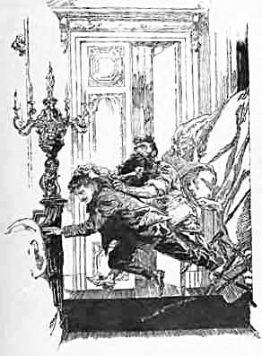

Drittes Kapitel
===============
Er ist ein ganz unmöglicher Mensch
----------------------------------

Meines Freundes Befürchtung oder Hoffnung sollte sich nicht verwirklichen. Als ich am Freitagmorgen bei ihm vorsprach, lag da ein Schreiben mit der West-Kensington-Briefmarke bei ihm, auf dessen Umschlag mein Name in einer Handschrift, die wie ein Stacheldrahtzaun aussah, gekritzelt war. Der Inhalt lautete wie folgt:

> Enmore Park W.

> Mein Herr!

> Ich habe Ihr Schreiben erhalten, in dem Sie mir bekanntgeben, dass Sie meine Anschauungen bestätigen, obgleich ich nicht wüsste, dass sie von irgendeiner Bestätigung von diesem oder von jenem abhängig wären. Sie haben es gewagt, das Wort »Theorien« hinsichtlich meiner Darlegungen über die Frage des Darwinismus zu gebrauchen. Ich möchte Sie darauf aufmerksam machen, dass ein solches Wort in dieser Verbindung bis zu einem gewissen Grade beleidigend ist. Der weitere Text Ihres Briefes zeigt mir indessen, dass Sie mehr aus Dummheit oder Taktlosigkeit als aus Bosheit gefehlt haben, und ich bin daher bereit, diese Angelegenheit auf sich beruhen zu lassen. Sie reißen einen einzelnen Satz aus dem Zusammenhang meiner Darlegung heraus, und es scheint, dass Ihnen einige Schwierigkeiten, ihn zu verstehen, begegnet sind. Ich sollte meinen, dass nur eine recht gering entwickelte Intelligenz am Kernpunkt der Sache vorbeigehen könnte. Wenn Sie aber eine weitere Erörterung als notwendig empfinden, bin ich bereit, Sie zu der von Ihnen angegebenen Stunde zu empfangen, obgleich ich Besuche und Besucher jeder Art aufs äußerste verabscheue. Bezüglich Ihrer Aufforderung, meine Meinung zu ändern, möchte ich Ihnen sagen, dass das nicht meine Gewohnheit ist, nachdem ich meinen gereiften Anschauungen einen klaren Ausdruck gegeben habe. Sie wollen freundlichst, wenn Sie bei mir vorsprechen, den Umschlag dieses Briefes meinem Diener Austin vorzeigen, da er den Auftrag hat, mir sorgfältigst alle aufdringlichen Schufte, die sich »Journalisten« nennen, vom Leibe zu halten.

> Ihr ergebener
> George Edward Challenger.

Das war der Brief, den ich laut Tarp Henry vorlas, der sogleich heruntergekommen war, um das Resultat meines Wagnisses zu erfahren. Er bemerkte nur dazu: »Es gibt da eine neue Art Seife, Cuticura oder so ähnlich, die für Wundbehandlung besser ist als Arnika.« Manche Leute haben einen seltsamen Begriff von Humor.

Es war fast ½11 Uhr, als ich das Schreiben erhalten hatte. Aber ein Taxameter brachte mich in kurzer Zeit an den Ort meiner Bestimmung. Wir hielten vor einem imposanten, mit einem Portikus versehenen Hause. Die schweren Vorhänge an den Fenstern ließen deutlich erkennen, dass dieser schreckliche Professor ein vermögender Mann war. Die Tür wurde geöffnet von einem wunderlichen, dunkelfarbigen, vertrockneten Menschen unbestimmten Alters, der eine schwarze Steuermannsjacke und braune Ledergamaschen trug. Ich erfuhr hinterher, dass es der Chauffeur war, der den infolge beständigen Wechselns leeren Platz des ersten Dieners einnahm. Er sah mich mit seinen hellen blauen Augen forschend von unten bis oben an.

»Erwartet?« fragte er.

»Eine Verabredung.«

»Haben Sie einen Brief erhalten?«

Ich zog den Umschlag hervor.

»Richtig.«

Er schien ein Mensch von wenig Worten zu sein. Als ich hinter ihm den Vorraum betrat, wurde ich plötzlich von einer kleinen Frau, die aus einer offenbar in einen Speiseraum führenden Tür hervortrat, zurückgehalten. Es war eine kluge, lebhafte, dunkeläugige Dame, mehr französisch als englisch im Typus.

»Einen Augenblick«, sagte sie. »Sie können warten, Austin. Wollen Sie bitte hereinkommen, mein Herr. Darf ich fragen, ob Sie bereits früher mit meinem Mann zusammenkamen?«

»Nein, gnädige Frau, ich hatte noch nicht die Ehre.«

»Dann bitte ich Sie im voraus um Entschuldigung. Ich muss Ihnen nämlich sagen, dass er ein ganz unmöglicher Mensch ist – absolut unmöglich. Wenn Sie vorher gewarnt worden sind, werden Sie gewiss bereit sein, Nachsicht zu üben.«

»Das ist sehr rücksichtsvoll von Ihnen, gnädige Frau.«

»Verlassen Sie schnell den Raum, wenn er den Eindruck macht, gewalttätig zu werden. Erwarten Sie nicht, mit ihm diskutieren zu können. Verschiedene Leute haben sich Beleidigungen zugezogen, weil sie es versucht haben. Hinterher gibt es einen öffentlichen Skandal, und das fällt dann auf mich und auf uns alle. Ich hoffe, dass Sie nicht wegen Südamerika zu ihm kommen.«

Ich konnte einer Dame nichts vorlügen.

»Um Gottes willen! Das ist sein gefährlichstes Thema. Sie werden kein Wort von dem, was er sagt, glauben – ich würde mich darüber nicht wundern. Aber sagen Sie ihm das nicht; denn das macht ihn rasend. Tun Sie so, als ob Sie ihm glauben, dann werden Sie mit ihm zurecht kommen. Denken Sie immer daran, dass er es selber glaubt. Davon können Sie überzeugt sein. Es gibt keinen ehrenhafteren Mann auf der Welt. Bleiben Sie nicht zu lange. Sonst schöpft er Verdacht. Wenn Sie den Eindruck haben, dass er gefährlich wird – wirklich gefährlich – dann läuten Sie und halten Sie ihn sich vom Leibe, bis ich komme. Selbst in seinem schlimmsten Zustand bin ich meist in der Lage, ihn zu beruhigen.«

Mit diesen ermutigenden Worten übergab mich die Dame des Hauses dem schweigsamen Austin, der während unserer kurzen Unterredung wie eine Bronzestatue der Verschwiegenheit gewartet hatte, und ich wurde von ihm an das Ende eines Korridors geführt. Ein Schlag gegen die Tür, eine Stierstimme von drinnen, und ich stand vor dem Professor.

Er saß in einem Drehstuhl hinter einem breiten Tisch, der mit Büchern, Karten und Zeichnungen bedeckt war. Als ich eintrat, flog sein Stuhl herum, und er fasste mich ins Auge. Sein Äußeres versetzte mir den Atem. Ich war darauf vorbereitet, etwas sehr Seltsames zu sehen, aber eine so überwältigende Persönlichkeit wie diese hatte ich nicht erwartet. Es war seine Gestalt, die einem den Atem stocken machte, seine Gestalt und sein imponierendes Wesen. Sein Kopf war enorm. Der größte, den ich je bei einem menschlichen Wesen gesehen habe. Ich glaube bestimmt, dass sein Hut, wenn ich gewagt hätte, ihn aufzusetzen, mir über die Ohren gerutscht wäre und auf meinen Schultern hätte stehen können. Sein Gesicht und sein Bart erinnerten mich an einen assyrischen Stier. Das erstere war von blühender Farbe, der letztere schwarz, mit einem Stich ins Bläuliche, dessen gekräuselte Strähnen sich wie ein Spaten auf seine Brust legten. Das Haar war merkwürdig, glatt nach vorn heruntergestrichen und lief in einen langen, kühnen Schwung über die massige Stirn aus. Die Augen waren blaugrau unter großen, schwarzen Haarbüscheln; sehr klar, sehr kritisch und sehr herrisch. Gewaltig breite Schultern und eine Brust wie eine Tonne bildeten den übrigen Körper, soweit er oberhalb der Tischplatte sichtbar war, außer zwei enormen, mit langen, schwarzen Haaren bedeckten Händen. Dies alles und eine brüllende, dröhnende Stimme war mein erster Eindruck von dem berühmten Professor Challenger.

»Nun?« sagte er, indem er mich unverschämt anstarrte, »was denn?«

Ich musste die Täuschung noch eine kurze Zeit aufrecht erhalten, sonst wäre ich zweifellos bereits am Ende meiner Unterhaltung gewesen.

»Sie waren so liebenswürdig, mir eine Zusammenkunft zu gewähren«, sagte ich bescheiden, den Briefumschlag hervorziehend.

Er nahm meinen Brief vom Schreibtisch und breitete ihn vor sich aus.

»Ah, Sie sind der junge Mensch, der kein klares Englisch versteht, nicht wahr? Meine allgemeinen Behauptungen sind Sie so liebenswürdig, zu billigen, wenn ich Sie recht verstehe?«

»Vollkommen – Herr Professor – vollkommen!«

Ich sagte das mit großer Emphase.

»Ach du lieber Gott! Das stärkt ja meine Position sehr, oder etwa nicht? Ihr Alter und Ihre Erscheinung machen mir Ihre Unterstützung doppelt wertvoll. Und, schließlich sind Sie besser als diese Schweineherde in Wien, deren Gegrunze sicherlich nicht mehr zu bedeuten hat als die vereinzelte Bemühung eines englischen Bullkalbes.« Dabei funkelte er mich an als den gewissermaßen anwesenden Vertreter dieser Tiergattung.

»Ihre Gegner scheinen sich abscheulich benommen zu haben«, sagte ich.

»Ich gebe Ihnen die Versicherung, dass ich noch in der Lage bin, meine eigenen Kämpfe auszufechten, und dass ich Ihre Sympathie nicht brauche. Lassen Sie mich nur allein, Herr, mit dem Rücken an der Wand. G. E. C. fühlt sich dann am wohlsten. Wir wollen uns bemühen, Herr, diesen Besuch abzukürzen, der für Sie kaum etwas Angenehmes haben kann und mir außerordentlich lästig ist. Sie haben, wie es scheint, einige Anmerkungen zum Inhalt meiner Denkschrift zu machen.«

Diese brutale Unmittelbarkeit in der Behandlung unseres Gegenstandes machte ein Ausweichen schwierig. Ich musste also das Spiel weiter treiben, um eine bessere Gelegenheit für meine Absichten zu erspähen. Aus der Entfernung hatte das viel einfacher ausgesehen. O, mein irischer Witz, konntest du mir denn nicht helfen, wo ich deiner Hilfe so bitter bedurfte? Er durchbohrte mich mit seinen scharfen, stahlharten Augen. »Also bitte, Herr, legen Sie los«, tobte er.

»Ich bin natürlich nur ein Student,« sagte ich mit einem einfältigen Lächeln, »kaum mehr, möchte ich sagen, als ein ernst strebender Mensch, und ich muss gestehen, es scheint mir, als ob Sie in dieser Frage ein wenig zu streng über Weismann urteilen. Hat nicht das allgemeine Beweismaterial seit dieser Zeit die Tendenz gehabt, seine Behauptungen zu bestätigen?«

»Was für Beweismaterial?« Er sprach mit unheimlicher Ruhe.

»Nun, ich weiß natürlich, dass es da nichts gibt, was man einen definitiven Beweis nennen könnte. Ich spreche nur von der Richtung des modernen Denkens und von der allgemeinwissenschaftlichen Anschauungsweise, wenn ich mich so ausdrücken darf.«

Er beugte sich mit tiefem Ernst vornüber.

»Ich nehme an, Sie wissen,« sagte er, indem er an den Fingern herzählte, »dass der Schädelindex ein konstanter Faktor ist?«

»Natürlich«, sagte ich.

»Und dass die Telegonie noch sub judice ist?«

»Zweifellos.«

»Und dass das Keimplasma verschieden ist vom parthenogenetischen Ei?«

»Ei, sicherlich«, rief ich und freute mich über meine eigene Kühnheit.

»Aber was beweist das?« fragte er mit sanfter, überzeugender Stimme.

»Ja, tatsächlich, was beweist das?« murmelte ich.

»Soll ich es Ihnen sagen?« girrte er wie eine Taube.

»Ja bitte.«

»Es beweist,« brüllte er in einem plötzlichen Wutausbruch, »dass Sie der schmutzigste Betrüger in London sind – ein nichtswürdiger, schleichender Journalist, der ebenso wenig wissenschaftliche Kenntnisse als Anstand in seinem Schüleraufsatz bewiesen hat.«

Mit rasender Wut in den Augen sprang er auf. Selbst in diesem Augenblick höchster Spannung fand ich Zeit, über die Entdeckung in Erstaunen zu geraten, dass er ein ziemlich kleiner Mann war. Sein Kopf reichte nicht über meine Schulter hinaus – ein zu klein geratener Herkules, dessen gesamte ungeheure Lebenskraft sich nach unten, in die Breite und im Gehirn auswirkte.

»Kauderwelsch«, schrie er, sich vornüberneigend, die gespreizten Hände auf die Tischplatte gestützt, und das Gesicht vorschiebend. »Wissenschaftliches Kauderwelsch war das, Herr, was ich Ihnen hier vorgeredet habe! Dachten Sie, Sie könnten sich mit meiner Erfahrung messen – Sie mit Ihrem Walnußgehirn? Ihr denkt, ihr seid allmächtig, ihr infernalischen Schmierer, oder etwa nicht? Dass euer Lob einen Mann berühmt machen und euer Tadel ihn zerschmettern kann! Wir müssen uns alle beugen vor euch und versuchen, ein günstiges Urteil von euch zu erlangen. Diesem helft Ihr auf die Beine, und jenen stürzt ihr in den Abgrund! Kriechendes Gewürm, ich kenne Sie! Sie haben sich über Ihren Stand hinausgewagt. Es wird Zeit, dass man Ihnen die Ohren stutzt. Sie haben den Sinn für Proportion verloren. Geschwollene Gasblase! Ich werde Sie in Ihre Schranken zurückweisen. Ja, Herr, es ist Ihnen nicht gelungen, G. E. C. zu überlisten. Das ist doch noch ein Mann, der Ihnen überlegen ist. Er hat Sie gewarnt, aber wenn Sie kommen wollen, beim Himmel, so tun Sie das auf Ihre eigene Gefahr. Sie sind unterlegen, mein verehrter Herr Malone, geben Sie es zu! Sie haben ein ziemlich gefährliches Spiel gespielt, und es macht einen gewissen Eindruck auf mich, dass Sie es verloren haben.

»Sehen Sie, Herr«, sagte ich, in der Richtung zur Tür zurückweichend und sie öffnend, »Sie können mich beleidigen, so viel Sie wollen. Aber es gibt eine Grenze. Sie werden es nicht zu Tätlichkeiten kommen lassen.«

»Ich werde es nicht tun?« Er kam langsam in einer seltsamen Art auf mich zu, blieb dann plötzlich stehen und steckte seine großen Hände in die Seitentaschen seiner ziemlich kindlichen kurzen Jacke. »Ich habe verschiedene von Ihnen zum Hause hinausgeworfen. Sie werden der vierte oder fünfte sein. 75 Mark für jeden – das ist etwa der Durchschnitt. Kostspielig, aber sehr notwendig. Nun, Herr, warum sollten Sie Ihren Brüdern nicht folgen? Ich sollte meinen, ja«, worauf er unvermerkt seinen unangenehmen Vormarsch auf mich fortsetzte.

Ich hätte mit einem Sprung die Vorplatztür erreichen können, aber das wäre schimpflich gewesen. Außerdem fühlte ich einen leisen Zorn in mir aufsteigen. Ich war vorher hoffnungslos im Unrecht gewesen, aber die Drohungen des Mannes brachten das Recht auf meine Seite.

»Ich werde Sie schon daran hindern, Hand an mich zu legen. Herr, das lass' ich mir nicht gefallen.

»Ach, du lieber Gott!« Sein schwarzer Schnurrbart zuckte in die Höhe, und er fletschte höhnisch lächelnd die Zähne. »Sie lassen sich das nicht gefallen, he?«

»Seien Sie kein Narr, Herr Professor«, schrie ich. »Was denken Sie ausrichten zu können. Ich wiege zwei Zentner, habe Muskeln von Stahl und spiele jeden Sonnabend als Mittelstürmer im Irischen Fußballklub. Ich bin nicht der Mann – –«

Das war der Moment, in dem er sich auf mich warf. Es war mein Glück, dass ich die Tür bereits geöffnet hatte, sonst wären wir durch die Füllung gegangen. Wir schwirrten wie ein Feuerwerkskörper miteinander den Vorplatz entlang, bekamen auf unserem Wege irgendwie einen Stuhl zwischen die Beine und kollerten mit ihm die nach der Straße führende Treppe hinunter. Sein Bart geriet mir in den Mund, wir hatten uns mit den Armen umschlungen, die Gliedmaßen unserer Körper waren miteinander verflochten, und die Beine des teuflischen Stuhles umwirbelten uns wie ein Strahlenbündel. Der wachsame Austin hatte die Entreetür aufgerissen, mit einem Purzelbaum nach hinten flogen wir auf die Straße.

Der Stuhl fiel zerschmettert zu Boden, und wir rollten beide nebeneinander in die Gosse. Er sprang auf, schwang die Fäuste und keuchte wie ein Asthmatiker.

»Haben Sie genug?« schnaufte er.

»Infernalische Bulldogge!« schrie ich, indem ich mich aufraffte. Die Sache wäre irgendwie noch zum Austrag gekommen, denn er stürzte sich in erneuter Kampfeslust auf mich, aber glücklicherweise wurde ich aus dieser üblen Situation befreit. Ein Schutzmann stand neben uns, das Notizbuch in der Hand.

»Was ist denn das? Sie sollten sich was schämen!« sagte er. Das war die erste vernünftige Bemerkung, die ich in Enmore Park gehört hatte. »Nun,« sagte er, sich an mich wendend, »was bedeutet das hier?«

»Dieser Mann hat mich angegriffen.«

»Haben Sie ihn angegriffen?« fragte der Schutzmann.

Der Professor atmete schwer und gab keine Antwort.

»Das ist ja nicht das erste Mal«, sagte der Schutzmann ernst, indem er den Kopf schüttelte. »Sie haben sich im letzten Monat bereits mit einer ähnlichen Sache in Ungelegenheiten gebracht. Sie haben ja dem Mann das Auge blau geschlagen. – Wollen Sie Anzeige machen?«

Ich beruhigte mich inzwischen.

»Nein,« sagte ich, »das werde ich nicht tun.«

»Na, wieso denn nicht?« fragte der Schutzmann.

»Ich muss mir selbst Vorwürfe machen. Ich habe ihn belästigt. Er hat mich anständigerweise gewarnt.«

Der Schutzmann klappte sein Notizbuch zu.

»Also lassen Sie doch bloß solche Sachen!« sagte er. »Nun los, nicht stehenbleiben, gehen Sie weiter.« Dies sagte er zu einem Schlächterjungen, einem kleinen Mädchen und einem oder zwei Passanten, die sich angesammelt hatten. Und die kleine Schar vor sich hertreibend, stampfte er schwerfällig die Straße hinunter. Der Professor blickte mich an mit Augen, in denen ein leichter Anflug von Humor spürbar wurde.

»Kommen Sie herein,« sagte er »ich bin noch nicht fertig mit Ihnen.« Seine Worte hatten einen bösartigen Klang, aber ich folgte ihm nichtsdestoweniger ins Haus. Der Diener Austin, der einem hölzernen Standbild glich, schloss die Tür hinter uns.

