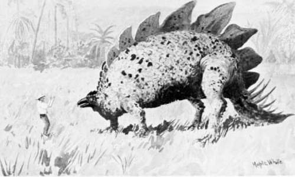
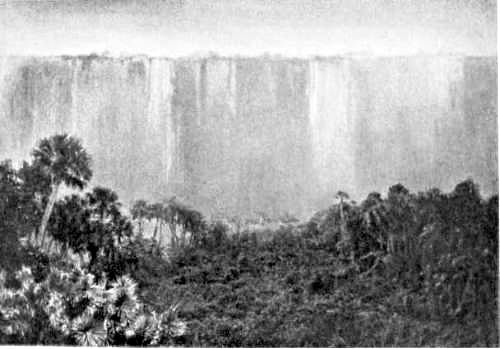

Viertes Kapitel
===============
Das ist die erstaunlichste Sache, von der ich je gehört habe
------------------------------------------------------------

Kaum war sie geschlossen, als Frau Challenger aus dem Speisezimmer herausstürzte. Die kleine Frau war in einer furchtbaren Erregung. Sie pflanzte sich vor ihrem Gatten auf wie ein wütendes Huhn, das einer Bulldogge gegenübersteht. Es war klar, dass sie meinen »Abgang« mit angesehen, meine Rückkehr aber nicht bemerkt hatte.

»Du bist ein Rohling, George«, kreischte sie. »Du hast diesem netten jungen Mann eine Verletzung beigebracht.«

Er zeigte mit dem Daumen über die Schulter.

»Da ist er, hinter mir, heil und gesund.«

Sie wurde etwas verwirrt.

»O bitte, ich hatte Sie nicht gesehen.«

»Ich versichere Sie, gnädige Frau, es ist alles in Ordnung.«

»Er hat Ihr armes Gesicht entstellt. O, George, was bist du für ein brutaler Mensch! Nichts als Skandal von einem Ende der Woche bis zum andern. Jeder Mensch hasst und verulkt dich. Meine Geduld ist erschöpft. Dies ist das Ende.«

»Sauberes Leinen!« brüllte er.

»Es ist kein Geheimnis«, schrie sie. »Weißt du, dass die ganze Straße – ganz London sogar – – gehen Sie, Austin, wir brauchen Sie hier nicht – –, weißt du, dass alle Welt von dir spricht? Wo bleibt deine Würde? Du, ein Mann, der königlicher Professor an einer großen Universität, wo tausend Studenten dich verehren würden, sein sollte, wo bleibt deine Würde, George?«

»Und wo die deinige, meine Teure?«

»Du quälst mich zu sehr. Ein Raufbold – ein wüster Raufbold – ist das, was du geworden bist.«

»Sei gut, Jessie!«

»Ein tobender, rasender Eisenfresser!«

»Jetzt ist es genug! Buß-Schemel!« sagte er.

Und zu meinem Erstaunen bückte er sich, hob sie auf und setzte sie auf ein hohes Piedestal von schwarzem Marmor in der Ecke der Vorhalle. Es war mindestens sieben Fuß hoch und so schmal, dass sie kaum das Gleichgewicht darauf halten konnte. Ein lächerlicheres Bild, als sie bot mit dem ängstlich verzogenen Gesicht, den baumelnden Füßen und dem vor Angst starren Körper, war nicht denkbar.

»Lass mich herunter«, jammerte sie.

»Sage bitte.«

»O du Rohling, im Augenblick lässt du mich herunter!«

»Kommen Sie in mein Studierzimmer, Mister Malone.«

»Aber wirklich, Herr Professor – –«, sagte ich mit einem Blick auf seine Frau.

»Herr Malone bittet für dich, Jessie. Sage bitte, und du kommst sofort herunter.«

»O du brutaler Mensch! Bitte! Bitte!«

Er hob sie herunter, als wäre sie ein Kanarienvogel.

»Du musst dich selbst gut benehmen, Liebling. Herr Malone ist ein Mann von der Presse. Er wird das alles morgen in seiner Zeitung bringen und ein Extradutzend Exemplare in unserer Nachbarschaft verkaufen: ›Seltsame Vorgänge in der höheren Gesellschaft‹ Du hattest doch einen höheren Platz auf dem Piedestal, nicht wahr? Dann ein Untertitel: ›Blick in eine merkwürdige Ehe.‹ Dieser Herr Malone ist ein Mann, der im Schmutz wühlt, ein Aasfresser wie alle seiner Art – porcus ex grege diaboli – ein Schwein aus des Teufels Herde. So ist es, Malone – was denn?«

»Sie sind tatsächlich unerträglich«, sagte ich heftig.

Er brach in ein gellendes Lachen aus. »Wir werden jetzt ein Bündnis schließen«, brummte er, indem er den Blick von seiner Frau zu mir herüberwandte und den enormen Brustkasten vorwölbte. Dann plötzlich in verändertem Tonfall: »Entschuldigen Sie diesen frivolen Familienscherz, Herr Malone. Ich habe Sie aus einem etwas ernsthafteren Grunde, als Ihnen unsere kleinen häuslichen Schäkereien vorzuführen, zurückgerufen. – Lauf nur, kleine Frau, und sei nicht mehr verdrießlich.« Dabei legte er ihr seine riesigen Hände auf die Schulter. »Alles, was du sagst, ist ja vollkommen richtig. Ich würde ja ein besserer Mann sein, wenn ich täte, was du mir rätst. Aber der ganze George Edward Challenger würde ich dann nicht mehr sein. Es gibt so viel bessere Männer, meine Teure. Aber nur einen G. E. C. Du musst schon versuchen, mit mir auszukommen.« Und darauf gab er ihr plötzlich einen schallenden Kuss, der mich noch mehr in Erstaunen versetzte als seine vorher bewiesene Gewalttätigkeit. »Nun, Herr Malone,« fuhr er plötzlich mit großer Würde fort, »darf ich bitten, hier durch den Korridor.«

Wir betraten aufs neue das Zimmer, das wir zehn Minuten vorher so tumultuarisch verlassen hatten. Der Professor schloss die Tür sorgfältig hinter uns, drückte mich in einen Armstuhl und hielt mir eine Zigarrenkiste unter die Nase. »Echte San Juan Colorado«, sagte er. »Reizbare Leute wie Sie brauchen Narkotika. Himmel, beißen Sie sie nicht ab! Abschneiden! – und mit Ehrfurcht abschneiden! So, jetzt legen Sie sich zurück und hören Sie aufmerksam an, was ich mich herbeilasse, Ihnen zu erzählen. Sollten Sie das Bedürfnis zu irgendeiner Bemerkung haben, so können Sie sie sich für eine bessere Gelegenheit aufsparen.

Zunächst zu Ihrer Rückkehr in mein Haus nach dem völlig gerechtfertigten Hinauswurf« – er schob den Bart vor und funkelte mich an wie einer, der einen Widerspruch herausfordert und erwartet –, »nach Ihrem, sage ich, wohlverdienten Hinauswurf. Der Grund lag in Ihrer dem höchst dienstfertigen Schutzmann gegebenen Antwort, in der ich glaubte eine Spur von schicklichem Empfinden Ihrerseits zu entdecken – mehr jedenfalls als ich gewöhnt bin mit einem Menschen Ihrer Berufsart zu verbinden. Indem Sie zugestanden, dass die Schuld zu diesem Zwischenfall auf Ihrer Seite lag, haben Sie den Beweis einer gewissen geistigen Selbständigkeit und weiter Lebensauffassung gegeben, der meine wohlwollende Aufmerksamkeit erregte. Die Untergattung der menschlichen Rasse, der Sie unglücklicherweise angehören, befand sich immer unterhalb meines geistigen Horizonts. Ihre Antwort hat Sie plötzlich oberhalb desselben erscheinen lassen. Sie sind aufgetaucht als ein Gegenstand meiner ernsthaften Beobachtung. Aus diesem Grunde habe ich Sie aufgefordert, mit mir zurückzugehen, da ich gesonnen war, Ihre weitere Bekanntschaft zu machen. – Bitte, wollen Sie die kleine japanische Schale auf dem Bambustisch, den Sie mit dem linken Ellbogen berühren, als Aschbecher benutzen.«

All dies brummte er vor sich hin wie ein Professor, der zu seinen Studenten redet. Er hatte seinen Drehstuhl herumgeschwungen, um mir gerade ins Gesicht sehen zu können, und saß, eine mächtige Rauchwolke ausstoßend, vor mir wie ein riesiger Ochsenfrosch, das Haupt zurückgelegt und die Augen mit einem hochmütigen Ausdruck halb geschlossen. Plötzlich drehte er sich zur Seite, und ich sah von ihm nichts mehr als sein wirres Haupthaar und ein rotes, abstehendes Ohr. Er wühlte in einem Haufen von Papieren, die auf seinem Schreibtisch lagen, worauf er sich mir wieder zuwandte und etwas in der Hand hielt, was wie ein zerfetztes Skizzenbuch aussah.

»Ich werde Ihnen jetzt etwas über Südamerika erzählen«, sagte er. »Machen Sie keine Bemerkungen, wenn ich bitten darf. Zunächst einmal möchte ich Ihnen sagen, dass nichts von dem, was ich Ihnen jetzt mitteile, irgendwie veröffentlicht werden darf, soweit Sie dazu keine ausdrückliche Erlaubnis erhalten. Diese Erlaubnis werde ich aller menschlichen Wahrscheinlichkeit nach niemals geben. Ist das klar?«

»Das ist sehr hart«, sagte ich. »Ein verständiger Bericht würde sicherlich – – –«

Er legte das Buch wieder auf den Tisch.

»Die Sache ist erledigt«, sagte er. »Guten Morgen, mein Herr.«

»Nein, nein,« rief ich, »ich unterwerfe mich jeder Bedingung. Soweit ich sehe, bleibt mir nichts anderes übrig.«

»Unter keinen Umständen«, sagte er.

»Gut, ich verspreche Ihnen alles.«

»Ehrenwort?«

»Ehrenwort.«

Er sah mich zweifelnd mit seinen anmaßenden Augen an.

»Was weiß ich denn schließlich von Ihrer Ehre?« sagte er.

»Ich muss sehr bitten, Herr Professor«, brauste ich auf. »Jetzt sind Sie sehr unhöflich. In meinem ganzen Leben hat man mich noch nicht so beleidigt.«

Meine Heftigkeit schien ihn mehr zu interessieren als zu langweilen.

»Rundköpfig«, murmelte er. »Brachycephalisch. Graue Augen, schwarze Haare mit negroidem Einschlag. Keltisch vermute ich.«

»Ich bin Ire, Herr Professor.«

»Irländischer Ire?«

»Ja, Herr Professor.«

»Das klärt die Sache natürlich. Na also, Sie haben mir Ihr Versprechen gegeben, dass mein Vertrauen respektiert werden soll. Dieses Vertrauen ist, möchte ich sagen, keineswegs ein vollständiges, doch bin ich bereit, Ihnen einige Mitteilungen, die nicht ohne Interesse sind, zu machen. Sie wissen wahrscheinlich, dass ich vor zwei Jahren eine Reise nach Südamerika gemacht habe – eine Reise, die man als klassisch in der Geschichte der Wissenschaften bezeichnen wird. Der Zweck meiner Reise war, den Wahrheitsbeweis für einige Behauptungen von Wallace und Bates zu erbringen, was nur geschehen konnte durch Beobachtung der von ihnen berichteten Fakta unter denselben Bedingungen, unter denen sie sie niedergeschrieben hatten. Hätte meine Expedition keine anderen Resultate als diese gehabt, so würde sie immer noch bemerkenswert gewesen sein; aber ein seltsamer Zwischenfall, den ich dort erlebte, hat die Forschung vor völlig neue Aufgaben gestellt.

Sie wissen vielleicht – oder in diesem halbgebildeten Zeitalter wissen Sie es vielleicht auch nicht –, dass gewisse Landabschnitte im Gebiet des Amazonenstroms erst zum Teil erforscht sind und dass der Hauptstrom eine große Zahl von Nebenflüssen hat, von denen einige noch nicht einmal kartographisch genau aufgenommen sind. Es war meine Aufgabe, in dieses wenig bekannte Hinterland vorzudringen und seine Fauna zu erforschen, die mir das Material für mehrere Kapitel des großen und monumentalen zoologischen Werkes, das meine Lebensarbeit darstellt, geliefert hat. Ich befand mich nach Beendigung meiner Arbeit auf dem Rückwege und musste eine Nacht in einem kleinen Indianerdorf zubringen, das an einer Stelle lag, wo ein gewisser Nebenfluss – dessen Namen und Lage ich verschweige – in den Hauptstrom mündet. Die Eingeborenen waren Cucama-Indianer, ein friedfertiger, aber heruntergekommener Stamm, dessen geistige Fähigkeiten kaum diejenigen eines Durchschnitts-Londoners übertreffen. Ich hatte auf meinem früheren Weg den Fluss hinauf einige von ihren Leuten kuriert und ihnen einen starken Eindruck meiner Persönlichkeit hinterlassen, so dass ich nicht überrascht war, dass sie mich bei meiner Rückkehr lebhaft erwarteten. Ich entnahm ihren Gesten, dass irgend jemand dringend meiner medizinischen Hilfe bedurfte, und folgte dem Häuptling in eine seiner Hütten. Als ich sie betrat, stellte sich heraus, dass der Leidende, zu dessen Hilfe man mich gerufen hatte, gerade gestorben war. Es war zu meiner Überraschung kein Indianer, sondern ein Weißer, und zwar ein Weißer in besonderem Sinne. Denn er hatte flachsfarbene Haare und wies Zeichen von Albinismus auf. Seine Kleidung bestand in Lumpen, sein Körper war sehr abgemagert und trug alle Spuren langdauernder Entbehrung. Nach allem, was ich aus dem Bericht der Eingeborenen entnehmen konnte, handelte es sich hier um einen ihnen völlig fremden Mann, der allein und im Zustande höchster Erschöpfung quer durch den Urwald zu ihnen gekommen war. Der Tornister des Mannes lag neben dem Lager, und ich untersuchte seinen Inhalt. Sein Name war auf einen Lederstreifen geschrieben – Maple White, Lake Avenue, Detroit, Michigan. Das ist ein Name, vor dem ich immer meinen Hut ziehen werde. Es ist nicht zu viel gesagt, dass er neben dem meinen stehen wird, wenn einst die Wissenschaft das Verdienst in dieser Angelegenheit gerecht verteilen wird. Aus dem Inhalt des Tornisters ging klar hervor, dass der Mann ein Künstler und Dichter war, der Motive gesucht hatte. Auch eine Menge von Versen fanden sich. Ich halte mich für keinen kundigen Beurteiler dieser Dinge, aber ich hatte den Eindruck, dass sie nicht eben bedeutend waren. Weiter fanden sich noch einige minderwertige Bilder von Fluss-Szenerien, ein Malkasten, eine Schachtel mit bunter Kreide, einige Pinsel, dieser gebogene Knochen, der da auf meinem Schreibtisch liegt, ein Band von Bacsters Werk über Falter und Schmetterlinge, ein billiger Revolver und einige Patronen. Persönliche Ausrüstungsgegenstände hatte er entweder nicht, oder sie waren während seiner Reise verloren gegangen. Das war der ganze Besitz dieses merkwürdigen amerikanischen Zigeuners.

Im Begriff, die Hütte zu verlassen, bemerkte ich noch einen Gegenstand, der vorn aus seiner zerrissenen Jacke herausragte. Es war dies Skizzenbuch, in dem zerrissenen Zustande, in dem Sie es hier vor sich sehen. Ich kann wohl sagen, dass ein einziges aufgefundenes Blatt von Shakespeare nicht mit einer größeren Ehrfurcht behandelt werden könnte, als wie es mit dieser Hinterlassenschaft geschah, seit sie in meinem Besitz ist. Ich gebe Ihnen das Buch in die Hand und bitte Sie, es Seite für Seite durchzusehen und seinen Inhalt zu prüfen.«

Er steckte sich eine neue Zigarre an, legte sich mit stolzen, kritischen Augen in seinen Stuhl zurück und beobachtete die Wirkung, die dieses Dokument auf mich haben würde.

Ich hatte das Buch mit einer gewissen Erwartung auf Enthüllungen, obgleich ich noch keine Vorstellung hatte, welcher Art diese sein könnten, geöffnet. Die erste Seite enttäuschte mich allerdings. Denn sie enthielt nichts als das Bildnis eines sehr dicken Mannes in einer blauen Tuchjacke mit der Unterschrift »Jimmy Colver auf dem Postboot«. Dann folgten mehrere Seiten mit kleinen Skizzen aus dem Leben der Indianer. Dann kam das Bild eines freundlichen und korpulenten Geistlichen mit einem flachen, breitkrempigen Hut, der einem dünnen Europäer gegenübersaß, mit der Unterschrift »Frühstück mit Fra Christofero in Rosario«. Studien von Frauen und Kindern füllten einige weitere Seiten, und dann folgte eine ununterbrochene Reihe von Tierzeichnungen mit Unterschriften, wie »Seekuh auf einer Sandbank«, »Schildkröten mit ihren Eiern«, »Schwarzes Ajuti unter einer Miriti-Palme« – – auf dem letzten davon erblickte ich ein schweinähnliches Tier, und schließlich kam eine Doppelseite von Studien von einem langschnäuzigen und höchst widerwärtigen Saurier. Ich konnte nichts anfangen damit und sagte das dem Professor.

»Das sind doch sicher Krokodile?«

»Alligatoren! Alligatoren! Wirkliche Krokodile gibt es ja gar nicht in Südamerika. Der Unterschied zwischen diesen – –«

»Ich wollte sagen, ich sehe nichts Ungewöhnliches – nichts, was Ihre Worte bestätigen könnte.«

Er lächelte gelassen. »Sehen Sie sich die nächste Seite an«, sagte er. Auch diese bot nichts Besonderes. Es war eine ganzseitige Zeichnung einer roh in Farben angelegten Landschaft – eine Art von Farbenskizze, wie sie ein Freilichtmaler als Grundlage für ein später genauer auszuführendes Bild benutzt. Man erkannte einen blaßgrünen Vordergrund mit geringem Pflanzenwuchs, der nach hinten zu anstieg und in eine dunkelrote Felswand mit eigenartigen senkrechten Streifen auslief, wie ich es auf Basaltformationen gesehen hatte. Diese Felsen bildeten einen ununterbrochenen Wall quer über den Hintergrund. An einer Stelle erblickte man einen einzigen pyramidenförmigen, von einem großen Baum gekrönten Felsen, der durch eine Kluft von dem Hauptmassiv getrennt schien. Über allem ein tropisch blauer Himmel. Eine dünne grüne Linie von Pflanzen bekränzte den oberen Rand der roten Klippen. Auf der nächsten Seite fand sich eine Tuschzeichnung derselben Örtlichkeit, aber aus größerer Nähe gesehen, so dass man die Einzelheiten klar unterscheiden konnte.

»Nun?« fragte er.

»Das ist zweifellos eine merkwürdige Formation«, sagte ich. »Aber ich bin nicht Geologe genug, um zu sagen, dass sie erstaunlich ist.«

»Erstaunlich!« wiederholte er. »Sie ist einzig! Sie ist unglaublich! Kein Mensch auf der ganzen Welt hätte sich je eine solche Möglichkeit träumen lassen. – Nun der Text.«

Ich schlug um und stieß einen Schrei der Überraschung aus. Ich erblickte ein ganzseitiges Bild des merkwürdigsten Tieres, das ich je gesehen hatte. Das war der wilde Traum eines Opiumrauchers, die Vision eines Deliriumkranken – der Kopf glich dem eines Vogels, der Körper dem einer aufgedunsenen Eidechse, der lange schleppende Schwanz war gespickt mit aufwärts gerichteten Stacheln und der gekrümmte Rücken eingefasst von sägeartigen Fransen, die aussahen wie ein Dutzend hintereinander angeordneter Hahnenkämme. Vor dem Tier stand ein lächerliches Männchen oder ein Zwerg in Menschengestalt, der das Ungetüm anstarrte.

»Nun, was denken Sie darüber?« rief der Professor aus, triumphierend die Hände reibend.

»Das ist furchtbar – grotesk!«

»Aber wie kommt er dazu, solch ein Tier zu zeichnen?«

»Schnaps, sollte ich denken.«

»Oh, das ist die beste Erklärung, die Sie geben können?«

»Ja, Herr Professor. Und was ist Ihre Meinung?«

»Die nächstliegende, nämlich, dass dieses Tier existiert. Dass es wirklich nach dem Leben gezeichnet ist.«

Ich hätte lachen mögen, wenn nicht die Vision eines erneuten Rundtanzes den Korridor hinunter vor mir aufgetaucht wäre.

»Zweifellos,« sagte ich, »zweifellos,« wie man einem Geistesschwachen nachgibt. »Ich muss indessen gestehen,« fügte ich hinzu, »dass dieses kleine menschliche Wesen mir zu denken gibt. Wenn es ein Indianer wäre, könnte man ihn als Beweis für das Vorhandensein einer Zwergrasse in Amerika halten, aber es scheint mir ein Europäer mit einem Sonnenhut zu sein.«

Der Professor schnaubte wie ein wütender Büffelochs. »Sie gehen wirklich bis zum äußersten«, sagte er. »Sie vertiefen meine Einsicht ganz außerordentlich. Gehirnerweichung! Geistesträgheit! Wirklich erstaunlich!«

Er wirkte zu lächerlich, als dass ich mich darüber hätte ärgern können. Es wäre tatsächlich eine Energievergeudung gewesen; denn wenn man sich über diesen Mann hätte ärgern wollen, so hätte man dazu fortwährend Anlass gehabt. Ich beschränkte mich darauf, müde zu lächeln. »Ich stieß mich daran, dass der Mann so klein ist«, sagte ich.

»Sehen Sie hier«, rief er aus, sich vorn überneigend und den großen haarigen Wurstfinger auf das Bild setzend. »Sie sehen diese Pflanze hinter dem Tier. Ich vermute, Sie halten sie für einen Löwenzahn oder Rosenkohl – wie? Nun, das ist eine Elfenbeinnuss-Palme, die 50 bis 60 Fuß hoch wird. Sehen Sie nicht, dass der Mann zu einem bestimmten Zweck in das Bild gesetzt ist? Der Maler selbst konnte nicht vor der Bestie stehen und sie zeichnen, ohne sein Leben zu riskieren. Er brachte sich daher selbst später in der Skizze an, um einen Größenmaßstab zu geben. Seine Größe betrug, wollen wir sagen, über fünf Fuß. Der Baum ist zehnmal so hoch, was durchaus anzunehmen ist.«

»Herr Gott im Himmel!« rief ich aus. »Sie denken also, diese Bestie war – aber dann würde die Bahnhofshalle von Charing Cross ja kaum eine Höhle für so ein Riesenvieh abgeben!«

»Ohne jede Übertreibung, das ist sicherlich ein voll ausgewachsenes Exemplar«, sagte der Professor friedlich.

»Aber man kann wohl nicht sämtliche Erfahrungen des Menschengeschlechts über den Haufen werfen lassen durch eine einzige Skizze – –«, ich hatte die nächsten Blätter umgeschlagen und festgestellt, dass das Buch nichts weiter enthielt –, »eine einzige Skizze von einem auf der Wanderschaft befindlichen amerikanischen Künstler, der sie vielleicht unter der Wirkung von Haschisch, oder im Fieberzustand, oder einfach zur Befriedigung einer wunderlichen Einbildungskraft angefertigt hat. Sie können doch als Mann der Wissenschaft eine solche Behauptung nicht verteidigen.«

Statt einer Antwort holte der Professor ein Buch vom Regal herunter.

»Dies ist eine ausgezeichnete Monographie meines begabten Freundes Ray Lankester«, sagte er. »Darin befindet sich eine Illustration, die Sie interessieren dürfte. Ah, ja, hier ist sie. Die Unterschrift lautet: »Wahrscheinliches Aussehen eines Stegosaurus aus der Juraperiode.« Das Hinterbein allein ist zweimal so lang als ein ausgewachsener Mann. Nun, was sagen Sie dazu?«

Er reichte mir das geöffnete Buch. Ich stutzte, als mein Blick auf das Bild fiel. Dieses rekonstruierte Tier aus einer verflossenen Welt zeigte sicherlich eine große Ähnlichkeit mit der Skizze des unbekannten Künstlers.

»Das ist in der Tat bemerkenswert«, sagte ich.

»Aber Sie wollen nicht zugeben, dass das entscheidend ist?«

»Sicherlich liegt hier eine Übereinstimmung vor, oder der Amerikaner hat ein derartiges Bild gesehen und im Gedächtnis aufbewahrt. Das könnte einem Mann im Delirium sehr gut passieren.«

»Na, schön«, sagte der Professor milde. »Wir wollen das auf sich beruhen lassen. Ich möchte Sie jetzt bitten, sich diesen Knochen anzusehen.« Er gab mir denselben, den er schon vorher als zum Besitztum des toten Mannes gehörig erwähnt hatte, in die Hand. Der Knochen war ungefähr 6 Zoll lang und dicker als mein Daumen, mit den Anzeichen von vertrocknetem Knorpel an dem einen Ende.

»Zu welchem der uns bekannten Tiere gehört dieser Knochen?« fragte der Professor.

Ich prüfte ihn sorgfältig und suchte mir einige halbvergessene Kenntnisse ins Gedächtnis zurückzurufen.

»Das ist vielleicht ein sehr dickes menschliches Schlüsselbein.«

Eine Handbewegung des Professors drückte tiefste Geringschätzung aus.

»Das menschliche Schlüsselbein ist gebogen. Dieser Knochen ist gerade. Auf seiner Oberfläche findet sich eine Einsenkung, die beweist, dass dort eine starke Sehne lag, was nicht der Fall sein könnte, wenn es ein Schlüsselbein wäre.«

»Dann muss ich bekennen, ich weiß nicht, was es ist.«

»Sie brauchen nicht beschämt zu sein, wenn sich Ihre Unwissenheit enthüllt, denn ich nehme an, dass der ganze Gelehrtenstab des Kensington-Museums auch nicht in der Lage wäre, den Knochen unterzubringen.« Er nahm darauf einen kleinen Knochen von der Größe einer Bohne aus einer Pillenschachtel. »Soweit ich sehe, bildet dieser menschliche Knochen eine Analogie zu dem in Ihrer Hand befindlichen. Das kann Ihnen eine Idee von der Größe des Tieres geben. An dem Knorpel können Sie erkennen, dass es sich hierbei nicht um ein versteinertes, sondern um ein Exemplar aus der Jetztzeit handelt. Was sagen Sie dazu?«

»Sicherlich bei einem Elefanten – –«

Er wand sich wie unter Schmerzen.

»Nicht so etwas, sprechen Sie nicht von Elefanten in Südamerika. Selbst beim heutigen Stande unserer Volksschulen – –«

»Gut,« unterbrach ich ihn, »irgendein großes südamerikanisches Tier – ein Tapir zum Beispiel.«

»Sie können überzeugt sein, junger Mann, dass ich in den Elementen meiner Wissenschaft einigermaßen zu Hause bin. Dies ist weder ein Knochen von einem Tapir, noch von irgendeinem anderen uns in der Zoologie bekannten Geschöpf. Es gehört zu einem sehr großen, sehr starken und, aller Analogie nach, sehr wilden Tier, das noch jetzt auf der Erde lebt, aber bisher der Wissenschaft nicht bekannt geworden ist. Sie sind noch nicht überzeugt?«

»Mein Interesse ist jedenfalls aufs tiefste erregt.«

»Dann ist Ihr Fall nicht hoffnungslos. Ich fühle, dass irgendwo etwas Verstand in Ihnen schlummert. Wir wollen ihn also geduldig ans Tageslicht befördern. – Wir wollen jetzt den toten Amerikaner verlassen und in unserer Erzählung fortfahren. Sie werden begreifen, dass ich mich nur schwer vom Amazonenstrom trennen konnte, ohne diese Angelegenheit tiefer erforscht zu haben. Es fanden sich nämlich Andeutungen, die einen Schluss auf die Richtung, aus der der tote Wanderer gekommen war, zuließen. Indianische Legenden allein schon hätten mir als Führer dienen können, denn ich fand Gerüchte über ein seltsames Land unter den am Ufer wohnenden Stämmen allgemein verbreitet. Sie haben zweifellos schon vom Curipuri gehört?«

»Niemals.«

»Curipuri ist der Geist des Urwaldes. Etwas Furchtbares, etwas Bösartiges, etwas, dem man aus dem Wege geht. Niemand kann sein Aussehen oder sein Wesen beschreiben. Aber es ist ein Schreckenswort an den Ufern des Amazonenstromes. Über die Richtung, in der Curipuri lebt, sind sich alle Stämme einig. Es war dieselbe Gegend, aus der der Amerikaner gekommen war. Irgend etwas Schreckliches lag auf diesem Wege. Meine Aufgabe bestand darin, zu erforschen, was das war.«

»Und was taten Sie dann?« Meine Lust zum vorlauten Schwätzen war verschwunden. Dieser energische Mann zwang einen zur Aufmerksamkeit und Achtung.

»Ich überwand das starke Widerstreben der Eingeborenen – ein Widerstreben, das soweit ging, dass sie über diesen Gegenstand nicht einmal sprechen wollten –, und durch kluges Zureden, Geschenke und auch, wie ich zugeben muss, durch Androhung von Zwang, sie meinen Wünschen gefügig zu machen, gelang es mir, zwei von ihnen als Führer zu gewinnen. Nach mancherlei Abenteuern, die ich nicht zu beschreiben brauche, und nach Zurücklegung einer gewissen Entfernung, die ich nicht angeben möchte, in einer Richtung, die ich gleichfalls verschweige, kamen wir zuletzt in eine Gegend, die bisher nicht beschrieben und auch mit Ausnahme meines unglücklichen Vorgängers von niemand besucht worden ist. Wollen Sie sich das bitte ansehen?«

Er reichte mir eine Photographie – Größe 9 x 12 Zentimeter.

»Der schlechte Zustand der Platte rührt von der Tatsache her,« sagte er, »dass unser Boot auf der Talfahrt kenterte und die Kiste mit den unentwickelten Platten zerbrach. Die unangenehme Folge dieses Vorfalls war, dass die Platten fast alle ruiniert waren – ein unersetzlicher Verlust. Das ist eine von den wenigen, die teilweise gerettet werden konnten. Diese Erklärung ihrer Mängel oder Fehler muss Ihnen genügen. Man hat von Schwindel gesprochen, aber ich bin nicht in der Stimmung, eine derartige Behauptung zu diskutieren.«

Die Photographie war sicherlich sehr undeutlich. Ein unfreundlicher Kritiker hätte das nebelhafte Bild leicht falsch auslegen können. Es war eine einfache graue Landschaft, und als ich langsam Einzelheiten darauf unterschied, stellte ich fest, dass sie eine lange und außerordentlich hohe Felswand, die aus der Entfernung den täuschenden Eindruck eines riesigen Wasserfalls machte, darstellte. Der Vordergrund war ausgefüllt durch eine geneigte, baumbestandene Ebene.

»Ich glaube, das ist dieselbe Gegend wie auf der Tuschzeichnung«, sagte ich.

»Es ist dieselbe Gegend«, antwortete der Professor. »Ich habe Spuren von dem Lager des Amerikaners gefunden. Jetzt sehen Sie dies hier!«

Es war dieselbe Szene, aus größerer Nähe gesehen, obgleich die Photographie außerordentlich mangelhaft war. Ich konnte deutlich die isolierte, von einem Baum gekrönte Felsspitze, die abseits der Felswände stand, erkennen.

»Jetzt habe ich keinen Zweifel mehr«, sagte ich.

»Gut, da hätten wir also schon etwas gewonnen«, sagte er. »Wir machen Fortschritte, nicht wahr? Wollen Sie jetzt, bitte, die Spitze dieses einzelnen Felsens ins Auge fassen. Bemerken Sie dort etwas?«

»Einen riesigen Baum.«

»Und auf dem Baum?«

»Einen großen Vogel«, sagte ich.

Er reichte mir ein Vergrößerungsglas.

»Ja,« sagte ich, hindurchsehend, »ein großer Vogel steht auf dem Baum. Wie es scheint, hat er einen riesigen Schnabel. Ich möchte sagen, er sieht aus wie ein Pelikan.«

»Zu der Schärfe Ihrer Augen kann ich Ihnen nicht gratulieren«, sagte der Professor. »Es ist weder ein Pelikan, noch überhaupt ein Vogel. Es wird Sie interessieren zu erfahren, dass es mir gelungen ist, dieses einzelne Exemplar zu schießen. Es war das einzige absolute Beweisstück über meine Entdeckungen, das ich in der Lage gewesen bin, mitzubringen.«

»Sie haben das Tier wirklich?« Hier war endlich eine greifbare Bestätigung.

»Ich hatte es. Es ging unglücklicherweise mit so vielem anderen bei demselben Bootsunfall, der mir meine Photographien ruiniert hat, verloren. Ich griff danach, als es in den Wirbeln der Stromschnellen verschwand und behielt nur einen Teil seines Flügels in der Hand. Ich wurde bewusstlos an das Ufer gespült, aber das elende Überbleibsel meines kostbaren Beweisexemplars war noch vorhanden. Ich werde es Ihnen jetzt zeigen.«

Er entnahm einer Schublade etwas, was mir vorkam wie der obere Teil des Flügels einer Fledermaus. Es war höchstens zwei Fuß lang, ein gebogener Knochen, von dem eine größere Hautfläche herabhing.

»Eine enorme Fledermaus«, flüsterte ich.

»Nichts dergleichen«, sagte der Professor ernst. »Mir, der ich in einer gebildeten und wissenschaftlichen Atmosphäre lebe, fällt es wirklich schwer, sich vorzustellen, dass die Grundprinzipien der Zoologie so wenig bekannt sind. Ist es möglich, dass Sie nicht einmal die elementaren Tatsachen der vergleichenden Anatomie kennen, dass nämlich der Flügel eines Vogels nichts anderes ist als sein Unterarm, während der Flügel einer Fledermaus aus drei verlängerten und durch eine Haut verbundenen Fingern besteht? In diesem Fall ist der Knochen sicherlich nicht der Unterarm, und Sie können selbst sehen, dass dies eine einseitig befestigte Haut ist, die an einem einzelnen Knochen hängt, und deswegen kann er nicht von einer Fledermaus stammen. Aber wenn es weder ein Vogel noch eine Fledermaus ist, was ist es denn?«

Mein kleiner Wissensvorrat war erschöpft.

»Ich weiß es tatsächlich nicht«, sagte ich.

Er öffnete das Standard-Werk, auf das er mich schon einmal verwiesen hatte.

»Hier,« sagte er, auf das Bild eines außergewöhnlichen fliegenden Ungeheuers hinweisend, »es ist eine ausgezeichnete Reproduktion des Dimorphodons oder Pterodactylus, eines fliegenden Reptils aus der Jurazeit. Auf der nächsten Seite befindet sich eine Zeichnung vom Bau seines Flügels. Vergleichen Sie diese, bitte, mit dem Stück in Ihrer Hand.«

Ich wurde von Erstaunen gepackt, als ich näher hinsah. Ich war überzeugt. Daran war nicht zu rütteln. Das angehäufte Beweismaterial wirkte überwältigend. Die Skizze, die Photographie und dazu ein wirkliches Beweisstück – das war unwiderleglich. Ich sagte dem Professor das mit warmem Herzen; denn ich fühlte, dass man ihn ungerecht behandelt hatte. Er saß zurückgelehnt in seinem Stuhl, mit gesenkten Lidern und einem milden Lächeln, wie von plötzlichem Sonnenschein überstrahlt.

»Das ist die erstaunlichste Sache, von der ich je gehört habe«, sagte ich, obgleich mehr meine journalistische als meine wissenschaftliche Begeisterung erweckt war. »Das ist kolossal. Sie sind der Kolumbus der Wissenschaft, der eine verlorene Welt entdeckt hat. Es tut mir furchtbar leid, dass es erst schien, als ob ich zweifelte. Es ist ja alles so unglaublich. Aber ich verschließe mich einem Beweise nicht, wenn ich selber prüfen kann. Und dies hier sollte eigentlich jeden überzeugen.«

Der Professor schnurrte wie eine Katze vor Befriedigung.

»Und was taten Sie darauf, Herr Professor?«

»Die Regenzeit trat ein, Herr Malone, und meine Vorräte waren erschöpft. Ich erforschte einen Teil dieser riesigen Felswände, aber es war mir nicht möglich, irgendeinen nach oben führenden Pfad ausfindig zu machen. Der pyramidenförmige Fels, auf dem ich den Pterodactylus sah und schoss, bot die Möglichkeit eines Aufstiegs, und da ich mich etwas aufs Kraxeln verstehe, gelang es mir, bis zur halben Höhe desselben emporzuklimmen. Von hier aus konnte ich mir eine bessere Vorstellung von dem Felsplateau machen. Es kam mir sehr ausgedehnt vor. Weder nach Osten noch nach Westen vermochte ich das Ende der grün bewachsenen Höhe zu erblicken. Unten breitete sich ein sumpfiges, dschungelartiges Gebiet aus voll von Schlangen, Insekten und Fieber. Es bildet einen natürlichen Schutz des seltsamen Plateaus.«

»Bemerkten Sie irgendwelche weiteren Anzeichen von Leben?«

»Nein, Herr Malone, das nicht, aber wir vernahmen im Laufe der Woche, die wir am Fuße der Felsen zubrachten, sehr merkwürdige Geräusche von oben.«

»Aber das Tier, das der Amerikaner zeichnete? Wie erklären Sie sich das?«

»Wir können nur annehmen, dass er einen auf das Plateau hinaufführenden Weg gefunden und es dort gesehen hat. Wir wissen also, dass es einen Weg dort hinauf gibt. Wir wissen gleichfalls, dass es ein sehr schwieriger Weg sein muss, denn sonst würden diese Geschöpfe heruntergekommen sein und die Umgebung verheert haben. Daran ist kein Zweifel.«

»Aber wie sind sie denn da hinaufgekommen?«

»Ich glaube nicht, dass dies Problem so schwer zu lösen ist«, sagte der Professor. »Dafür kann es nur eine einzige Erklärung geben. Der südamerikanische Kontinent besteht, wie Sie gehört haben werden, aus Granit. An diesem einzelnen Punkt in seinem Innern hat in weit zurückliegender Zeit eine große, plötzliche vulkanische Erhebung stattgefunden. Diese Felsen, darf ich bemerken, bestehen aus Basalt, sie sind also plutonisch. Ein Gebiet etwa von dem Umfange von Sussex ist im ganzen mit all seinem lebenden Inhalt gehoben und durch seine senkrechten Wände, deren Steilheit jeder Erosion trotzt, vom übrigen Kontinent abgeschlossen worden. Was ist das Resultat? Nun, die allgemeinen Naturgesetze sind aufgehoben. Die verschiedenen Bedingungen, die in der übrigen Welt den Kampf ums Dasein beeinflussen, sind neutralisiert oder verändert worden. Es sind Geschöpfe am Leben geblieben, die unter anderen Umständen verschwunden wären. Sie werden wissen, dass sowohl der Pterodactylus als auch der Stegosaurus der Juraperiode angehören, also entwicklungsgeschichtlich sehr alt sind. Sie sind auf Grund dieser eigenartigen und zufälligen Verhältnisse erhalten geblieben.«

»Dieser Beweis ist sicherlich bündig. Sie brauchen ihn doch nur den in Frage kommenden Autoritäten zu unterbreiten.«

»So hatte ich in meiner Naivität auch gedacht«, sagte der Professor bitter. »Ich kann Ihnen nur sagen, dass ich mich darin getäuscht habe und dass ich bei jedem Versuch einer großen, teils aus Dummheit und teils aus Eifersucht herrührenden Ungläubigkeit begegnet bin. Es ist nicht meine Art, Herr Malone, mich vor irgendjemand zu beugen, oder den Beweis für eine Sache anzutreten, wenn man meine Worte anzweifelt. Ich habe mich nicht einmal herabgelassen, die Beweisstücke, die ich in Händen habe, vorzuzeigen. Die ganze Sache wurde mir zuwider – ich mochte nicht mehr davon sprechen. Wenn Leute wie Sie, alberne Vertreter öffentlicher Neugierde, die Ruhe meiner Privatwohnung störten, war ich nicht imstande, ihnen mit würdiger Haltung zu begegnen. Ich gebe zu, dass ich von Natur etwas heftig bin, und wenn man mich herausfordert, neige ich zu Gewalttätigkeit. Ich fürchte, dass Sie das auch bemerkt haben.«

Ich schlug die Augen nieder und schwieg.

»Meine Frau hat mir öfters Vorwürfe in dieser Hinsicht gemacht, und doch glaube ich, dass jeder Mann von Ehre ebenso gehandelt hätte. Heute abend allerdings habe ich vor, ein außerordentliches Beispiel von Selbstbeherrschung zu geben. Ich lade Sie ein zu einer öffentlichen Diskussion.« Er überreichte mir eine auf dem Schreibtisch liegende Karte. »Wie Sie sehen, wird Professor Percival Waldron, ein Naturwissenschaftler von einigem Ruf, um 8 Uhr 30 im Saal des Zoologischen Instituts einen Vortrag über Entwicklungsperioden halten. Ich bin eigens aufgefordert worden, auf der Rednerbühne anwesend zu sein, um dem Vortragenden den Dank der Versammlung auszusprechen. Ich will diese Gelegenheit benutzen, um sehr vorsichtig und mit Takt einige Bemerkungen fallen zu lassen, die vielleicht das Interesse des Auditoriums erwecken und bei einigen vielleicht den Wunsch entstehen lassen, etwas tiefer in die Materie einzudringen. Nichts Kampflustiges, Sie verstehen, sondern nur eine Andeutung, dass es noch tiefere Probleme gibt. Ich werde mich fest im Zaum halten und sehen, ob es mir bei dieser Selbstbeschränkung gelingt, ein günstigeres Resultat zu erzielen.«

»Und ich darf kommen?« fragte ich eifrig.

»Aber natürlich«, antwortete er herzlich. Er sagte das in einer so außerordentlich freundlichen Art, die fast noch überwältigender war als seine Heftigkeit. Wundervoll wirkte sein wohlwollendes Lächeln, wenn seine beiden Wangen sich zwischen halbgeschlossenen Augen und dem großen Bart zu zwei roten Äpfeln aufblähten. »Kommen Sie auf jeden Fall. Es wird mir eine Erleichterung sein, wenn ich weiß, dass ich einen Bundesgenossen, wenn auch in dieser Sache nur einen schwachen und unwissenden, im Saale habe. Ich vermute, dass die Zuhörerschaft sehr groß sein wird, denn Waldron, obgleich er ein absoluter Scharlatan ist, hat eine bedeutende Gefolgschaft. Nun, Herr Malone, ich habe Ihnen viel mehr Zeit gewidmet, als ich beabsichtigte. Das Individuum soll niemals für sich allein in Anspruch nehmen, was der ganzen Welt zukommt. Ich würde mich freuen, Sie heute abend beim Vortrag zu sehen. Inzwischen dürfen Sie natürlich keinen öffentlichen Gebrauch machen von dem Material, das ich Ihnen gegeben habe.«

»Aber McArdle – mein Verlagsdirektor, Sie verstehen – wird doch wohl wissen wollen, was ich gemacht habe.«

»Erzählen Sie ihm, was Sie wollen, Sie können ihm neben anderem sagen, wenn er noch irgendeinen anderen aufdringlichen Menschen zu mir schickt, so würde ich ihm einen Besuch mit der Reitpeitsche machen. Aber ich verlasse mich darauf, dass nichts von all diesem in der Zeitung erscheint. Schön. Also heute abend ½9 Uhr im Zoologischen Institut.«

Mein letzter Eindruck bestand in roten Wangen, einem blauschwarzen gekräuselten Bart und herrischen Augen, als er mich mit einer Handbewegung entließ.

