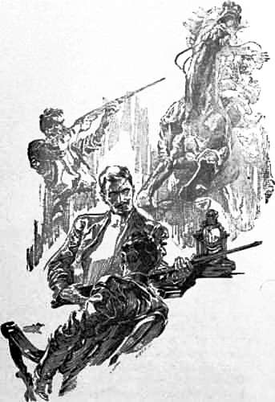

Sechstes Kapitel
================
Ich war die Gottesgeißel
------------------------

Lord John Roxton und ich gingen die Vigostreet zusammen hinunter und durchschritten die düsteren Portale des berühmten aristokratischen Gebäudes. Am Ende einer langen steinfarbenen Passage stieß mein neuer Bekannter eine Tür auf und drehte das elektrische Licht an. Eine Anzahl von Lampen, die von farbigen Schleiern umgeben waren, warfen über den ganzen großen Raum vor uns einen rötlichen Schimmer. Im Türeingang stehend, hatte ich den allgemeinen Eindruck eines außerordentlichen Komforts und großer Eleganz, die sich mit einer Atmosphäre ausgesprochen männlicher Geschmacksrichtung verband. Überall mischte sich der Luxus eines reichen Mannes von Geschmack mit der sorglosen Unordnung des Studenten. Schwere Pelze und in seltsamen Farben schillernde Matten aus irgendeinem orientalischen Basar waren auf dem Boden ausgebreitet. Gemälde und graphische Blätter, die sogar meine unerfahrenen Augen als sehr wertvoll und selten erkannten, bedeckten überall die Wände. Skizzen von Boxern, von tennisspielenden Mädchen und von Reitpferden wechselten ab mit einem gefühlvollen Fragonard, einem kritischen Girardet und einem träumerischen Turner. Aber inmitten dieses verschiedenartigen Wandschmucks waren Trophäen angebracht, die mir sofort die Tatsache lebhaft ins Gedächtnis zurückriefen, dass Lord John Roxton einer der großen allseitigen Sportsmänner und Athleten von heute war. Ein Paar gekreuzte Ruder, das eine dunkelblau, das andere kirschrot gefärbt, über dem Kaminsims sprach von ehemaliger Mitgliedschaft im Ruderklub der Leandermänner in Oxford, während die Rapiere und Boxerhandschuhe über und unter ihnen die Zeichen eines Mannes bildeten, der mit beiden die Meisterschaft erworben hatte. Wie eine rund um das Zimmer herumlaufende Wandbekleidung wirkte eine Reihe herrlicher Geweihe, die besten ihrer Art aus allen vier Ecken der Welt, über denen der Kopf des seltenen weißen Nilpferdes vom Oberlauf des Nils mit seinen anmaßend herabhängenden Lippen thronte.

In der Mitte des kostbaren roten Teppichs stand ein Louis-quinze-Tisch in Schwarz mit Gold, eine reizende Antiquität, die aber frevelhaft durch Ränder von Trinkgläsern und durch von Zigarrenstummeln herrührende Flecke entweiht war. Darauf stand ein silbernes Rauchgeschirr und ein polierter Whiskybehälter. Schweigend füllte der Hausherr aus diesem und einem daneben stehenden Syphon zwei hohe Gläser. Nachdem er mich in einen Armstuhl genötigt und ein Glas in meine Nähe gestellt hatte, reichte er mir eine lange milde Havannazigarre. Dann nahm er mir gegenüber Platz und blickte mich lange und fest mit seinen seltsamen, blitzenden und rücksichtslosen Augen, die das kalte Hellblau eines Gletschersees zeigten, an.

Durch den dünnen Schleier von Zigarrenrauch unterschied ich die Einzelheiten eines Gesichts, das mir bereits durch viele Photographien bekannt war – die scharfgebogene Nase, die eingesenkten hageren Wangen, das dunkle, rötliche, auf der Stirn gelichtete Haar, den krausen, männlichen Schnurrbart, den schmalen, herausfordernden Knebelbart auf dem vorgeschobenen Kinn. Etwas in diesem Gesicht erinnerte an Napoleon III., etwas an Don Quichotte und wieder etwas an das Wesen eines englischen Landedelmannes, diesen scharfen, lebhaften und in frischer Luft lebenden Liebhaber von Hunden und Pferden. Seine Haut war von Sonne und Wind gerötet wie ein Blumentopf. Seine Augenbrauen waren buschig und überhängend, was seinen kalten Augen ein fast wildes Aussehen gab, ein Eindruck, der noch durch seine starke und gefurchte Stirn verstärkt wurde. Sein Körper war mager, aber stark gebaut. Tatsächlich hatte er schon oft den Beweis geliefert, dass nur wenige Leute in England fähig waren, so andauernde Anstrengungen zu ertragen wie er. Seine Größe betrug wenig über sechs Fuß, aber er erschien infolge eigenartig gerundeter Schultern etwas kleiner. So sah der berühmte Lord John Roxton aus, als er mir gegenüber saß, die Zigarre zwischen die Zähne geklemmt und mich während eines langen und in Verlegenheit setzenden Schweigens fest ansehend.

»Nun,« sagte er schließlich, »das wäre also eine beschlossene Sache, mein Jungchen. In die Sache wären wir hineingesprungen, Sie und ich. Ich vermute, dass Sie nicht daran gedacht haben, als Sie zur Versammlung gingen – hm?«

»Kein Gedanke daran!«

»Mir ging's ebenso. Ich habe auch nicht daran gedacht, und jetzt sitzen wir bis zum Halse in der Terrine, und dabei bin ich erst seit drei Wochen zurück aus Uganda. Habe einen Besitz in Schottland gepachtet und den Vertrag unterzeichnet. Schöne Sache das, – was? Und wie steht's mit Ihnen?«

»Nun, bei mir geht die Geschichte mit meinen Berufsplänen zusammen. Ich bin Redakteur an der ›Gazette‹.«

»Ach ja, – Sie erwähnten das, als Sie sich meldeten. Übrigens hätte ich da eine kleine Aufgabe für Sie, wenn Sie mir helfen möchten.«

»Mit Vergnügen.«

»Fürchten Sie sich vor etwas?«

»Um welche Gefahr handelt es sich denn?«

»Nun, es handelt sich um Ballinger – er ist nicht ungefährlich. Sie haben doch von ihm gehört?«

»Nein.«

»Aber Menschenskind, wo haben Sie denn gelebt? Sir John Ballinger ist der beste Herrenreiter im Norden. Auf der ebenen Erde kann ich ihm die Stange halten, aber im Springen ist er mir überlegen. Nun, kurz und gut, es ist ein offenes Geheimnis, dass er, solange er nicht trainiert, stark trinkt – einen Rekord aufstellen, nennt er das. Er liegt seit Donnerstag im Delirium und rast wie ein Teufel. Er wohnt hier über mir. Die Ärzte sagen, dass es mit ihm zu Ende geht, wenn es nicht gelingt, ihm etwas Nahrung einzuflößen. Aber da er mit einem Revolver auf der Decke im Bett liegt und schwört, dass er jedem, der sich ihm nähert, sechs Kugeln in den Bauch schießen will, ist da so etwas wie ein Streik unter seinem Bedienungspersonal ausgebrochen. Er ist ein Dickschädel, ein rüder Patron und außerdem ein sicherer Schütze. Aber kann man einen Sportsmann von nationalem Range so sterben lassen, wie?«

»Was beabsichtigen Sie denn zu tun?« fragte ich.

»Nun, ich denke, dass wir beide ihn unterkriegen. Vielleicht schläft er gerade und schlimmstenfalls kann er nur einen von uns anschießen, so dass der andere die Möglichkeit hat, sich auf ihn zu stürzen. Wenn es uns gelingt, mit der Bettdecke seine Arme niederzuhalten und ihm dann die Magenpumpe einzuführen, werden wir dem alten Knaben schon etwas Lebenselixier einflößen.«

Das war eine ziemlich verzweifelte Aufgabe, die einem da so plötzlich zufiel. Ich glaube ja nicht, dass ich ein besonders tapferer Mann bin. Ich habe die irische Phantasie, die alles Unbekannte und noch nicht Erlebte für viel furchtbarer hält, als es ist. Andererseits war mir Abscheu vor Feigheit anerzogen, und nichts war mir schrecklicher, als auch nur mutlos zu erscheinen. Ich kann wohl sagen, ich hätte mich in einen Abgrund hinunterstürzen können wie die Hunnen in den Geschichtsbüchern, wenn man meinen Mut in Zweifel gezogen hätte. Aber es wäre mehr Stolz und Furcht als Mut gewesen, die mich veranlasst hätten, so zu handeln. Infolgedessen antwortete ich, obgleich jeder Nerv in mir bei der Vorstellung des unter der Wirkung des Alkohols delirierenden Kranken über uns erbebte, mit einer möglichst sorglosen Stimme, dass ich bereit sei, mitzugehen. Irgendeine weitere Bemerkung Lord Roxtons über die uns bevorstehende Gefahr hätte meine Erregung nur noch steigern können.

»Reden macht die Sache nicht besser,« sagte ich, »lassen Sie uns gehen.« Ich sprang auf, und er erhob sich gleichfalls. Dann klopfte er mir mit einem vertrauensvollen Lächeln zwei- oder dreimal gegen die Brust und stieß mich schließlich in meinen Stuhl zurück.

»So ist's richtig, mein Söhnchen, Sie werden's schon machen«, sagte er.

Ich blickte überrascht auf.

»Ich habe heute morgen schon selbst nach John Ballinger gesehen. Er hat mir ein Loch in meinen Kimono gerissen. Gesegnet sei seine alte, schwache Hand! Aber wir haben ihm eine Jacke übergeworfen, und er wird in einer Woche wiederhergestellt sein. Nun, lassen wir das, mein Junge, denken Sie nicht mehr daran! Sehen Sie, ganz unter uns gesprochen, ich halte diese südamerikanische Angelegenheit für eine höchst ernsthafte Sache, und wenn ich einen Gefährten bei mir habe, so wünsche ich mir einen Mann, auf den ich mich verlassen kann. Darum habe ich Sie auf die Probe gestellt, und ich muss sagen, dass Sie sie gut bestanden haben. Sie sollen sehen, alle Last wird auf uns beiden liegen; denn dieser alte Summerlee wird von Anfang an eine Kinderfrau nötig haben. Übrigens, sind Sie etwa der Malone, von dem man annimmt, dass er unter die irischen Rugbyspieler aufgenommen wird?«

»Als Reservemann vielleicht.«

»Mir kam Ihr Gesicht so bekannt vor. Ich war nämlich dabei, als Sie das Tor gegen Richmond schossen, das war der schönste Lauf, den ich in der ganzen Saison gesehen habe. Ich versäume niemals ein Rugby-Match, wenn ich es nur irgend ermöglichen kann, denn es ist das männlichste Spiel, das wir haben. – Nun, ich habe Sie aber schließlich nicht hergebeten, um mich mit Ihnen über Sport zu unterhalten. Wir müssen unsere Geschichte in Ordnung bringen. Hier stehen die Abfahrtzeiten der Dampfer auf der ersten Seite der »Times«. Da ist ein Dampfer der Booth-Linie nach Para Freitag nächster Woche, und wenn der Professor und Sie es einrichten können, sollten wir den doch nehmen – was denn? Schön. Ich werde das mit ihm vereinbaren. Wie steht es mit Ihrer Ausrüstung?«

»Dafür wird meine Zeitung sorgen.«

»Können Sie schießen?«

»Auf mittlere Entfernungen einigermaßen.«

»Ach du lieber Himmel, nicht besser? So etwas zu lernen, daran denkt Ihr jungen Burschen doch immer zuletzt. Sie sind alle Bienen ohne Stachel, deren Blick nicht über den Bienenstock hinausreicht, und werden ein schönes Gesicht machen, wenn eines Tages jemand kommt und Ihnen den Honig maust. Aber Sie werden Ihren Schießprügel schon in Ordnung bringen müssen für Südamerika; denn wenn unser Freund, der Professor, nicht ein Wahnsinniger oder ein Lügner ist, könnten wir doch schnurrige Dinge zu sehen bekommen, bevor wir zurückkehren. Was für eine Büchse haben Sie?«

Er ging zu einem eichenen Schrank hinüber, und als er dessen Tür öffnete, konnte ich einen Blick auf eine glänzende Reihe paralleler Gewehrläufe, die wie die Pfeifen einer Orgel wirkten, werfen.

»Ich werde mal sehen, ob ich hier etwas für Sie habe«, sagte er.

Er entnahm dem Schrank nacheinander eine ganze Reihe von schönen Gewehren, ließ das Schloss klingend auf- und zuschnappen und beklopfte sie, als er sie wieder in das Stativ zurückstellte, so zärtlich, wie eine Mutter ihre Kinder liebkosen würde.

»Dies ist eine Bland, Kaliber 577, eine hochbrisante Express-Büchse. Ich schoss den großen Burschen damit«, sagte er, zu dem weißen Rhinozeros hinaufblickend. »Zehn Meter weiter, und er hätte mich seiner Sammlung hinzugefügt.«

»An dieser Kugel hängt seine einzige Hoffnung,
Sie ist des Schwachen treuer Schutz.«

»Ich hoffe, Sie kennen Ihren Gordon, denn er ist der Dichter des Pferdes und der Flinte und der Männer, die mit beiden umgehen. Hier ist noch eine brauchbare Waffe, Kaliber 470, Zielfernrohr, geteilter Auswerfer, Kernschuss auf 350 Meter. Das ist die Büchse, die ich vor drei Jahren gegen die Sklavenhändler in Peru gebraucht habe. Ich kann Ihnen sagen, ich habe in diesen Gebieten als Gottesgeißel gewirkt, obgleich Sie das in keinem Blaubuch finden werden. Es gibt Zeiten, mein Junge, in denen jeder von uns für Menschenrecht und Gerechtigkeit eintreten muss, wenn er sich das Gefühl von Sauberkeit bewahren will. Aus diesem Grunde habe ich einen eigenen kleinen Krieg unternommen, ihn selbst erklärt, durchgeführt und beendet. Jede von diesen Kerben bedeutet einen Sklavenhändler. Eine schöne Reihe – was? Diese große hier gilt für Pedro Lopez, den König von allen, den ich in einem Seitengewässer des Putomajoflusses niederschoss. Aber hier ist etwas, was sich für Sie eignen würde.« Er entnahm dem Schrank eine schöne Büchse in Braun und Silber. »Gute Gummipolsterung am Kolben, scharf visiert, fünf Patronen im Rahmen. Dieser Büchse können Sie Ihr Leben anvertrauen.« Er reichte sie mir und verschloss den Schrank. 

»Übrigens,« fuhr er fort, sich wieder in seinen Stuhl niederlassend, »was wissen Sie von Professor Challenger?«

»Ich sah ihn heute zum erstenmal.«

»Hm, mir geht es nicht anders. Es ist doch komisch, dass wir beide mit versiegelter Order eines Mannes fahren, den wir nicht kennen. Er scheint mir ein anmaßender alter Knabe zu sein. Seine Kollegen von der Wissenschaft sind offenbar auch nicht gerade entzückt von ihm. Wie sind Sie denn dazu gekommen, sich für seine Angelegenheiten zu interessieren?«

Ich erzählte ihm kurz meine Erlebnisse von heute morgen, denen er aufmerksam zuhörte. Dann zog er eine Karte von Südamerika hervor und legte sie auf den Tisch.

»Ich glaube, dass alles, was er Ihnen gesagt hat, auf Wahrheit beruht,« sagte er ernst, »und kann Sie versichern, ich habe einige Gründe dafür, wenn ich so etwas sage. Südamerika ist eine Gegend, die ich liebe, und ich bin der Meinung, wenn Sie es an der richtigen Stelle vom Golf von Darien bis nach Feuerland durchqueren, dass es das großartigste, reichste und wundervollste Stück Erde auf unserem Planeten ist. Die Menschen kennen es noch nicht und können gar nicht beurteilen, was daraus zu machen ist. Ich bin da überall gewesen, von einem Ende bis zum anderen, und habe gerade in den Gebieten, wo ich meinen Krieg mit den Sklavenhändlern führte, zwei Trockenzeiten zugebracht. Und in dieser Gegend habe ich tatsächlich einige ganz ähnliche Gerüchte gehört, – Erzählungen von Indianern und ähnlichen Leuten, hinter denen mir aber doch etwas zu stecken scheint. Je tiefer Sie in die Kenntnis dieses Landes eindringen, mein Junge, desto mehr werden Sie verstehen, dass dort alles möglich ist – alles! Es gibt dort nur schmale Wasserwege als Verkehrsmöglichkeit, und darüber hinaus ist alles unerforschtes Gebiet. Hier zum Beispiel, in Mattogrosso« – er umschrieb mit der Zigarre einen Teil der Karte – »oder hier oben in dieser Ecke, wo drei Länder zusammenstoßen, würde mich nichts überraschen. Wie der alte Knabe heute abend sagte, gibt es hier 100 000 Kilometer Wasserwege innerhalb riesiger Wälder. Das ist so ziemlich die Größe von Europa. Wir beiden könnten durch eine Entfernung von Schottland bis Konstantinopel voneinander getrennt sein, und doch wäre jeder von uns in demselben großen brasilianischen Urwald. Hier ist mal einer durchgezogen, und dort ist mal jemand in dem Irrgarten herumgelaufen. Dazu kommt, dass das Stromniveau bis zu 40 Fuß auf- und absteigt und das halbe Land in einen undurchdringlichen Morast verwandelt. Warum sollte es nicht irgend etwas Neues und Wunderbares in einem solchen Lande geben? Und warum sollten wir beide nicht die Leute sein, es ausfindig zu machen? Übrigens,« fügte er hinzu, worauf sein eigenartiges hageres Gesicht vor innerer Freude erglänzte, »Jagderlebnisse gibt es da in Hülle und Fülle. Ich bin wie ein alter Golfball, der seine weiße Farbe seit langem verloren hat. Das Leben kann mich hin- und herwerfen, ohne dass es ein sichtbares Zeichen bei mir hinterlässt. Aber die Gefahren der Jagd, Freundchen, die bilden das Salz des Daseins. Sie machen das Leben wieder lebenswert. Wir sind alle viel zu sehr verweichlicht, zu träge und zu bequem. Geben Sie mir große, ausgedehnte Landstrecken, weite Räume, eine Büchse in die Faust und die Aufgabe, etwas, was sich lohnt, zu suchen. Ich habe mich im Kriege versucht, im Rennen und mit Flugzeugen. Aber diese Jagd auf Bestien, die wie Ausgeburten einer tollen Phantasie erscheinen, ist denn doch eine fabelhafte Sache.« Er lächelte vor Freude bei dieser Aussicht.

Vielleicht habe ich mich zu lange bei meiner neuen Bekanntschaft aufgehalten. Aber da er für lange Zeit mein Kamerad sein wird, habe ich versucht, ihn zu schildern, so wie ich ihn zuerst sah, mit seiner klugen Persönlichkeit und den kleinen Eigentümlichkeiten seiner Sprache und Denkungsweise. Aber die Notwendigkeit, meinen Versammlungsbericht zu schreiben, entriss mich schließlich seiner Gesellschaft. Ich verließ ihn, wie er im rötlichen Schimmer dasaß, das Schloss seiner Lieblingsbüchse ölend, während er bei dem Gedanken an die uns erwartenden Abenteuer still vor sich hinlächelte. Es war mir ganz klar, dass ich, wenn wir Gefahren begegnen würden, in ganz England keinen kaltblütigeren Kopf und verwegeneren Geist hätte finden können, um sie mit ihm zu teilen.

Am Abend saß ich, abgespannt nach all den wunderbaren Ereignissen des Tages, noch spät bei McArdle, dem Verlagsdirektor, und erklärte ihm die ganze Situation, die er für wichtig genug hielt, sie am nächsten Morgen Sir George Beaumont, dem Chef, zu unterbreiten. Wir kamen überein, dass ich ausführliche Berichte über meine Erlebnisse in der Form aufeinander folgender Briefe von unterwegs an McArdle schicken sollte, und dass diese entweder nach ihrem Eintreffen in der »Gazette« abgedruckt oder für eine spätere Publikation zurückgehalten werden sollten, je nach den Wünschen des Professors Challenger, da wir ja noch nicht wissen konnten, welche Bedingungen er mit seinen Angaben, die uns den Weg in das unbekannte Land bezeichnen sollten, verknüpfen würde. Auf eine telegraphische Anfrage erhielten wir keine entscheidende Antwort, sondern nur einen gegen die Presse gerichteten Wutausbruch, der mit der Bemerkung schloss, dass er uns, sobald wir ihm unser Schiff bezeichnet hätten, im Moment der Abfahrt die ihm geeignet erscheinenden Mitteilungen übergeben würde. Auf eine zweite Frage erhielten wir überhaupt keine Antwort mehr, mit Ausnahme eines kläglichen Gewimmers seiner Frau, dass ihr Gatte bereits in furchtbare Aufregung versetzt sei und dass sie hoffe, wir würden seinen Zustand nicht noch verschlimmern. Ein dritter Versuch, der etwas später unternommen wurde, endete mit einem furchtbaren Krach, und wir erhielten vom Telefonamt die Mitteilung, dass die Leitung Professor Challengers gestört wäre. Darauf verzichteten wir auf jedes weitere Bemühen, mit ihm in Verbindung zu treten.

Und nun, meine geduldigen Leser, kann ich Sie nicht länger direkt anreden. Von jetzt an (wenn überhaupt irgendeine Fortsetzung dieser Erzählung Sie erreichen sollte) kann es nur durch die Zeitung, die ich vertrete, geschehen. Ich lege den Bericht über die Ereignisse, die den Eingang zu einer der bemerkenswertesten Expeditionen aller Zeiten bilden, in die Hand des Verlegers, so dass, wenn ich nicht nach England zurückkehren sollte, dort eine Darstellung der kommenden Ereignisse vorhanden sein wird. Ich schreibe diese letzten Zeilen im Salon des Dampfers »Franziska«, von dem sie durch den Lotsen in die Hände McArdles gelangen werden. Lassen Sie mich, bevor ich mein Notizbuch schließe, ein letztes Bild zeichnen – ein Bild, das die letzte Erinnerung, die ich von dem alten Land mit mir nehme, wiedergibt. Es ist ein feuchter, nebliger Morgen des Spätfrühlings, ein dünner, kalter Regen fällt hernieder. Drei vor Nässe glänzende, in Regenmäntel gehüllte Figuren schreiten den Kai hinunter und besteigen über eine Planke den großen Dampfer, auf dem die Abfahrtssignalflagge flattert. Vor ihnen ein Träger, der einen Gepäckkarren, hoch beladen mit Koffern, Decken und Gewehrfutteralen, vor sich herschiebt. Professor Summerlee, eine lange, melancholische Gestalt, kommt mit schleppendem Gang und gesenktem Haupt, wie einer, der sich selbst außerordentlich leid tut, daher. Lord John Roxton in lebhaftem Schritt, das schmale, eifrige Gesicht strahlend zwischen der Jägermütze und dem Halstuch. Was mich betrifft, bin ich froh, die aufgeregten Tage der Vorbereitung und den Abschiedsschmerz hinter mir zu haben, und ich zweifle nicht daran, dass man es mir ansieht. Plötzlich, gerade als wir beim Schiff ankommen, ertönt ein Ruf hinter uns. Es ist Professor Challenger, der uns versprochen hatte, sich zu verabschieden. Schnaufend, mit gerötetem Gesicht, stürzt seine reizbare Gestalt hinter uns her.

»Nein, danke sehr,« sagt er, »ich ziehe es durchaus vor, nicht mit an Bord zu gehen. Ich habe Ihnen nur einige Worte zu sagen, und das kann sehr gut hier, auf der Stelle, geschehen. Ich bitte Sie, sich nicht einzubilden, dass ich Ihnen in irgendeiner Weise zu Dank verpflichtet wäre, wenn Sie diese Reise unternehmen. Ich möchte Sie darüber nicht im unklaren lassen, dass diese Frage mir absolut gleichgültig ist, und ich lehne es ab, Ihnen gegenüber auch nur die geringste persönliche Verpflichtung einzugehen. Wahrheit ist Wahrheit, und nichts von dem, was Sie berichten werden, kann sie irgendwie beeinflussen, wenn es auch Aufsehen erregt und die Neugierde einer Anzahl gänzlich belangloser Leute befriedigt. Meine Anweisungen zu Ihrer Aufklärung und Führung sind in diesem versiegelten Umschlag enthalten. Sie werden ihn öffnen, sobald Sie eine Stadt am Amazonenstrom, die Manaos genannt wird, erreicht haben. Aber nicht vor dem Tag und der Stunde, die außen darauf vermerkt sind. Hinsichtlich der strikten Beobachtung meiner Bedingungen verlasse ich mich ganz auf Ihre ehrenhafte Gesinnung. Ihrer Berichterstattung, Herr Malone, will ich keinerlei Beschränkung auferlegen, da die Erörterung der Tatsachen die Aufgabe Ihrer Zeitung ist. Aber ich verlange, dass Sie nichts bringen werden, was nicht zu Ihrer speziellen Aufgabe gehört, und dass tatsächlich vor Ihrer Rückkehr nichts veröffentlicht wird. Leben Sie wohl, Herr Malone, Sie haben etwas zur Milderung meiner Gefühle gegen den ekelhaften Beruf, dem Sie unglücklicherweise angehören, beigetragen. Leben Sie wohl, Lord John. Die Wissenschaft ist, wenn ich Sie richtig beurteile, für Sie ein Buch mit sieben Siegeln; aber Sie können sich gratulieren zu den Jagdgründen, die Ihrer warten. Sie werden ohne Zweifel Gelegenheit haben, in der Jagdzeitung zu beschreiben, wie Sie den riesenhaften Dimorphodon erlegt haben. Und auch Sie, Professor Summerlee, leben Sie wohl. Wenn Sie noch fähig sind, Ihre Kenntnisse zu verbessern, wovon ich, offen gesagt, nicht überzeugt bin, so werden Sie sicherlich als ein gelehrter Mann nach London zurückkehren.« Damit drehte er sich kurz um, und eine Minute später sah ich von Deck aus seine untersetzte Figur in der Ferne mit kleinen, hastigen Schritten seinem Zuge zueilen. Und wir, wir fahren nunmehr den Kanal hinunter. Ein letztes Glockenzeichen für die Post und ein Lebewohl für den Lotsen. Und »Hinunter fahren wir, weit hinunter den alten Weg«. Gott segne alles, was wir hinter uns lassen, und lasse uns gesund zurückkehren.

