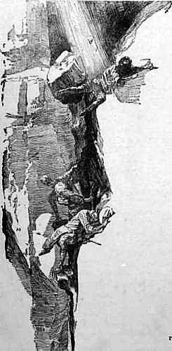
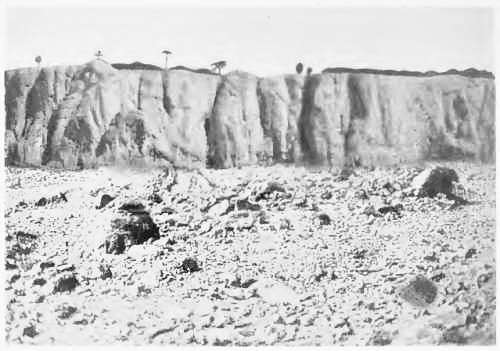
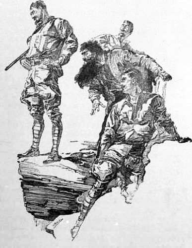

Neuntes Kapitel
===============
Wer hätte das voraussehen können?
---------------------------------

Ein furchtbares Verhängnis ist über uns hereingebrochen. Wer hätte das voraussehen können? Ich sehe kein Ende unserer aufregenden Erlebnisse. Vielleicht sind wir verurteilt, unser ganzes Leben an diesem seltsamen, unzugänglichen Ort zuzubringen. Ich bin noch so betäubt, dass ich die gegenwärtigen Vorgänge kaum verstehe, viel weniger noch die Aussichten, die uns die Zukunft bietet. Die Gegenwart erfüllt meinen verwirrten Sinn mit tiefstem Schrecken, und die Zukunft erscheint mir dunkel wie die Nacht.

Niemals haben sich Menschen in einer schlimmeren Lage befunden, und es gibt kein Mittel, Euch genaue geographische Angaben über unseren Aufenthaltsort zukommen zu lassen und unsere Freunde zu einer Ersatzexpedition aufzurufen. Und selbst wenn die Absendung einer solchen möglich wäre, so würde unser Schicksal aller menschlichen Wahrscheinlichkeit nach längst entschieden sein, bevor sie in Südamerika eintreffen könnte.

Wir sind in Wahrheit so weit von jeder menschlichen Hilfe entfernt, als säßen wir auf dem Monde. Wenn es uns gelingt durchzukommen, so werden wir es allein unseren eigenen Kräften zu verdanken haben. Ich habe drei hervorragende Männer zu Gefährten, Männer von großer Intelligenz und unerschütterlichem Mut. Darin liegt unsere einzige Hoffnung. Nur wenn ich die ruhigen Gesichter meiner Kameraden sehe, steigt ein Schimmer von Hoffnung in dem Dunkel vor mir auf. Äußerlich, glaube ich, mache ich einen ebenso gefassten Eindruck wie sie, innerlich aber erfüllt mich die allergrößte Besorgnis.

Ich will jetzt, so genau wie ich es kann, in meiner Schilderung der Ereignisse, die uns bis zu dieser Katastrophe geführt haben, fortfahren.

Als ich meinen letzten Brief beendete, stellte ich fest, dass wir 15 Kilometer von einer riesigen, rötlichen Felsmauer entfernt waren, die ohne Zweifel jenes Plateau, von dem Professor Challenger sprach, wie eine hohe Mauer umgibt. Als wir uns ihr näherten, schien mir ihre Höhe an einigen Stellen größer zu sein, als er behauptet hatte – erreichte sie doch teilweise mindestens tausend Fuß –, und die Felsen waren sonderbar geriefelt in einer Art, die, wie ich glaube, charakteristisch für basaltische Erhebungen ist. Etwas Ähnliches kann man in den Salisbury Crags bei Edinburgh sehen. Der Gipfel war allem Anschein nach von einer üppigen Vegetation bedeckt, die nahe dem Rand aus Sträuchern und weiter zurück aus vielen hohen Bäumen bestand. Anzeichen von irgendwelchem Leben konnten nicht beobachtet werden.

In jener Nacht schlugen wir unser Lager zu Füßen der Felswand auf – es war ein wüster und einsamer Ort. Die Felsen über uns waren nicht nur steil, sondern am oberen Rande sogar nach auswärts gebogen, so dass ein Aufstieg nicht in Frage kam. Nahe bei uns befand sich eine hohe, dünne Felsspitze, die ich, wenn ich mich recht erinnere, schon früher erwähnt habe. Sie ähnelt einem dicken, roten Kirchturm, dessen oberes Ende in gleicher Höhe mit dem Plateau liegt, nur dass sie durch eine große Kluft von ihm getrennt ist. Auf ihrer Spitze steht ein hoher Baum. Sowohl das Plateau an dieser Stelle wie auch diese Felsennadel waren verhältnismäßig niedrig, etwa fünf- oder sechshundert Fuß hoch, denke ich.

»Es war da oben«, sagte Professor Challenger, nach dem Baum zeigend, »wo ich den Pterodactylus sah. Ich hatte den Felsen bis zur Hälfte erklommen, bevor ich ihn herunterschoss. Ich sollte glauben, dass ein guter Bergsteiger wie ich bis zur Höhe gelangen könnte, obgleich er natürlich dem Plateau dann auch nicht näher gekommen sein würde.«

Als Challenger von seinem Pterodactylus sprach, blickte ich zu Professor Summerlee hinüber, und zum erstenmal glaubte ich auf seinem Gesicht Zeichen eines aufdämmernden Glaubens und von Reue zu bemerken. Seine dünnen Lippen lächelten nicht mehr höhnisch, sondern in seinen Augen lag der Ausdruck der Erregung und des Erstaunens. Challenger bemerkte es ebenfalls und genoss den Vorgeschmack seines Sieges.

»Natürlich,« sagte er mit grobem und betontem Spott, »glaubt Professor Summerlee, dass ich, wenn ich vom Pterodactylus spreche, einen Storch meine – nur ist das eine Art von Storch, die keine Federn hat, sondern eine lederartige Haut, ebensolche Flügel und Zähne in den Kiefern.« Er grinste und verbeugte sich mit blinzelnden Augen vor seinem Kollegen, bis dieser sich umdrehte und wegging.

Morgens, nach einem frugalen Frühstück, das aus Kaffee und Maniok bestand – wir mussten haushälterisch mit unseren Vorräten umgehen –, hielten wir einen Kriegsrat über die zweckmäßige Methode zur Besteigung des Plateaus.

Challenger führte hierbei den Vorsitz mit einer Feierlichkeit, als wäre er der Lord-Oberrichter. Stellen Sie sich ihn vor, wie er auf einem Felsblock vor uns saß, seinen lächerlichen Strohhut nach hinten geschoben, und uns mit seinen herrschsüchtigen Augen unter seinen halbgesenkten Lidern ansah, während sein großer, schwarzer Bart hin und her wackelte, als er uns unsere gegenwärtige Lage und die zu treffenden Maßnahmen auseinandersetzte.

Vor ihm saßen zunächst die drei übrigen Weißen: Ich selbst, sonnenverbrannt, jung und beweglich infolge unseres Aufenthalts in der frischen Luft, Summerlee ernst, aber immer noch kritisch, mit seiner ewigen Pfeife, Lord John scharf wie die Schneide eines Rasiermessers, seine elastische, lebhafte Gestalt auf sein Gewehr gestützt, und die Adleraugen eifrig auf den Sprechenden gerichtet. Hinter uns gruppierten sich die beiden dunkelhaarigen Mischlinge und die kleine Schar von Indianern, während sich vor uns und über uns die riesigen roten Felswände, die uns von unserem Ziel trennten, auftürmten.

»Ich brauche nicht zu sagen,« erklärte unser Führer, »dass ich gelegentlich meiner letzten Reise kein Mittel unversucht gelassen habe, das Plateau zu erklimmen, und ich glaube nicht, dass irgendein anderer das erreichen wird, was mir nicht gelungen ist. Denn ich verstehe mich etwas aufs Bergsteigen. Ich hatte damals keinerlei für solche Zwecke nötigen Hilfsmittel bei mir, bin aber so vorsichtig gewesen, sie diesmal mitzubringen. Mit ihrer Hilfe halte ich es bestimmt für möglich, bis zur Spitze dieses freistehenden Felsens zu gelangen. Die Ersteigung des Plateaus ist freilich, soweit die Wände nach außen überhängen, ein vergebliches Bemühen. Ich musste mich bei meinem letzten Hiersein infolge Eintritts der Regenperiode und der Erschöpfung meiner Vorräte allzusehr beeilen. Diese Rücksichten beschränkten meine Zeit, so dass es mir nur möglich war, etwa sechs Meilen der Felswände in östlicher Richtung von hier abzusuchen, ohne dass es mir gelang, einen Weg nach oben ausfindig zu machen. Was sollen wir also jetzt tun?«

»Es scheint nur einen vernünftigen Ausweg zu geben«, sagte Professor Summerlee. »Wenn Sie den Osten erforscht haben, müssten wir am Fuße der Bergwand nach Westen zu marschieren, um nach einer geeigneten Stelle für den Aufstieg zu suchen.«

»So ist es«, sagte Lord John. »Alle Wahrscheinlichkeit spricht dafür, dass dieses Plateau keine große Ausdehnung hat. Wir werden also um dasselbe herumgehen und entweder einen brauchbaren Weg nach oben finden oder zu unserem Ausgangspunkt zurückkehren.«

»Ich habe unserem jungen Freund hier bereits auseinandergesetzt,« sagte Professor Challenger (er sprach von mir immer nur, als ob ich ein Schuljunge von zehn Jahren wäre), »dass es ganz unmöglich ist, hier irgendwo einen zum Aufstieg geeigneten Weg zu finden, und zwar aus dem einfachen Grunde, dass das Plateau dann nicht isoliert wäre und jene Bedingungen, die die eigenartige Aufhebung der allgemeinen Naturgesetze veranlasst haben, nicht zustande gekommen wären. Die Möglichkeit ist aber durchaus zuzugeben, dass es Stellen gibt, wo ein geschickter Kletterer die Höhe erreichen kann, ohne dass ein großes und schweres Tier in der Lage wäre, einen Abstieg zu unternehmen. Es ist sogar sicher, dass es irgendeine Stelle gibt, wo der Aufstieg möglich ist.«

»Woher wissen Sie das, Herr?« fragte Summerlee scharf.

»Weil mein Vorgänger, der Amerikaner Maple White, tatsächlich einen solchen Aufstieg gemacht hat. Wie könnte er sonst das Ungeheuer, das er in seinem Skizzenbuch gezeichnet hat, gesehen haben?«

»In diesem Falle eilt Ihre Begründung den bewiesenen Tatsachen etwas voraus«, sagte der halsstarrige Summerlee. »Ich glaube an das Vorhandensein des Plateaus, weil ich es gesehen habe, aber davon, dass es irgendeine Spur von Leben aufweist, habe ich mich noch nicht überzeugen können.«

»Woran Sie glauben, Herr, oder woran Sie nicht glauben, ist tatsächlich von außerordentlich geringer Bedeutung. Ich stelle mit Vergnügen fest, dass sich Ihrer Einsicht wenigstens das Vorhandensein des Plateaus nicht verschlossen hat.« Er blickte hinauf und sprang dann zu unserem Erstaunen von seinem Felsblock herunter, ergriff Summerlee mit der einen Hand im Nacken und schob ihm mit der anderen Hand den Kopf nach hinten. »Nun, Herr,« donnerte er, heiser vor Aufregung, »soll ich Ihnen behilflich sein festzustellen, dass das Plateau tierisches Leben aufweist?«

Ich sagte bereits, dass der Rand der Klippe von einem dicken Kranz überhängenden Grüns bedeckt war. Aus dieser grünen Linie war plötzlich ein schwarzes, glänzendes Wesen hervor, getreten. Als es langsam herauskam und über den Abgrund blickte, sahen wir, dass es eine sehr große Schlange mit einem eigenartig flachen, spatenförmigen Kopf war. Es schwankte und bebte für die Dauer einer Minute über uns, und die Morgensonne glänzte auf den glatten Windungen seines Körpers. Dann zog es sich langsam wieder ins Innere zurück und verschwand.

Summerlee war von dem Anblick so benommen, dass er ruhig stillhielt, als Challenger sein Gesicht nach oben gebogen hatte. Jetzt aber stieß er seinen Kollegen zurück und nahm seine würdige Haltung wieder ein.

»Es würde mir lieb sein, Professor Challenger,« sagte er, »wenn Sie Ihre Einfälle kundgeben würden, ohne mich am Kinn zu packen. Sogar das Erscheinen einer ganz gewöhnlichen Felsen-Pythonschlange scheint mir eine solche Freiheit des Benehmens nicht zu rechtfertigen.«

»Gleichwohl gibt es tierisches Leben auf dem Plateau«, erwiderte sein Kollege triumphierend. »Und nun, nachdem diese wichtige Tatsache in einer Weise erwiesen wurde, die jedermann, möge er noch so voreingenommen oder dumm sein, genügen kann, bin ich der Meinung, dass wir nicht besser handeln können, als unser Lager abzubrechen und nach Westen zu marschieren, bis wir die Möglichkeit eines Aufstiegs sehen.«

Der Boden am Fuße der Felsen war steinig und uneben, so dass der Vormarsch nur langsam und unter Schwierigkeiten vonstatten ging. Plötzlich stießen wir indessen auf etwas, was unsere Herzen entzückte. Es war die Stelle eines alten Lagers mit verschiedenen leeren Chikagoer Konservenbüchsen, einer Flasche mit der Aufschrift »Brandy«, einem zerbrochenen Dosenöffner und einer Reihe anderer Gegenstände, wie sie Reisende zurückzulassen pflegen. Eine zerknüllte und zerfetzte Zeitung erwies sich als eine Nummer des »Chicagoer Democrat«, deren Datum allerdings verwischt war. »Das ist nicht meine,« sagte Challenger, »sie muss Maple White gehört haben.«

Lord John untersuchte interessiert einen großen Farnbaum, der die Lagerstätte beschattete. »Sehen Sie doch hier,« sagte er, »ich sollte meinen, das ist ein Wegweiser.«

Ein Holzsplitter war so an den Stamm genagelt, dass er nach Westen zeigte.

»Höchstwahrscheinlich ein Wegweiser«, sagte Challenger. »Oder was sonst? Unser Pionier hat, als er die Entdeckung machte, sich verirrt zu haben, dieses Zeichen hinterlassen, um irgendeiner ihm folgenden Expedition den von ihm eingeschlagenen Weg anzudeuten. Vielleicht stoßen wir auf unserem weiteren Marsch noch auf andere Hinweise.«

Und solche fanden wir in der Tat, aber sie waren von einer schrecklichen und völlig unerwarteten Art. Unmittelbar zu Füßen der Felswand befand sich eine ausgedehnte, mit hohem Bambus bewachsene Stelle, wie wir sie früher bereits auf unserer Reise durchquert hatten. Viele von diesen Stämmen waren zwanzig Fuß hoch und endeten in scharfen, harten Spitzen, so dass sie so, wie sie dastanden, wie furchtbare Speere wirkten. Wir schritten am Rande dieses Dickichts entlang, als meine Augen durch etwas Weißes in seinem Innern gefesselt wurden. Ich schob meinen Kopf zwischen die Stämme und erblickte einen menschlichen Schädel. Auch das ganze Skelett fand sich vor, aber der Schädel hatte sich gelöst und lag einige Fuß weiter nach außen.

Wir machten die Stelle mit einigen Schlägen der Machete unserer Indianer frei und waren nunmehr imstande, den Schauplatz dieser Tragödie näher zu untersuchen. Von den Kleidern waren nur noch einige Fetzen zu unterscheiden, aber Reste von Stiefeln steckten noch an den Fußknochen. Es war klar, dass es sich bei diesem Toten um einen Europäer handelte. Eine goldene Uhr von der Firma Hudson, New York, und eine Kette, an der ein Füllfederhalter befestigt war, lag zwischen den Knochen. Gleichfalls fand sich eine silberne Zigarettenschachtel vor, auf deren Deckel »J. C. von A. E. C.« eingraviert war. Aus dem Zustande des Materials konnte man schließen, dass die Katastrophe vor noch nicht allzu langer Zeit stattgefunden hatte.«

»Wer kann das sein?« fragte Lord John. »Armer Teufel! Alle Knochen seines Körpers scheinen gebrochen zu sein.«

»Und die Bambusstämme wachsen durch seine zerschmetterten Rippen«, sagte Summerlee. »Es ist eine schnellwachsende Pflanze, aber es ist sicherlich nicht anzunehmen, dass dieser Körper hier bereits so lange gelegen hat, dass sie bis zu einer Höhe von zwanzig Fuß emporgeschossen sind.«

»Über die Identität dieses Mannes«, sagte Professor Challenger, »besteht bei mir keinerlei Zweifel. Als ich den Amazonenstrom hinauffuhr, bevor ich in der Hazienda eintraf, habe ich besondere Nachforschungen betreffs Maple White angestellt. In Para wusste man nichts von ihm. Glücklicherweise hatte ich einen bestimmten Anhaltspunkt, denn sein Skizzenbuch enthielt ein besonderes Bild, das ihn beim Frühstück mit einem gewissen Geistlichen in Rosario zeigte. Es gelang mir, diesen Priester ausfindig zu machen, und obgleich er sich als ein sehr polemischer Bursche erwies, der es lächerlich übelnahm, dass ich ihm die ätzende Wirkung moderner Wissenschaft auf seinen Glauben auseinandersetzte, gab er mir nichtsdestoweniger einige positive Auskünfte. Maple White passierte Rosario vor vier Jahren, zwei Jahre, bevor ich seinen toten Körper sah. Er war zu dieser Zeit nicht allein, sondern in Begleitung eines Freundes, eines Amerikaners mit Namen James Colver, der im Boot zurückblieb und nicht mit dem Geistlichen zusammenkam. Ich denke also, dass wir hier ohne Zweifel vor den menschlichen Überresten dieses James Colver stehen.«

»Und auch darüber kann kein Zweifel sein,« sagte Lord John, »auf welche Weise er hier seinen Tod gefunden hat. Er ist von der Höhe herabgefallen oder herabgestürzt und von den Bambusstämmen aufgespießt worden. Woher sollten sonst seine sämtlichen Knochen gebrochen sein, und wie sollten die Stämme von dieser enormen Länge sonst wohl seinen Körper durchbohrt haben?«

Tiefes Schweigen legte sich auf uns, als wir um diese zerschmetterten Überreste herumstanden und uns von der Wahrheit der Worte Lord John Roxtons überzeugten. Der vorstehende Rand der Felswände hing senkrecht über dem Bambusgestrüpp. Zweifellos war er von oben herabgefallen. Aber war er gefallen? Handelte es sich hier um einen Unglücksfall? Oder – verhängnisvolle und furchtbare Möglichkeiten dieses unbekannten Landes begannen vor unserer Seele aufzusteigen.

Schweigend setzten wir unseren Weg zu Füßen der Felswand fort, die keine Unterbrechung zeigte, wie jene riesenhaften antarktischen Eisfelder, die sich von einem Horizont bis zum andern erstrecken und zu einer die Mastspitzen von Expeditionsschiffen weit überragenden Höhe auftürmen. Auf einer Strecke von fünf Meilen konnten wir nicht die geringste Spalte feststellen. Und dann erblickten wir plötzlich etwas, was uns mit neuer Hoffnung erfüllte. In einer Aushöhlung des Felsens, die gegen Regen geschützt war, war in roher Form ein Pfeil mit Kreide gezeichnet, der still nach Westen wies.

»Wieder Maple White«, sagte Professor Challenger. »Er hatte eine Vorahnung davon, dass würdige Männer seinen Fußstapfen folgen würden.«

»Hatte er denn Kreide bei sich?«

»Ein Kasten mit farbiger Kreide hat sich in seinem Tornister vorgefunden. Ich erinnere mich, dass das weiße Stück ziemlich abgenutzt war.«

»Das ist sicher ein guter Beweis«, sagte Summerlee. »Wir können nichts Besseres tun, als seiner Führung folgen und nach Westen weitermarschieren.« Nach etwa fünf weiteren Meilen erblickten wir wieder einen weißen Pfeil auf dem Felsen, und zwar an einer Stelle, an der wir zum erstenmal einen kleinen Spalt in der glatten Wand feststellten. Innerhalb dieser Kluft fand sich ein zweites Zeichen, das mit einer aufwärts gerichteten Spitze nach oben wies, als wenn der angedeutete Punkt sich oberhalb des Grundes, auf dem wir standen, befand.

Es war ein düsterer Ort, denn die Felsmauern waren so riesenhaft und der schmale Ausblick auf den Himmel so eng und so sehr durch einen doppelten Kranz von Vegetation verdunkelt, dass nur ein mattes Licht auf den Boden fiel. Wir hatten seit vielen Stunden nichts gegessen und waren von dem steinigen und unebenen Weg sehr ermüdet, aber unsere Nerven waren viel zu erregt, als dass wir eine Unterbrechung hätten machen können. Wir ließen indessen unser Lager aufschlagen, und während die Indianer damit beschäftigt waren, drangen wir vier mit den beiden Mischlingen in die schmale Schlucht ein.

Sie hatte am Eingang nicht mehr als vierzig Fuß Breite, wurde aber schnell enger und endete in einem spitzen Winkel, dessen Wände für einen Aufstieg zu steil und glatt waren. Unser Pionier hatte also sicherlich auf etwas anderes hinweisen wollen. Wir gingen zurück – die ganze Schlucht war nicht tiefer als einen halben Kilometer. Plötzlich entdeckte der Blick Lord Johns das Gesuchte. Hoch über unseren Köpfen zeichnete sich auf der dunklen Wand ein kreisförmiger, schwarzer Fleck ab. Das konnte nur die Öffnung einer Höhle sein.

Da sich an dieser Stelle der Wand eine Geröllhalde angesammelt hatte, war es nicht schwer, hinaufzugelangen. Als wir die dunkle Stelle erreichten, waren alle Zweifel geschwunden. Wir fanden nicht nur einen Eingang in den Felsen, sondern an der einen Seite desselben wiederum ein Pfeilzeichen. Dies war die richtige Stelle, und auf diesem Wege hatten Maple White und sein unglücklicher Kamerad den Aufstieg gemacht.

Wir waren zu aufgeregt, um zum Lager zurückzukehren, sondern beschlossen eine sofortige nähere Untersuchung. Lord John hatte eine elektrische Lampe in seinem Tornister, die uns jetzt gute Dienste leistete. Einen kleinen, gelben Lichtkegel vorauswerfend, schritt Lord John vorwärts, während wir einer nach dem anderen seinen Fußstapfen folgten. Die Höhle war offenbar von Wasser ausgewaschen worden, wie man aus den glatten Wänden und aus den rundlichen Kieselsteinen am Boden schließen konnte. Fünfzig Meter weit ging sie gerade in den Felsen hinein und stieg dann im Winkel von 45 Grad aufwärts. Gleich darauf wurde die Richtung sogar noch steiler, und wir waren gezwungen, auf Händen und Knien auf dem losen Gestein, das unter uns wegrutschte, höher zu klettern. Plötzlich stieß Lord Norton einen Schrei der Überraschung aus.

»Der Ausgang ist versperrt«, sagte er.

Hinter ihm herkriechend, erblickten wir in dem gelben Lichtfleck vor uns eine Mauer von Basaltstücken, die bis zur Decke hinaufreichte.

»Die Decke ist eingestürzt.«

Vergebens räumten wir einige Steine beiseite. Die einzige Wirkung war, dass größere Blöcke in Bewegung gerieten und uns zu zerschmettern drohten. Dies Hindernis hätte ohne Zweifel all unseren Bemühungen, es beiseite zu räumen, widerstanden. Der Weg, den Maple White zum Aufstieg benutzt hatte, war nicht mehr brauchbar.

Zu niedergeschlagen, um sprechen zu mögen, stolperten wir den dunklen Tunnel wieder hinunter und gingen zum Lager zurück.

Indessen ereignete sich, bevor wir die Schlucht verließen, ein Vorfall, der mit Beziehung auf die künftigen Ereignisse von Bedeutung ist.

Wir standen in einer kleinen Gruppe auf dem Grunde der Schlucht, etwa vierzig Fuß unterhalb des Höhleneingangs, als plötzlich ein riesiger Felsblock mit furchtbarer Gewalt hinter uns niederstürzte. Es gelang uns nur mit genauer Not, beiseite zu springen. Wir selbst konnten nicht sehen, woher der Block gekommen war, aber unsere Mischlinge, die noch beim Eingang der Höhle waren, sagten, dass er hinter ihnen heruntergesaust wäre und infolgedessen oben von der Felswand heruntergefallen sein müsse. Dort oben allerdings, in dem grünen Kranz der Vegetation, die den Rand der Mauer bedeckte, konnten wir keinerlei Zeichen von Bewegung feststellen. Aber darüber konnte kein Zweifel bestehen, dass der Stein uns galt, und man durfte also mit Sicherheit auf Lebewesen – und zwar böswillige – auf dem Plateau schließen.

Wir zogen uns eiligst aus der Schlucht zurück, voll von Gedanken über diese neueste Entwicklung und ihren Einfluss auf unsere Pläne. Unsere Lage war schon vorher schwierig genug; aber wenn die Hindernisse in der Natur unterstrichen wurden durch überlegten menschlichen Widerstand, dann wurde sie in der Tat hoffnungslos. Und doch, wenn wir hinauf, blickten zu der nur ein paar hundert Fuß über uns befindlichen Vegetation, dann gab es auch nicht einen unter uns, der sich mit dem Gedanken, nach London zurückzukehren, bevor wir das Plateau gründlich erforscht hatten, hätte befreunden können.

Wir erörterten unsere Lage und hielten es für das beste Verfahren, unseren Marsch um das Plateau herum fortzusetzen, um, wenn möglich, irgendeinen zur Höhe führenden Weg zu finden. Die Felswand, die bereits beträchtlich niedriger geworden war, begann sich langsam von Westen nach Norden zu wenden, und wenn wir in diesem Bogen den Abschnitt eines Kreises erblicken durften, so konnte der Gesamtumfang nicht sehr groß sein. Schlimmstenfalls konnten wir also in einigen Tagen bei unserem Ausgangspunkt wieder angelangt sein.

Die Marschleistung dieses Tages betrug insgesamt etwa vierzig Kilometer, ohne dass sich uns irgendwelche Aussichten eröffnet hätten, übrigens zeigte uns das Aneroidbarometer, dass wir uns seit dem Verlassen unserer Boote in beständigem Aufstieg bis zu einer Höhe von nicht weniger als dreitausend Fuß über dem Meeresspiegel erhoben hatten. Daher auch der bedeutende Wechsel sowohl in der Temperatur, wie auch in der Vegetation. Wir hatten verschiedene von den furchtbaren Insekten, die die Geißel tropischer Länder bilden, hinter uns zurückgelassen. Nur wenige Palmen und manche Farnbäume waren geblieben. Aber die Riesenbäume aus den Urwäldern am Amazonenstrom waren geschwunden. Ich freute mich, die Winde, die Passionsblume, die Begonie, alle diese Blumen, die mich an die Heimat erinnerten, hier zwischen den ungastlichen Felsen wiederzusehen. Es gab da eine rote Begonie von genau derselben Farbe, wie jene, die in einem Blumentopf auf dem Fensterbrett einer gewissen Villa in Streatham steht – aber jetzt gleite ich in private Erinnerungen hinein.

In dieser Nacht – ich spreche immer noch vom ersten Tage unseres Marsches um das Plateau herum – erwartete uns ein großes Erlebnis. Und zwar eins, das für immer jeden Zweifel beseitigte, den wir noch über die Geheimnisse in unserer Nähe hätten haben können.

Sie werden sich beim Lesen – und an dieser Stelle vielleicht zum erstenmal – davon überzeugen, verehrter Herr McArdle, dass unsere Zeitung mich nicht zu einer unnützen Sache herausgeschickt hat und dass sie einen ganz wunderbaren Bericht zur Veröffentlichung abgeben wird, sobald wir nur des Professors Erlaubnis dazu haben werden. Ich möchte es nicht wagen, diese Artikel zu bringen, wenn ich nicht meine Beweisstücke nach England bringen kann, oder ich würde für immer den Namen eines journalistischen Münchhausens erworben haben. Ich zweifle nicht daran, dass Sie genau so empfinden und dass Sie den Ruf der »Gazette« mit diesem Abenteuer nicht aufs Spiel setzen wollen, bevor wir nicht in der Lage sind, dem Chor der Kritiker und Skeptiker, die solche Artikel notwendigerweise auf den Plan bringen müssen, entgegentreten zu können. Und so muss auch der Bericht von diesem wunderbaren Vorfall, der eine so prächtige fette Überschrift in unserer alten lieben Zeitung haben könnte, den geeigneten Zeitpunkt zur Veröffentlichung im Schubfach des Herausgebers abwarten.

Und doch war alles vorüber wie ein Blitz und hatte keinerlei Folgen, außer in unseren Überzeugungen.

Und zwar hat sich folgendes ereignet: Lord John hatte ein Ajuti – ein kleines Tier, das mit einem Schwein Ähnlichkeit hat – geschossen, und wir waren dabei, nachdem wir die eine Hälfte desselben den Indianern gegeben hatten, die andere Hälfte über unserem Feuer zu braten. Es wurde nach Eintritt der Dunkelheit ziemlich kühl, so dass wir alle an das Feuer heranrückten. Die Nacht war mondlos, aber einige Sterne glänzten, so dass man eine kleine Strecke weit auf der Ebene sehen konnte. Plötzlich schoss etwas aus der Dunkelheit mit einem Schwung wie ein Luftschiff herunter. Für einen Moment waren wir alle wie von einem Baldachin aus ledernen Flügeln bedeckt, und ich hatte einen Augenblick das Bild eines langen, schlangenähnlichen Nackens, eines wilden, roten, gierigen Auges und eines großen, schnappenden Schnabels, der zu meinem Erstaunen kleine, glänzende Zähne trug, vor mir. Im nächsten Augenblick schon war es verschwunden – und mit ihm das halbe Schwein. Ein riesenhafter, dunkler Schatten, zwanzig Fuß im Durchmesser, schwang sich in die Höhe. Für einen Augenblick verdunkelten die ungeheuren Flügel die Sterne, und dann verschwand es hoch über uns hinter dem Rand der Felswand. Wir saßen in schweigendem Staunen um das Feuer herum wie die Helden Virgils, als die Harpyen sich auf sie stürzten. Summerlee fand zuerst die Sprache wieder.

»Professor Challenger,« sagte er mit seiner ernsten Stimme, die vor innerer Bewegung zitterte, »ich bin Ihnen Abbitte schuldig, ich bin völlig im Unrecht, und ich bitte Sie, das Geschehene zu vergessen.«

Die Worte klangen herzlich, und die beiden Männer schüttelten sich zum erstenmal die Hand. Soviel hatten wir also gewonnen durch diesen unbezweifelbaren Anblick eines Pterodactylus. Zwei solche Männer zusammenzubringen, das war ein gestohlenes Nachtessen wert.

Wenn aber prähistorisches Leben auf dem Plateau existierte, konnte es jedenfalls nicht überreichlich sein, denn während der nächsten drei Tage bemerkten wir keine weiteren Anzeichen davon. Unser Marsch führte uns im Norden und Osten durch ein unfruchtbares und widerwärtiges Land, das abwechselnd aus steinbedeckten Wüsten und tiefen, an Wasservögeln reichen Sümpfen bestand. Das Vorwärtskommen war hier außerordentlich schwierig. Wenn wir nicht eine schmale Felskante, die am Rande der Mauer entlanglief, gefunden hätten, so wäre uns nur die Rückkehr übriggeblieben. Manchmal versanken wir bis zu den Hüften in den Schlamm des alten, halbtropischen Sumpfes. Und was die Sache noch schlimmer machte, die Gegend schien ein Lieblingsbrutplatz der Jaracacaschlange, der giftigsten und angriffslustigsten in Südamerika, zu sein. Immer wieder kamen diese schrecklichen Tiere hüpfend und springend quer über die Oberfläche des fauligen Morastes auf uns zu, und nur durch ständiges Bereithalten unserer Schrotflinten konnten wir uns ihrer erwehren. Der Anblick einer trichterförmigen Einsenkung des Sumpfes, die mit üppig gedeihenden Flechten in hellgrüner Farbe bedeckt war, wird meine Erinnerung immer wie ein Alpdruck belasten. Sie schien ein richtiges Nest dieses ekelhaften Gewürms zu sein. Die Abhänge wimmelten von den auf uns zustrebenden Tieren, denn es ist eine Eigenart der Jaracaca, dass sie jeden Menschen ohne weiteres angreift. Es wurden ihrer zu viele, als dass wir hätten schießen können. Wir suchten unser Heil daher in der Flucht und liefen, bis wir völlig erschöpft waren. Niemals werde ich es vergessen, wie wir, rückschauend, die Köpfe dieser schrecklichen Verfolger sich im grünen Schilf heben und senken sahen. Jaracaca-Sumpf nannten wir diese Stelle auf der Karte, die wir von dieser ganzen Gegend entwarfen.

Die rötliche Farbe der Felswand ging langsam in ein Schokoladenbraun über; die Vegetation auf der Höhe war weniger dicht, und diese sank bis auf etwa drei- oder vierhundert Fuß, aber nirgends fanden wir eine zum Aufstieg geeignete Stelle. Wenn überhaupt möglich, war dieser hier noch weniger zu bewerkstelligen als bei unserem Ausgangspunkt. Die absolute Steilheit der Wände erkennt man aus der Photographie, die ich von der Steinwüste aufnahm.

»Aber der Regen muss doch irgendwo herunterkommen,« sagte ich, als wir die Lage erörterten, »es müssen Rinnen in dem Felsen vorhanden sein.«

»Unser junger Freund hat Augenblicke einer gewissen geistigen Klarheit«, sagte Professor Challenger, indem er mir auf die Schulter klopfte.

»Der Regen muss doch irgendwo bleiben«, wiederholte ich.

»Er hält unbedingt fest an seinem Gedanken. Schade nur, dass wir durch Okularinspektion bereits sicher festgestellt haben, dass es keine Rinnen in der Felswand gibt.«

»Aber wo bleibt das Wasser denn?« fragte ich hartnäckig.

»Ich glaube, man darf mit Recht vermuten, dass es nach innen rinnt, wenn es nicht nach außen abfließt.«

»Dann ist also ein See in der Mitte.«

»Das nehme ich an.«

»Es ist mehr als wahrscheinlich, dass der See einen alten Krater ausfüllt«, sagte Summerlee. »Die ganze Formation ist, wie man sieht, durchaus vulkanisch. Aber wie dem auch sein möge, ich würde mich nicht wundern, wenn die Oberfläche des Plateaus sich nach innen zu einem riesigen Wasserspiegel in der Mitte hinabsenkt, der vielleicht einen unterirdischen Abfluss in die Sümpfe nach dem Jaracacasumpf hin hat.«

»Vielleicht wird der Zufluss an Regenwasser auch durch Verdunstung ausgeglichen«, bemerkte Challenger, und dann verloren sich die beiden gelehrten Männer in eine ihrer üblichen wissenschaftlichen Diskussionen, die dem Laien so unverständlich waren, als ob sie chinesisch miteinander sprächen.

Am sechsten Tage hatten wir unseren Rundmarsch beendet und kamen bei unserem Lager neben dem einzelstehenden Felsen wieder an. Wir waren in verzweifelter Stimmung. Denn unsere Untersuchung war völlig ergebnislos geblieben, und es war völlig sicher, dass es nirgends eine Stelle gab, wo auch der geschickteste Mensch hätte hoffen können, die Höhe durch Klettern zu erreichen. Die Stelle, die uns Maple White durch Pfeile als den Ort seines Aufstiegs gekennzeichnet hatte, war unpassierbar geworden.

Was blieb uns zu tun übrig? Unsere Vorräte, die wir mit Hilfe unserer Gewehre ergänzen konnten, hätten wohl noch ausgehalten. Aber schließlich musste der Zeitpunkt kommen, an dem sie erschöpft waren. In wenigen Monaten musste auch die Regenzeit, die das Kampieren im Freien unmöglich machte, beginnen. Der Felsen war härter als Marmor, und jeder Versuch, Stufen hineinzuhauen, überstieg angesichts der riesigen Höhe unsere Zeit und unsere Hilfsmittel. Kein Wunder, dass wir uns an diesem Abend gegenseitig mit düsteren Blicken streiften und schweigsam zu unseren Schlafdecken griffen. Ich entsinne mich, dass ich im Moment des Einschlafens noch Professor Challenger wie einen riesigen Ochsenfrosch am Feuer hocken sah. Den großen Kopf auf seine Hände gestützt und anscheinend tief in Gedanken versunken, so dass er völlig überhörte, dass ich ihm Gute Nacht wünschte.

Ein ganz anderer Challenger war es, der uns am nächsten Morgen begrüßte – ein Challenger, dessen ganze Person Zufriedenheit und inneren Stolz ausströmte. Als wir uns zum Frühstück versammelt hatten, blickte er uns mit falscher Bescheidenheit in die Augen, als wolle er sagen, ich weiß, dass ich alles, was Sie mir zum Lob sagen könnten, verdiene, aber ich bitte Sie, nichts zu sagen, um mir das Erröten zu ersparen. Sein Bart sträubte sich lebhaft. Er warf sich in die Brust und steckte seine Hand vorn in sein Jackett. Das ist das Bild, das ihm sicherlich manchmal vorschwebt, wie er dasteht auf einem der leeren Piedestale auf dem Trafalgar Square und den Schreckbildern auf den Straßen Londons noch ein neues hinzufügt.

»Heureka«, rief er aus, die blitzenden Zähne in seinem schwarzen Bart aufleuchten lassend. »Meine Herren, Sie können mir gratulieren, und wir können uns gegenseitig gratulieren. Das Problem ist gelöst.«

»Sie haben einen Weg nach oben gefunden?«

»Ich wage es zu hoffen.«

»Und wo?«

Statt einer Antwort zeigte er hinauf auf die Spitze der Felssäule.

Unsere Gesichter – oder wenigstens meins – wurden lang, als wir hinaufblickten. Dass man durch Klettern hinaufkommen könne, hatte uns unser Führer bereits versichert. Aber ein furchtbarer Abgrund lag zwischen dem Felsen und dem Plateau.

»Wir werden da niemals hinüberkommen«, sagte ich verschüchtert.

»Wir können wenigstens die Spitze erreichen«, erwiderte er. »Sobald wir oben sind, werde ich Ihnen zeigen, dass die Hilfsmittel eines erfinderischen Geistes noch nicht erschöpft sind.«

Nach dem Frühstück packte er ein Bündel aus, das die von ihm mitgebrachten Klettergeräte enthielt. Er entnahm ihm eine Rolle starken und leichten Taus von etwa 150 Fuß Länge, Steigeisen, Klammern und andere sinnreiche Vorrichtungen. Lord John war ein erfahrener Bergsteiger, und auch Summerlee hatte sich gelegentlich im Klettern geübt, so dass ich als einziger übrig blieb, dem diese Tätigkeit etwas Neues war. Aber meine Stärke und Behendigkeit konnten wohl einen Ersatz für meine mangelnden Erfahrungen bilden. Die Aufgabe war tatsächlich nicht allzu schwer, obgleich es Augenblicke gab, in denen sich mir die Haare auf dem Kopf sträubten. Die erste Hälfte ließ sich durchaus leicht bewältigen, aber weiter hinauf wurde die Wand immer steiler, so dass wir während der letzten fünfzig Fuß buchstäblich mit den Fingern oder Zehen an den schmalen Kanten und Einsenkungen des Felsens hingen. Ich wäre sicherlich nicht nach oben gelangt, ebensowenig Summerlee, wenn Challenger nicht die Spitze erreicht (es war ein außerordentliches Bild, diesen so schwerfälligen Menschen so gewandt klettern zu sehen) und das Tau um den Baum, der oben wuchs, geschlungen hätte. Mit dieser Unterstützung war es uns bald möglich, an der zackigen Wand hinaufzuklimmen, so dass wir uns oben auf einer kleinen grasbewachsenen Plattform, etwa fünfundzwanzig Fuß im Quadrat, zusammenfanden.

Den ersten Eindruck, den ich empfing, nachdem ich wieder zu Atem gekommen war, bildete die großartige Aussicht über das Land, das wir durchquert hatten. Das ganze brasilianische Tiefland schien zu unseren Füßen zu liegen. Nach allen Seiten hin breitete es sich aus, bis es im blauen Schimmer am unendlich weit entfernten Horizont versank. Den Vordergrund bildete ein langer, steiniger und hie und da mit Farnbäumen bedeckter Abhang. Weiter weg, in der Mitte des Gesamtbildes, gerade noch hinter dem sattelförmigen Bergrücken sichtbar, erkannte ich den gelbgrünen Bambusgürtel, den wir durchquert hatten. Und dann ging die stärker werdende Vegetation langsam über in riesigen Urwald, der sich, soweit das Auge reichte und wohl noch 3-4000 Kilometer darüber hinaus, ausbreitete.

Ich war noch im Anblick dieses Panoramas versunken, als sich die schwere Hand des Professors auf meine Schulter legte.

»Hier hinüber, mein junger Freund«, sagte er. »*Vestigia nulla retrorsum*. Nicht rückwärts schauen, immer den Blick auf unser ruhmreiches Ziel.«

Die Höhe des Plateaus war, wie ich bemerkte, genau die gleiche unserer Standfläche, und der grüne Buschrand mit den einzelnen Bäumen dazwischen war uns so nahe, dass man die Unzugänglichkeit des Plateaus kaum begreifen konnte. Nach einer ungefähren Schätzung war die trennende Kluft vierzig Fuß breit. Aber, soweit ich urteilen konnte, hätte sie recht gut auch vierzig Kilometer breit sein können. Ich schlang einen Arm um den Baumstamm und lehnte mich über den Abhang. Tief unten erkannte ich die kleinen dunklen Figuren unserer Hilfsmannschaften, die zu uns hinaufsahen. Die Wand unter mir fiel absolut senkrecht hinunter, genau wie jene auf der anderen Seite.

»Das ist in der Tat merkwürdig«, sagte Professor Summerlee mit krächzender Stimme.

Ich drehte mich um und sah, wie er mit großem Interesse den Baum, an dem ich mich festhielt, prüfte. Diese glatte Rinde und die kleingerippten Blätter kamen mir sehr bekannt vor. »Das ist ja eine Buche!« rief ich aus.

»Richtig,« sagte Summerlee, »ein Landsmann in weiter Ferne.«

»Nicht nur ein Landsmann, lieber Herr Kollege,« sagte Challenger, »sondern auch, wenn ich das von Ihnen gebrauchte Bild weiter ausführen darf, ein außerordentlich wertvoller Bundesgenosse. Dieser Buchenstamm wird zu unserem Retter.«

»Beim Himmel,« rief Lord John, »eine Brücke!«

»Jawohl, meine Freunde, eine Brücke! Nicht umsonst habe ich gestern abend noch eine Stunde lang gesessen und unsere Lage durchdacht. Ich entsinne mich, unserem jungen Freunde gegenüber früher einmal die Bemerkung gemacht zu haben, dass G. E. C. sich am wohlsten fühlt, wenn er mit dem Rücken an der Mauer steht. Sie werden mir zugeben, dass wir gestern abend alle miteinander mit dem Rücken an der Mauer standen. Aber wo sich Willenskraft und Intelligenz vereinigen, gibt es immer einen Ausweg. Wir brauchten nur eine Zugbrücke zu erfinden, die über den Abgrund geschlagen wird. Bitte, was sagen Sie dazu?«

Das war tatsächlich ein ausgezeichneter Gedanke. Der Baum war mindestens sechzig Fuß hoch, und wenn es uns gelingen würde, ihn richtig zu Fall zu bringen, würde er leicht hinüberreichen. Challenger hatte sich beim Aufstieg die Axt über den Rücken gebunden, die er mir jetzt einhändigte.

»Unser junger Freund verfügt über die nötigen Armkräfte«, sagte er. »Ich halte ihn am geeignetsten für diese Aufgabe. Ich muss Sie allerdings bitten, von eigenem Denken hierbei abzusehen und nur das genau auszuführen, was man von Ihnen verlangt.«

Unter seiner Leitung hieb ich den Baum an beiden Seiten so weit an, dass er in der gewünschten Richtung fallen musste. Er hatte bereits von Natur aus eine ausgesprochene Neigung zum Plateau hinüber, so dass die Sache nicht allzu schwierig war. Ich machte mich zuletzt mit aller Kraft an die Arbeit, wobei ich mit Lord John abwechselte. Nach einer Stunde etwa gab es einen lauten Krach, der Baum schwankte und fiel dann hinüber, seine Krone im jenseitigen Gebüsch vergrabend. Der abgehauene Stamm rutschte fast bis an den Rand unserer Plattform, und eine furchtbare Sekunde lang dachten wir, dass er hinunterstürzen würde. Aber schließlich blieb er wenige Zoll von der Kante entfernt ruhig liegen, und unsere Brücke ins Unbekannte war fertig.

Wortlos schüttelten wir alle Professor Challenger, der seinen Strohhut abnahm und sich vor jedem von uns tief verbeugte, die Hand.

»Ich nehme die Ehre für mich in Anspruch,« sagte er, »der erste zu sein, der das unbekannte Land betritt – zweifellos ein geeigneter Vorwurf für ein späteres historisches Gemälde.«

Er näherte sich der Brücke, als Lord John ihm die Hand auf die Schulter legte. »Verehrter Herr Professor,« sagte er, »das kann ich tatsächlich nicht erlauben.«

»Das können Sie nicht erlauben, Herr?« sagte Challenger, den Kopf zurückwerfend und den Bart vorschiebend.

»Wenn es sich um eine wissenschaftliche Angelegenheit handelt, werde ich mich, wie Sie wissen, stets Ihrer Führung unterwerfen, da Sie ein Vertreter der Wissenschaft sind. Aber auf meinem Gebiet müssen Sie sich mir unterwerfen.«

»Ihr Gebiet, Herr?«

»Wir haben alle unseren Beruf, und der meinige ist: Soldat sein. Wir sind, wie ich die Sache auffasse, im Begriff, in ein neues Land einzudringen, das möglicherweise voll von Feinden jeder Art steckt, und darauf blindlings loszugehen aus Mangel an Überlegung und Geduld, scheint mir nicht das richtige Verfahren zu sein.«

Dieser Einwand war zu vernünftig, als dass man ihn hätte übergehen können. Challenger warf den Kopf zurück und zog die breiten Schultern hoch.

»Gut, Herr. Und was schlagen Sie vor?«

»Ich könnte mir denken, dass es da drüben einen Kannibalenstamm gibt, der im Gebüsch auf ein gutes Frühstück wartet«, sagte Lord John, zum Plateau hinüberblickend. »Es ist besser, Sie üben Vorsicht, als dass Sie in einen Kochtopf steigen. Wir wollen gern annehmen, dass uns keinerlei Gefahren erwarten, aber handeln wollen wir doch, als ob es solche gibt. Malone und ich wollen deshalb hinuntersteigen und unsere vier Gewehre und die beiden Mischlinge heraufholen. Einer von uns kann dann hinübergehen, und die übrigen werden ihn so lange mit ihren Gewehren decken, bis er feststellt, dass wir alle miteinander ohne Gefahr das Plateau betreten können.«

Challenger setzte sich auf den Baumstumpf und machte seiner Ungeduld durch Grunzen Luft. Aber Summerlee und ich waren einer Meinung darüber, dass Lord John unser Führer sein müsste, wenn es sich um solche praktischen Fragen handelte. Die Kletterei war jetzt, nachdem das Tau an dem schlimmsten Teil der Mauer herunterhing, bedeutend erleichtert. Innerhalb einer Stunde hatten wir die Gewehre und eine Schrotflinte hinaufgeschafft. Die Mischlinge waren ebenfalls nach oben gekommen und hatten auf Lord Johns Anordnung einen Ballen von Vorräten für den Fall, dass die erste Untersuchung des Plateaus längere Zeit in Anspruch nehmen sollte, mitgebracht. Jeder von uns war übrigens im Besitz eines Patronenstreifens.

»Nun, Professor Challenger, wenn Sie ernstlich darauf bestehen, der erste zu sein –«, sagte Lord John, als alle Vorbereitungen getroffen waren.

»Ich bin Ihnen sehr verbunden für die liebenswürdige Erlaubnis«, sagte der verärgerte Professor; denn niemals hat es einen Mann gegeben, der so unduldsam in allen Dingen war, die die Autorität betrafen. »Da Sie so liebenswürdig sind, es mir zu gestatten, so werde ich die Gelegenheit gern benutzen, mich als Pionier zu zeigen.« Er setzte sich rücklings auf den Baumstamm, so dass seine Beine auf beiden Seiten in den Abgrund hinunterbaumelten, hing sich das Handbeil über den Rücken und hoppelte hinüber. Drüben richtete er sich auf und winkte mit den Armen.

»Endlich!« schrie er, »endlich!«

Ich blickte ängstlich hinüber mit dem unbestimmten Gefühl, dass der grüne Vorhang irgendeine Gefahr für ihn bergen könnte. Es blieb aber alles ruhig mit Ausnahme eines merkwürdigen buntfarbigen Vogels, der vor seinen Füßen aufflog und zwischen den Bäumen verschwand.

Summerlee war der zweite. Wundervoll war diese zähe Energie in einem so gebrechlichen Körper. Er bestand darauf, zwei Gewehre mit hinüberzunehmen, so dass beide Professoren nach ihrem Übergang bewaffnet waren. Dann kam ich, und ich musste mich zwingen, nicht in den furchtbaren Abgrund, den ich überquerte, hinunterzuschauen. Summerlee streckte mir den Kolben seines Gewehrs entgegen, und einen Augenblick später war ich in der Lage, seine Hand zu erfassen. Zuletzt schritt Lord John – er schritt tatsächlich ohne Unterstützung! – hinüber. Er muss Nerven von Stahl haben.

Und dann waren wir drüben. Im Traumland. In der verlorenen Welt Maple Whites. Wir alle empfanden das als den Augenblick unseres höchsten Triumphes. Wer hätte ahnen können, dass es die Einleitung zu unserem größten Unglück war? Ich will mit kurzen Worten von dem furchtbaren Schlag, der auf uns herniedersauste, berichten.

Wir waren vom Rande aus etwa fünfzig Meter in dem dichten Gebüsch vorgedrungen, als ein furchtbares splitterndes Krachen hinter uns ertönte. Wir stürzten zum Rande der Felsmauer zurück: Die Brücke war verschwunden.

Tief unten am Fuß der Felsenwand erblickte ich, als ich hinuntersah, ein wirres Durcheinander von Zweigen und Splittern. Es war unser Buchenstamm. Hatte die Kante der Plattform nachgegeben und ihn abrutschen lassen? Einen Augenblick lang dachten wir das alle. Dann aber wurde an der Hinterseite des Felsens langsam ein dunkles Gesicht, das Gesicht des Mischlings Gomez, sichtbar. Ja, das war Gomez. Aber nicht mehr der Mischling mit dem ehrbaren Lächeln und dem maskenähnlichen Ausdruck, das war ein Gesicht mit rasenden Augen und verzerrten Zügen, ein Gesicht, das vor Hass und wilder Freude über eine gelungene Rache bebte.

»Lord Roxton,« schrie er, »Lord John Roxton!«

»Nun,« sagte unser Gefährte, »hier bin ich.«

Ein gellendes Gelächter tönte über den Abgrund hinüber.

»Ja, da bist du, du englischer Hund, und da wirst du bleiben! Ich habe gewartet und gewartet, und jetzt endlich war die Gelegenheit da. Du hast den Aufstieg schwer gefunden, du wirst finden, dass der Abstieg noch schwerer ist. Jetzt seid Ihr in der Falle, Ihr verfluchten Narren alle miteinander.«

Keines Wortes mächtig starrten wir hinüber. Ein großer, abgebrochener und im Grase liegender Ast ließ uns bald erkennen, wie er es gemacht hatte, unsere Brücke zum Absturz zu bringen. Das Gesicht war verschwunden, aber schon tauchte es wieder auf mit einem noch rasenderen Ausdruck als vorher. 

»Beinahe schon hätten wir euch umgebracht mit dem Stein bei der Höhle,« schrie er, »aber so ist es besser. Dies geht langsamer und ist furchtbarer. Eure Knochen werden da drüben bleichen, und niemand wird wissen, wo ihr liegt, um euch zu begraben. Wenn du im Sterben liegst, dann denke an Lopez, den du vor fünf Jahren am Putomajo-Fluss erschossen hast. Ich bin sein Bruder und, komme, was da kommen wolle, ich werde jetzt glücklich sterben, denn er ist gerächt.« Und mit der Hand zu uns hinüberdrohend, verschwand er.

Hätte der Mischling nur diesen Racheakt verübt und dann die Flucht ergriffen, so hätte ihm nichts geschehen können. Aber die tolle, unwiderstehliche Neigung des Lateiners, dramatisch zu wirken, wurde ihm zum Verhängnis. Roxton, der sich den Namen einer Gottesgeißel in drei Ländern erworben hatte, war nicht der Mann, der sich ungestraft verhöhnen ließ.

Der Mischling stieg an der Rückseite der Felsspitze hinunter; bevor er jedoch unten ankam, war Lord John am Rand des Plateaus entlanggelaufen und hatte hier eine Stelle gefunden, von wo aus er den Mann sehen konnte. Seine Büchse krachte, und obwohl wir nichts sehen konnten, hörten wir einen Schrei und einige Sekunden später das Aufschlagen eines fallenden Körpers. Roxton kehrte zu uns zurück mit einem Gesicht wie aus Erz.

»Ich habe gehandelt wie ein blinder Einfaltspinsel«, sagte er mit bitterem Ton. »Meiner Dummheit verdanken Sie alle dies Unglück. Ich hätte daran denken sollen, dass diese Menschen gewohnt sind, Blutrache zu üben, und hätte mehr auf der Hut sein müssen.«

»Wie steht's aber mit dem anderen, dazu haben doch zwei gehört, um den Baumstamm von der Kante abzubringen?«

»Ich hätte ihn auch niederschießen können, aber ich ließ ihn gehen. Vielleicht ist er nicht schuldig. Vielleicht wäre es aber doch besser gewesen, wenn ich ihn getötet hätte; denn er muss, wie Sie mit Recht sagen, mitgeholfen haben.«

Jetzt, nachdem wir die Erklärung des folgenschweren Vorfalls gehört hatten, entsann sich jeder von uns mancherlei zweifelhafter Handlungen von seiten des Mischlings – seines beständigen Wunsches, hinter unsere Pläne zu kommen, seines Verstecks in der Nähe unseres Zeltes, seiner verstohlenen Hassblicke, die einen oder den anderen von uns zuweilen überrascht hatten. Während wir noch unsere völlig veränderte Lage diskutierten, erregte eine merkwürdige, unten auf der Ebene sich abspielende Szene unsere Aufmerksamkeit.

Ein Mann in weißen Kleidern, der nur der überlebende Mischling sein konnte, rannte davon, als ob ihm der Teufel auf den Fersen war. Hinter ihm her lief, ihn fast erreichend, die riesenhafte Gestalt Zambos, unseres treuen Negers, und schon stürzte er sich auf den Rücken des Flüchtlings, umschlang ihn mit seinen Armen und rollte mit ihm zu Boden. Einen Augenblick später erhob sich Zambo, warf noch einen Blick auf den am Boden liegenden Mann und kam dann eiligst in der Richtung auf uns zurück. Die weiße Gestalt lag bewegungslos auf der Ebene.

Die beiden Verräter hatten ihr Ende gefunden. Aber ihr Verbrechen war nicht mehr ungeschehen zu machen. Zu der Felsenspitze zurückzukehren, war uns völlig unmöglich. Hatten wir bisher der ganzen Welt angehört, so waren wir jetzt auf unser Plateau beschränkt. Dort unten lag die Ebene, über die wir zu unseren Kanus gelangen konnten, weit hinten, jenseits des violetten verschleierten Horizonts war der Strom, der uns zur Zivilisation zurückführte, aber das verbindende Glied fehlte. Keine menschliche Erfindungsgabe hätte ein Mittel finden können, die Kluft, die zwischen uns und der Welt gähnte, zu überbrücken. Ein einziger Umstand hatte alle Bedingungen unseres Daseins verändert. Aber gerade solch ein Moment war geeignet, um zu erkennen, aus welchem Stoff meine drei Kameraden geschaffen waren. Wohl waren sie ernst und gedankenvoll, aber doch voll von unbesiegbarer Ruhe und Gelassenheit. Im Augenblick konnten wir nichts anderes tun, als uns geduldig im Gebüsch niederzulassen und auf die Rückkehr Zambos zu warten. Bald erschien sein biederes schwarzes Gesicht über dem Felsen, und seine herkulische Gestalt tauchte auf der Plattform auf.

»Was soll ich jetzt tun?« rief er hinüber. »Sagen Sie mir es, und ich werde Ihre Befehle ausführen.«

Diese Frage war leichter getan, als zu beantworten. Eins war jedenfalls klar: Der Neger bildete das einzige vertrauenswürdige Bindeglied zwischen uns und der übrigen Welt. Er durfte uns unter keinen Umständen verlassen.

»Nein, nein,« schrie er, »ich Sie nicht verlasse. Was auch kommt, Sie mich immer hier finden. Aber unmöglich Indianer zurückhalten. Sagen immer, zuviel Curipuri hier sein, wollen nach Hause. Jetzt wollen fort, ich nicht kann halten sie.«

Tatsächlich hatten unsere Indianer in letzter Zeit öfters erkennen lassen, dass sie der Reise überdrüssig seien und heimkehren möchten. Wir waren überzeugt, dass Zambo die Wahrheit sprach und dass es ihm unmöglich sein würde, sie zurückzuhalten.

»Überrede sie, bis morgen zu bleiben, Zambo«, rief ich hinunter. »Ich werde ihnen dann einen Brief mitgeben.«

»Gut, Herr! Verspreche, sie warten bis morgen«, antwortete der Neger. »Aber was soll ich tun jetzt für Sie?«

Es gab allerlei zu tun für ihn, und der treue Bursche hat alles in bewundernswerter Weise ausgeführt. Zunächst löste er nach unserer Anweisung das Tau vom Baumstamm los und warf das Ende desselben zu uns hinüber. Es war nicht dicker als eine Wäscheleine, aber doch sehr stark. Wenn es auch keine Brücke abgeben konnte, so war es für den Fall, dass wir klettern mussten, doch von unschätzbarem Wert für uns. Er befestigte darauf an dem anderen Ende des Taues den Ballen mit Lebensmitteln, den er für uns heraufgebracht hatte, so dass wir in der Lage waren, ihn zu uns herüberzuziehen. Damit konnten wir mindestens eine Woche auskommen, sogar wenn wir sonst nichts anderes fanden. Schließlich stieg er hinunter und schaffte noch zwei weitere Pakete gemischten Inhalts, eine Kiste mit Munition und eine Reihe von anderen Dingen hinauf, die wir alle mit Hilfe des Taues zu uns hinüberzogen. Als der Abend hereinbrach, stieg er hinunter und versicherte uns noch einmal, dass er die Indianer bis zum nächsten Morgen zurückhalten wolle.

Und so habe ich fast die ganze erste Nacht auf dem Plateau damit zugebracht, unsere Erlebnisse beim Schein einer Laterne niederzuschreiben.

Wir hatten etwas gegessen und uns nahe am Rande der Felswand ein Lager hergerichtet. Unseren Durst stillten wir mit zwei Flaschen Apollinaris, die wir in einer der Kisten entdeckten. Wasser zu finden, ist nunmehr für uns eine Lebensfrage, aber ich denke, dass sogar Lord John für heute genug erlebt hat, und niemand von uns fühlte Neigung zu einem ersten Vorstoß ins Unbekannte. Wir vermieden es, ein Feuer anzuzünden oder unnütze Geräusche zu machen.

Morgen (oder besser gesagt heute, denn der Tag bricht bereits an, während ich hier schreibe) werden wir einen ersten Versuch machen, in dies seltsame Land einzudringen. Ob ich in der Lage sein werde, nochmals zu schreiben, oder ob ich überhaupt jemals wieder schreibe, weiß ich nicht. Inzwischen sehe ich, dass die Indianer noch immer auf dem Platz warten, und ich glaube bestimmt, dass der treue Neger kommen und den Brief holen wird. Ich will nur hoffen, dass er wirklich ankommt.

P. S. Je mehr ich darüber nachdenke, desto verzweifelter kommt mir unsere Lage vor. Ich sehe keine Möglichkeit einer Rückkehr. Wenn in der Nähe der Kante des Plateaus ein hoher Baum stehen würde, so könnten wir eine neue Brücke von hier aus hinüberschlagen. Es gibt aber leider keinen, der näher als fünfzig Meter vom Rande abstände, und unsere vereinigten Kräfte würden nicht in der Lage sein, einen geeigneten Baum heranzuschaffen. Das Tau ist natürlich viel zu kurz, als dass wir uns daran herablassen könnten. Unsere Lage ist hilflos – hilflos!

