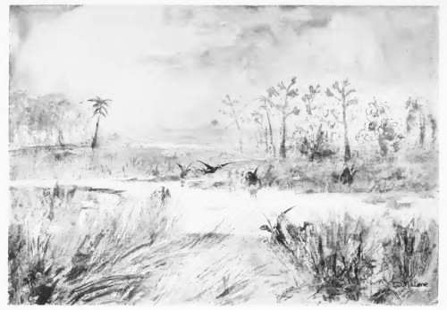

Zehntes Kapitel
===============
Die seltsamsten Dinge haben sich ereignet
-----------------------------------------

Wir haben eine Reihe höchst merkwürdiger Dinge erlebt und erleben dauernd noch neue. Mein ganzer Papiervorrat besteht aus fünf alten Notizbüchern und einer Anzahl loser Blätter, und ich besitze nur einen Füllfederhalter. Aber solange ich meine Hand bewegen kann, will ich fortfahren, unsere Erlebnisse und Eindrücke niederzuschreiben. Denn da wir die einzigen Mitglieder des Menschengeschlechts sind, die derartige Dinge zu sehen bekommen, ist es von außerordentlicher Bedeutung, wenn ich von ihnen berichte, solange sie noch frisch in meinem Gedächtnis sind und bevor das Schicksal, das drohend über uns hängt, uns zerschmettert. Ob Zambo diese Briefe zum Ufer hinuntertragen kann, oder ob ich sie auf irgendeine wunderbare Weise selbst bringen werde, oder ob schließlich irgendein kühner Forscher mit Hilfe eines Flugzeuges dies Bündel von Manuskripten findet, auf jeden Fall weiß ich, dass das, was ich hier niederschreibe, unsterblich sein wird als das klassische Beispiel eines wirklichen Abenteuers.

Am Morgen nach dem Tage, an dem wir durch den verbrecherischen Gomez zu Gefangenen auf dem Plateau gemacht waren, begann für uns ein ganz neuer Abschnitt unserer Erlebnisse. Der erste Vorfall war nicht danach angetan, mir eine sehr günstige Meinung über unseren Aufenthaltsort zu vermitteln. Als ich mich bei Tagesanbruch nach einem kurzen Schlaf erhob, fielen meine Augen auf eine merkwürdige Erscheinung an einem meiner Beine. Die Hose war etwas hinaufgerutscht, so dass ein Stückchen der Haut oberhalb des Strumpfes bloß lag. An dieser Stelle haftete etwas, das wie eine dicke rötliche Traube aussah. Erstaunt über diesen Anblick beugte ich mich vornüber, um das Ding zu entfernen, als es zu meinem Schrecken zwischen meinen Fingern zerbarst, wobei das Blut nach allen Seiten spritzte. Ein Schrei des Entsetzens brachte die beiden Professoren an meine Seite.

»Höchst interessant«, sagte Summerlee, sich über mein Schienbein beugend. »Ein riesiger Blutegel, noch nicht klassifiziert, wie ich glaube.«

»Die erste Frucht unserer Forscherarbeit«, sagte Challenger in seiner lauten pedantischen Art. »Wir können nicht umhin, sie Ixodes Maloni zu nennen. Die kleine Unannehmlichkeit, von dem Tier gebissen zu sein, mein junger Freund, bedeutet nichts gegenüber dem ruhmreichen Vorrecht, Ihren Namen in die ewigen Annalen der Zoologie einschreiben zu lassen. Unglücklicherweise haben Sie dieses schöne Exemplar im Moment seiner Sättigung zerstört.«

»Ekelhaftes Gewürm!« schrie ich.

Professor Challenger zog mit dem Ausdruck des Protestes die grauen Augenbrauen hoch und legte seine begütigende Hand auf meine Schulter. »Sie sollten es lernen, mehr wissenschaftlich zu denken und zu fühlen«, sagte er. »Für einen Mann mit philosophischer Veranlagung, wie ich, ist ein Blutegel mit seinem lanzenähnlichen Rüssel und seinem ausdehnbaren Magen ein ebenso schönes Werk der Natur wie ein Pfau oder wie etwa das Nordlicht. Es schmerzt mich, wenn ich Sie in einer so unangemessenen Weise sprechen höre. Ich zweifle aber nicht daran, dass wir bei gehörigem Eifer noch eines oder das andere Exemplar auftreiben werden.«

»Das ist sogar ganz sicher,« sagte Summerlee, ironisch lächelnd, »denn es ist gerade eines hinter Ihrem Hemdkragen verschwunden.«

Challenger machte einen Luftsprung, brüllte wie ein Ochse und zerrte wie wahnwitzig an Rock und Hemd, um beides auszuziehen. Summerlee und ich mussten so lachen, dass wir ihm kaum helfen konnten. Schließlich zogen wir ihm die Kleidungsstücke von seinem monströsen Körper (54 Zoll Bandmaß) herunter. Aus dem dichten Dschungel von schwarzen Haaren, mit denen seine Haut bedeckt war, holten wir den wandernden Blutegel hervor, ehe er sich festgesogen hatte. Aber das Gebüsch bei unserem Standort war so voll von dieser furchtbaren Pest, dass wir gezwungen waren, unseren Lagerplatz dort aufzugeben.

Das erste und notwendigste aber war, Verabredungen mit unserem treuen Neger zu treffen, der gerade wieder auf der Höhe der Felsenspitze erschien, um von hier aus eine Anzahl Büchsen mit Kakao und Biskuit zu uns herüberzuschaffen. Wir beauftragten ihn, von den unten bleibenden Vorräten so viel zurückzubehalten, als er etwa für zwei Monate nötig habe. Den Rest sollte er den Indianern als Lohn für ihre Dienste und für das Mitnehmen unserer Briefe zum Amazonenstrom überlassen. Einige Stunden später sahen wir sie im Gänsemarsch weit hinten auf der Ebene, jeder mit einem Bündel auf dem Kopf, den Weg, den wir gekommen waren, zurückgehen. Zambo richtete sich in unserem kleinen Zelt zu Füßen der Felsspitze ein und blieb hier als unser einziges Bindeglied mit der Welt.

Und nun mussten wir uns klar werden über die nächsten von uns zu unternehmenden Schritte. Die Stelle mit den Blutegeln vertauschten wir mit einer kleinen Lichtung, die auf allen Seiten dicht von Bäumen eingefasst war. In der Mitte derselben fanden sich einige flache Felsplatten, und in deren Nähe entsprang eine Quelle. Das war ein bequemer und sauberer Platz, auf dem wir uns niederlassen und unsere Pläne für den Einfall in das neue Land schmieden konnten. Aus den Baumkronen ertönten die Stimmen von Vögeln; besonders fiel uns darunter ein eigenartiger Schrei auf, den wir bisher nicht gehört hatten – sonst war kein Zeichen von Leben zu bemerken.

Zunächst stellten wir eine Art von Verzeichnis über unsere Vorräte auf, um eine Übersicht darüber zu haben, was uns zur Verfügung stand. Es stellte sich heraus, dass wir mit dem, was wir selbst mitgebracht hatten und was Zambo zu uns hinüberexpediert hatte, ganz gut versehen waren. Als Wichtigstes von allem, mit Rücksicht auf die bevorstehenden Gefahren, hatten wir unsere vier Gewehre nebst 1300 Schuss Munition, ebenso eine Schrotflinte mit allerdings nur 150 Patronen. Unsere Lebensmittel und der Tabak reichten für einige Wochen. Außerdem hatten wir einige wissenschaftliche Apparate einschließlich eines großen Fernrohrs und eines guten Feldstechers. Alle diese Dinge legten wir auf den Boden der Lichtung nieder und umgaben sie mit einem Wall dorniger Sträucher, der einen Kreis von fünfzehn Metern Durchmesser bildete. Dieser Kreis war einstweilen unser Hauptquartier, unsere Zufluchtsstelle bei plötzlicher Gefahr und ein geschütztes Lager für unsere Vorräte. Fort Challenger nannten wir es.

Es war Mittag geworden, bevor wir diese Arbeit beendigt hatten, aber die Hitze war nicht drückend, wie überhaupt der allgemeine Charakter der Temperatur und der Vegetation auf dem Plateau ziemlich gemäßigt war. In dem uns umgebenden Baumgürtel fanden sich Eichen, Buchen und sogar Birken. Ein riesiger Gingkobaum, der alle anderen überragte, breitete seine großen Zweige und sein feingegliedertes Blätterwerk über dem von uns erbauten Fort aus. In seinem Schatten setzten wir unsere Erörterungen fort, bei welcher Gelegenheit Lord John, der in der Stunde der Tat rasch das Kommando übernommen hatte, seine Ansichten auseinandersetzte.

»Solange wir von keinem Menschen oder Tier bemerkt werden, sind wir sicher«, sagte er. »Von dem Augenblick an, da sie unsere Anwesenheit feststellen, ist es mit der Ruhe vorbei. Kein Anzeichen verrät bis jetzt, dass sie uns entdeckt hätten. Es ist also unsere Aufgabe, uns zunächst einmal hier verborgen zu halten und das Land auszuspionieren. Wir müssen uns über den Charakter unserer eventuellen Nachbarn informieren, bevor wir uns mit ihnen auf den Besuchsfuß stellen.«

»Aber wir müssen doch vorwärts«, erlaubte ich mir zu bemerken.

»Auf jeden Fall, mein Söhnchen, werden wir vorgehen. Aber mit Überlegung. Wir dürfen niemals so weit gehen, dass wir nicht zu unserem Lager zurückkehren können. Unter keinen Umständen dürfen wir, wenn es nicht auf Leben und Tod geht, von unseren Gewehren Gebrauch machen.«

»Aber Sie haben doch gestern geschossen«, sagte Summerlee.

»Wohl habe ich das getan, aber das war nicht zu vermeiden. Doch ging der Wind stark nach außen, so dass es nicht wahrscheinlich ist, dass der Schall weit ins Plateau hinein gehört worden ist. – Wie wollen wir übrigens diese Hochfläche nennen? Ich meine, wir müssten ihr doch einen Namen geben.«

Es wurden dann einige mehr oder weniger glückliche Vorschläge gemacht, aber Challenger traf das Richtige.

»Das Land kann nur einen Namen tragen«, sagte er. »Es muss genannt werden nach dem Namen des Pioniers, der es entdeckt hat: Maple-White-Land.«

Und diesen Namen wählten wir und trugen ihn in die Karte ein, deren Ausarbeitung meine besondere Aufgabe war. Und so wird er denn wohl auch in einem zukünftigen Atlas zu lesen sein.

Die friedliche Durchdringung des Maple-White-Landes war nun unsere wichtigste Aufgabe. Wir hatten mit eigenen Augen festgestellt, dass dieses Land von einigen unbekannten Geschöpfen bewohnt war. Und auch Maple Whites Skizzenbuch enthielt für uns den Beweis vom Vorhandensein noch furchtbarerer und gefährlicherer Ungetüme. Dass es daneben noch menschliche Bewohner, und zwar solche von böswilligem Charakter gab, ließ sich aus dem aufgespießten Skelett in dem Bambusdickicht, das dort nur durch den Sturz von oben her hingelangt sein konnte, schließen. Unsere Lage in einem solchen Lande, ohne die Möglichkeit zu entkommen, bot also viele Gefahren, und unser Verstand billigte alle Vorsichtsmaßregeln, die Lord Johns Erfahrung für richtig hielt. Unmöglich war es dennoch, am Rande dieser geheimnisvollen Welt lange zu verweilen, solange wir innerlich vor Ungeduld bebten, vorzudringen und das Innere zu erforschen.

Wir verschlossen daher den Eingang unseres Lagers mit dornigen Sträuchern, so dass die Vorräte hinter der schützenden Hecke verborgen waren, und schritten dann langsam und vorsichtig, dem Lauf eines kleinen Baches, dessen Quelle in unserem Fort entsprang, folgend, ins Unbekannte hinein.

Wenige Augenblicke später stießen wir auf Anzeichen, die uns verrieten, dass ganz besondere Dinge unser harrten. Nach wenigen hundert Metern Weges durch einen dichten Wald mit vielen mir unbekannten Bäumen, die aber von dem Botaniker unserer Expedition, Professor Summerlee, als Koniferen und Cycadaceen, die in der übrigen Welt längst verschwunden waren, festgestellt wurden, gelangten wir an eine Stelle, wo der Bach sich verbreiterte und einen ausgedehnten Sumpf bildete. Wir gelangten bis zu einer hohen Schilfmasse von besonderem Typus, der als Equisetum oder Tannenwedel erkannt wurde und ebenso wie die Kronen einzelner darin stehender Bäume in kräftigem Winde hin und her schwankte. Plötzlich gebot Lord John, der voran ging, mit aufgehobener Hand Halt.

»Sehen Sie hier,« sagte er, »beim Himmel, das muss die Spur des Urvogels sein.«

Auf dem weichen Boden vor uns erblickten wir den Abdruck eines riesigen dreizehigen Vogelfußes. Die Spuren dieses Tieres führten über den Sumpf und in den Wald hinein. Wir blieben alle stehen, um sie genauer zu untersuchen. Wenn es tatsächlich ein Vogel war – und welches andere Tier hätte solch eine Spur hinterlassen können? –, so musste er verhältnismäßig viel größer als ein Strauß sein.

Lord John blickte eifrig suchend in der Gegend umher und schob zwei Patronen in seine Elefantenbüchse. »Ich setze meinen guten Ruf als Jäger zum Pfande,« sagte er, »dass diese Spur ganz frisch ist. Das Untier ist vor kaum zehn Minuten hier vorübergegangen. Sehen Sie doch, wie hier noch das Wasser in den tieferen Stellen der Spur zusammenrinnt. Beim Himmel, hier ist noch eine kleinere Spur daneben.«

Und tatsächlich erblickten wir kleinere Spuren desselben Charakters, die neben den größeren herliefen.

»Und was halten Sie hiervon?« rief Professor Summerlee triumphierend, indem er auf ein zwischen den dreizehigen Spuren vorhandenes Zeichen hinwies, das wie der Abdruck einer riesenhaften, fünffingerigen menschlichen Hand aussah.

»Weald!« rief Challenger in Ekstase, »diese Spuren habe ich im Wealdton bereits gesehen. Es handelt sich um ein Geschöpf, das auf dreizehigen Hinterfüßen aufrecht geht und gelegentlich einen seiner fünffingerigen Vorderfüße auf den Boden setzt. Das ist kein Vogel, mein lieber Roxton – kein Vogel.«

»Ein Raubtier?«

»Nein, nein, ein Reptil – ein Dinosaurier. Kein anderes Wesen könnte solche Spuren zurücklassen. Die haben schon einen würdigen Doktor in Sussex vor einigen neunzig Jahren in Verlegenheit gesetzt. Aber wer in der Welt hätte hoffen können – hoffen können –, so etwas zu sehen!«

Seine Worte erstarben in einem Flüstern, und wir standen alle in regungslosem Staunen da. Den Spuren folgend, gelangten wir von dem Morast bis zu einer aus Gebüsch und einzelnen Bäumen bestehenden Wand. Jenseits derselben befand sich eine Lichtung, und in dieser erblickten wir fünf der merkwürdigsten Geschöpfe, die ich jemals gesehen habe. Im Gebüsch niederhockend, konnten wir sie bequem beobachten.

Es waren fünf von diesen Tieren, zwei Ausgewachsene und drei Junge. Ihre Größe war riesenhaft. Selbst die Kleinen hatten die Größe von Elefanten, während das Ausmaß der beiden Erwachsenen alles übertraf, was ich je an tierischen Lebewesen gesehen habe. Ihre schieferfarbige Haut war geschuppt wie die einer Eidechse und glänzte im Sonnenschein. Alle fünf saßen aufrecht. Sie hielten sich auf ihren dicken, mächtig entwickelten Schwänzen und den riesigen, dreizehigen Hinterfüßen im Gleichgewicht, während sie mit ihren kleinen fünffingerigen Vorderfüßen Baumzweige herunterzogen, um das Blattwerk abzufressen. Ich kann euch ihre Erscheinung nicht besser schildern, als wenn ich sage, dass sie aussahen wie ungeheure Känguruhs von zwanzig Fuß Höhe mit einer Haut wie schwarze Krokodile.

Ich weiß nicht, wie lange wir regungslos im Anblick dieses erstaunlichen Schauspiels verharrten. Ein kräftiger Windstoß blies zu uns herüber, und das Gebüsch verbarg uns so gut, dass wir nicht zu befürchten brauchten, entdeckt zu werden. Von Zeit zu Zeit hüpften die Kleinen schwerfällig um die Eltern herum, während diese in die Luft sprangen und mit dumpfem Aufschlag wieder auf die Erde zurückfielen. Die Stärke der Eltern schien unbegrenzt zu sein. Denn als eines von ihnen ein Blätterbündel in der Krone eines sehr hohen Baumes nicht erreichen konnte, ergriff es den Stamm mit den Vorderfüßen und riss ihn um, als wäre er eine Gerte. Dieser Vorgang war, wie mir schien, nicht nur ein Beweis von der riesenhaften Entwicklung seiner Muskeln, sondern auch von der Kleinheit seines Gehirns, denn der Baum stürzte krachend um und schlug ihm auf den Kopf, und das Tier stieß eine Reihe von klagenden Lauten aus, die erkennen ließen, dass es trotz seiner Größe verhältnismäßig empfindlich war. Auch schien ihm das Ergebnis anscheinend den Gedanken einzuflößen, dass die Nachbarschaft Gefahren barg; denn es ging langsam ab in den Wald, gefolgt von seinem Genossen und den drei Riesenkindern. Wir sahen die Schuppen der Tiere zwischen den Baumstämmen glänzen und ihre Köpfe oberhalb des Buschwerks hin- und herschwanken. Dann verloren wir sie aus den Augen.

Ich blickte zu meinen Gefährten hinüber. Lord John, dem die Jägerlust aus den stolzen Augen blitzte, starrte den Tieren nach, den Finger am Abzug seiner Elefantenbüchse. Was würde er dafür gegeben haben, einen solchen Kopf zwischen den gekreuzten Rudern über dem Kaminsims in seinem behaglichen Heim im Albanygebäude anbringen zu können! Und doch hielt seine Überlegung ihn zurück, denn die Möglichkeit, die Wunder dieses unbekannten Landes zu erforschen, hing davon ab, dass unsere Anwesenheit seinen Bewohnern verborgen blieb. Die beiden Professoren waren von schweigender Ekstase erfüllt. In ihrer Aufregung hatten sie einander unbewusst bei der Hand ergriffen und standen da wie zwei Kinder vor einem sich enthüllenden Wunder. Challengers Antlitz war übergossen von einem engelgleichen Lächeln, und auch Summerlees bittere Züge erweichte der Ausdruck des Staunens und der Ehrfurcht.

»*Nunc dimittis*!« rief er endlich aus. »Was werden sie in England dazu sagen!«

»Mein lieber Summerlee, ich will Ihnen im tiefsten Vertrauen mitteilen, was man in England sagen wird«, erwiderte Challenger. »Sie werden sagen, dass Sie ein infernalischer Lügner und ein wissenschaftlicher Scharlatan sind. Genau das, was Sie und andere von mir behauptet haben.«

»Angesichts der Photographien?«

»Schwindel, Summerlee, plumper Schwindel!«

»Angesichts der Beweisstücke?«

»Ah, ja, damit werden wir sie kriegen, Malone und seine schmutzige Fleetstreet-Gesellschaft werden uns jetzt Loblieder in allen Tonarten singen. Der 28. August – das ist der Tag, an dem wir fünf lebende Iguanodons in einer Lichtung in Maple-White-Land gesehen haben. Schreiben Sie das nieder in Ihrem Tagebuch, mein junger Freund, und schicken Sie das Ihrer Bande.«

»Nehmen Sie sich aber in acht, dass Sie keine redaktionellen Fußtritte bekommen«, sagte Lord John. »Vom Breitengrade Londons aus sehen die Dinge etwas anders aus. Es gibt manche, die ihre Erlebnisse niemals erzählen, weil sie doch keinen Glauben damit finden, und niemand wird sie deswegen tadeln können. Denn das, was wir hier gesehen haben, wird uns in einigen Monaten selbst als Traum vorkommen. – Wofür halten Sie diese Tiere?«

»Iguanodons,« sagte Summerlee, »deren Fußabdrücke finden sie überall auf den Sandbänken in Hasting, in Kent und in Sussex. Der Süden von England war voll von ihnen, solange sie dort genügend saftiges Futter fanden. Aber die Lebensbedingungen haben sich geändert, und infolgedessen sind diese Geschöpfe ausgestorben. Hier scheint das nicht der Fall zu sein, daher sind sie erhalten geblieben.«

»Wenn ich jemals lebendig davonkomme, muss ich einen von diesen Köpfen haben«, sagte Lord John. »Herr Gott im Himmel, was würden einige von meinen Jagdgefährten aus Uganda für ein Wesen daraus gemacht haben, wenn sie das gesehen hätten! Ich weiß nicht, wie Sie darüber denken, aber auf mich macht es doch einen starken Eindruck, auf einem so gefährlichen Fleck Erde zu stehen.«

Ich hatte dasselbe Gefühl gegenüber unserer geheimnisvollen und gefährlichen Umgebung. In der Dämmerung zwischen den Bäumen schien eine beständige Gefahr zu lauern, und beim Anblick der düsteren Baumkronen stieg eine unbestimmte Angst in unser aller Herzen auf. Die riesenhaften Geschöpfe, die wir gesehen hatten, waren sicherlich schwerfällige und friedliche Bestien, die niemandem etwas zu Leide taten. Aber bestand nicht die Möglichkeit, dass noch andere urzeitliche Tiere in dieser Welt der Wunder vorhanden waren, die in wilder Angriffslust sich von ihren Schlupfwinkeln zwischen den Felsen oder im Busch auf uns stürzen würden? Meine Kenntnisse vom prähistorischen Leben waren nur geringe. Aber ich erinnere mich deutlich eines Buches, das ich einst gelesen hatte, in dem die Rede war von Geschöpfen, die Löwen und Tiger verschlingen konnten wie eine Katze die Mäuse. Was dann, wenn solche Tiere in den Wäldern des Maple-White-Landes vorhanden waren?

Und unser Schicksal wollte es, dass wir an diesem selben Morgen – dem ersten im neuen Lande – erfahren sollten, welch seltsame Gefahren uns umgaben. Es war ein ekelhaftes Erlebnis, an das ich nur mit tiefem Abscheu zurückdenken kann. Wenn die Lichtung mit den Iguanodons uns, wie Lord John sagte, wie ein Traum vorkommen wird, dann wird der Sumpf mit den Pterodactylen sicherlich wie ein ewiger Alpdruck auf uns wirken. Lasst mich erzählen, was sich ereignet hat!

Wir schritten langsam durch den Wald hin, teils, weil Lord John als Pfadfinder vorsichtig vorausging, bevor er gestattete, dass wir ihm nachkamen, und teils weil der eine oder der andere unserer Professoren alle Augenblick mit dem Ausdruck des Erstaunens vor Blumen oder Insekten stehen blieb, um sie als Vertreter einer ganz neuen Gattung festzustellen. Wir waren vier bis fünf Kilometer marschiert, wobei wir uns immer an dem rechten Ufer des Baches hielten, als wir an eine ausgedehnte, baumlose, mit Felsblöcken besäte Ebene kamen. Ein buschbewachsener Landstreifen trennte uns von einem vor uns liegenden wirren Felshaufen. Als wir durch das hüfthohe Gras darauf zuschritten, vernahmen wir ein seltsames leises Geschnatter und Pfeifen, das allem Anschein nach von einer nicht weit vor uns liegenden Stelle herkam. Lord John forderte uns winkend auf, stehen zu bleiben, und schlich sich, vorsichtig und in gebückter Haltung, bis an die Felsen. Wir sahen, wie er über den Rand derselben hinüberschaute und durch eine Handbewegung sein Erstaunen zum Ausdruck brachte. Dann stand er wie im Anschauen versunken, als ob er uns völlig vergessen hätte; so sehr nahm ihn das, was er sah, in Anspruch. Schließlich gab er uns ein Zeichen, vorsichtig näher zu kommen. Sein ganzes Gebaren ließ deutlich erkennen, dass etwas ebenso Wunderbares wie Gefährliches unser wartete.

An seine Seite kriechend, lugten wir über die Felsen hinüber. Wir sahen vor uns einen gewaltigen Erdtrichter, der in Urzeiten vielleicht einen der kleineren vulkanischen Krater auf dem Plateau gebildet hatte. Er hatte die Form einer Schüssel, und auf seinem Grunde bemerkten wir, in der Entfernung von einigen hundert Metern, mit grünem Schaum bedeckte, stagnierende und von Binsen umgebene Wasserlöcher. Sie boten ein unheimliches Bild, aber die dort unten befindlichen Lebewesen machten sie zu einer Szene aus Dantes Hölle. Es war ein Brutplatz von Pterodactylen. Hunderte von ihnen hockten dort nebeneinander. Der Erdboden rund um die Wasserlöcher herum wimmelte von jungen Tieren und ihren grauenhaften Müttern, die ihre gelblichen, lederartigen Eier ausbrüteten. Von dieser kriechenden, flügelschlagenden Masse widerwärtiger Reptilien rührte der betäubende Lärm her und ebenso ein fauliger und muffiger Gestank, der einen krank machen konnte. An den höheren Stellen saßen, jedes auf seinem Stein, große, graue Exemplare, die mehr den Eindruck von toten und getrockneten, als von wirklich lebenden Geschöpfen machten. Es waren die schaudererregenden männliche Tiere, die dort in absoluter Regungslosigkeit, nur die roten Augen rollend und gelegentlich mit ihren wie Rattenfallen aussehenden Schnäbeln nach einer vorbeifliegenden Libelle schnappend, hockten. Die großen häutigen Flügel waren über dem Körper zusammengefaltet, so dass sie aussahen wie riesenhafte alte Weiber, die mit hässlichen grauen, nur die wilden Köpfe freilassenden Tüchern bekleidet waren. Mindestens tausend von diesen schmutzigen großen und kleinen Geschöpfen befanden sich in der Hölle vor uns.

Unsere Professoren wären am liebsten den ganzen Tag hier geblieben, so entzückt waren sie über die Gelegenheit, prähistorisches Leben zu studieren. Sie machten auf die zwischen den Felsen umherliegenden Fische und toten Vögel aufmerksam, die als Beweis für die Art der Nahrung der Pterodactylen angesehen werden konnten. Und ich hörte, dass sie sich gegenseitig beglückwünschten, Klarheit darüber geschaffen zu haben, warum die Knochen dieser fliegenden Drachen in gewissen, scharfumgrenzten Gebieten in so großer Anzahl beieinander gefunden wurden, wie zum Beispiel im Cambridger Grünsandstein. Man hatte sich durch Augenschein überzeugen können, dass diese Tiere wie Pinguine zu großen Scharen vereinigt leben.

Schließlich erhob aber Challenger, in der Absicht, eine Behauptung, der Summerlee widersprochen hatte, zu beweisen, den Kopf über den Felsen und hätte dadurch fast unseren Untergang heraufbeschworen. Sofort stieß nämlich der nächste männliche Vogel einen schrillen, pfeifenden Schrei aus, öffnete seine zwanzig Fuß breiten, lederartigen Flügel und schwang sich in die Luft. Die Weibchen und Jungen drängten sich neben dem Wasser dicht zusammen, während der ganze Kreis der männlichen Wachtposten einer nach dem anderen sich in die Luft erhob. Es war ein wunderbares Schauspiel, zuletzt etwa hundert Kreaturen von einer riesenhaften Größe und diesem furchtbaren Äußern, heftige Windstöße erzeugend, wie Schwalben auf und ab schießen zu sehen. Es wurde uns aber bald klar, dass es uns nicht möglich sein würde, auch nur eines der Tiere herunterzuholen. Zunächst bildeten die Bestien im Fluge einen gewaltigen Ring, als ob sie sich erst einmal über die Ausdehnung der Gefahr klar werden wollten. Dann flogen sie langsam tiefer, und der Kreis wurde immer enger, bis sie zuletzt um uns herumschwirrten, wobei der trockene, rasselnde Schlag ihrer riesigen, schieferfarbenen Flügel die Luft mit einem so lauten Geräusch erfüllte, dass man an einen Flugplatz hätte denken können.

»Schnell in den Wald, und zusammenbleiben!« schrie Lord John, den Kolben umdrehend. »Die Bestien beabsichtigen einen Angriff.«

Im Augenblick, als wir uns zurückziehen wollten, schloss sich der Kreis über uns, so dass die Spitzen der Flügel der nächsten Tiere fast unser Gesicht berührten. Wir schlugen nach ihnen mit Knüppeln und unseren Gewehren, aber es gelang uns nicht, etwas Festes und Verwundbares damit zu treffen. Dann schoss plötzlich aus dem schwirrenden, dunkelgrauen Gewimmel ein langer Nacken heraus, und ein wilder Schnabel hieb auf uns ein. Immer mehr Schnäbel folgten. Summerlee stieß einen Schrei aus und griff sich an die Stirn, von der das Blut herabströmte. Ich fühlte einen Stich im Nacken und wurde vor Schreck fast ohnmächtig. Challenger stürzte, und als ich stehen blieb, um ihm aufzuhelfen, erhielt ich wiederum einen Schlag von hinten, so dass ich auf den Professor fiel. Im selben Augenblick hörte ich das Krachen der Elefantenbüchse Lord Johns, und aufblickend bemerkte ich, wie eines der furchtbaren Geschöpfe sich mit gebrochenem Flügel auf dem Boden hinschleppte, uns mit weitgeöffnetem Schnabel anfauchend und die blutunterlaufenen Glotzaugen auf uns gerichtet wie ein Teufel auf einem mittelalterlichen Gemälde. Die übrigen Tiere waren bei dem plötzlichen Knall höher gestiegen und schwebten wieder in einem Kreise über unseren Köpfen.

»So,« schrie Lord John, »jetzt geht's auf Leben und Tod.« Wir stürzten durch das Gestrüpp, aber als wir im Begriff waren, die schützenden Bäume zu erreichen, waren die Harpyen wieder da. Summerlee wurde niedergehauen, aber wir rissen ihn hoch und schleppten ihn bis unter die Bäume. Dort angelangt, waren wir sicher; denn zwischen den Baumkronen fanden die riesigen Flügel nicht Raum genug, um sich entfalten zu können. Als wir, übel zugerichtet, heimwärts humpelten, sahen wir die Tiere noch lange in großer Höhe über uns am blauen Himmel kreisen, von wo aus sie uns zweifellos dauernd beobachteten. Nachdem wir aber schließlich den dichteren Wald erreicht hatten, gaben sie die Jagd auf, und wir sahen nichts mehr von ihnen.

»Ein sehr interessantes und überzeugendes Erlebnis«, sagte Challenger, als wir bei dem Sumpf angekommen waren und er sein geschwollenes Knie kühlte. »Wir sind über die Gewohnheiten dieser tollen Pterodactylen jetzt außerordentlich gut informiert.«

Summerlee wischte sich das Blut von der Stirn, während ich eine unangenehme Stichwunde im Nacken verband. Lord John hatte eine Schulter entblößt, aber die Zähne des angreifenden Tieres hatten ihm nur die Haut gestreift.

»Es verdient festgestellt zu werden,« fuhr Challenger fort, »dass unser junger Freund eine unbezweifelbare Wunde erhalten hat, während in Lord Johns Rock durch den Biss nur ein Loch gerissen wurde. Ich für meinen Teil habe nur einen Flügelschlag an den Kopf bekommen, so dass wir eine Reihe von guten Beispielen ihrer Angriffsmethoden haben.«

»Wir sind noch gerade so eben davon gekommen,« sagt« Lord John ernst, »und ich könnte mir keine üblere Todesart vorstellen, als durch solch ein schmutziges Viehzeug erledigt zu werden. Es tut mir leid, dass ich einen Schuss abgegeben habe, aber es blieb mir tatsächlich keine andere Wahl.«

»Wir wären nicht bis hierher gelangt, wenn Sie nicht geschossen hätten«, sagte ich mit Überzeugung.

»Vielleicht schadet es auch nicht«, erwiderte er. »In diesen Wäldern hier gibt es sicherlich manchen Krach von fallenden Bäumen, der ähnlich wie ein Schuss klingen mag. Sie werden aber jetzt mit mir einer Meinung sein, dass diese Erlebnisse für heute genügen und dass wir gut tun, zum Lager zurückzukehren, um unsere Wunden mit Karbolwasser aus unserem Verbandkasten zu waschen. Wer weiß, was für ein Gift diese Bestien uns mit ihren ekelhaften Schnäbeln beigebracht haben.«

Sicherlich hatte niemals ein Mensch seit Anfang der Welt solch einen Tag erlebt, und doch bereitete sich bereits eine neue Überraschung für uns vor. Als wir, dem Laufe des Baches folgend, schließlich unsere Lichtung erreichten und die dornige Ringmauer unseres Lagers erblickten, glaubten wir fürs erste am Ende unserer Abenteuer angekommen zu sein. Es gab aber etwas anderes zu tun, als uns der Ruhe hinzugeben. Der Eingang von Fort Challenger erwies sich als unberührt. Der dornige Wall war nicht zerstört, und doch war das Lager in unserer Abwesenheit von einem seltsamen und mächtigen Wesen besucht worden. Keine Fußspur ließ auf die Art dieses Wesens schließen, und nur die überhängenden Zweige des riesigen Gingkobaumes gestatteten eine Vermutung über die Annäherung und das Verschwinden desselben. Seine unheimlichen und zerstörerischen Kräfte wurden klar belegt durch den Zustand unserer Vorräte. Sie waren alle auf dem Boden des Lagers durcheinandergeworfen, und eine Büchse mit Fleisch war völlig zerschmettert und ihres Inhaltes beraubt. Eine Patronenkiste war zersplittert, und eine der Messinghülsen lag in Stücke zerrissen daneben. Uns überfiel ein namenloser Schrecken, und unsere entsetzten Augen streiften die dunklen Schatten zwischen den Bäumen um uns herum, in denen ein furchtbares Wesen auf der Lauer liegen mochte. Es war eine Erlösung für uns, als wir durch die laute Stimme Zambos begrüßt wurden und ihn, an den Rand des Plateaus eilend, schmunzelnd auf der Plattform der Felsensäule sitzen sahen.

»Alles gut, Massa Challenger, alles gut«, schrie er. »Ich bin hier. Keine Furcht, Sie mich immer hier finden, wenn mich brauchen.«

Sein biederes, schwarzes Gesicht und die unendlich weite Aussicht vor uns, die die halbe Entfernung bis zum Nebenfluss des Amazonenstroms umspannte, rief uns in die Erinnerung zurück, dass wir tatsächlich dem zwanzigsten Jahrhundert angehörten und nicht durch irgendeinen Zauber auf einen im Urzustand befindlichen Planeten versetzt waren. Wie schwer war es, sich vorzustellen, dass jene violette Linie am weiten Horizont so nahe dem großen Strom war, auf dem riesige Dampfer hinabglitten und an dessen Ufern sich die Leute über die kleinsten Dinge des Lebens unterhielten, während wir, hilflos ausgesetzt unter den Kreaturen eines verflossenen Zeitalters, nur sehnsüchtig in die Ferne blicken konnten.

Und noch eine andere Erinnerung ist mir von diesem merkwürdigen Tage zurückgeblieben, mit der ich diesen Brief beschließen will. Die beiden Professoren lagen miteinander in Streit darüber, ob unsere Angreifer zur Gattung Pterodactylus oder Dimorphodon gehörten, und da ihr reizbares Temperament offenbar durch gegenseitige Kränkungen noch stärker erhitzt war, warfen sie sich kräftige Worte an den Kopf. Ich hatte mich, um ihrem Zank aus dem Wege zu gehen, etwas abseits auf einen gestürzten Baum gesetzt und rauchte meine Pfeife, als Lord John zu mir herüberkam.

»Sagen Sie, Malone, erinnern Sie sich der Stelle, wo diese Bestien saßen?«

»Ganz genau.«

»Es war doch eine Art Vulkantrichter, nicht wahr?«

»Sicherlich«, sagte ich.

»Haben Sie sich den Boden genau angesehen?«

»Der war felsig.«

»Aber am Rande des Wassers, wo das Schilf wuchs?«

»Da zeigte der Boden eine bläuliche Farbe. Die sah aus wie blauer Ton.«

»Richtig, ein Vulkankrater, der mit blauem Ton ausgefüllt ist.«

»Was bedeutet das?« fragte ich.

»Oh, nichts, nichts«, sagte er und schritt langsam wieder zu jener Stelle hinüber, von der das Duett der streitbaren Männer der Wissenschaft, in dem der hohe, schneidende Ton von Summerlee und der sonore Bass Challengers sich mischten, herüberdrang. Ich hätte nicht wieder an Lord Johns Bemerkung gedacht, wenn ich ihn nicht in der Nacht noch hätte vor sich hinmurmeln hören: »Blauer Ton, blauer Ton in einem Krater.« Das waren die letzten Worte, die ich vernahm, ehe ich in einen tiefen Schlaf sank.

