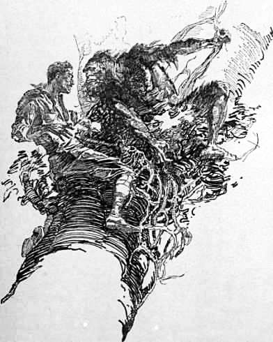
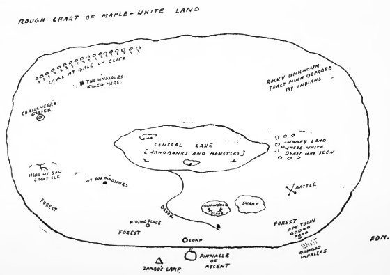
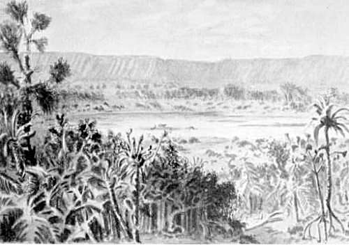

Elftes Kapitel
==============
Diesmal war ich der Held
------------------------

Lord John Roxtons Vermutung über die Giftigkeit der Schnabelhiebe jener fürchterlichen Geschöpfe, die uns angegriffen halten, erwies sich als richtig. Am Morgen nach unserem ersten Abenteuer auf dem Plateau stellten sich bei Summerlee und mir starke Schmerzen und Fieber ein, während Challengers Knie so geschwollen war, dass er kaum gehen konnte. Wir blieben daher den ganzen Tag über in unserem Lager, wo Lord John sich damit beschäftigte, mit unserer schwachen Unterstützung Höhe und Dicke des dornigen Walles, der unseren einzigen Schutz bildete, zu vergrößern. Ich erinnere mich, dass mich während des ganzen Tages das Gefühl beherrschte, dass wir irgendwie aus der Nähe beobachtet würden, obgleich ich keine Vorstellung hatte, durch wen und von welcher Stelle aus das geschah.

So stark war dieser Eindruck, dass ich Professor Challenger davon Mitteilung machte, der ihn indessen auf meinen fieberhaften Zustand zurückführte. Immer wieder blickte ich vorsichtig umher mit der Überzeugung, dass ich etwas entdecken würde; aber mein Blick traf immer nur auf das düstere Gestrüpp unserer Hecke oder auf das geheimnisvolle Dunkel des großen Baumes, dessen Zweige sich über uns ausbreiteten. Und doch wurde das Gefühl immer stärker in mir, dass etwas Beobachtendes und Bösartiges ganz in unserer Nähe sei. Ich dachte an den indianischen Aberglauben vom Curipuri – dem furchtbaren lauernden Geist der Wälder –, und ich konnte mir vorstellen, dass seine schreckliche Gegenwart die verfolgt, die in seinen versteckten und geheiligten Zufluchtsort eingedrungen waren.

In dieser Nacht (unserer dritten im Maple-White-Land), erlebten wir etwas, was einen furchtbaren Eindruck auf unsere Seelen zurückließ und ein Gefühl des Dankes gegen Lord John, der durch harte Arbeit unser Lager uneinnehmbar gemacht hatte, erweckte. Wir lagen schlafend um unser niedergebranntes Feuer, als wir plötzlich wach oder besser aus unserem Schlummer aufgeschreckt wurden durch ein andauerndes entsetzliches Schreien und Kreischen, wie ich es niemals gehört habe. Ich kenne keinen Klang, mit dem ich diesen grauenvollen Lärm, der von einer nur wenige hundert Meter entfernten Stelle herzukommen schien, vergleichen könnte. Er war ohrzerreißend wie der Pfiff einer Lokomotive; aber während dieses Pfeifen einen klaren, mechanischen, schneidenden Ton bildet, waren jene Laute von einem Umfang und einer vibrierenden Kraft, als ob sie in höchster Todesangst hervorgestoßen würden. Wir bedeckten unsere Ohren mit den Händen, um das nervenerschütternde Flehen nicht mehr zu hören. Kalter Schweiß lief mir über den Körper, und mein Herz wand sich vor Qual bei diesem Jammer. Alles Weh eines gequälten Lebens, alle seine zum Himmel aufgellenden Klagen als Ausdruck unendlicher Leiden schienen zusammengefasst in diesem einen entsetzlichen Todesschrei. Und mit diesem hohen, durchdringenden Klang verband sich ein anderer, ein rauhes, aus tiefer Brust kommendes Lachen, ein knurrender, gieriger, gurgelnder Laut des Wohlbehagens, der im grotesken Gegensatz zu dem sich mit ihm mischenden Geschrei stand. Drei oder vier Minuten dauerte dieses furchtbare Duett, während dessen das Laub der Bäume rauschte vom Auffliegen der im Schlaf gestörten Vögel. Dann hörte es ebenso plötzlich auf, wie es begonnen hatte. Lange verharrten wir in schweigendem Entsetzen. Dann warf Lord John ein Bündel von Zweigen ins Feuer, dessen rote Glut die gespannten Züge meiner Gefährten erleuchtete und seinen Schein über die großen Zweige über uns warf.

»Was war das?« flüsterte ich.

»Wir werden es morgen früh sehen«, sagte Lord John. »Es war ganz in unserer Nähe – nicht weiter als die Lichtung.«

»Wir hatten den Vorzug, einer prähistorischen Tragödie beizuwohnen, einem der Schauspiele, wie sie sich im Schilf am Rande irgendeiner Lagune der Juraperiode abzuspielen pflegten, wenn ein größerer Drache einen kleineren im Schlamm zerreißt«, sagte Challenger mit mehr Ernst in der Stimme, als man es sonst bei ihm gewohnt war. »Es war sicherlich gut für den Menschen, dass er erst später in der Schöpfungsgeschichte auftauchte. Es gab Kräfte in diesen Zeiten, denen gegenüber Mut und mechanische Hilfsmittel versagen mussten. Was hätten seine Schlinge, sein Wurfholz oder sein Pfeil ihm nützen können gegenüber Gewalten, die sich in dieser Nacht betätigt haben? Selbst mit einem modernen Gewehr wäre es ein ungleicher Kampf mit einer solchen Bestie gewesen.«

»Ich hätte Lust, mein Gewehr auf die Schulter zu nehmen«, sagte Lord John, zärtlich seine gute Büchse streichelnd. »Ein gleichwertiger Gegner wäre dieser Bursche allerdings wohl gewesen.«

Summerlee hob die Hand. »Sst,« machte er, »ich höre etwas kommen.«

Aus dem tiefen Schweigen löste sich ein leises, regelmäßiges Tappen. Es war der Schritt eines Tieres, der Rhythmus weicher, aber schwerer Pfoten, die vorsichtig auf den Boden gesetzt wurden. Ich schlich mich vorsichtig an der Dornhecke herum und machte nahe dem Eingang halt. Dort vernahm ich ein leises, regelmäßiges Zischen, die Atemzüge eines Tieres. Nur ein schwacher Zaun trennte uns von diesem Schrecken der Nacht. Jeder von uns hatte sein Gewehr ergriffen, und Lord John zog einen kleinen Busch aus dem Wall heraus, um eine Schießscharte zu haben.

»Beim Himmel,« flüsterte er, »ich glaube, ich sehe es.«

Ich bückte mich und blickte über seine Schulter hinüber durch die Öffnung. Ja, ich konnte es auch erkennen. In dem tiefen Dunkel der Bäume bemerkte ich einen noch tieferen Schatten, schwarz und unbestimmt – ein zusammengekauertes wildes und drohendes Geschöpf. Es erschien nicht größer als ein Pferd, aber die unbestimmten Körperlinien ließen riesige Formen und Kräfte vermuten. Der zischende Atem, der an einen regelmäßig und kräftig einer Maschine entströmenden Dampf erinnerte, ließ auf einen ungeheuren Organismus schließen. Bei einer Bewegung des Tieres glaubte ich das Glitzern zweier schrecklicher, grünlich leuchtender Augen zu erkennen. Ein unangenehmes Rascheln machte den Eindruck, als ob es langsam vorwärts kroch.

»Ich glaube, die Bestie will hinüberspringen«, sagte ich, den Hahn meiner Büchse spannend.

»Nicht schießen, nicht schießen,« flüsterte Lord John, »ein Gewehrschuss ist in dieser stillen Nacht meilenweit zu hören. Wir wollen bis zuletzt warten damit.«

»Wenn es über die Hecke setzt, sind wir verloren«, sagte Summerlee, wobei seine Stimme in ein nervöses Lachen überging.

»Es darf nicht über die Hecke kommen,« rief Lord John, »aber warten Sie mit dem Schießen bis zuletzt. Ich werde etwas anderes mit der Bestie unternehmen. Ich werde es irgendwie versuchen.«

Und nun folgte die kühnste Tat, die ich je von einem Mann gesehen habe. Er bückte sich zum Feuer hernieder, riss einen glühenden Ast heraus und stürzte durch eine am Eingang des Lagers hergerichtete Ausfallspforte nach außen. Das Tier näherte sich ihm mit einem furchtbaren Knurren. Lord John rannte blitzschnell auf den Gegner zu und versetzte der Bestie mit dem brennenden Holz einen Schlag ins Gesicht. Einen Augenblick lang hatten wir das Bild einer grauenhaften Maske, wie von einer riesenhaften Kröte mit einer warzigen; aussätzigen Haut und einem offenen, von frischem Blut triefenden Maul. Dann gab es einen Krach im Unterholz, und unser furchtbarer, nächtlicher Gast war verschwunden.

»Ich denke, davon wird er einstweilen genug haben«, sagte Lord John lachend, als er zurückkam und seinen Zweig ins Feuer warf.

»Das hätten Sie wirklich nicht wagen sollen«, riefen wir alle.

»Etwas anderes konnte man doch nicht tun. Wäre er herübergekommen, so hätten wir uns bei den Versuchen, es niederzuschießen, gegenseitig treffen können, und andererseits, wenn wir durch die Hecke geschossen und ihn verwundet hätten, so wäre er trotzdem über uns hergefallen – nicht zu reden davon, dass wir uns blamiert hätten. Schließlich sind wir auf diese Art noch gut davongekommen. – Was war es denn übrigens?«

Unsere gelehrten Männer blickten sich gegenseitig schweigend an.

»Ich persönlich bin nicht in der Lage, das Tier mit Sicherheit zu klassifizieren«, sagte Summerlee, seine Pfeife am Lagerfeuer anzündend.

»Mit Ihrer Ablehnung einer bestimmten Äußerung beweisen Sie nur die richtige wissenschaftliche Zurückhaltung«, sagte Challenger mit betonter Herablassung. »Ich möchte selbst ebenfalls nicht weiter gehen, als ganz allgemein zu sagen, dass wir heute Nacht mit einiger Sicherheit mit irgendeiner Form eines fleischfressenden Dinosauriers in Berührung gekommen sind. Ich habe meine Annahme bereits zum Ausdruck gebracht, dass irgendeine Art dieser Klasse auf dem Plateau existiert.«

»Wir müssen berücksichtigen,« bemerkte Summerlee, »dass es manche vorgeschichtliche Form gibt, die wir bisher niemals kennengelernt haben. Es würde voreilig sein, anzunehmen, dass wir in der Lage sind, allen Geschöpfen, denen wir hier etwa begegnen, einen Namen zu geben.«

»Richtig.«

»Eine ungefähre Klassifikation muss uns genügen. Vielleicht verhelfen uns morgen einige weitere Beweisstücke zu einer Identifizierung. Einstweilen können wir nur versuchen, unseren unterbrochenen Schlaf fortzusetzen.«

»Aber nicht ohne Wache«, sagte Lord John mit Entschiedenheit. »Wir dürfen uns in einem Lande wie diesem nicht unnütz einer Gefahr aussetzen. Also mit zweistündiger Ablösung für jeden von uns.«

»Dann möchte ich meine Pfeife zu Ende rauchen und als erster die Wache übernehmen«, sagte Professor Summerlee. Und von jetzt an haben wir stets eine Nachtwache gehabt.

Am nächsten Morgen entdeckten wir bald die Quelle des grauenvollen Lärmes, der uns in der Nacht aus dem Schlaf gerissen hatte. Die Iguanodonlichtung hatte den Schauplatz eines furchtbaren, blutigen Kampfes abgegeben. Aus den Blutlachen und den überall im Grase umherliegenden riesigen Fleischfetzen schlossen wir zuerst, dass eine Anzahl von Tieren getötet worden war. Bei einer genaueren Untersuchung der Überreste stellten wir jedoch fest, dass alles Fleisch von einem einzigen dieser mächtigen Ungetüme stammte, das buchstäblich von einem, vielleicht nicht größeren, aber es an Wildheit übertreffenden Tiere in Stücke zerrissen war.

Unsere beiden in wissenschaftliche Erörterung versunkenen Professoren prüften nacheinander die verschiedenen Stücke, die die Spuren von gewaltigen Klauen und Zähnen zeigten.

»Wir werden kaum zu einem sicheren Schluss kommen«, sagte Professor Challenger, einen großen Streifen von hellfarbigem Fleisch auf den Knien haltend. »Das Aussehen dieser Stücke deutet auf das Vorhandensein eines Tigers mit säbelförmigen Krallen, so wie sie noch jetzt im Trümmergestein unserer Höhlen gefunden werden. Aber das von uns gesehene Tier war zweifellos größer und mehr den Reptilien verwandt. Ich persönlich bin geneigt, es für einen Allosaurus zu halten.«

»Oder Megalosaurus«, sagte Summerlee.

»Ganz recht, irgendeiner der großen fleischfressenden Dinosaurier würde auf den Fall passen. Es gibt unter ihnen die furchtbarsten Typen animalischen Lebens, die jemals die Erde schauerlich – oder ein Museum glücklich gemacht haben.« Diese komische Gegenüberstellung reizte ihn selbst zu einem sonoren Lachen, denn obwohl er wenig Sinn für Humor hatte, brach er gern in ein schallendes Lachen der Anerkennung aus, wenn ein salzloser Witz seinen eigenen Lippen entströmte.

»Je weniger Lärm, desto besser«, sagte Lord John kurz. »Wir wissen nicht, wer oder was hier in der Nähe ist. Wenn dieser Bursche zurückkommt, um sein Frühstück zu suchen und über uns herfällt, so werden wir nicht gerade viel zu lachen haben. – Was bedeutet übrigens diese Stelle hier auf der Decke des Iguanodons?«

Auf der dicken, schuppigen, schieferfarbigen Haut irgendwo über der Schulter befand sich ein einzelner schwarzer Fleck von irgendeiner Masse, die aussah wie Asphalt. Keiner von uns konnte sich vorstellen, was das war, obwohl Summerlee behauptete, vor zwei Tagen etwas Ähnliches auf dem Körper eines der Jungen gesehen zu haben. Challenger sagte nichts, blickte aber wichtigtuerisch und geschwollen um sich, als ob er etwas sagen könne, wenn er wolle, so dass Lord John ihn schließlich direkt nach seiner Ansicht fragte.

»Wenn Eure Lordschaft mir gütigst gestatten wollen, den Mund zu öffnen, würde ich glücklich sein, meine Meinung zu äußern«, sagte er mit beißendem Spott. »Ich bin im allgemeinen nicht gewohnt, in einer Art zur Rede gestellt zu werden, wie sie Eure Lordschaft zu belieben scheinen. Ich wusste nicht, dass zu einem Lachen über einen harmlosen Scherz erst Ihre Erlaubnis eingeholt werden muss.«

Erst eine Entschuldigung Lord Johns konnte unseren reizbaren Freund wieder beruhigen. Als der verletzte Stolz schließlich dem Gefühl der Versöhnung Platz gemacht hatte, hielt er uns von seinem etwas entfernten Sitz auf einem gestürzten Baum einen Vortrag, und zwar in der bei ihm üblichen Form, als wenn er einer tausendfachen Zuhörerschaft höchst wertvolle Mitteilungen machte.

»Was diese Flecken angeht,« sagte er, »so bin ich geneigt, meinem Freunde und Kollegen Professor Summerlee zuzustimmen, dass sie aus Asphalt bestehen. Da dies Plateau seiner ganzen Natur nach hochvulkanisch ist, und da man im allgemeinen das Vorhandensein von Asphalt mit plutonischen Kräften verbindet, so zweifle ich nicht daran, dass es in freiem, flüssigem Zustande vorhanden ist und dass diese Geschöpfe damit in Berührung kommen. Ein sehr viel wichtigeres Problem ist aber die Frage nach der Existenz des fleischfressenden Ungetüms, das seine Spuren auf dieser Lichtung hinterlassen hat. Wir wissen ungefähr, dass das Plateau nicht größer ist als eine mittlere englische Grafschaft. Innerhalb seiner engen Grenzen hat eine gewisse Anzahl von Tierarten, von denen die meisten auf der übrigen Welt längst verschwunden sind, seit unendlich langer Zeit nebeneinander gelebt. Es ist mir nun ganz klar, dass die sich ungehindert vermehrenden fleischfressenden Tiere schließlich ihre Nahrungsquellen erschöpfen mussten und dadurch in die Zwangslage gekommen sind, entweder ihren Charakter als Fleischfresser aufzugeben oder vor Hunger zu sterben. Dem ist, wie Sie sehen, nicht so. Wir können uns daher nur vorstellen, dass das Gleichgewicht der Natur durch irgendein Hindernis, das die Zahl dieser wilden Geschöpfe beschränkt, aufrechterhalten wird. Es ist demnach eines der interessantesten Probleme, die unserer Lösung harren, aufzuklären, welcher Art dieses Hindernis ist und wie es sich auswirkt. Ich wage zu hoffen, dass wir bald weitere Gelegenheit zu einem genaueren Studium der fleischfressenden Dinosaurier haben werden.«

»Und ich wage zu hoffen, dass dem nicht so ist«, bemerkte ich.

Der Professor zog nur die grauen Augenbrauen hoch, etwa so, wie der Lehrer einem naseweisen Schüler gegenüber, der eine unangebrachte Bemerkung gemacht hat.

»Vielleicht hat Professor Summerlee noch eine Bemerkung zu machen«, sagte er. Und dann stiegen die beiden Gelehrten in jene luftverdünnte wissenschaftliche Atmosphäre hinauf, in der die Möglichkeiten einer Veränderung der Geburtenzahl gegen die Verminderung der Nahrungsquellen als ausgleichender Faktor im Kampf ums Dasein erörtert wurden.

An diesem Morgen kartographierten wir einen Teil des Plateaus, wobei wir den Pterodactylus-Sumpf vermieden und uns an der Ostseite unseres Baches statt wie früher auf seiner Westseite hielten. In dieser Richtung war das Land mit dichtem Wald bedeckt, der jedoch mit so starkem Unterholz durchsetzt war, dass wir nur langsam vorwärts kamen.

Bis jetzt habe ich immer nur von den Schrecken des Maple-White-Landes gesprochen. Es hatte aber auch noch andere Seiten, denn diesen ganzen Morgen wanderten wir unter lieblichen Blumen, die meist, wie ich bemerkte, weiß oder gelb gefärbt waren. Das sind, wie unsere Professoren erklärten, die ursprünglichen Blumenfarben. An manchen Stellen war der Boden ganz dicht von ihnen bedeckt, und wenn wir während des Gehens bis zu den Knöcheln in diesen wunderbar weichen Teppich einsanken, war der Duft in seiner Süße und Stärke fast betäubend. Unsere heimatliche Biene summte überall um uns herum. Die Zweige vieler Bäume, unter denen wir hinschritten, bogen sich unter der Last von Früchten, von denen einige uns bekannt, andere aber völlig neu waren. Wir gaben Obacht, welche von ihnen von Vögeln angepickt wurden, um die Gefahr einer Vergiftung zu vermeiden, und bereicherten unseren Nahrungsmittelvorrat um eine köstliche Abwechslung. In dem Dschungel, das wir durchquerten, fanden sich zahlreiche, von den wilden Tieren ausgetretene Pfade, und auf den sumpfigeren Stellen bemerkten wir ein Durcheinander seltsamer Fußspuren, darunter viele vom Iguanodon. In einer Erdsenkung sahen wir einmal mehrere dieser kolossalen Geschöpfe, und Lord John konnte mit seinem Glas feststellen, dass auch sie mit Asphaltflecken bedeckt waren, obwohl an anderen Stellen als an dem Exemplar, das wir heute morgen untersucht hatten. Wir hatten keine Vorstellung davon, was diese Erscheinung bedeutete.

Wir sahen viele kleine Tiere, wie Stachelschweine, einen schuppigen Ameisenfresser und ein wildes, scheckiges Schwein mit langen, gebogenen Fangzähnen. Einmal erblickten wir durch eine offene Stelle zwischen den Bäumen in einiger Entfernung den Abhang eines grünen Hügels, über den ein mächtiges, schwarzgefärbtes Tier in lebhaftem Schritt hinwegeilte. Es ging so schnell, dass wir nicht feststellen konnten, was es war. Sollte es ein Hirsch gewesen sein, wie Lord John meinte, so würde seine Größe die der riesenhaften irischen Elche, die von Zeit zu Zeit in den Mooren meines Heimatlandes ausgegraben werden, übertreffen.

Seit dem geheimnisvollen Besuch, den wir in unserem Lager empfangen hatten, kehrten wir immer mit einem gewissen Misstrauen dahin zurück. Doch fanden wir diesmal alles in Ordnung. Wir hatten an diesem Abend eine große Diskussion über unsere gegenwärtige Lage und unsere Zukunftspläne, die ich etwas ausführlicher beschreiben muss, denn sie führt zu einem neuen Vorstoß, der uns zu einer besseren Kenntnis des Maple-White-Landes verhalf, als es viele Wochen der Forschung hätten tun können.

Es war Summerlee, der die Debatte eröffnete. Den ganzen Tag lang war er schon in reizbarer Stimmung gewesen, und jetzt brachte eine Bemerkung Lord Johns über das, was wir morgen tun sollten, seine ganze Verbitterung zum Ausbruch.

»Was wir heute, morgen und alle anderen Tage zu tun haben werden, ist, einen Weg ausfindig zu machen, der uns aus dieser Falle hinausführt. Sie denken alle nur daran, wie wir in das Land hineinkommen. Ich sage, dass wir alles dransetzen sollten, hinauszukommen.«

»Ich bin überrascht, Herr,« sagte Challenger dröhnend, indem er seinen majestätischen Bart strich, »dass ein Mann der Wissenschaft sich einem so unedlen Gefühl überlassen kann. Sie sind in einem Lande, das Ihnen einen Anreiz für einen ehrgeizigen Naturwissenschaftler gibt, wie ihn die Welt noch nicht gesehen hat, und Sie wünschen es zu verlassen, bevor wir mehr als die oberflächlichste Kenntnis von ihm und von seinem Inhalt gewonnen haben? Ich habe etwas Besseres von Ihnen erwartet, Professor Summerlee.«

»Sie müssen bedenken,« sagte Summerlee empfindlich, »dass ich in London eine große Zahl von Schülern habe, die augenblicklich einem außerordentlich ungenügenden Vertreter überlassen sind. Das unterscheidet meine Lage von der Ihrigen, Professor Challenger, da Sie, soweit mir bekannt ist, niemals mit einem Lehrauftrag betraut worden sind.«

»Ganz recht«, sagte Challenger. »Ich habe es immer als einen Frevel empfunden, geistige Kräfte, die zu den höchsten Aufgaben der Forschung befähigt sind, durch tieferstehende Objekte ablenken zu lassen. Aus diesem Grunde habe ich immer entschieden irgendein mir angebotenes Lehramt abgelehnt.«

»Zum Beispiel?« fragte Summerlee mit einem höhnischen Lachen. Aber Lord John beeilte sich, das Gespräch auf ein anderes Gebiet zu bringen.

»Ich muss sagen,« bemerkte er, »dass ich es doch für eine ziemlich armselige Sache halten würde, nach London zurückzukehren, bevor ich etwas mehr als jetzt von diesem Ort weiß.«

»Und ich könnte niemals wagen, in meine Redaktion zurückzukehren und vor den alten, guten McArdle hinzutreten«, sagte ich (ich bitte die Freiheit des Ausdrucks zu entschuldigen, Herr McArdle). »Er würde es mir niemals vergeben, dass ich eine solche Gelegenheit ungenützt hätte vorbeigehen lassen. Übrigens, soweit ich sehe, ist es unnütz, darüber zu reden, da wir ja nicht herunter könnten, selbst wenn wir wollten.«

»Unser junger Freund macht manche offensichtliche geistige Lücke wieder wett durch ein gewisses Maß schlichten, gesunden Menschenverstandes«, bemerkte Challenger. »Die Interessen seines beklagenswerten Berufes können uns unberührt lassen, aber wie er bemerkt, können wir unter keinen Umständen hinuntergelangen, so würde es eine Energievergeudung bedeuten, diese Frage länger zu diskutieren.«

»Es ist eine Energievergeudung, irgend etwas anderes zu tun«, brummte Summerlee hinter seiner Pfeife. »Ich möchte Sie daran erinnern, dass wir hierher gekommen sind mit einem ganz bestimmten Auftrag, der uns von der Versammlung im Zoologischen Institut in London gegeben worden ist. Dieser Auftrag bestand darin, die Wahrheit von Professor Challengers Behauptungen nachzuprüfen. Wir sind nunmehr in der Lage, wie ich zugeben muss, diese Behauptungen zu bestätigen. Unsere besondere Aufgabe ist also erledigt. Was die Einzelarbeit, die auf diesem Plateau noch zu leisten ist, angeht, so ist sie so gewaltig, dass nur eine große Expedition mit einer ganz speziellen Ausrüstung hoffen könnte, dieser Aufgabe gerecht zu werden. Wenn wir selbst diese Arbeit übernehmen würden, so würde sie das einzig mögliche Ergebnis haben, dass wir überhaupt nicht zurückkehren mit dem bedeutenden Beitrag zur Wissenschaft, den wir bereits in Händen haben. Professor Challenger hat Mittel und Wege gefunden, uns in dieses Plateau zu führen, obwohl es völlig unersteigbar erschien. Ich denke, wir sollten ihn jetzt bitten, mit seinem erfinderischen Geist uns in die Welt, aus der wir kommen, zurückzuführen.«

Ich muss gestehen, dass diese Darlegungen Summerlees Eindruck auf mich machten und mir als ganz vernünftig vorkamen. Sogar Challenger wurde betroffen bei dem Gedanken, dass seine Feinde niemals widerlegt werden würden, wenn die Bestätigung seiner Behauptungen diejenigen nicht erreichte, die sie bezweifelt hatten.

»Das Problem des Abstieges erscheint im ersten Moment ungeheuerlich,« sagte er, »und doch zweifle ich nicht daran, dass es sich mit dem Verstande lösen lässt. Ich bin geneigt, unserem Kollegen darin zuzustimmen, dass ein verlängerter Aufenthalt im Maple-White-Land gegenwärtig nicht ratsam ist und dass wir die Frage unserer Rückkehr bald ins Auge fassen müssen. Ich widersetze mich indessen durchaus, dies Land zu verlassen, bevor wir eine wenn auch nur oberflächliche Prüfung desselben angestellt haben und in der Lage sind, etwas, was nach einer Karte aussehen könnte, mitzunehmen.«

Professor Summerlee knurrte vor Ungeduld.

»Zwei lange Tage haben wir bereits mit der Erforschung des Landes zugebracht, und wir sind in bezug auf die Geographie dieses Landes noch genau so klug wie am Anfang. Es ist klar, dass es dicht bewaldet ist, und es würden Monate dazu gehören, tiefer einzudringen und die Verhältnisse des Landes aufzuklären. Die Sache würde anders liegen, wenn man wenigstens einen Bergkegel in der Mitte hätte. Aber überall fällt das Land nach der Mitte zu ab, soweit wir sehen können. Je weiter wir gehen, desto unwahrscheinlicher ist es, einen Punkt für eine Gesamtübersicht zu finden.«

In diesem Augenblick hatte ich eine Eingebung. Meine Augen fielen wie von ungefähr auf den riesigen, knorrigen Stamm des Gingko-Baumes, der seine großen Zweige über uns ausbreitete. Da seine Dicke die aller anderen Bäume übertraf, ragte er sicherlich auch in der Höhe über sie hinaus. Und wenn tatsächlich der Rand des Plateaus die höchste Stelle des Landes bildete, musste sich dann nicht dieser mächtige Baum als ein geeigneter Aussichtspunkt, der das ganze Land beherrschte, erweisen?

Nun, seit meiner frühesten Jugend als wilder Junge in Irland bin ich immer ein kühner und geschickter Baumkletterer gewesen. Meine Gefährten mochten mir über sein auf den Felsen, aber ich wusste, dass ich zwischen den Zweigen ihr Meister war. Wenn es mir nur gelingen wollte, meine Beine auf den untersten der dicken Äste zu bringen, so müsste es seltsam zugehen, wenn ich nicht bis zur Spitze hinaufgelangen würde. Meine Gefährten waren entzückt von meinem Gedanken.

»Unser junger Freund«, sagte Challenger, seine roten Wangen aufblähend, »ist akrobatischer Leistungen fähig, die einem Mann von soliderer, aber möglicherweise dominierenderer Erscheinung unmöglich sein würden. Ich billige seinen Plan.«

»Beim Himmel, mein Junge, Sie haben die Sache erfasst«, sagte Lord John, mir einen Schlag in den Rücken versetzend. »Ich begreife nicht, warum wir nicht schon längst auf diesen Gedanken gekommen sind. Sie haben noch eine Stunde bis Sonnenuntergang, aber wenn Sie Ihr Notizbuch mitnehmen, sind Sie vielleicht in der Lage, eine rohe Skizze von der Umgebung zu entwerfen. Wenn wir diese drei Munitionslisten unter dem Ast aufeinanderstellen, werde ich Ihnen schon hinaufhelfen.«

Er stand auf den Kisten, während ich zum Baum hinaufblickte, und hob mich sanft hoch, als Challenger vorstürzte und mir noch einen Stoß mit seiner mächtigen Hand versetzte, dass ich nur so in den Baum hineinschoss. Mit beiden Armen den Ast umklammernd und mit den Füßen nachhelfend, brachte ich zunächst meinen Körper und dann die Knie auf den Ast. Über mir erblickte ich drei weitere Zweige, wie Sprossen einer Leiter, und ein Gewirr von passenden Zweigen, so dass ich mit einer solchen Eile in die Höhe gelangte, dass ich bald den Boden aus den Augen verlor und nichts als Blätter um mich her sah. Hin und wieder stieß ich auf ein Hindernis, und einmal musste ich sogar acht oder zehn Fuß an einer Schlingpflanze emporklimmen, aber ich kam schnell vorwärts, und die dröhnende Stimme Challengers klang bald wie aus großer Entfernung zu mir hinauf. Der Baum war indessen von einer riesenhaften Größe, und ich konnte, nach oben blickend, kein Lichterwerden der Krone bemerken. Auf einem Zweige, den ich erklettern wollte, sah ich einen dicken, buschartigen Klumpen, der mir ein Schmarotzer zu sein schien. Ich drehte meinen Kopf um denselben herum, um zu sehen, was hinter ihm war, und wäre von dem Anblick, der sich mir bot, vor Überraschung und Schreck fast vom Baum heruntergestürzt.

Ein Gesicht starrte in das meine – nicht weiter als ein oder zwei Fuß von mir entfernt. Das Geschöpf, zu dem dieses Gesicht gehörte, hatte hinter der Schmarotzerpflanze gehockt und zu gleicher Zeit mit mir um dieselbe herumgesehen. Es war ein menschliches Gesicht – oder wenigstens sah es mehr nach einem Menschen als nach einem Affen aus. Es war ein langes, hellfarbiges, mit Pusteln bedecktes Gesicht mit plattgedrückter Nase und vorgeschobenem Unterkiefer, mit abstehenden, struppigen, das Kinn umgebenden Haaren. Die unter dicken und schweren Brauen liegenden Augen waren bestialisch und wild, und als es den Mund zu einem Knurren öffnete, das wie ein Fluch klang, bemerkte ich darin gebogene, scharfe Raubtierzähne. Einen Augenblick lang las ich Hass und Drohung in den bösen Augen. Dann hatte ich den Eindruck einer das Tier wie ein Blitz überfallenden Furcht, ein Krachen von zerbrochenen Zweigen folgte, und es tauchte unter in dem grünen Blattwerk der dichten Baumkrone. Ich sah eben noch einen haarigen Körper, der an den eines rotgefärbten Schweines erinnerte, und dann war das Geschöpf inmitten eines Wirbels von Blättern und Zweigen verschwunden.

»Was ist los?« schrie Roxton von unten. »Ist Ihnen irgend etwas passiert?«

»Haben Sie es gesehen?« rief ich zurück, die Arme um einen Ast geschlungen und am ganzen Körper zitternd.

»Wir hörten ein Geräusch, als ob Sie mit dem Fuß ausgeglitten wären, was war es?«

Ich war von der plötzlichen und seltsamen Erscheinung des Affenmenschen so betroffen, dass ich mich fragte, ob ich nicht herunterklettern und meinen Gefährten mein Erlebnis schildern sollte. Aber ich war bereits so hoch auf den großen Baum hinaufgelangt, dass es mir beschämend erschien, zurückzukehren, ohne meinen Auftrag ausgeführt zu haben.

Ich stieg daher nach einer langen Pause, deren ich bedurfte, um wieder zu Atem zu gelangen und Mut zu fassen, höher hinauf. Einmal brach ein dürrer Ast unter meiner Last ab, und ich hing für einige Sekunden an den Händen, aber im ganzen war die Kletterei nicht sehr schwierig. Langsam wurde das Blattwerk lichter über mir, und ich schloss aus dem frischen Wind, der meine Stirn traf, dass ich über die Kronen der anderen Bäume des Waldes hinausgelangt war. Entschlossen, keine Umschau zu halten, bevor ich nicht die höchste Spitze erreicht hatte, kletterte ich weiter, bis ich auf den obersten Zweig, der sich unter meinem Gewicht neigte, gelangt war. Hier wählte ich, um mich gegen das Herabfallen zu sichern, einen geeigneten Platz in einer Astgabel und genoss von dort ein wunderbares Panorama des seltsamen Landes, in dem wir gefangen waren. Die Sonne stand gerade noch am westlichen Horizont, und der Abend war ungewöhnlich hell und klar, so dass die ganze Oberfläche des Plateaus gut zu erkennen war. Von hier oben erschien sie wie ein Oval mit einer Breite von etwa fünfzig Kilometern und einer Tiefe von fünfunddreißig Kilometern. Sie bildete im allgemeinen einen flachen Trichter, dessen Wände auf allen Seiten nach der Mitte zu auf einen bedeutenden See abfielen. Dieser See hatte etwa zwanzig Kilometer im Umfang und bot ein schönes, grünes Bild im Abendlicht. Die Ufer desselben waren mit dichtem Schilf bedeckt, und seine Oberfläche wurde von verschiedene gelben Sandbänken, die im weichen Sonnenlicht goldig glänzten, unterbrochen. Eine Anzahl langer, dunkler Objekte, die zu groß waren, um Alligatoren, und zu lang, um Kanus sein zu können, lagen am Rande dieser gelben Flächen. Mit einem Glase konnte ich klar erkennen, dass es Lebewesen waren. Es war mir aber nicht möglich, mir eine Vorstellung von ihrer Natur zu bilden.

Von unserer Seite her senkten sich bewaldete Abhänge mit einzelnen Lichtungen in einer Ausdehnung von neun bis zehn Kilometern bis an den See in der Mitte. Gerade unter mir erblickte ich die Iguanodon-Lichtung, und weiterhin zeigte sich eine runde, offene Stelle zwischen den Bäumen, in der sich der Pterodactylus-Sumpf befand. Auf der gegenüberliegenden Seite bot das Plateau jedoch ein ganz anderes Aussehen. Hier wiederholten sich die Basaltwände der Außenseite im Innern. Sie bildeten eine Böschung von etwa zweihundert Fuß Höhe, an die sich ein bewaldeter Abhang nach unten hin anschloss. Am Rande dieser roten Felswand in einiger Höhe über dem Erdboden konnte ich durch das Glas eine Reihe dunkler Löcher sehen, die ich für Höhleneingänge hielt. In einer derselben schimmerte etwas Weißes, aber ich konnte nicht erkennen, was es war. Ich trug dann die Einzelheiten der Umgebung in meine Karte ein, bis die Sonne untergegangen war und es so dunkel wurde, dass ich nichts mehr unterscheiden konnte. Dann kletterte ich zu meinen Gefährten, die am Fuß des großen Baumes begierig auf mich warteten, hinunter. Mit einem Schlage war ich der Held der Expedition. Ich allein hatte den Gedanken gehabt, und ich allein hatte ihn ausgeführt, und hier hatte ich die Karte, die uns ein monatelanges Umhertappen zwischen unbekannten Gefahren ersparte. Jeder meiner Gefährten schüttelte mir feierlich die Hand. Aber bevor sie in die Erörterung der Einzelheiten meiner Karte eintraten, musste ich ihnen meine Begegnung mit dem Affenmenschen in der Baumkrone erzählen.

»Er ist die ganze Zeit dort oben gewesen«, sagte ich.

»Woher wissen Sie das?« fragte Lord John.

»Weil ich immer das Gefühl hatte, dass wir von einem bösartigen Wesen belauert wurden. Ich sprach schon mit Ihnen darüber, Herr Professor.«

»Ja, unser junger Freund sagte etwas Derartiges. Er ist offenbar der einzige unter uns, der mit jener keltischen Wesensart begabt ist, die so feinfühlig für solche Eindrücke macht.«

»Diese ganze Theorie der Telepathie –« begann Summerlee, seine Pfeife stopfend.

»Ist zu umfangreich, als dass wir sie jetzt diskutieren könnten«, sagte Challenger mit Entschiedenheit. »Sagen Sie mir jetzt,« fuhr er fort mit der Miene eines Bischofs, der zu seiner Sonntagsschule spricht, »hatten Sie Gelegenheit zu beobachten, ob dieses Geschöpf den Daumen der Handfläche gegenüberstellen konnte?«

»In der Tat, nein!«

»Hatte es einen Schwanz?«

»Nein.«

»War der Fuß zum Greifen eingerichtet?«

»Ich glaube nicht, dass es ihm gelungen wäre, so schnell zwischen den Zweigen zu verschwinden, wenn er nicht mit den Füßen hätte greifen können.«

»In Südamerika gibt es, wenn mein Gedächtnis mich nicht täuscht –, Sie werden meine Bemerkung kontrollieren, Professor Summerlee – etwa sechsunddreißig Arten von Affen. Nur der Menschenaffe ist bisher nicht bekannt geworden. Es ist indessen klar, dass er in diesem Lande existiert und dass es nicht die behaarte gorillaartige Form ist, die bisher außerhalb Afrikas oder des Ostens nicht gesehen wurde. (Ich war in diesem Augenblick, zu ihm hinüberblickend, geneigt einzuschalten, dass ich seinen frühesten Vetter im Kensington-Museum in London gesehen hatte.) Dies ist eine bärtige Abart, deren helle Farbe auf die Tatsache hindeutet, dass er in der Abgeschiedenheit der Wälder lebt. Wir haben die Frage ins Auge zu fassen, ob er mehr dem Affen oder mehr dem Menschen ähnelt. In letzterem Falle würde er etwa dem nahekommen, was man allgemein als das »fehlende Zwischenglied« bezeichnet. Die Lösung dieses Problems ist unsere unmittelbare Aufgabe.«

»Nichts dergleichen,« sagte Summerlee schroff, »jetzt, wo wir der Intelligenz und der Tatkraft des Herrn Malone (ich muss diese Worte leider zitieren) eine Karte verdanken, ist unsere einzige und alleinige unmittelbare Aufgabe, uns heil und gesund aus diesem furchtbaren Lande herauszubringen.«

»Die Fleischtöpfe der Zivilisation«, grollte Challenger.

»Die Tintenfässer der Zivilisation, Herr. Es ist unsere Aufgabe, einen Bericht über das, was wir gesehen haben, abzufassen und die weitere Erforschung des Landes anderen zu überlassen. Sie alle haben dem zugestimmt, bevor uns Herr Malone diese Karte entworfen hat.«

»Gut«, sagte Challenger. »Ich gebe zu, dass auch ich mich wohler fühlen werde, wenn ich die Sicherheit habe, dass die Resultate unserer Expedition in die Hände unserer Freunde gelangt sind. Wie wir von diesem Plateau herunterkommen sollen, davon habe ich bis jetzt allerdings noch keine Vorstellung. Ich habe indessen noch niemals einem Problem gegenübergestanden, das mein erfinderisches Gehirn nicht in der Lage gewesen wäre zu lösen, und ich gebe Ihnen das Versprechen, dass ich mich morgen mit Aufmerksamkeit der Frage unseres Abstieges widmen werde.«

Dabei blieb es einstweilen, und wir verbrachten den Abend damit, beim Schein unseres Feuers und einer kleinen Kerze die erste Karte von der verlorenen Welt auszuarbeiten. Alle Einzelheiten, die ich auf meinem Aussichtspunkt flüchtig notiert hatte, wurden an der zugehörigen Stelle eingetragen. Challengers Bleistift schwebte über der großen weißen Stelle, die den See bezeichnete.

»Wie wollen wir den nennen?« fragte er.

»Warum sollten Sie die günstige Gelegenheit nicht benutzen, Ihrem Namen Unsterblichkeit zu verleihen?« sagte Summerlee mit dem üblichen schneidenden Unterton.

»Ich hoffe, Herr, dass mein Name sich durch andere und bessere Gründe das Recht erwerben wird, auf die Nachwelt zu kommen«, sagte Challenger ernst. »Irgendein unwissender Mensch möge seinen gleichgültigen Namen dem Gedächtnis der Nachwelt überliefern, indem er ihn auf irgendeinen Berg oder einen Fluss überträgt, ich brauche ein solches Monument nicht.«

Summerlee lächelte gezwungen und setzte zu einem neuen Angriff an, als Lord John sich eiligst ins Mittel legte.

»Es kommt Ihnen zu, mein Junge, dem See einen Namen zu geben«, sagte er. »Sie haben ihn zuerst gesehen, und, beim Himmel, wenn Sie sich entscheiden, ihn den Malone-See zu nennen, so haben Sie dazu ein unbezweifelbares Recht.«

»Sehr richtig. Unser junger Freund soll ihm einen Namen geben«, sagte Challenger.

»Dann soll er«, und ich errötete, indem ich das sagte, »Gladys-See heißen.«

»Glauben Sie nicht, dass der Ausdruck ›See der Mitte‹ charakteristischer wäre?« warf Summerlee ein.

»Ich möchte lieber Gladys-See.«

Challenger warf mir einen wohlwollenden Blick zu, schüttelte aber doch sein großes Haupt mit ironischer Missbilligung. »Knaben bleiben Knaben, lassen Sie ihn Gladys–See heißen.«

