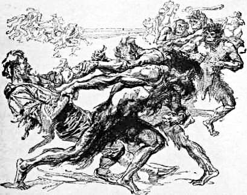

Dreizehntes Kapitel
===================
Ein Anblick, den ich nie vergessen werde
----------------------------------------

Gerade als die Sonne im Begriff war unterzugehen, sah ich die einsame Gestalt des Indianers auf der weiten Ebene unter mir dahinschreiten, und ich blickte ihm, unserer einzigen schwachen Hoffnung auf Rettung, nach, bis er in dem zwischen mir und dem in weiter Ferne dahinfließenden Strom aufsteigenden und von der Sonne rosig gefärbten Dunst verschwand.

Es war völlig dunkel, als ich schließlich zu unserem verwüsteten Lager zurückkehrte, und der letzte Eindruck, den ich mit mir nahm, war Zambos aufleuchtendes Feuer. Es war der einzige Lichtpunkt in der weiten Welt dort unten, so wie die treue Gegenwart des Negers den einzigen Trost meiner verdüsterten Seele bildete. Und doch fühlte ich mich zum erstenmal etwas leichter, seitdem mich dieser furchtbare Schlag getroffen hatte. Denn der Gedanke erhob mich, dass die Welt wissen würde, was wir getan hatten, so dass im schlimmsten Falle doch unsere Namen nicht mit unseren Körpern verlorengehen konnten, sondern mit den Ergebnissen unserer Arbeit auf die Nachwelt kommen würden.

Es war ein grauenvoller Gedanke, in dem übel zugerichteten Lager zu schlafen, und doch wäre es noch schrecklicher gewesen, sich im Dschungel hinzulegen. Eins oder das andere musste geschehen. Die Überlegung ließ ratsam erscheinen, wach zu bleiben, aber die erschöpfte Natur erzwang sich ihr Recht.

Ich erkletterte einen Zweig des großen Gingkobaumes, aber seine glatte Oberfläche gewährte mir keinen festen Sitz, und ich wäre sicherlich im Moment des Einschlafens heruntergefallen. Ich überlegte, was ich tun sollte. Schließlich schloss ich das Tor unseres Lagers, zündete drei getrennte Feuer an, zwang mich, etwas zu essen, und fiel darauf in einen tiefen Schlaf, dem ein merkwürdiges und höchst willkommenes Erwachen folgte. Am frühen Morgen, gerade bei Tagesanbruch, legte sich eine Hand auf meinen Arm, und als ich mit zitternden Nerven aufsprang und nach einem Gewehr griff, stieß ich einen lauten Freudenschrei aus. Denn im kalten, grauen Morgenlicht sah ich Lord John neben mir knien.

Er war es – und doch war er es nicht. Als ich ihn verließ, war seine Haltung ruhig und sein Äußeres korrekt und sauber. Jetzt war er blass, seine Augen hatten einen wilden Ausdruck, und er keuchte wie jemand, der lange und schnell gelaufen ist. Sein schmales Gesicht war zerkratzt und blutig, seine Kleider hingen in Fetzen herab, und seinen Hut hatte er verloren. Ich starrte ihn fassungslos an, aber er ließ mir keine Zeit zu Fragen. Er wühlte während des Sprechens in unseren Vorräten herum.

»Schnell, mein Junge,« schrie er, »jeder Augenblick zählt. Nehmen Sie diese beiden Gewehre, ich habe die anderen beiden. So, nun so viel Patronen, wie Sie tragen können. Stecken Sie sich die Taschen voll. Und jetzt etwas zu essen. Ein halbes Dutzend Büchsen werden genügen. So, das wäre geschafft! Verlieren Sie keine Zeit mit Reden oder Nachdenken. Und jetzt vorwärts, oder wir sind verloren.«

Noch halb im Schlaf und unfähig, mir vorzustellen, was dies alles bedeutete, rannte ich wie toll durch den Wald hinter ihm her, unter jedem Arm ein Gewehr und einen Stapel verschiedener Vorräte tragend. Er stürmte durch das Gestrüpp, bis er an eine Stelle mit dichtem Unterholz kam, in das er ohne Rücksicht auf die Dornen hineinsprang, sich zu Boden warf und mich zu sich herniederzog. »Hier«, leuchte er, »glaube ich, sind wir sicher. Sie werden das Lager von neuem überfallen, das ist todsicher. Es wird ihr erster Gedanke sein. Aber dies wird sie in Verlegenheit setzen.«

»Was bedeutet das alles?« fragte ich, als ich wieder zu Atem gekommen war. »Wo sind die Professoren, und wer ist denn hinter uns her?«

»Die Affenmenschen«, antwortete er. »Mein Gott, was sind das für brutale Geschöpfe! Sprechen Sie nicht zu laut, denn sie haben lange Ohren und außerdem scharfe Augen, aber, soweit ich es beurteilen kann, keinen entwickelten Geruchssinn, so dass sie unserer Spur nicht werden folgen können. – Wo sind Sie gewesen, mein Junge? Sie sind ja gut davongekommen.«

Ich erzählte ihm flüsternd mit einigen Sätzen, was ich gemacht hatte.

»Üble Sache«, sagte er, als er vom Dinosaurus und dem Erdloch gehört hatte. »Ist nicht gerade ein geeigneter Ort für einen Kuraufenthalt, nicht wahr? Aber was in diesem Lande möglich ist, weiß ich erst, seit wir in die Hände dieser Teufel gefallen sind. Einmal hatten mich die papuanischen Menschenfresser gefangen. Aber das sind gesellschaftsfähige Leute, verglichen mit dieser Bande.«

»Wie ist die Sache denn vor sich gegangen?« fragte ich.

»Es war am frühen Morgen. Unsere gelehrten Freunde erhoben sich gerade von ihrem Lager und hatten sogar noch nicht einmal mit ihren wissenschaftlichen Erörterungen begonnen. Plötzlich regnete es Affen. Sie kamen in solchen Mengen herunter wie Äpfel, die man vom Baum schüttelt. Sie hatten sich während der Nacht versammelt, nehme ich an, bis der große Baum über unseren Köpfen voll mit ihnen beladen war. Ich schoss einem von ihnen durch den Bauch, aber bevor wir begriffen hatten, was los war, hatten sie uns schon zu Boden geworfen und die ausgebreiteten Arme und Füße festgehalten. Ich sage ›Affen‹, aber sie trugen Knüttel und Steine in den Händen, redeten irgendein Kauderwelsch miteinander und schnürten uns die Hände schließlich mit Schlingpflanzen zusammen, so dass sie also jedenfalls geistig höher stehen als irgendein Tier, das mir auf meinen Reisen begegnet ist. Affenmenschen sind es, das ›fehlende Zwischenglied‹, und ich wünschte wohl, dass sie uns noch heute fehlten. Sie schleppten ihren verwundeten Kameraden, der wie ein Schwein blutete, fort und setzten sich dann in einem Kreis um uns herum. Wenn ich jemals den Ausdruck kalter Mordlust gesehen habe, so in ihrem Gesicht. Es waren tüchtige Burschen, groß wie ein Mann, aber erheblich stärker. Sie haben unter roten Brauen seltsam gläserne, graue Augen, mit denen sie uns dauernd anglotzten. Challenger ist kein Hasenfuß, aber selbst er war entmutigt. Er versuchte sich mit Gewalt aufzurichten und schrie sie an, dass er erschöpft und der Sache überdrüssig sei. Ich glaube, dass sein Verstand bei dieser plötzlichen Affäre etwas gelitten hat, denn er raste und verfluchte die Affenmenschen wie ein Wahnsinniger. Er hätte sie nicht toller beschimpfen können, wenn es eine Reihe der von ihm so geschätzten Presseleute gewesen wäre.«

»Nun, und was taten Sie dann?« Während ich ganz gepackt war von dem Bericht, den mein Gefährte mir ins Ohr flüsterte, ließ dieser seine kühnen Augen scharf umhergehen und hielt die gespannte Büchse in der Hand.

»Ich dachte, unser Ende sei gekommen. Die Dinge nahmen aber plötzlich eine ganz andere Wendung. Die Affenmenschen schwatzten und schnatterten durcheinander. Dann trat einer von ihnen an Challenger heran. Sie werden lachen, mein Junge, aber ich gebe Ihnen mein Wort, beide hätten Verwandte sein können. Ich hätte das niemals geglaubt, wenn ich es nicht mit eigenen Augen gesehen hätte. Dieser alte Affenmensch – es war der Häuptling – war eine Art rothaariger Challenger mit all den Schönheitsmerkmalen, die unseren Freund auszeichnen. Nur dass diese bei ihm alle etwas stärker betont waren. Er hatte den kurzen Körper, die riesigen Schultern, den vorgewölbten Brustkasten, keinen Nacken, einen großen, roten, gekräuselten Bart, die buschigen Augenbrauen, und ein ›Was willst du, verfluchter Kerl‹ und eine ganze Reihe anderer schmeichelhafter Wendungen schauten ihm aus den Augen. Als der Affenmensch bei Challenger stand und seine Klaue auf seine Schulter legte, war die Ähnlichkeit vollkommen. Summerlee hatte einen Nervenanfall und lachte, bis er schrie. Die Affenmenschen lachten auch oder ließen wenigstens ein teuflisches Gemecker ertönen, und dann ergriffen sie uns und schleppten uns durch den Wald. Die Gewehre rührten sie nicht an –, ich möchte glauben, sie hielten sie für gefährlich. Aber die offen daliegenden Nahrungsmittel nahmen sie mit. Summerlee und ich wurden ziemlich roh behandelt unterwegs, wie Sie an meiner Haut und an meinen Kleidern sehen können. Denn sie schleppten uns geradenwegs durch das Dorngestrüpp, das ihrer lederartigen Haut nichts anhaben konnte. Challenger erging es besser. Vier von ihnen trugen ihn in Schulterhöhe, und er schwebte dahin wie ein römischer Imperator. – Was ist das?«

Wir vernahmen ein seltsames, klapperndes Geräusch in der Ferne, das an Kastagnetten erinnerte.

»Da gehen sie«, sagte mein Gefährte, indem er Patronen in seine doppelläufige Expressbüchse schob. »Wir wollen sie alle laden, mein Jungchen, denn lebend sollen die Burschen uns nicht bekommen. Diesen Lärm machen sie immer, wenn sie erregt sind. Beim Himmel, denen wollen wir schon einige Ursache geben, sich aufzuregen, wenn sie auf uns stoßen. Hören Sie sie noch?«

»Sehr weit weg.«

»Diese kleine Gruppe wird nicht viel ausrichten, aber ich nehme an, dass ihre Streifen auf den ganzen Wald verteilt sind. – Nun, ich war dabei, Ihnen meinen Klagegesang vorzusingen. Sie schleppten uns also in ihre Stadt, etwa tausend Hütten aus Zweigen und Blättern in einem großen Hain, dicht am Rande des Plateaus. Sie liegt drei bis vier Meilen von hier. Die schmutzigen Bestien befühlten mich am ganzen Körper, und ich habe die Empfindung, als könnte ich niemals wieder sauber werden. Sie fesselten uns – der Bursche, der mich in Händen hatte, konnte ziehen wie ein Bulle. Und da lagen wir mit gebundenen Füßen unter einem Baum, und bei uns stand eine Wache mit einer Keule in der Hand. Wenn ich sage ›wir‹, so meine ich Summerlee und mich. Unser guter Challenger saß auf einem Baumstamm, aß eine Ananas und konnte sich frei bewegen. Ich muss aber sagen, dass er uns einige Früchte zukommen ließ und unsere Fessel mit eigener Hand gelöst hat. Wenn Sie ihn dort auf dem Baum so vertraulich mit seinem Zwillingsbruder hätten sitzen sehen können und gehört hätten, wie er mit seinem rollenden Bass vergnügt einen Gesang anstimmte – Musik scheint ihn ja immer in eine gute Stimmung zu versetzen –, so hätten Sie lachen müssen. Wir freilich waren nicht gerade zum Lachen aufgelegt, wie Sie sich wohl vorstellen können. Die Affenmenschen waren bis zu einem gewissen Grade geneigt, ihn tun zu lassen, was er wollte. Uns hielten sie desto schärfer. Es war ein starker Trost für uns alle, zu wissen, dass Sie in Freiheit waren und unsere Berichte in Verwahrung hatten.

So, und jetzt, mein Junge, werde ich Ihnen etwas erzählen, was Sie überraschen wird. Sie sagten, Sie hätten Zeichen von Menschen gesehen, Feuer, Fallen und anderes. Nun, wir haben die Eingeborenen selbst gesehen. Arme Teufel sind das, kleine Kerle, die furchtsam die Augen niederschlagen und auch allen Grund dazu haben. Es scheint, dass die Menschen die eine Seite des Plateaus bewohnen – die Seite drüben, wo Sie die Höhlen gesehen haben – und die Affenmenschen diese Seite. Und zwischen beiden besteht ein dauernder, blutiger Kriegszustand. Das ist die Situation, soweit ich sie erfassen konnte. Gestern haben nun die Affenmenschen ein Dutzend dieser Menschen als Gefangene eingebracht. In Ihrem ganzen Leben haben Sie nicht ein solches Geschwatze und Geschrei gehört. Die Menschen, diese kleinen, roten Burschen, waren so zerkratzt und zerschlagen, dass sie kaum noch gehen konnten. Die Affenmenschen quälten zwei von ihnen zu Tode, dem einen rissen sie geradezu einen Arm aus. Es war ganz bestialisch. Sie sind doch mutige, kleine Kerle, gaben kaum einen Ton von sich. Aber der Anblick machte uns ganz krank. Summerlee fiel in Ohnmacht, und sogar Challenger hatte Mühe, sich aufrecht zu halten. – Ich denke, sie sind verschwunden jetzt, was denn?« Wir horchten aufmerksam, aber nichts als Vogelstimmen drang aus dem tiefen Frieden des Waldes zu uns herüber. Lord John fuhr in seiner Erzählung fort: »Sie sind also mit dem Leben davongekommen, mein Junge. Die Affenmenschen haben Sie ganz aus dem Gedächtnis verloren, weil sie inzwischen diese Indianer gefangen haben. Sonst wären sie todsicher aufs neue zum Lager gekommen, um Sie zu holen. Natürlich haben sie uns, wie Sie schon sagten, von Anfang an vom Baum aus beobachtet. Und sie wissen ganz genau, dass noch einer von uns fehlt. Aber sie denken augenblicklich nur an ihren neuen Zug, und daher war es nicht eine Schar von Affen, sondern ich, der Sie heute morgen im Lager aufgeweckt hat. Ach, wir haben furchtbare Dinge erlebt, die wie ein Alpdruck auf uns lasten. Sie erinnern sich der Stelle unten am Rande der Felswand mit den riesigen spitzen Bambusstämmen, wo wir das Skelett des Amerikaners fanden? Diese Stelle liegt gerade unter der Affenstadt und ist der Ort, wo sie ihre Gefangenen hinunterstürzen. Ich nehme an, dass dort ganze Haufen von Skeletten zu finden wären, wenn man danach suchen würde. Auf der Höhe haben sie eine Art Paradeplatz, und das Hinabwerfen der Gefangenen verbinden sie mit einer gewissen Zeremonie. Einen nach dem anderen dieser armen Teufel werfen sie über den Rand, und es ist ein besonderes Vergnügen für sie, zu beobachten, ob der Hinabstürzende in Stücke zerfetzt oder auf den Bambusstämmen aufgespießt wird. Sie führten uns hin, um die Sache ebenfalls ansehen zu können, wobei der ganze Stamm sich am Rande der Felswand aufgestellt hatte. Vier der Indianer stürzten hinunter, und die spitzen Bambusstämme durchbohrten ihren Körper wie Stricknadeln ein Stück Butter. Es ist also kein Wunder mehr, dass wir die Bambusstangen durch das Skelett des Amerikaners hindurchgewachsen fanden. Es war furchtbar und doch wieder verteufelt interessant. Wir waren alle hingerissen, wenn wir sie ihren Kopfsprung machen sahen, obwohl wir uns darüber klar waren, dass wir die nächsten auf dem Sprungbrett waren.

Nun, es geschah nichts dergleichen. Sie haben sich sechs von den Indianern für heute aufgehoben – so wie ich es verstand –, aber ich glaube, wir sollen die Hauptdarsteller in dem Schauspiel werden. Challenger mag davonkommen, aber Summerlee und ich stehen auf der Liste. Ihre Sprache besteht zum größten Teil aus Zeichen, so dass es nicht schwer ist, sie zu verstehen. Ich hielt die Zeit daher für gekommen, einen Durchbruch zu versuchen. Ich hatte die Sache schon etwas überlegt und mir einen einigermaßen klaren Plan gemacht. Ausführen konnte nur ich ihn, denn mit Summerlee war nichts zu machen und mit Challenger stand es nicht viel besser. Die wenigen Augenblicke, die die beiden zusammenkamen, benutzten sie gleich wieder zu wissenschaftlichen Streitereien. Sie konnten sich nämlich nicht über die Klassifizierung dieser rothaarigen Teufel, in deren Händen wir uns befanden, einig werden. Der eine sagte, es handle sich um den Dryopithecus von Java, während der andere für den Pithecanthropus eintrat. So ein Wahnsinn! So eine Verrücktheit! Aber wie gesagt, ich hatte eine oder zwei Möglichkeiten unserer Rettung ausgedacht. Die eine war die, dass diese Bestien auf freier Ebene nicht so laufen konnten wie ein Mensch. Sie haben kurze, krumme Beine und schwere Körper. Selbst Challenger würde den besten von ihnen etwas überlegen sein, und Sie und ich würden sie mit Leichtigkeit hinter uns lassen. Die zweite Möglichkeit lag darin, dass sie nichts von Gewehren verstehen. Ich glaube nicht, dass sie wissen, woher die Wunde ihres Kameraden, den ich niederschoss, rührt. Sobald wir nur unsere Gewehre wieder hätten, würden sich alle Worte über das, was zu tun ist, erübrigen.

Ich riss mich heute morgen los, gab dem Wachtposten einen Fußtritt in seinen Hängebauch, der ihn zu Boden warf, und stürzte nach unserem Lager. Dort traf ich auf Sie, auf unsere Gewehre, und hier sind wir jetzt.«

»Aber die Professoren?« rief ich konsterniert.

»Ja richtig. Wir müssen sofort zurückkehren und sie heraushauen. Mitbringen konnte ich sie nicht. Challenger saß auf dem Baum, und Summerlee war der Anstrengung nicht gewachsen. Die einzige Möglichkeit war, die Gewehre zu holen und einen Versuch zu ihrer Befreiung zu machen. Natürlich ist es nicht ausgeschlossen, dass sie die beiden aus Rache sofort über Bord geworfen haben. Challenger werden sie vielleicht nicht anrühren, aber für Summerlee möchte ich meine Hand nicht ins Feuer legen. Aber den hätten sie auf jeden Fall erledigt, dessen bin ich gewiss. Und daher habe ich die Lage jedenfalls durch mein Davonlaufen nicht verschlimmert. Wir sind aber verpflichtet zurückzukehren, um sie zu befreien oder ihr Schicksal zu teilen. Machen Sie sich also auf alles gefasst, mein Junge, denn man kann nicht wissen, wie die Sache bis heute abend auslaufen wird.«

Ich habe versucht, Lord Roxtons launige Sprechweise wiederzugeben, seine kurzen, kräftigen Sätze und den halb humorvollen, halb nachlässigen Ton, in dem sie gesprochen wurden. Er war ein geborener Führer. Seine gute Laune stieg mit der Gefahr. Seine Sprache wurde lebhafter, seine sonst so kühlen Augen leuchteten von innerem Feuer, und die Spitzen seines donquichottischen Schnurrbartes zitterten vor freudiger Erregung. Seine Liebe zur Gefahr, seine starke, innere Hingabe an das Dramatische eines Abenteuers – die um so größer war, je mehr er im Mittelpunkt desselben stand –, seine bestimmte Anschauung, dass jede Lebensgefahr eine Form des Sportes sei, ein stolzes Spiel des Menschen mit dem Schicksal, in dem er das Leben zum Pfande setzt, machten ihn zu einem wundervollen Kameraden in solchen Stunden. Wenn uns nicht das Schicksal unserer Gefährten mit Besorgnis erfüllt hätte, würde es für mich eine Freude gewesen sein, mich mit einem solchen Manne ins Treffen gestürzt zu haben. Wir erhoben uns von unserem Versteck im Unterholz, als er mich plötzlich am Arm packte.

»Himmel,« flüsterte er, »da kommen sie.«

Wir konnten von unserer Stelle aus einen Gang, der von grünen Zweigen und Baumstämmen gebildet wurde, hinuntersehen und die Affenmenschen beobachten, die ihn entlangschritten. Sie gingen im Gänsemarsch mit ihren krummen Beinen und dem gewölbten Rücken hintereinander her, wobei sie zuweilen den Boden mit den Vorderhänden berührten und die Köpfe nach links und nach rechts drehten. Ihr gebückter Gang ließ sie kleiner erscheinen, als sie waren. Ich schätzte ihre Höhe auf ungefähr fünf Fuß und stellte fest, dass sie lange, haarige Arme und einen riesigen Brustkasten hatten. Manche von ihnen trugen Knüttel, und aus der Entfernung machten sie den Eindruck von sehr behaarten und missgestalteten menschlichen Wesen. Nur für einen Augenblick bot sich uns dieses Bild, dann verschwanden sie im Gebüsch.

»Noch nicht«, sagte Lord John, der sein Gewehr aufgenommen hatte. »Es wird besser für uns sein, hier ruhig liegen zu bleiben, bis sie das Suchen aufgegeben haben. Dann werden wir sehen, ob wir zu ihrer Stadt zurückgelangen und sie dort mit besserem Erfolg angreifen können. Wir wollen noch eine Stunde hier verweilen und dann vorgehen.«

Wir füllten die Zeit aus, indem wir eine Büchse mit Fleisch öffneten und frühstückten. Lord Roxton hatte seit frühem Morgen nichts als einige Früchte zu sich genommen und aß wie ein Halbverhungerter. Und dann machten wir uns mit unseren patronengefüllten Taschen und in jeder Hand ein Gewehr auf den Weg, um unsere Gefährten zu befreien. Bevor wir unser Versteck verließen, versahen wir dieses mit einem Merkzeichen und prägten uns seine Lage zum Fort Challenger ein, um es im Falle der Not wiederfinden zu können. Dann schlichen wir leise durch das Gebüsch, bis wir nahe an den Rand der Felswand bei unserem alten Lager anlangten. Hier machten wir halt, und Lord John entwickelte mir seinen Plan.

»Solange wir uns zwischen den dicken Bäumen befinden, sind diese Schweine uns über«, sagte er. »Sie können uns beobachten, während wir sie nicht sehen können. Anders ist es jedoch auf der freien Fläche. Dort können wir uns schneller bewegen als sie. Wir müssen uns also auf jeden Fall außerhalb des Waldes halten. Am Rande des Plateaus stehen die hohen Bäume weniger zahlreich als weiter im Innern, das ist also die günstigste Stelle für uns. So, jetzt gehen Sie langsam, halten Sie die Augen offen und das Gewehr schussbereit. Vor allem, lassen Sie sich nicht gefangennehmen, solange Sie auch nur noch eine Patrone haben – das ist mein letztes Wort, mein Junge.«

Als wir den Rand des Plateaus erreichten, blickte ich hinunter und sah unseren guten, alten Zambo. Ich hätte viel darum gegeben, ihn begrüßen und ihm zurufen zu können, wo wir waren. Aber die Gefahr, gehört zu werden, war zu groß. Die Wälder schienen voll zu sein von Affenmenschen. Immer wieder hörte ich ihr seltsames Geklapper. Wir versteckten uns dann jedesmal im nächsten Gestrüpp und blieben dort still liegen, bis der Lärm vorüber war. Unser Vormarsch ging infolgedessen nur langsam vonstatten, und es waren wenigstens zwei Stunden vergangen, bis ich an Lord Johns vorsichtigen Bewegungen erkannte, dass wir nahe am Ort unserer Bestimmung angekommen waren. Er bedeutete mir, ruhig liegen zu bleiben, und kroch selbst weiter nach vorn. Als er nach einer Minute zurückkam, bebte sein Gesicht vor innerer Erregung.

»Kommen Sie,« sagte er, »kommen Sie schnell. Ich hoffe zu Gott, dass wir noch nicht zu spät kommen.«

Ich zitterte am ganzen Leibe, als ich vorwärts kroch, mich neben ihn legte und durch das Gebüsch nach einer sich vor uns ausstreckenden Lichtung blickte.

Es war ein Bild, das ich niemals vergessen werde, solange ich lebe – so unheimlich, so unmöglich, dass ich nicht weiß, wie ich dem Leser eine Vorstellung davon geben soll. Oder ob ich nach einigen Jahren, wenn ich wieder einmal in einem bequemen Sessel im Savage-Klub sitze und auf den alten, schmutzigen, soliden Themse-Kai hinunterschaue, noch fähig bin, daran zu glauben? Ich bin überzeugt, dass diese Erinnerung mir dann mehr als ein wüster Alpdruck oder als ein Fiebertraum vorkommen wird. Ich will das Ganze aber doch, solange es noch frisch in meinem Gedächtnis ist, niederschreiben, und schließlich wird der eine, der mit mir im feuchten Grase gelegen hat, wissen, dass ich nicht lüge.

Vor uns lag ein großer, freier Platz – einige hundert Meter im Durchmesser –, der mit grünem Rasen und am Rande des Plateaus mit niedrigem Farnkraut bedeckt war. Den Rand dieser Lichtung umgab ein Halbkreis von Bäumen, deren Zweige mit merkwürdigen, übereinandergetürmten, blätterbedeckten Hütten bedeckt waren. Ein Krähenhorst, in dem jedes Nest ein kleines Haus ist, wird Ihnen die beste Vorstellung davon geben können. Die Eingänge zu diesen Hütten und die Äste der Bäume waren voll von einer dichten Masse von Affenmenschen, die ihrer Größe nach die Weiber und Kinder des Stammes zu sein schienen. Sie bildeten den Hintergrund des Gemäldes und blickten mit dem lebhaftesten Interesse auf dieselbe Szene herab, die auch unsere Aufmerksamkeit erregte und uns in Bestürzung versetzte. Auf der freien Fläche, und zwar nahe am Rand der Außenwände halte sich eine Schar von einigen Hundert dieser zottigen, rothaarigen Geschöpf«, von denen manche von riesiger Größe waren, alle aber einen furchtbaren Anblick boten, versammelt. Es bestand eine gewisse Disziplin unter ihnen, denn keiner von ihnen versuchte die Linie, in der sie aufgestellt waren, zu durchbrechen. Vor dieser Linie stand eine kleine Gruppe von Indianern, kleine, saubere, rötliche Kerle, deren Haut im hellen Sonnenlicht wie polierte Bronze leuchtete. Ein langer, hagerer, weißer Mann mit gebeugtem Haupt und gefesselten Armen, dessen ganze Haltung Entsetzen und Niedergeschlagenheit ausdrückte, stand neben ihnen. Es war kein Irrtum möglich, das war die eckige Gestalt Professor Summerlees. Um diese traurige Gruppe von Gefangenen herum standen mehrere Affenmenschen, die sie scharf bewachten und jede Flucht verhinderten. Weiter rechts von allen und nahe dem Rande der Felswand bemerkte ich zwei so seltsame und unter anderen Umständen so lächerliche Gestalten, dass sie meine Aufmerksamkeit stark in Anspruch nahmen. Der eine war unser gelehrter Professor Challenger. Die Reste seines Rockes hingen nur noch in Streifen von seinen Schultern. Aber das Hemd hatte man ihm ausgezogen, und sein großer Bart schien mit dem schwarzen Gewirr, das seine Brust bedeckte, verwachsen zu sein. Seinen Hut hatte er verloren, und sein Haar, das während unserer Reise sehr lang geworden war, flatterte wild im Winde. Ein einziger Tag schien ihn aus einem höchsten Produkt moderner Zivilisation in einen verzweifelten Wilden Südamerikas verwandelt zu haben. Neben ihm stand als sein Gebieter der König der Affenmenschen. Er war tatsächlich in allem, wie Lord John gesagt hatte, das wahre Gegenstück zu unserem Professor. Nur dass seine Haare rot statt schwarz waren. Dieselbe kurze, breite Gestalt. Dieselben mächtigen Schultern. Dieselben nach vorn hängenden langen Arme. Derselbe üppige Bart, der in die haarige Brust überging. Nur oberhalb der Augenbrauen, wo die abfallende Stirn und der flache Schädel des Affenmenschen einen scharfen Gegensatz zu der breiten Stirn und dem prachtvollen Schädel des Europäers bildete, kam der Unterschied deutlich zum Ausdruck. In jeder anderen Hinsicht war der Affenkönig eine lächerliche Parodie des Professors.

All dies, was ich hier so umständlich beschreibe, empfand ich in wenig Sekunden. Denn wir hatten an ganz andere Dinge zu denken, da sich ein dramatisches Schauspiel zu entwickeln begann. Zwei der Affenmenschen hatten einen der Indianer ergriffen und schleppten ihn an den Rand des Plateaus. Der König erhob die Hand zum Signal. Dann ergriffen sie den Mann bei Armen und Beinen, schwangen ihn dreimal mit großer Gewalt vorwärts und rückwärts und warfen den armen Teufel dann mit einem furchtbaren Schwung über den Abgrund. Das geschah mit solcher Kraft, dass er einen hohen Bogen in der Luft machte, bevor er zu fallen begann. Als er verschwunden war, stürzte die ganze Versammlung mit Ausnahme der Wächter an den Rand der Felswand und verharrte dort in langem, tiefem Schweigen, um zuletzt in einen gellenden Schrei des Entzückens auszubrechen, worauf sie alle, ihr Triumphgeheul fortsetzend, umhersprangen und mit den langen, haarigen Armen in der Luft herumfuchtelten. Dann kehrten sie zurück, bildeten von neuem eine Linie und warteten auf das nächste Opfer.

Jetzt kam die Reihe an Summerlee. Zwei von seinen Wächtern ergriffen ihn beim Handgelenk und stießen ihn brutal nach vorn. Mit seiner schmächtigen Gestalt und seinen langen Gliedmaßen stolperte und zappelte er wie ein Huhn, das man dem Geflügelkorb entnimmt. Challenger hatte sich an den König gewendet und rang die Hände wie wahnsinnig vor ihm. Er bat und flehte für das Leben seines Kameraden. Der Affenmensch stieß ihn roh beiseite und schüttelte mit dem Kopf. Das war die letzte bewusste Bewegung, die er auf Erden machte. Lord Johns Büchse krachte, und der König sank um und bildete nur noch einen zuckenden Haufen roter Glieder.

»Schießen Sie in die dichte Menge hinein! Schießen, mein Söhnchen, schießen!« schrie mein Gefährte.

Es gibt merkwürdige rote Tiefen in der Seele der meisten Durchschnittsmenschen. Ich bin etwas weichherzig von Natur, so dass meine Augen nicht selten feucht geworden sind beim Angstschrei eines verwundeten Hasen. Und doch kam jetzt die Mordlust über mich. Ich fühlte mich so ganz auf meinem Platze, als ich ein Magazin nach dem anderen öffnete, den Lauf aufklappte, um zu laden und ihn wieder zuschnappen ließ, dass ich aus purer Grausamkeit und Freude am Morden laut jauchzte und schrie.

Mit unseren vier Gewehren richteten wir beide ein furchtbares Blutbad an. Die beiden Wächter, die Summerlee gehalten hatten, lagen am Boden, und dieser taumelte in seiner Verwirrung wie ein Betrunkener hin und her, unfähig zu begreifen, dass er frei war. Die dichte Masse der Affenmenschen rannte in wildem Entsetzen umher, in ratlosem Erstaunen um sich blickend, woher dieser Todessturm kommen mochte und was er zu bedeuten habe. Sie rangen die Hände, gestikulierten, schrien und stolperten über ihre gefallenen Kameraden. Und dann, mit einem plötzlichen Entschluss, stürzte die ganze heulende Horde davon, um sich auf den Bäumen in Sicherheit zu bringen. Die Lichtung war mit ihren erschossenen Kameraden bedeckt, und inmitten der Toten standen allein noch die Gefangenen.

Challengers lebhaftes Gehirn hatte die Situation sofort erfasst. Er ergriff den betäubten Summerlee beim Arm, und dann rannten beide auf uns zu. Zwei ihrer Wächter stürzten hinter ihnen her und fielen zwei Schüssen Lord Johns zum Opfer. Wir liefen unseren Freunden entgegen und drückten jedem von ihnen ein geladenes Gewehr in die Hand. Aber Summerlee war am Ende seiner Kräfte, er konnte sich kaum noch auf den Beinen halten. Inzwischen hatten die Affenmenschen sich wieder von ihrem Schrecken erholt, sie schlichen durch das Buschwerk bis in unsere Nähe und drohten uns abzuschneiden. Challenger und ich nahmen Summerlee in die Mitte, während Lord John unseren Rückzug deckte, indem er immer wieder auf die aus dem Gebüsch uns anknurrenden Wilden feuerte.

Eine halbe Stunde lang verfolgten uns die schnatternden Bestien. Dann blieben sie langsam zurück, da sie unsere Macht zu fühlen begannen und keine Neigung hatten, sich dem unfehlbaren Gewehr auszusetzen. Als wir schließlich das Lager erreichten und zurückblickten, waren wir allein.

So schien es uns, und doch war es ein Irrtum. Wir hatten kaum den Eingang unseres Lagers mit einem Dornbusch geschlossen, uns gegenseitig die Hand gebrückt und uns keuchend neben unserer Quelle auf den Boden geworfen, als wir das Getrappel von Füßen und dann ein sanftes Klagegeschrei von außerhalb des Lagers hörten. Lord Roxton stürzte mit dem Gewehr in der Hand zum Eingang und öffnete. Da lagen drei von den vier überlebenden kleinen, roten Indianern, die aus Angst vor uns zitterten und doch unsere Hilfe anflehten. Mit einer ausdrucksvollen Handbewegung zeigte der eine auf die Wälder rundherum, um anzudeuten, dass sie voll Gefahren seien. Dann stürzte er vorwärts, schlang seine Arme um Lord Roxtons Beine und drückte sein Gesicht gegen sie.

»Beim Himmel,« schrie Lord John, bestürzt an seinem Schnurrbart zupfend, »was zum Teufel sollen wir denn mit diesem Volk hier anfangen! Steh auf, du kleiner Bursche, und nimm deine Nase von meinen Stiefeln.«

Summerlee saß auf dem Boden und stopfte sich etwas Tabak in seine alte Rosenholzpfeife. »Jedenfalls haben wir sie erst einmal gerettet«, sagte er. »Sie haben uns alle aus dem Rachen des Todes gerissen, ich muss gestehen, das war eine tüchtige Leistung.«

»Wunderbar!« schrie Challenger. »Wunderbar! Nicht nur wir als Individuen, sondern die europäische Wissenschaft im allgemeinen ist Ihnen tiefsten Dank schuldig für das, was Sie getan haben. Ich nehme keinen Anstand zu erklären, dass das Verschwinden Professor Summerlees und meiner Wenigkeit eine merkliche Lücke in der modernen Geschichte der Zoologie hinterlassen haben würde. Unser junger Freund hier und Sie haben das wirklich ganz ausgezeichnet gemacht.«

Dabei strahlte er uns mit seinem lieben, väterlichen Lächeln an. Aber die europäische Wissenschaft würde sicherlich etwas erstaunt gewesen sein, wenn sie ihr erwähltes Kind, die Hoffnung der Zukunft, mit seinem wirren, ungekämmten Haar, seiner nackten Brust und seinen zerfetzten Kleidern gesehen hätte. Er hielt eine Fleischbüchse zwischen den Knien und saß da mit einem großen Stück kalten australischen Hammelfleisches in der Hand. Die Indianer warfen einen Blick auf ihn, krochen dann mit einem leisen Angstschrei auf dem Boden entlang und umschlangen aufs neue Lord Johns Beine.

»Du brauchst keine Furcht zu haben, mein Kleiner«, sagte Lord John, indem er dem Ermatteten vor ihm seine Hand auf den Kopf legte. »Er kann Ihren Anblick nicht ertragen, Challenger, und, beim Himmel, das setzt mich nicht in Erstaunen. – Beruhige dich, kleiner Kerl, er ist auch nur ein Mensch, genau so einer wie wir alle.«

»Tatsächlich, Herr!« schrie der Professor.

»Nun, Challenger, es ist ein wahres Glück für Sie, dass Sie tatsächlich mit Ihrem Äußeren etwas aus der Reihe fallen. Wenn Sie nicht dem Affenkönig so ähnlich gewesen wären – –«

»Lord Roxton, ich muss Ihnen sagen, Sie erlauben sich große Freiheiten.«

»Aber es ist doch so!«

»Ich bitte Sie, Herr, das Gesprächsthema zu wechseln. Ihre Bemerkungen sind unangebracht und unverständig. Es ist hier die Frage, was mit diesen Indianern geschehen soll. Das Einleuchtendste dürfte sein, sie nach Hause zu begleiten, wenn wir wüssten, wo sie wohnen.«

»Das ist nicht allzu schwer«, sagte ich. »Sie wohnen in den Höhlen jenseits des Zentralsees.«

»Unser junger Freund hier weiß, wo sie zu Hause sind. Ich vermute, dass das ziemlich weit weg ist.«

»Es dürften dreißig bis vierzig Kilometer sein«, sagte ich.

Summerlee grunzte vor sich hin.

»Ich für meine Person könnte unter keinen Umständen mitgehen. Ich glaube, ich höre diese Bestien noch hinter uns her heulen.«

Als er dies sagte, vernahmen wir tatsächlich aus dem dunklen Hintergrunde der Wälder in weiter Entfernung das schnatternde Geschrei der Affenmenschen. Auch die Indianer stießen aufs neue ein furchtsames Wimmern aus.

»Wir müssen uns schnell auf den Weg machen, und zwar sehr schnell«, sagte Lord John. »Helfen Sie Summerlee, mein Junge. Die Indianer werden unsere Vorräte schleppen. So, jetzt los, bevor sie uns bemerken.«

In weniger als einer halben Stunde hatten wir unser Versteck im Unterholz erreicht und uns dort verborgen. Den ganzen Tag über hörten wir das aufgeregte Rufen der Affenmenschen in der Gegend unseres früheren Lagere. Aber keiner von ihnen tauchte in unserer Nähe auf, so dass wir alle, Rote und Weiße, einen langen, tiefen Schlaf tun konnten. Ich lag während des Abends im Halbschlummer, als jemand an meiner Decke zupfte, und bemerkte Challenger, der neben mir kniete.

»Sie führen ein Tagebuch über unsere Erlebnisse und haben die Absicht, es eventuell zu veröffentlichen, Herr Malone«, sagte er mit feierlicher Stimme.

»Ich bin nur hier als Berichterstatter für die Presse«, antwortete ich.

»Richtig. Sie haben gewiss die ziemlich albernen Bemerkungen von Lord John Roxton gehört, der anzudeuten schien, dass es da eine gewisse – – gewisse – –Ähnlichkeit – – gäbe – –«

»Ja, ich hörte das.«

»Es ist wohl nicht nötig zu sagen, dass irgendeine Veröffentlichung eines solchen Gedankens – irgendeine Leichtfertigkeit in Ihrem Bericht über unsere Erlebnisse – außerordentlich beleidigend für mich sein würde.«

»Ich werde strikte bei der Wahrheit bleiben.«

»Lord Johns Bemerkungen sind öfters außerordentlich phantasievoll, und er ist imstande, die Achtung, die stets von unentwickelten Rassen würdigen und charaktervollen Persönlichkeiten erwiesen wird, den lächerlichsten Gründen zuzuschreiben. Sind Sie nicht auch meiner Meinung?«

»Völlig.«

»Ich überlasse diese Angelegenheit Ihrem Taktgefühl.«

Und nach einer langen Pause fügte er hinzu: »Der König der Affenmenschen war tatsächlich ein Wesen von großer Distinktion – eine bemerkenswerte, liebenswerte und intelligente Persönlichkeit. Ist Ihnen das nicht auch aufgefallen?«

»Ein höchst bemerkenswertes Geschöpf«, sagte ich.

Worauf sich der Professor sehr erleichtert wieder niederlegte, um weiterzuschlafen. 
