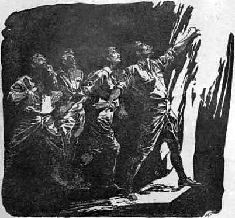

Fünfzehntes Kapitel
===================
Unsere Augen haben große Wunder gesehen
---------------------------------------

Ich schreibe dies von Tag zu Tag nieder, aber ich hoffe, dass ich noch vor dem letzten Bericht sagen kann, dass auch unsere Zukunft sich wieder aufhellt. Wir sind hier gefangen, ohne bis jetzt ein Mittel, das uns die Flucht ermöglichen könnte, zu sehen, obgleich wir uns mit allen Kräften darum bemühen. Und doch kann ich mir sehr wohl den Tag vorstellen, an dem wir uns freuen, dass wir hier gegen unseren Willen gefangen waren und etwas mehr von den Merkwürdigkeiten dieses seltsamen Plateaus und den Geschöpfen, die es bewohnen, gesehen haben.

Der Sieg der Indianer und die Vernichtung der Affenmenschen bezeichneten den Wendepunkt in unserem Schicksal. Von jetzt an waren wir in Wahrheit die Herren des Plateaus. Denn die Eingeborenen blickten mit einer Mischung von Furcht und Dankbarkeit auf uns, seit wir ihnen mit unseren seltsamen Kräften geholfen hatten, ihren Erzfeind zu vernichten. In ihrem eigenen Interesse würden sie vielleicht froh sein, wenn so furchtbare und unberechenbare Leute wie wir wieder verschwänden. Doch haben sie uns selbst niemals irgendwie angedeutet, auf welche Weise wir von der Hochfläche heruntergelangen könnten. Es hatte ehemals, so viel wir aus ihren Gesten entnehmen konnten, einen Tunnel gegeben, durch den man das Plateau von unten her erreichen konnte und dessen unteren Ausgang wir von der Schlucht her gesehen hatten. Durch diesen sind zweifellos die Affenmenschen und die Indianer zu verschiedenen Zeiten nach oben gelangt. Und auch Maple White mit seinem Gefährten hat den gleichen Weg benutzt. Vor einem Jahr jedoch ist das obere Ende des Tunnels bei einem furchtbaren Erdbeben eingestürzt und infolgedessen nicht mehr zugänglich. Die Indianer konnten daher nur die Köpfe schütteln und die Achsel zucken, wenn wir ihnen durch Zeichen unseren Wunsch, nach unten zu gelangen, ausdrückten. Möglicherweise waren sie gar nicht in der Lage, uns zu helfen, vielleicht wollten sie es aber auch nicht.

Am Schluss des siegreichen Feldzuges wurde das überlebende Affenvolk über das Plateau getrieben – ihr Wehklagen war schrecklich – und in der Nachbarschaft der Indianerhöhlen angesiedelt. Hier sollten sie für alle Zukunft unter den Augen ihrer Herren als Sklavenrasse verbleiben. Es war eine rohe, vorgeschichtliche Parallele zum Schicksal der Juden in Babylon oder in Ägypten. Während der Nacht ertönte aus dem Walde langgezogenes Wehgeschrei, als ob ein urzeitlicher Hesekiel über die gefallene Größe und den entschwundenen Ruhm der Affenstadt trauerte, zu uns herüber. Holz- und Wasserträger zu sein, war ihr künftiges Schicksal.

Wir waren zwei Tage nach der Schlacht mit unseren Verbündeten herübergekommen und schlugen unser Lager am Fuße ihrer Felsenwände auf. Sie boten uns an, ihre Höhlen mit ihnen zu teilen, aber Lord John wollte hierzu unter keinen Umständen seine Einwilligung geben, da er befürchtete, dass wir uns allzusehr in ihre Hände geben würden, falls sie verräterisch veranlagt sein sollten. Wir bewahrten uns also unsere Unabhängigkeit und hielten, trotz aller freundschaftlichen Beziehungen, unsere Waffen auf jeden Fall in Bereitschaft. Wir besuchten auch ihre höchst merkwürdigen Höhlen öfters, waren jedoch nicht imstande festzustellen, ob sie von Menschenhänden gemacht oder natürlich entstanden waren. Sie lagen alle in ein und derselben weichen geologischen Schicht, die zwischen der basaltischen Formation der roten Felswände und dem unterwärts befindlichen harten Granit gelegen war.

Die Eingänge befanden sich achtzig Fuß über dem Erdboden. Zu ihnen hinauf führten lange Steintreppen, die aber so schmal und steil waren, dass große Tiere nicht hinaufklettern konnten. Das Innere war warm und trocken und lief in gerader Richtung, wenn auch verschieden tief, in den Felsen hinein. Die glatten, grauen Wände waren mit vielen ausgezeichneten Kohlezeichnungen, die die verschiedenen Tiere des Plateaus darstellten, geschmückt. Wenn jedes Lebewesen in diesem Lande ausgestorben wäre, würde der zukünftige Forscher auf den Wänden der Höhlen einen glänzenden Nachweis der eigenartigen Fauna (Dinosaurier, Iguanodons und Fischeidechsen), die noch vor kurzem auf der Erde lebte, finden.

Seit wir erfahren hatten, dass die riesigen Iguanodons von ihren Eigentümern als zahme Tiere gehalten wurden und nur lebende Fleischspeicher darstellten, begriffen wir, dass der Mensch sogar mit seinen primitiven Waffen seine Überlegenheit auf dem Plateau begründet hatte. Wir sollten bald entdecken, dass dem nicht so war und dass er nur geduldet wurde. Es war am dritten Tage, nachdem wir unser Lager in der Nähe der Indianerhöhlen aufgeschlagen hatten, als sich eine Tragödie vor uns abspielte. Challenger und Summerlee waren an diesem Tage zum See hinuntergegangen, wo einige Eingeborene unter ihrer Leitung damit beschäftigt waren, einige Arten von großen Eidechsen mit der Harpune zu fangen. Lord John und ich waren in unserem Lager geblieben, während eine Reihe von Indianern an verschiedenen Stellen des grasbewachsenen Abhanges vor den Höhleneingängen mit allerlei Arbeiten beschäftigt waren. Plötzlich gab es einen gellenden Alarmschrei, und Hunderte von Stimmen schrien das Wort: »Stoa, Stoa«. Von allen Seiten stürzten Männer, Frauen und Kinder in wilder Flucht die Treppen hinauf, um in ihren Höhlen Schutz zu suchen. Von oben her sahen wir sie mit den Armen winken und uns auffordern, zu ihnen hinaufzukommen. Wir hatten unsere Gewehre ergriffen und rannten ins Freie, um zu sehen, um was es sich handelte. Plötzlich stürzte aus dem nahen Waldrande eine Gruppe von 12-15 Indianern in rasendem Lauf hervor, und scharf hinter ihnen erblickte man zwei jener furchtbaren Ungetüme, von denen eins unser Lager besucht und mich auf meiner nächtlichen Expedition verfolgt hatte. Sie hatten die Form entsetzlicher Kröten und bewegten sich springend vorwärts, waren aber von einer unglaublichen Größe, die die eines Elefanten übertraf. Wir hatten sie bisher nur nachts gesehen, und tatsächlich waren es nächtliche Tiere, die sich am Tage nur zeigten, wenn sie aufgestört wurden. Wir standen bei ihrem Anblick wie gelähmt da, denn ihre fleckige und warzige Haut schillerte wie Fischschuppen, und das Sonnenlicht übergoss sie mit ständig wechselnden Regenbogenfarben.

Wir hatten indessen wenig Zeit, sie zu beobachten, denn schon hatten sie die Fliehenden eingeholt und richteten ein grässliches Blutbad unter ihnen an. Ihre Angriffsmethode bestand darin, sich im Sprung auf ihr Opfer zu werfen und dieses dann mit zerbrochenen und zerfetzten Gliedern liegen zu lassen, um hinter dem nächsten her zu setzen. Die Unglücklichen Indianer schrien vor Entsetzen, waren aber hilflos und versuchten, sich durch Laufen den riesenhaften Bestien zu entziehen. Aber einer nach dem anderen stürzte zu Boden, und es war nur noch ein halbes Dutzend von ihnen am Leben, als mein Gefährte und ich ihnen zu Hilfe eilten. Unsere Unterstützung war nur von geringem Nutzen und brachte uns höchstens mit in Gefahr. In der Entfernung von einigen hundert Metern verschossen wir sämtliche Patronen unseres Magazins, ohne jedoch mehr zu erreichen, als wenn wir die Tiere mit Papierkugeln beworfen hätten. Die reptilienhafte Natur ihres Körpers machte sich nichts aus Verwundungen, und ihre in Ermangelung eines einheitlichen Gehirns auf das ganze Rückenmark verteilten Nervenzentren entzogen sich der Einwirkung moderner Waffen. Das einzige, was wir tun konnten, war, ihr Vordringen aufzuhalten, indem wir ihre Aufmerksamkeit durch das Aufblitzen und Krachen unserer Gewehre ablenkten, damit die Eingeborenen und wir selbst die zur sicheren Höhe hinaufführende Treppe erreichen konnten. Aber wo die konischen Explosivgeschosse des 20. Jahrhunderts nutzlos waren, erwiesen sich die vergifteten Pfeile der Eingeborenen, die man erst in Strophantussaft und danach in verwesendes Aas getaucht hatte, als erfolgreich. Den Jägern, die die Tiere angriffen, halfen sie freilich nichts, da die Wirkung des Giftes durch die träge Blutzirkulation der Tiere verlangsamt wurde. Aber als die beiden Ungeheuer uns gerade bis zum Fuß der Treppe getrieben hatten, schwirrte eine Unzahl von Pfeilen aus den Höhleneingängen auf sie herunter. In einer Minute wurden sie völlig gespickt mit ihnen, und doch versuchten sie, ohne ein Zeichen von Schmerz von sich zu geben, in rasender Wut die Stufen, die zu ihren Opfern hinaufführten, unter wildem Kratzen und Begeifern zu erklimmen, stürzten aber jedesmal nach wenigen Metern schwerfällig wieder auf den Boden zurück. Zuletzt fing das Gift an zu wirken. Eines von beiden stieß ein dröhnendes Grunzen aus und ließ seinen riesigen, flachen Kopf auf den Boden sinken. Dann sprang das andere mit gellendem Wehgeschrei wild im Kreise umher, wand sich einige Minuten im Todeskampf und lag dann ebenfalls steif und still da. Mit lautem Triumphgeschrei stürzten die Indianer aus ihren Höhlen und die Treppen hinunter und führten einen rasenden Siegestanz um die toten Körper aus, voll Freude darüber, dass wieder zwei ihrer gefährlichsten Feinde erschlagen waren. In der Nacht zerschnitten sie die Kadaver und beseitigten die Stücke, nicht um sie zu essen – denn das Gift war noch wirksam –, sondern um die Entstehung einer Pestilenz zu verhüten. Die großen Reptilienherzen jedoch, von denen jedes so groß war wie ein Kissen, blieben liegen und schlugen mit unheimlich selbständigem Leben, sanft an- und abschwellend, leise und ständig weiter. Erst am dritten Tage hörte das Leben in ihnen auf, und die furchtbaren Organe standen still.

Wenn ich eines Tages einen besseren Tisch als eine Fleischbüchse und ein besseres Schreibzeug als einen Bleistiftstummel und ein zerrissenes Notizbuch haben werde, will ich einen etwas genaueren Bericht über die Accala-Indianer, über unser Leben unter ihnen und von den Beobachtungen, die wir unter den seltsamen Verhältnissen des wunderbaren Maple-White-Landes machten, geben. Niemals werde ich diese Dinge vergessen; denn solange noch eine Spur von Leben in mir ist, wird jede Stunde und all unser Tun in diesem Zeitabschnitt deutlich und klar vor mir stehen, wie die ersten Erlebnisse unserer Kindheit. Keine neuen Eindrücke können auslöschen, was sich dem Gedächtnis so tief eingeprägt hat. Ich werde dann Gelegenheit nehmen, die zauberhafte Mondnacht auf dem großen See zu beschreiben, als ein junger Ichthyosaurus – ein seltsames Wesen, halb Seehund, halb Fisch, mit je einem knochenbedeckten Auge auf jeder Seite der Schnauze und einem dritten oben auf dem Kopf – sich in einem Indianernetz verfangen hatte und fast unser Kanu zum Kentern brachte, bevor wir es ans Ufer ziehen konnten; diese Nacht, in der eine grüne Wasserschlange aus dem Schilf hervorschoss und in den Windungen ihres Körpers den Steuermann von Challengers Kanu hinwegführte. Ich werde auch erzählen von dem großen, nächtlichen, weißen Wesen – bis heute wissen wir noch nicht, ob es ein Säugetier oder ein Reptil war -, das in einem hässlichen, im Osten des Sees gelegenen Sumpf lebte, in dem es mit einem schwachen phosphoreszierenden Glanz umherhuschte. Die Indianer erfüllte eine derartige Angst vor dem Tier, dass sie nicht nahe an den Sumpf herangehen wollten. Obwohl wir zwei Vorstöße bis zu dem Sumpf machten und es auch jedesmal gesehen haben, war es uns doch nicht möglich; durch den Morast zu ihm hinzugelangen. Ich kann nur sagen, dass es größer als eine Kuh zu sein schien und einen eigenartigen Moschusgeruch verbreitete. Weiter werde ich von dem riesenhaften Vogel berichten, der Challenger eines Tages in die Höhlenwohnungen hinaufjagte, ein großer Laufvogel, weit stärker als ein Strauß, mit einem geierartigen Hals und einem Kopf, der an einen Totenschädel erinnerte. Als Challenger die Treppen hinaufeilte, wurde ihm durch einen Schlag des gebogenen Schnabels der Absatz seines Stiefels wie von einem Meißel glatt abgeschnitten. In diesem Falle waren die modernen Waffen wenigstens erfolgreich, und das große Geschöpf, das zwölf Fuß Länge hatte – Phororachus ist sein Name, den uns der keuchende, aber entzückte Professor nannte –, stürzte auf einen Gewehrschuss Lord Roxtons in einem Gewirr von flatternden Federn und zappelnden Gliedern, aus deren Mitte zwei kalte und grausame gelbe Augen uns anstarrten, zu Boden. Hoffentlich erlebe ich den Tag, wo ich diesen flachen, bösartigen Schädel in der ihm zugewiesenen Nische zwischen den Trophäen im Albanygebäude wiedersehen werde. Schließlich werde ich auch nicht unterlassen, von dem Toxodon, dem riesigen, zehn Fuß hohen Guineaschwein mit seinen vorstehenden Meißelzähnen, das wir im Morgengrauen am Seeufer töteten, als es zum Trinken herabgekommen war, zu berichten.

All dies werde ich eines Tages ausführlich beschreiben, und inmitten der Schilderungen dieser aufregenden Tage sollen auch die lieblichen Sommerabende ihren Platz finden, an denen wir unter tiefblauem Himmel in guter Kameradschaft im weichen Grase lagen, um unsere staunenden Augen auf den seltsamen Vögeln, die über uns schwebten, und die merkwürdigen Geschöpfe, die aus ihren Verstecken hervorkamen, um uns zu beobachten, ruhen zu lassen, während über uns die Zweige mit köstlichen Früchten herabhingen und neben uns seltsame und liebliche Blumen im Grase aufleuchteten. Oder jene langen, mondbeglänzten Nächte, die wir auf der schimmernden Fläche des großen Sees zubrachten und mit staunender Ehrfurcht die riesigen Wellenkreise beobachteten, die vom plötzlichen Auftauchen eines phantastischen Ungeheuers erzeugt wurden, oder den grünlichen Glanz tief unten im Wasser, der von einem fremdartigen Wesen an den Grenzen der Dunkelheit herrührte. Das sind die Bilder, die mein Geist und meine Feder eines Tages auf das genaueste darstellen werden.

Aber Sie werden fragen: wozu diese Erlebnisse und wozu dies Verweilen, während Sie und Ihre Gefährten doch die Pflicht hatten, Tag und Nacht sich mit den Mitteln zu beschäftigen, die Ihnen eine Rückkehr in die Welt ermöglichen sollten? Darauf muss ich antworten, dass wir alle dauernd auf dieses Ziel hinarbeiteten, dass unsere Bemühung aber vergeblich war.

Eins war uns sehr bald klar geworden: Die Indianer hatten nicht die Absicht, uns irgendwie zu helfen. In jeder anderen Beziehung waren sie unsere Freunde oder, man könnte fast sagen, unsere ergebenen Sklaven. Aber wenn wir von ihnen verlangten, dass sie uns beim Bau einer Brücke, die zu der Felsspitze hinübergeführt hätte, helfen sollten, oder wenn wir von ihnen Lederriemen oder Schlingpflanzen haben wollten, aus denen wir Tauwerk hätten flechten können, so stießen wir auf eine freundliche, aber unbesiegbare Ablehnung. Dann lächelten sie nur, zwinkerten mit den Augen und schüttelten mit den Köpfen. Selbst bei dem alten Häuptling begegneten wir dieser hartnäckigen Ablehnung, und nur Maretas, der Jüngste, den wir gerettet hatten, blickte uns verständnisvoll an und gab uns durch Gesten zu verstehen, dass es ihn bekümmere, wenn man unsere Wünsche durchkreuzte. Seitdem sie über die Affenmenschen triumphiert hatten, blickten sie auf uns wie auf Übermenschen, die in ihren seltsamen Waffen den Sieg trugen, und sie glaubten, dass das Glück so lange mit ihnen sein würde, als wir bei ihnen blieben. Ein kleines, rothäutiges Weib und eine eigene Höhle wurde jedem von uns freigebig angeboten, wenn wir nur unsere Heimat vergessen und für immer auf dem Plateau bei ihnen leben wollten. So weit wäre alles ganz schön gewesen, wenn wir nur nicht unsere besonderen Wünsche gehabt hätten. Wir fühlten aber deutlich, dass unsere Pläne, die auf einen Abstieg zielten, geheimgehalten werden mussten, denn wir hatten Grund zu der Befürchtung, dass sie es schließlich versuchen würden, uns mit Gewalt zurückzuhalten.

Trotz der von den Dinosauriern drohenden Gefahr (die mit Ausnahme des Nachts nicht sehr groß war, denn sie sind, wie ich schon gesagt habe, nächtliche Tiere) war ich in der letzten Woche zweimal in unserem alten Lager, um nachzusehen, ob unser Neger am Fuße der Felswand noch unser wartete. Meine Augen schweiften sehnsuchtsvoll über die große Ebene in der Hoffnung, das Herannahen der Hilfe, um die wir gebeten hatten, zu sehen. Aber auf der kaktusbestreuten Fläche war bis zu jenem dichten Bambusgürtel hin kein Lebewesen zu bemerken.

»Werden bald kommen, Massa Malone. Bevor Woche zu Ende, Indianer kommen zurück, bringen Taue und holen euch herunter«, klang der fröhliche Ruf des prächtigen Negers zu mir herauf.

Gelegentlich meines zweiten Besuches im Lager, der einen Tag und eine Nacht in Anspruch nahm, hatte ich auf meinem nächtlichen Rückwege ein merkwürdiges Erlebnis. Ich schritt auf dem mir wohlbekannten Weg dahin und war an einer Stelle, die etwa einen Kilometer vom Pterodactylus-Sumpf entfernt war, angelangt, als ich eine merkwürdige Erscheinung auf mich zukommen sah. Es war ein Mann, der innerhalb eines Bambusgestelles, das ihn wie ein riesiger Käfig umgab, einherschritt. Mein Erstaunen wuchs, als ich beim Näherkommen erkannte, dass es Lord John Roxton war. Als er mich bemerkte, schlüpfte er aus seinem seltsamen Käfig heraus, kam lachend und doch nicht ohne eine gewisse Verlegenheit auf mich zu.

»Hallo, mein Junge, wer hätte wohl gedacht, Sie hier zu treffen.«

»Aber was in aller Welt machen Sie denn hier?« fragte ich.

»Ich besuche meine Freunde, die Pterodactylen!«

»Aber warum denn?«

»Interessantes Viehzeug, was denn? Aber etwas ungesellig. Haben ein ekelhaft grobes Benehmen Fremden gegenüber, wie Sie sich erinnern werden. Ich habe mir diesen Käfig übergehängt, um gegen ihre zudringlichen Aufmerksamkeiten geschützt zu sein.«

»Aber was wollen Sie denn nur in diesem Sumpf?«

Er blickte mich mit etwas misstrauischen Augen an, und ich las ein zurückhaltendes Zögern in seinem Gesicht.

»Glauben Sie, dass nicht auch andere Leute als Professoren wissbegierig sind?« sagte er zuletzt. »Ich studiere diese netten Tierchen, das muss Ihnen genügen.«

»Nichts für ungut«, sagte ich.

Er gewann seine gute Laune wieder und lachte.

»Nichts für ungut, mein Junge. Ich bin auf dem Wege, ein junges Teufelshuhn für Challenger zu holen. Das ist so etwas für mich. Nein, danke, ich brauche Ihre Gesellschaft nicht. Ich bin sicher in diesem Käfig, und Sie sind es nicht. Also auf Wiedersehen. Ich werde heute abend wieder im Lager zurück sein.«

Er entfernte sich, und ich sah ihn durch den Wald im Schutze seines Käfigs dahinwandern.

Wenn Lord Johns Benehmen bei dieser Gelegenheit seltsam war, so war es das von Challenger noch mehr. Ich kann wohl sagen, dass ich den Eindruck hatte, als ob er außerordentlich faszinierend auf die kleinen Indianerweiber wirkte. Dauernd trug er einen großen Palmzweig in der Hand, mit dem er sie wie Fliegen von sich abwehrte, wenn sie allzu zudringlich wurden. Es ist eines der groteskesten Bilder, die mein Gedächtnis aufbewahrt hat, wie er mit seinem schwarzen, starrenden Bart, die Füße bei jedem Schritt elegant aufsetzend, wie ein Sultan aus der Komischen Oper mit dem Zeichen der Autorität in der Hand dahinschritt, während eine Schar von Indianermädchen mit erstaunt aufgerissenen Augen und sehr sparsamer Bekleidung aus Baumrinde hinter ihm hertrollte. Summerlee hatte sich ganz dem Studium des Insekten- und Vogellebens hingegeben und verbrachte seine Tage (mit Ausnahme der beträchtlichen Zeit, die er mit Vorwürfen gegen Challenger, dass wir noch immer auf dem Plateau wären, ausfüllte) mit dem Präparieren der erbeuteten Exemplare.

Challenger hatte die Gewohnheit, jeden Morgen zu verschwinden und hin und wieder mit dem Ausdruck gewichtiger Feierlichkeit wieder aufzutauchen, wie jemand, der die volle Schwere einer großen Unternehmung auf seinen Schultern trägt. Eines Tages führte er uns, mit dem Palmzweig in der Hand und gefolgt von einer Schar Anbeterinnen, hinunter zu seiner versteckten Werkstatt und weihte uns in das Geheimnis seiner Pläne ein.

Es war eine kleine Lichtung in der Mitte eines Palmenwäldchens. Hier befand sich einer jener kochenden Schlammgeiser, die ich bereits beschrieben habe. Am Rande desselben lagen eine Anzahl aus einer Iguanodonhaut geschnittener Lederstreifen und ebenso eine zusammengesunkene Haut, die sich als der getrocknete und gesäuberte Magen einer der großen Fischeidechsen aus dem See erwies. Der riesige Sack war an einem Ende zugenäht und zeigte auf dem anderen nur eine kleine Öffnung. In dieser steckten mehrere Bambusrohre, deren freie Enden mit konischen Tontrichtern, die das in Blasen aufsteigende Gas auffingen, verbunden waren. Das häutige Organ begann sich langsam auszudehnen und entwickelte eine so starke Neigung, sich in die Luft zu erheben, dass Challenger das Tau, mit dem es an den umstehenden Bäumen befestigt war, stärker anzog. In einer halben Stunde hatte der Gasballon eine stattliche Größe angenommen, und der Zug an den Lederriemen bewies, dass er über einen kräftigen Auftrieb verfügte. Challengers Antlitz glänzte wie das eines Vaters angesichts seines Erstgeborenen, und er blickte, mit lächelnder Selbstzufriedenheit seinen Bart streichend, wortlos auf dies neue Produkt seines Geistes. Summerlee brach als erster das Schweigen.

»Sie glauben doch nicht etwa, dass wir mit dem Ding da in die Höhe steigen sollen, Challenger?« fragte er mit schneidender Stimme.

»Ich werde Ihnen, mein lieber Summerlee, einen solchen Beweis von der Stärke dieses Ballons geben, dass Sie keine Bedenken mehr tragen werden, sich ihm ruhig anzuvertrauen.«

»Sie können sich das Ding ruhig auf den Kopf binden«, sagte Summerlee mit Entschiedenheit. »Nichts in der Welt wird mich veranlassen, eine solche Tollheit zu begehen. Lord John, ich hoffe, dass Sie diesen Wahnsinn nicht unterstützen werden.«

»Ich finde, die Sache ist verteufelt fein ausgedacht«, sagte unser Lord. »Ich würde gern sehen, ob der Ballon funktioniert.«

»Sie werden es sehen«, sagte Challenger. »Seit einigen Tagen habe ich meine ganzen Geisteskräfte auf die Lösung des Problems gerichtet, wie wir von diesem Plateau herunterkommen sollen. Wir haben uns überzeugt, dass wir nicht hinunterklettern können und dass es auch keinen Tunnel gibt. Wir sind auch nicht in der Lage, eine Art von Brücke zu der Felsensäule hinüberzuschlagen. Es musste also ein anderes Mittel, hinunterzugelangen, gefunden werden. Ich bemerkte bereits vor einiger Zeit unserem jungen Freunde gegenüber, dass die Gasblasen dieser Geiser freien Wasserstoff enthalten. Daraus erwuchs logischerweise der Gedanke eines Ballons. Ich will zugeben, dass ich zunächst einigen Schwierigkeiten begegnete, eine Hülle, die das Gas aufnehmen konnte, herzustellen. Aber die Untersuchung der ungeheuren Eingeweide dieses Reptils brachte mir die Lösung des Problems. Sie sehen das Resultat!«

Dabei steckte er eine Hand vorn in sein zerrissenes Jackett und zeigte mit der anderen stolz auf den Gasballon, der prall und rund vor uns stand und an seinen Fesseln zerrte.

»Jahrmarktsrummel«, knurrte Summerlee.

Lord John war von der ganzen Idee entzückt. »Famoser alter Knabe, nicht wahr?« flüsterte er mir zu und fragte dann laut Challenger: »Wie wird es denn mit dem Korbe?«

»Der Korb wird meine nächste Sorge sein. Ich habe bereits einen Plan, wie man ihn anfertigen und befestigen kann. Inzwischen werde ich Ihnen aber einen Beweis geben, dass mein Apparat imstande ist, das Gewicht eines jeden von uns zu tragen.«

»Das Gewicht von uns allen doch wohl, nehme ich an.«

»Nein, es gehört zu meinem Plan, dass jeder von uns einzeln, wie mit einem Fallschirm, den Abstieg bewerkstelligen soll. Der Ballon wird jedesmal auf eine Weise wieder nach oben gezogen, die mir nicht schwer fallen wird, auszudenken. Wenn er das Gewicht von einem von uns trägt und ihn sanft hinuntersinken lässt, so leistet er alles, was man von ihm verlangen kann. Ich werde Ihnen das jetzt vorführen.«

Er befestigte das Tau darauf um einen Basaltblock, dessen Mitte etwas eingeschnürt war. Es war das eine, das wir zum Besteigen der Felsen benutzt und nachher aufs Plateau gebracht hatten. Er hatte eine Art von Netz aus Lederriemen angefertigt, von dem eine Reihe von Streifen herniederhingen. Dieses Netz wurde über den Ballon gelegt und die herunterhängenden Streifen unten zusammengebunden, so dass der Druck auf die ganze Oberfläche des Ballons verteilt wurde. An den freien Enden der Lederstreifen wurde nunmehr der Basaltblock festgebunden, und der Professor schlang sich das von ihm herabhängende Tau mehrere Male um den Arm.

»Ich werde jetzt,« sagte Challenger mit dem stolzen Vorgefühl des geglückten Versuches, »die Tragkraft meines Apparates demonstrieren«, und mit diesen Worten durchschnitt er die Fesseln des aufwärts strebenden Ballons.

Niemals war unsere Expedition in einer drohenderen Gefahr völliger Vernichtung. Die aufgeblasene Membrane stieg mit erschreckender Geschwindigkeit in die Luft. Einen Augenblick später wurde Challenger vom Boden aufgerissen und weggeschleppt. Ich hatte gerade noch Zeit, meine Arme um seinen aufsteigenden Körper zu schlingen, und wurde gleichfalls hochgehoben. Lord John packte mich wie eine Rattenfalle an den Beinen, aber ich fühlte, dass auch er sich über den Boden erhob. Für einen Augenblick schwebte mir das Bild von vier Abenteurern vor, die wie eine Kette von Würsten über das Land, das sie erforscht hatten, hinschwebten. Aber glücklicherweise hatte zwar nicht die Tragfähigkeit unserer Teufelsmaschine, wohl aber die des Taues seine Grenzen. Es gab einen scharfen Ruck, und wir lagen alle miteinander auf dem Erdboden, bedeckt von den Windungen des herabfallenden Strickes. Als wir alle wieder auf den Füßen waren, erblickten wir weit weg am Himmel als dunklen Punkt den mit beschleunigter Geschwindigkeit herabstürzenden Basaltblock.

»Glänzend!« schrie der uneingeschüchterte Challenger, sich seinen schmerzenden Arm reibend. »Ein ausgezeichneter und völlig befriedigender Versuch! Einen derartigen Erfolg hätte ich nicht vorhersehen können. Ich verspreche Ihnen, meine Herren, dass ich innerhalb einer Woche einen zweiten Ballon fertig haben werde und dass Sie darauf rechnen können, die erste Etappe Ihrer Heimfahrt sicher und bequem zu erreichen.« – –

Bis hierher habe ich alle Ereignisse, so wie sie aufeinander folgten, beschrieben. Ich fasse die letzten Vorgänge nunmehr vom alten Lager aus, wo Zambo so lange gewartet hatte, zusammen. Alle Schwierigkeiten und Gefahren liegen nunmehr wie ein Traum hinter uns auf der Höhe jener rötlichen Felsenwände, die sich über uns auftürmen. Wir sind sicher heruntergestiegen, wenn auch in einer gänzlich unerwarteten Weise, und es geht uns allen ausgezeichnet. In sechs Wochen oder zwei Monaten werden wir wieder in London sein, und möglicherweise kommt dieser Brief nicht früher an als wir selbst. Wir empfinden bereits starke Sehnsucht nach Hause, und unsere Geister fliegen heimwärts zu unserer großen, lieben Stadt, die so vieles enthält, was uns teuer ist.

Es war am Abend unseres gefährlichen Abenteuers mit Challengers selbstfabriziertem Ballon, als eine Wendung in unserem Schicksal eintrat. Ich erwähnte bereits, dass der einzige Indianer, der unsere Bemühungen, wegzukommen, mit Zeichen der Sympathie begleitet hatte, der junge Häuptling war, den wir befreit hatten. Er allein hatte nicht den Wunsch, uns gegen unseren Willen in diesem seltsamen Land zurückzuhalten. Er hatte uns durch seine Zeichensprache schon allerlei Mitteilungen gemacht. An diesem Abend kam er nach Dunkelwerden in unser kleines Lager hinunter, händigte mir (aus irgendwelchen Gründen hatte er mir immer besondere Aufmerksamkeit erwiesen, vielleicht, weil ich ihm im Alter am nächsten stand) eine Rolle von Baumrinde aus, wobei er ernst zu der Reihe von Höhlen über uns hinwies und seinen Finger, um Schweigen anzudeuten, auf die Lippen legte, und schlich sich dann wieder vorsichtig zu seinen Leuten zurück.

Ich hielt das Rindenstück ans Feuer, und wir unterzogen es einer gemeinsamen Prüfung. Es war etwa einen Quadratfuß groß, und auf der inneren Seite befand sich eine eigenartige Reihe von Linien, die ich hier wiedergebe:

Diese waren sauber mit einem Stück Kohle auf der weißen Oberfläche gezeichnet und machten im ersten Augenblick den Eindruck von rohen musikalischen Zeichen.

»Was es auch immer sein möge, ich kann beschwören, dass es von Wichtigkeit für uns ist«, sagte ich. »Das habe ich auf seinem Gesicht gelesen, als er es mir übergab.«

»Wenn wir es nicht mit einem primitiven, geschickten Spaßvogel zu tun haben,« bemerkte Summerlee, »deren es meiner Meinung nach bereits in frühester Vorzeit gegeben hat.«

»Es ist ganz klar, dass es sich hier um eine Art von Schrift handelt«, sagte Challenger.

»Sieht aus wie ein schwindelhaftes Preisrätsel«, bemerkte Lord John, indem er den Hals ausreckte, um einen Blick darauf zu werfen. Aber plötzlich streckte er die Hand aus und ergriff das Preisrätsel. »Beim Himmel!« schrie er, »ich glaube, ich habe es. Unser junger Freund hatte gleich die richtige Ahnung. Sehen Sie hier. Wieviel Striche stehen auf dem Rindenstück? Achtzehn. Gut. Und wie Sie sich erinnern, sind da achtzehn Höhleneingänge an der Felsenwand über uns.«

»Er zeigte zu den Höhlen hinauf, als er mir das gab«, sagte ich.

»Schön. Jetzt ist die Sache klar. Dies ist ein Plan der Höhlenreihe. Natürlich! Achtzehn in einer Reihe, einige kurz, einige lang, einige, die sich verzweigen, genau wie wir das alles gesehen haben. Es ist eine Karte, und hier ist noch ein Kreuz. Was mag das bedeuten? Es steht bei einer Höhle, die viel weiter in den Berg hineinführt als die anderen.«

»Eine, die durch die Felsenwand hindurchgeht!« rief ich aus.

»Ich glaube, unser junger Freund hat das Rätsel gelöst. Wenn die Höhle nicht durchführt, verstehe ich nicht, warum dieser Mensch, der allen Grund hat, uns dankbar zu sein, unsere Aufmerksamkeit auf sie gelenkt hat. Wenn sie aber hindurchgeht und an der anderen Seite der Felsenwand einen Ausgang hat, so würden wir von dort aus nicht mehr als hundert Fuß herunterzusteigen brauchen.«

»Hundert Fuß!« brummte Summerlee.

»Ausgezeichnet, unser Tau ist etwas länger als hundert Fuß«, rief ich aus. »Wir werden also sicher nach unten kommen können.«

»Und die Indianer in der Höhle?« warf Summerlee ein.

»In diesen Höhlen hier über uns sind keine Indianer«, sagte ich. »Diese dienen lediglich als Speicher und Vorratsräume. Warum sollten wir nicht gleich hinaufgehen und die Möglichkeiten auskundschaften?«

Es gibt auf dem Plateau ein trocknes und harziges Holz – eine Art von Araucarie nach unserem Botaniker –, das von den Indianern als Fackel benutzt wird. Jeder von uns nahm ein Bündelchen davon mit, und wir schritten die unkrautbedeckten Stufen zu jener Höhle hinauf, die in der Zeichnung besonders markiert war. Sie war, wie ich bereits bemerkt hatte, leer mit Ausnahme einer großen Zahl von Fledermäusen, die um uns herumflatterten, als wir die Höhle betraten. Da wir die Aufmerksamkeit der Indianer nicht auf unser Vorhaben zu ziehen wünschten, stolperten wir im Dunkeln weiter, bis wir einige Windungen hinter uns hatten und ziemlich tief in die Höhle eingedrungen waren. Dann erst zündeten wir unsere Fackeln an. Es war ein schöner, trockener Tunnel mit glatten, grauen, von Zeichnungen der Eingeborenen bedeckten Wänden mit einer gewölbten Decke und weißem glitzernden Sand unter unseren Füßen. Wir schritten eiligst vorwärts, bis wir mit dem Gefühl tiefster Enttäuschung feststellen mussten, dass es nicht weiter ging. Eine glatte Felswand, ohne jede Spalte, durch die auch nur eine Maus hätte schlüpfen können, bildete das Ende der Höhle. Hier also war nicht hindurchzukommen.

Niedergeschlagen standen wir vor unserem Hindernis. Es handelte sich hier nicht um das Ergebnis einer Erschütterung, wie in dem früher von uns erstiegenen Tunnel, die Quermauer war genau so gebaut wie die Seitenwände. Die Höhle bildete also eine richtige Sackgasse.

»Machen Sie sich keine Sorgen, meine Freunde«, sagte der unbezwingbare Challenger. »Es bleibt Ihnen immer noch die Möglichkeit des Abstieges mit meinem Ballon.«

Summerlee stöhnte.

»Sollten wir in der falschen Höhle sein?« bemerkte ich.

»Unmöglich, junger Freund«, sagte Lord John, den Finger auf die Karte setzend, die siebzehnte von rechts und die zweite von links. »Es ist kein Zweifel, dass wir in der richtigen Höhle sind.«

Ich warf einen Blick auf die Stelle, die er mit dem Finger bezeichnete, und stieß einen plötzlichen Freudenschrei aus. »Ich glaube, ich habe es! Folgen Sie mir! Folgen Sie mir!« Ich stürzte den Weg, den wir gekommen waren, zurück, die Fackel in der Hand. »Hier,« sagte ich, auf einige Streichhölzer auf dem Boden hinweisend, »hier haben wir unsere Fackeln angezündet.«

»Richtig.«

»Nun, die Höhle hat, wie wir aus der Zeichnung ersehen, noch einen Nebenast, und wir sind in der Dunkelheit, bevor wir unsere Fackeln entzündeten, an diesem Seiteneingang vorbeigegangen, ohne ihn zu bemerken. Wenn wir zurückgehen, werden wir auf der rechten Seite auf den längeren Höhlenarm stoßen.«

Es war so, wie ich gesagt hatte. Wir waren noch nicht dreißig Meter zurückgeschritten, als eine große, schwarze Öffnung in der Seitenwand erschien. Wir gingen hinein und stellten fest, dass wir uns in einem viel längeren Gang befanden als vorher. In atemloser Ungeduld eilten wir einige hundert Meter darin entlang, und dann tauchte plötzlich im tiefen Dunkel vor uns der Glanz eines Lichtes auf, das uns in größtes Erstaunen versetzte. Eine leuchtende Fläche schien die Höhle zu kreuzen und uns den Weg zu verlegen. Wir stürzten vorwärts, kein Klang, keine Hitze, keine Bewegung ging von der Erscheinung aus, aber immer noch hing der große, leuchtende Vorhang vor uns, füllte die Höhle mit silbernem Glanz und verwandelte den Sand unter unseren Füßen in glitzernden Juwelenstaub, bis wir, fortschreitend, den Rand einer kreisförmigen Fläche erkannten.

»Himmel, das ist ja der Mond!« schrie Lord John. »Wir sind durch, Kinder, wir sind durch!« 

Es war in der Tat der Vollmond, der gerade in die jenseitige Öffnung der Höhle hineinschien. Diese war schmal, nicht größer als ein Fenster, aber sie genügte völlig für unsere Zwecke. Als wir den Kopf hinausstreckten, konnten wir feststellen, dass der Abstieg nicht allzu schwierig war und dass der Erdboden nicht sehr tief unter uns lag. Es war kein Wunder, dass wir diese Öffnung von unten nicht bemerkt hatten, denn die Felswände bogen sich unterhalb derselben nach außen, und ein Aufstieg an dieser Stelle wäre so unmöglich erschienen, dass sich eine nähere Untersuchung erübrigt hätte. Wir überzeugten uns, dass wir mit Hilfe unseres Taues abwärts gelangen konnten, und kehrten dann voll Freude in unser Lager zurück, um unsere Vorbereitungen für den nächsten Abend zu treffen.

Alles, was wir zu tun hatten, musste schnell und heimlich geschehen, da uns die Indianer noch in letzter Stunde zurückhalten konnten. Unsere Vorräte mussten zurückbleiben mit Ausnahme unserer Gewehre und Patronen. Nur Challenger hatte irgend etwas Schweres, das er dringend mitzunehmen wünschte. Und ein besonders gepackter Ballen, über dessen Inhalt ich nicht sprechen möchte, verursachte uns mehr Arbeit als alles andere. Langsam verstrich der Tag, aber als die Dunkelheit hereinbrach, waren wir zum Abmarsch bereit. Mit vieler Anstrengung schleppten wir unser Gepäck die Treppen hinauf und warfen von oben, stehenbleibend, noch einen langen Blick auf das seltsame Land, das bald, wie ich fürchte, die Beute von Jägern und Goldsuchern sein wird, das aber für jeden von uns ein Traumland voll von Zauber und Romantik geworden war. Ein Land, in dem wir vieles gewagt, vieles gelitten und vieles verloren hatten – unser Land, wie wir es für immer liebevoll nennen sollten. Aus den Nachbarhöhlen zu unserer Linken erglänzte wieder freundlicher Lichtschein inmitten des allgemeinen Dunkels. Von den Abhängen unter uns tönte Lachen und Singen der Indianer herauf. Weit jenseits erblickten wir den dunklen Kranz der Wälder, und in der Mitte, matt durch die Dunkelheit schimmernd, lag der große See, die Mutter seltsamer Ungeheuer, und gerade in diesem Augenblicke löste sich aus dem Schatten der Nacht ein hoher, gellender Schrei, der Ruf irgendeines unheimlichen Tieres. Es war die Stimme vom Maple-White-Land selbst, die uns ein Lebewohl zurief. Wir wandten uns und tauchten unter in der Höhle, die uns heimwärts führte. Zwei Stunden später waren wir mit allem, was wir besaßen, am Fuß der jenseitigen Felsenwand angelangt. Nur Challengers Gepäck hatte uns einige Schwierigkeiten bereitet. Wir ließen alles an Ort und Stelle liegen und eilten zu Zambos Lager hinüber. Am frühen Morgen erreichten wir es, fanden jedoch zu unserem Erstaunen nicht ein Feuer, sondern ein Dutzend auf der Ebene: die Hilfsexpedition war angelangt. Zwanzig Indianer vom Amazonenstrom mit Pfählen, Tauen und allem, was zum Schlagen einer Brücke nötig ist. Wir werden nun wenigstens keine Schwierigkeiten mehr beim Transport unseres Gepäckes haben, wenn wir morgen unseren Rückmarsch zum Amazonenstrom antreten.

Und so schließe ich diesen Bericht in demütiger und dankbarer Stimmung. Wir haben große Wunder gesehen, und unsere Seelen sind durch alles, was wir gelitten haben, geläutert. Jeder von uns ist in seiner Weise ein besserer und tieferer Mensch geworden. Wahrscheinlich werden wir, sobald wir nach Para kommen, einen Aufenthalt nehmen, um uns neu auszurüsten. In diesem Falle wird mein Brief eine Post früher ankommen als wir. Wenn nicht, bringe ich ihn selber mit. Auf jeden Fall, mein lieber Herr McArdle, hoffe ich, Ihnen bald die Hand schütteln zu können.

