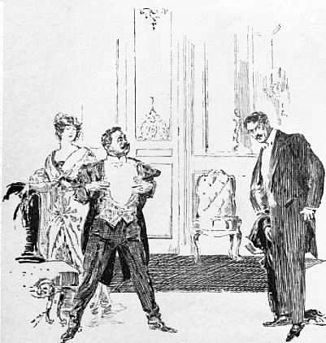

Sechzehntes Kapitel
====================
Ein Umzug! Ein Umzug!
---------------------

Ich möchte an dieser Stelle allen unsern Freunden am Amazonenstrom unsern Dank aussprechen für die große Liebenswürdigkeit und Gastlichkeit, die sie uns anlässlich unserer Rückreise erwiesen haben. Ganz besonders muss ich Signor Penalosas und anderer Beamten der brasilianischen Regierung gedenken für ihre Bemühungen, uns unsere Abreise zu erleichtern, und Signor Pereiras in Para, dessen Vorsorge wir das Bereitliegen einer vollständigen neuen Ausrüstung, die uns ein anständiges Wiedererscheinen in der zivilisierten Welt ermöglichte, verdankten. Alle diese Freundlichkeiten scheinen allerdings schlecht vergolten, wenn wir unsere Gastgeber und Wohltäter täuschen. Aber unter den gegebenen Umständen haben wir tatsächlich keine andere Wahl. Und ich muss ihnen bei dieser Gelegenheit sagen, dass es Zeit und Geldverschwendung bedeuten würde, wenn sie unseren Spuren folgen würden. Sogar die Namen sind in unseren Berichten geändert, und ich bin sicher, dass niemand sogar nach dem sorgfältigsten Studium in der Lage ist, auch nur auf tausend Kilometer an unser unbekanntes Land heranzukommen.

Wir waren der Meinung, dass die Aufregung, der wir auf unserer Rückreise begegneten, auf die Gebiete, die unsere Route berührte, beschränkt sei, und ich kann unseren Freunden in England nur die Versicherung geben, dass wir keine Ahnung von dem allgemeinen Interesse, das schon durch unsere Erlebnisse in ganz Europa erweckt war, hatten. Erst die vielen drahtlosen Telegramme von allen möglichen Zeitungen und Agenturen, die uns, als wir noch fünfhundert Meilen von Southampton entfernt waren, große Honorare für eine kurze Rückantwort über unsere Forschungsergebnisse anboten, zeigten uns die hochgespannte Erwartung der wissenschaftlichen Welt und der Öffentlichkeit. Wir waren indessen übereingekommen, der Presse keinerlei Mitteilung zu machen, bevor wir den Mitgliedern des Zoologischen Instituts gegenüberstanden; denn es war unsere Pflicht, zuerst ihnen, die uns den Auftrag zu unserer Reise gegeben hatten, Bericht zu erstatten. Wir lehnten daher kategorisch ab, obwohl Southampton voll von Pressevertretern war, irgendwelche Informationen zu geben. Die natürliche Folge davon war, dass die allgemeine Aufmerksamkeit auf die für den Abend des 7. Novembers angezeigte Versammlung gelenkt wurde. Für diese Zusammenkunft erwies sich der Saal des Zoologischen Instituts, von dem unser Unternehmen ausgegangen war, als zu klein, und man hatte infolgedessen die Queens Hall in der Regent Street gewählt. Heute wissen wir, dass die Veranstalter ruhig die Albert-Halle hätten wählen können, und auch dort hätte der Platz kaum ausgereicht. Die Versammlung sollte am zweiten Abend nach unserer Ankunft stattfinden. Zunächst hatte jeder von uns eigene dringende Angelegenheiten zu erledigen. Von der meinigen kann ich noch nicht sprechen. Vielleicht bin ich nach einiger Zeit imstande, mit einer weniger starken Bewegung daran zu denken und davon zu reden. Ich habe dem Leser am Anfang dieser Erzählung gezeigt, wo der Ursprung meines Unternehmens lag. Es ist daher vielleicht richtig, dass ich die Erzählung bis zu Ende führe und ihren Ausgang mitteile. Und doch könnte der Tag kommen, an dem ich sogar wünschen werde, dass es so und nicht anders gekommen ist. Schließlich habe ich den Antrieb zu einem wunderbaren Erlebnis erhalten, und ich kann jener Kraft, von der er ausgegangen ist, nur dankbar sein.

Und nun wende ich mich dem letzten erhabenen und ereignisreichen Moment unseres Abenteuers zu. Während ich noch mein Gehirn zermürbte, um die beste Form für die Darstellung zu finden, fielen meine Augen auf einen Artikel der Morgenausgabe des 8. Novembers meiner eigenen Zeitung, der einen vollständigen und ausgezeichneten Bericht meines Freundes und Kollegen Mac Dona enthielt. Was könnte ich wohl Besseres tun, als seine Erzählung abzuschreiben, den Artikel mitsamt den Überschriften? Ich muss zugeben, dass die Zeitung eine etwas überschwängliche Darstellung brachte, was zum Teil der Tatsache verdankt wurde, dass sie einen eigenen Berichterstatter zu dieser Unternehmung entsandt hatte. Aber die anderen großen Tageszeitungen waren kaum weniger vollständig in ihren Berichten. Freund Mac schrieb also folgendermaßen:

Die neue Welt
Große Versammlung in der Queen's Hall
Aufregende Szenen
Außerordentlicher Vorfall
Was war es?
Nächtlicher Tumult in der Regent Street.
(Spezialbericht.)

»Die vielerörterte Versammlung des Zoologischen Instituts, die den Zweck hatte, den Bericht des Untersuchungsausschusses entgegenzunehmen, der im letzten Jahre nach Südamerika geschickt wurde, um die Behauptungen des Professors Challenger nachzuprüfen, dass es auf diesem Kontinent noch heute prähistorische Lebensformen gäbe, fand gestern abend im großen Saale der Queens Hall statt, und man ist berechtigt zu sagen, dass dieser Tag in der Geschichte der Wissenschaften rot angestrichen zu werden verdient, denn die Mitteilungen dieser Versammlung hatten einen so bemerkenswerten und sensationellen Charakter, dass keiner der Anwesenden sie jemals vergessen wird. (Oh, Kollege Mac Dona! Was für ein monströser Einleitungssatz!) Die Einlasskarten sollten theoretisch nur in die Hände von Mitgliedern und Freunden derselben gelangen. Da aber das Wort »Freunde« ein dehnbarer Begriff ist, war der riesige Saal bereits lange vor acht Uhr, vor Anfang der Versammlung, dicht gefüllt. Das Publikum, das unverständigerweise darüber verärgert war, dass man es von der Versammlung ausschloss, nahm ein Viertel nach sieben Uhr die Eingänge mit Sturm, nachdem schon vorher eine allgemeine Keilerei, bei der verschiedene Leute verletzt und einem Institutsinspektor sogar ein Bein gebrochen wurde, stattgefunden hatte. Nach diesem unerwarteten Ansturm, der nicht nur alle Eingänge, sondern auch die für die Presse reservierten Plätze füllte, waren es schätzungsweise etwa fünftausend Leute, die die Ankunft der Forschungsreisenden erwarteten. Diese nahmen, nachdem sie eingetreten waren, ihre Plätze vorn auf der Rednerbühne ein, auf der bereits alle führenden Wissenschaftler, nicht nur aus England, sondern auch aus Frankreich und Deutschland, erschienen waren. Auch Schweden war in der Person des Professors Sergius, des berühmten Zoologen von der Universität Upsala, vertreten. Der Eintritt der vier Forschungsreisenden bildete das Signal für eine bemerkenswerte Begrüßungsdemonstration, bei der sich die gesamte Zuhörerschaft erhob und in minutenlange Beifallsrufe ausbrach. Ein aufmerksamer Beobachter hätte indessen feststellen können, dass sich der Beifall auch mit einigen abfälligen Rufen mischte, woraus man den Schluss ziehen durfte, dass die Versammlung einen mehr lebhaften als harmonischen Verlauf nehmen würde. Niemand hätte aber die außerordentliche Wendung, die dann eintrat, vorhersehen können.

Über das Aussehen der vier Forschungsreisenden braucht nichts gesagt zu werden, denn ihre Photographien sind bereits in allen Zeitungen erschienen. Man sieht ihnen kaum Spuren der beschwerlichen Reise, die sie hinter sich haben, an. Professor Challengers Bart scheint vielleicht zottiger geworden zu sein, Professor Summerlees Züge etwas strenger, Lord John Roxtons Figur etwas magerer, und alle drei erscheinen etwas gebräunter als bei ihrer Abreise. Aber alle sind offenbar bei ausgezeichneter Gesundheit. Was unseren eigenen Vertreter angeht, den wohlbekannten Sportsmann und Rugbyfußballspieler E. D. Malone, so machte er einen wohltrainierten Eindruck, und als er seine Augen über die versammelte Menge schweifen ließ, glitt ein zufriedenes, freundliches Lächeln über sein biederes, derbes Gesicht. (Allright, Mac, na warte nur, bis ich dich unter vier Augen treffe!)

Nachdem die Ruhe wiederhergestellt war und die Zuhörerschaft ihre Plätze wieder eingenommen hatte, ergriff der Vorsitzende, der Herzog von Durham, das Wort. Er wolle sich nicht lange, so sagte er, zwischen diese große Versammlung und die hochwichtigen Mitteilungen, die ihrer warteten, stellen. Es wäre nicht seine Aufgabe, vorwegzunehmen, was Professor Summerlee, der Sprecher des Untersuchungsausschusses, ihnen zu berichten hätte. Es wäre aber bereits bekannt, dass die Arbeiten der Expedition von außerordentlichem Erfolg gekrönt worden seien. Es habe den Anschein, als ob das Zeitalter der Romantik noch nicht vorüber sei, und es gäbe noch einen Boden, auf dem sich die wildeste Phantasie der Romanschreiber mit den wissenschaftlichen Untersuchungen ernster Forscher begegnen könnte. Er wolle nur noch hinzufügen, dass er glücklich sei, und die ganze Versammlung würde dasselbe empfinden, dass diese Herren heil und gesund von ihrer schwierigen und gefährlichen Unternehmung zurückgekehrt seien, denn es könne nicht in Abrede gestellt werden, dass ein einer solchen Expedition zugestoßenes Unglück für die Sache der zoologischen Wissenschaft einen unersetzlichen Verlust bedeutet hätte. (Großer Beifall, an dem man Professor Challenger sich beteiligen sah.)

Als sich darauf Summerlee erhob, brach ein neuer Begeisterungssturm aus, der sich mehrfach während seiner Rede wiederholte. Diese Rede soll hier nicht in extenso gegeben werden, da ein vollständiger Bericht über die Erlebnisse der Expedition aus der Feder unseres eigenen Berichterstatters in Vorbereitung ist. Nachdem er die Veranlassung der Reise geschildert und seinem Freunde, Professor Challenger, freigebig Anerkennung gezollt und auch die Ungläubigkeit, die man seinen jetzt völlig bewiesenen Behauptungen entgegengebracht hatte, entschuldigt hatte, schilderte er den tatsächlichen Verlauf der Reise, wobei er nur sorgfältig alle Informationen zurückhielt, die dem Publikum ermöglicht hätten, die Lage des merkwürdigen Plateaus festzustellen. Nach einer allgemeinen Beschreibung der Route auf dem Hauptstrom bis zu jener hohen Felsenmauer fesselte er seine Zuhörer durch den Bericht über die Schwierigkeiten, die die Expedition bei den Versuchen, sie zu besteigen, gefunden hatte, und schilderte zum Schluss das erfolgreiche Gelingen ihrer verzweifelten Anstrengungen, die ihnen das Leben ihrer beiden ergebenen Mischlinge gekostet hätten. (Diese befremdliche Mitteilung über die Mischlingsaffäre machte Summerlee in dem Bemühen, irgendwelche Anfragen aus dem Publikum in der Sache zu vermeiden.) Nachdem er seine Zuhörerschaft im Geiste auf die Höhe des Plateaus geführt und sie die Wirkung des Brückeneinsturzes hatte erleben lassen, fuhr er in der Beschreibung der Schrecken und der Reize des merkwürdigen Landes fort. Von persönlichen Erlebnissen sprach er wenig, um so mehr von den reichen Ergebnissen für die Wissenschaft, von den Beobachtungen des wunderbaren Tier-, Vogel-, Insekten- und Pflanzenlebens auf dem Plateau. Insbesondere hob er den Reichtum an Käfern, von denen 46 neue Arten, und Schmetterlingen, von denen 94 Arten im Laufe einiger Wochen hätten festgestellt werden können, hervor. Es waren jedoch die größeren Tiere und insbesondere diejenigen, die man für längst ausgestorben gehalten hatte, die das Interesse des Publikums am lebhaftesten in Anspruch nahmen. Hiervon konnte er eine ganze Reihe aufzählen, aber er zweifelte nicht daran, dass sie noch erweitert werden könne, wenn das Land erst gründlicher durchforscht wäre. Er und seine Gefährten hätten mindestens, wenn auch meistens allerdings in der Entfernung, ein Dutzend von Geschöpfen gesehen, die keinerlei Übereinstimmung mit den bis heute der Wissenschaft bekannten Tieren zeigten. Die Zeit würde kommen, in der man diese näher untersuchen und wissenschaftlich einreihen würde. Er führte als Beispiel eine Schlange an, deren abgeworfene, tief purpurrot gefärbte Haut einundfünfzig Fuß lang war, und erwähnte weiter ein weißes Geschöpf, vermutlich ein Säugetier, das während der Dunkelheit ein deutlich phosphoreszierendes Licht ausstrahlte, ferner einen großen, schwarzen Nachtfalter, dessen Biss von den Indianern für höchst giftig gehalten würde. Neben diesen völlig neuen Lebensformen sei das Plateau sehr reich an bekannten prähistorischen Tieren, von denen einzelne auf die Juraperiode zurückreichten. Er erwähnte darunter den gigantischen und grotesken Stegosaurus, der nur einmal von Herrn Malone an seinem Trinkplatz am Seeufer gesehen wurde und von dem sich eine Zeichnung in dem Skizzenbuch des abenteuerlichen Amerikaners, der dieses unbekannte Land zuerst besucht hatte, vorfände. Er beschrieb ebenso das Iguanodon und den Pterodactylus, zwei der ersten Naturwunder, die ihnen begegnet seien. Darauf ließ er die Versammlung erbeben durch eine Schilderung des schreckliches fleischfressenden Dinosaurus, der mehr als einmal Mitglieder der Expedition verfolgt hatte und der das furchtbarste Geschöpf sei, das sie angetroffen hätten. Dann ging er über zu dem riesenhaften und wilden Vogel, dem Phororachus, und dem großen Elch, der noch auf dem Hochland umherstreife. Aber erst bei der Schilderung der geheimnisvollen Vorgänge im Zentralsee stieg das Interesse und die Begeisterung der Versammlung auf ihren Höhepunkt. Man musste sich selbst fragen, ob man wache oder träume, wenn man diesen nüchternen und auf das rein Tatsächliche gerichteten Gelehrten in kühlem, gemessenem Ton die ungeheueren dreiäugigen Fischeidechsen und die riesenhaften Wasserschlangen, die dieses zauberhafte Gewässer bewohnten, beschreiben hörte. Er kam dann auf die Indianer und auf die merkwürdige Kolonie der anthropoiden Affen zu sprechen, die man als eine höhere Stufe des Pithecanthropus auf Java ansehen könne und die infolgedessen sich mehr als jedes andere Wesen jenem hypothetischen Geschöpf, das man als das »fehlende Zwischenglied« zwischen Menschen und Menschenaffen bezeichne, nähern. Endlich beschrieb er unter allgemeiner Heiterkeit die geistvolle, aber höchst gefährliche aeronautische Erfindung Professor Challengers und schloss seinen bedeutsamen Vortrag durch einen Bericht über die Methoden, deren sich der Untersuchungsausschuss bediente, um wieder in die Welt der Zivilisation zurückzukehren.

Man hätte glauben sollen, dass das wissenschaftliche Programm des Abends hiermit erschöpft sei und dass nunmehr der Dank und die Glückwünsche der Versammlung durch Professor Sergius von der Universität Upsala folgen würden. Aber es wurde bald klar, dass der weitere Verlauf der Versammlung kein so glattes Ende nehmen sollte. Schon während der Rede hatten sich von Zeit zu Zeit Anzeichen von Opposition bemerkbar gemacht, und nun erhob sich Dr. James Illingworth aus Edinburgh in der Mitte der Versammlung. Dr. Illingworth warf die Frage auf, ob nicht ein Amendement möglich sei, bevor man den Entschluss fasse, dem Ausschuss den Dank der Versammlung auszusprechen.

Der Vorsitzende: »Ja, wenn Sie ein Amendement für nötig halten?«

Dr. Illingworth: »Mit Ihrer freundlichen Erlaubnis, das Amendement ist nötig!«

Der Vorsitzende: »Dann bitte ich darum.«

Professor Summerlee (aufspringend): »Ich möchte erklären, Ew. Gnaden, dass dieser Mann von jeher mein persönlicher Gegner war seit unserer Kontroverse in der wissenschaftlichen Vierteljahrsschrift über die wahre Natur des Bathybius.

Der Vorsitzende: »Ich werde auf diese persönlichen Dinge nicht eingehen können. Bitte fortfahren.«

Man konnte Dr. Illingworths Bemerkungen wegen der andauernden Opposition der Freunde unserer vier Forschungsreisenden nur teilweise verstehen. Man versuchte auch mehrfach, ihn auf seinen Stuhl niederzuziehen. Da er aber ein Mann von enormen Körperkräften war und eine mächtige Stimme besaß, gelang es ihm, des Tumults Herr zu werden und seine Rede zu Ende zu führen. Von dem Augenblick an, als er sich erhob, war es klar, dass er eine Anzahl von Freunden und Anhängern in der Halle hatte, obgleich sie die Minorität bildeten. Die Haltung des größeren Teils der Versammlung könnte man als die einer aufmerksamen Neutralität bezeichnen.

Dr. Illingworth begann seine Ausführungen mit dem Ausdruck seiner hohen Wertschätzung für die wissenschaftliche Arbeit sowohl Professor Challengers als auch Professor Summerlees. Er bedaure sehr, dass man aus seinen Bemerkungen, die ihre Quelle einzig und allein in seinem Streben nach wissenschaftlicher Wahrheit hätten, den Unterton von irgend etwas Persönlichem gehört habe. Seine Lage sei aber tatsächlich und wesentlich die gleiche, in der sich Professor Summerlee in der letzten Versammlung befunden habe. In dieser Versammlung habe Professor Challenger gewisse Behauptungen aufgestellt, die von seinen Kollegen bezweifelt wurden. Jetzt trete dieser Kollege selbst auf mit den gleichen Behauptungen und verlange, dass man sie ungeprüft hinnehme. Ob das berechtigt sei? (»Ja!« »Nein!« – Längere Unterbrechung, während welcher man vom Pressetisch aus hörte, wie Professor Challenger den Vorsitzenden um die Erlaubnis bat, Dr. Illingworth hinauszuwerfen.) Vor einem Jahre behauptete ein Mann gewisse Dinge. Jetzt behaupten vier Männer etwas anderes und noch Erstaunlicheres. Sollte dies etwa ein endgültiger Beweis sein, wo doch die in Rede stehenden Dinge von so höchst revolutionärem und unglaublichem Charakter wären? Es habe neuerdings Beispiele von Forschungsreisenden gegeben, die aus unbekannten Ländern mit allerhand merkwürdigen Berichten zurückgekommen seien, denen man allzu eilig geglaubt habe. Solle das Londoner Zoologische Institut etwa in die gleiche Lage kommen? Er gebe zu, dass die Mitglieder des Ausschusses Männer von Charakter wären, aber die menschliche Natur sei sehr kompliziert, sogar Professoren könnten aus Ruhmsucht auf falsche Wege geraten. Wir alle liebten es, wie der Nachtfalter, zum Licht zu fliegen. Großwildjäger seien gern in der Lage, die Erzählungen ihrer Rivalen zu übertreffen, und Journalisten seien einer sensationellen Aufmachung nicht abgeneigt und scheuten sich nicht, den Tatsachen durch ihre Phantasie etwas aufzuhelfen. Jedes Mitglied des Ausschusses habe seine eigenen Gründe, die Resultate größer erscheinen zu lassen. (Pfui! Pfui!) Er habe nicht die Absicht, beleidigend zu sein. (»Sie sind es aber!« – Unterbrechung.) Die Beweismittel dieser seltsamen Geschichten wären tatsächlich recht bescheidener Art. Was hätte man hier vorgebracht? Einige Photographien. Könne man in unserem Zeitalter geschickter Technik Photographien noch als Beweisstücke ansehen? Was sonst? Wir hätten einige Geschichten von der Flucht und dem Abstieg mit Hilfe von Tauen gehört, die ein Mitbringen von größeren Probestücken ausschlösse. Das sei wohl zu verstehen, aber nicht überzeugend. Man habe gehört, dass Lord John Roxton behaupte, den Schädel eines Phororachus zu haben. Er könne nur sagen, dass er diesen Schädel gern einmal gesehen hätte.

Lord John Roxton: »Will dieser Mensch mich hier als Lügner bezeichnen?« (Lärm.)

Der Vorsitzende: »Ruhe! Ruhe! Dr. Illingworth, ich muss Sie ersuchen, mit Ihren Ausführungen zu Ende zu kommen und Ihr Amendement vorzubringen.«

Dr. Illingworth: »Ich habe noch mehr zu sagen, Ew. Gnaden, aber ich füge mich Ihrer Anordnung. Ich stelle also den Ergänzungsantrag, Professor Summerlee den Dank der Versammlung für seinen interessanten Vortrag aussprechen zu lassen, die ganze Angelegenheit aber als ungewiss anzusehen und noch einmal an einen größeren und möglichst noch verantwortlicheren Untersuchungsausschuss zu verweisen.«

Die von diesem Amendement hervorgerufene Verwirrung ist schwer zu beschreiben. Ein großer Teil der Zuhörerschaft äußerte seinen Unwillen über eine derartige Beschimpfung der Forschungsreisenden durch laute Zurufe der Missbilligung: »Ablehnen!« »Zurückziehen!« »Schmeißt ihn raus!« Die Unzufriedenen auf der anderen Seite – und es kann nicht in Abrede gestellt werden, dass sie ziemlich zahlreich waren – begrüßten das Amendement beifällig und riefen: »Ruhe!« »Ruhe!« »Ehrliches Spiel!« Auf den hinteren Bänken kam es zu einer Rauferei, und unter den Medizinstudenten, die diesen Teil des Saales besetzt hatten, war man mit Schlägen ziemlich freigebig. Es war lediglich dem mäßigenden Einfluss der Gegenwart einer größeren Anzahl von Damen zuzuschreiben, dass es nicht zu einem allgemeinen Tumult kam. Plötzlich indessen gab es eine Pause, der Lärm legte sich, und dann trat völliges Schweigen ein. Professor Challenger stand auf der Rednerbühne. Seine Erscheinung und sein Auftreten hatten etwas eigenartig Fesselndes, und als er die Hand aufhob und um Ruhe bat, nahm die ganze Zuhörerschaft wieder Platz und lauschte gespannt seinen Worten.

»Es wird manchem der Anwesenden noch erinnerlich sein,« sagte Professor Challenger, »dass sich bei der letzten Versammlung, in der ich Gelegenheit hatte, zu Ihnen zu sprechen, ähnliche alberne und unfeine Szenen ereignet haben. Bei dieser Gelegenheit war Professor Summerlee der Hauptschuldige, und obwohl er heute bereut und eine geläuterte Auffassung hat, kann die Sache nicht völlig vergeben werden. Ich habe heute abend ähnliche und sogar noch beleidigendere Bemerkungen von der Persönlichkeit, die soeben Platz genommen hat, gehört, und, obgleich es eine bewusste Selbsterniedrigung bedeutet, auf das geistige Niveau dieser Persönlichkeit hinabzusteigen, will ich doch versuchen, es zu tun, um irgendwelche verständlichen Zweifel, die möglicherweise in den Köpfen der Zuhörerschaft noch vorhanden sein könnten, zu beheben. (Lachen und Lärmen.) Ich brauche die Zuhörerschaft nicht daran zu erinnern, dass, obwohl Professor Summerlee als der Vorsitzende des Untersuchungsausschusses hier heute abend aufgefordert worden ist zu sprechen, ich es noch immer bin, der den tatsächlichen Anlass zu diesen ganzen Vorgängen gegeben hat, und dass mir in erster Linie ihre Erfolge zugeschrieben werden müssen. Ich habe diese drei Herren an die von mir bezeichnete Stelle geführt und sie, wie Sie gehört haben, von der Richtigkeit meiner früheren Darlegungen überzeugt. Wir hatten gehofft, dass wir nach unserer Rückkehr keinen so beschränkten Menschen mehr finden würden, der unsere gemeinsamen Behauptungen zu bestreiten wagte. Ich bin allerdings, gewarnt durch meine früheren Erfahrungen, nicht ohne solche Beweisstücke, die vernünftige Leute überzeugen können, zurückgekehrt. Wie Ihnen Professor Summerlee bereits erklärt hat, sind unsere photographischen Apparate von den Affenmenschen, als sie unser Lager plünderten, zerschlagen worden. Auch die meisten Negative sind ruiniert. (Beifall, Lachen und »Erzählen Sie uns was anderes!« aus dem Hintergrund.) Ich habe die Affenmenschen erwähnt und kann nicht umhin, zu sagen, dass einige der Töne, die jetzt an mein Ohr dringen, mich sehr lebhaft an meine Erfahrungen mit diesen interessanten Geschöpfen erinnern. (Lachen.) Trotz der Zerstörung so vieler unschätzbarer Negative sind in unserer Sammlung noch eine Anzahl von beweiskräftigen Photographien erhalten geblieben, die die Lebensbedingungen auf dem Plateau veranschaulichen. Wollen Sie uns vorwerfen, dass diese Photographien gefälscht seien? (Eine Stimme: »Ja!« und beträchtlicher Lärm, der damit endet, dass verschiedene Leute hinausgeworfen werden.) Die Negative ständen Fachleuten zur Überprüfung zur Verfügung. Welche weiteren Beweismittel sie hätten? Die Umstände ihrer Flucht hätten es ihnen natürlich unmöglich gemacht, viel Gepäck mit sich zu nehmen, aber sie hätten Professor Summerlees Sammlung von Schmetterlingen und Käfern, die viele neue Arten enthielte, retten können. Ob das etwa kein Beweis sei? (Mehrere Stimmen: »Nein!«) Wer sagte ›Nein?‹«

Dr. Illingworth, sich erhebend: »Wir behaupten, dass eine solche Sammlung auch an anderen Stellen zustande kommen kann als auf einem prähistorischen Plateau.« (Beifall.)

Professor Challenger: »Kein Zweifel, Herr, wir haben uns Ihrer wissenschaftlichen Autorität zu unterwerfen, obwohl ich gestehen muss, dass Ihr Name nicht gerade sehr bekannt ist. Lassen wir also die Photographien und die entomologische Sammlung. Ich werde jetzt sprechen über die von uns mitgebrachten verschiedenartigen und genauen Informationen über gewisse Punkte, die bisher niemals aufgeklärt worden sind. So zum Beispiel über die Lebensgewohnheiten des Pterodactylus. (Eine Stimme: »Blödsinn!« und Lärm.) Ich sage, dass wir über die Lebensgewohnheiten des Pterodactylus eine Fülle von Mitteilungen zu machen haben. Ich kann Ihnen hier aus meiner Mappe ein Bild eines Tieres zeigen, das nach dem Leben aufgenommen ist und Sie überzeugen wird.«

Dr. Illingworth: »Abbildungen können uns in keiner Weise überzeugen.«

Professor Challenger: »Sie wünschen also das Objekt selbst zu sehen?«

Dr. Illingworth: »Zweifellos.«

Professor Challenger: »Und das würde Ihnen als Beweis genügen?«

Dr. Illingworth (lachend): »Selbstverständlich.«

In diesem Augenblick war eine Höhe der Sensation erreicht, eine so dramatische Höhe, dass sich in der Geschichte der wissenschaftlichen Versammlungen keine Parallele dazu findet. Professor Challenger gab mit der Hand ein Zeichen, und dann sah man unseren Kollegen, Herrn E. D. Malone, sich erheben und in den Hintergrund der Rednerbühne gehen. Einen Augenblick später erschien er wieder in Begleitung eines riesenhaften Negers. Beide schleppten eine große quadratische Kiste nach vorn. Sie war offenbar sehr schwer und wurde langsam vorwärts bewegt und vor dem Stuhl des Professors niedergesetzt. Tiefes Schweigen legte sich auf die Zuhörerschaft, und aller Augen hingen wie gebannt an dem sich entwickelnden Schauspiel. Professor Challenger zog den in den oberen Teil der Kiste eingelassenen Deckel zurück. Dann blickte er in die Kiste hinein, schnippte mehrmals mit den Fingern, und vom Pressetisch aus hörte man ihn mit schmeichelnder Stimme sagen: »Komm doch, komm doch heraus, mein Liebling!« Einen Augenblick später erhob sich mit einem kratzenden, rasselnden Geräusch ein höchst schreckliches und ekelhaftes Geschöpf aus der Kiste und setzte sich auf den Rand derselben. Sogar der unerwartete Sturz des Herzogs von Durham in den Orchesterraum, der in diesem Augenblicke vor sich ging, konnte die starre Aufmerksamkeit der großen Zuhörerschaft nicht ablenken. Das Gesicht dieses Geschöpfes glich dem der wildesten Dachrinnenfigur, die je aus der Phantasie eines tollen mittelalterlichen Bildhauers hervorgegangen ist. Es war bösartig, abstoßend und zeigte zwei kleine, rote Augen, die wie glühende Kohlen funkelten. Sein langer, gebogener Schnabel war geöffnet und enthielt eine doppelte Reihe scharfer Zähne. Die Schultern trugen Höcker, und diese waren wie mit einem zusammengefalteten, grauen Schal bedeckt. Es war der Teufel aus unseren Kindertagen in eigener Person. Und nun erhob sich in der Zuhörerschaft ein gewaltiger Aufruhr – irgendeiner schrie, zwei Damen in der ersten Reihe fielen in Ohnmacht, und auf der Rednerbühne wichen alle zurück, als ob sie ihrem Vorsitzenden in den Orchesterraum folgen wollten. Einen Augenblick bestand die Gefahr einer allgemeinen Panik. Professor Challenger hob die Hände auf, um die Erregung zu dämpfen, aber diese Bewegung regte das neben ihm sitzende Tier auf. Sein seltsames Umschlagetuch entfaltete sich plötzlich, breitete sich aus und bewegte sich ein paarmal wie lederne Flügel auf und ab. Der Professor griff nach den Beinen des Tieres, aber es war bereits zu spät. Es hatte sich vom Rand der Kiste erhoben und flog langsam mit einem trockenen, lederartigen Klatschen seiner zehn Fuß weiten Schwingen rund um den Saal, einen faulen und infernalischen Geruch im ganzen Raum verbreitend. Das Geschrei der Leute auf den Galerien, die durch die glühenden Augen und den mörderischen Schnabel des heranfliegenden Geschöpfes erschreckt wurden, erregte das Tier bis zum Wahnsinn. Immer schneller flog es im Kreise herum, mit den Flügeln gegen Mauer und Kronleuchter schlagend, während die Aufregung der Zuhörerschaft bis zur Tollheit stieg. »Das Fenster! Um Gottes willen, schließen Sie das Fenster!« brüllte der Professor, auf der Rednerbühne hin und her springend und in angstvoller Verzweiflung die Hände ringend. Aber ach, seine Warnung kam zu spät. Das fliegende Ungeheuer, das wie eine Motte im Lampenschirm gegen die Wände stieß, kam in diesem Augenblick an das offene Fenster, zwängte seinen hässlichen, großen Körper hindurch und war verschwunden. Professor Challenger sank in seinen Stuhl und begrub das Gesicht in seinen Händen, während die Zuhörerschaft einen langen, tiefen Seufzer der Erleichterung ausstieß, als ihr klar wurde, dass der Vorfall vorüber sei.

Dann, oh, wie soll man die folgenden Ereignisse beschreiben – als der überschwängliche Beifall der Mehrheit sich mit der umschlagenden Stimmung der Minderheit zu einer immer höher ansteigenden Woge der Begeisterung vereinigte, die über den Orchesterraum und die Rednerbühne hinwegbrauste und unsere vier Helden hoch emportrug! (Das ist dein Glück, Mac!) Was die Zuhörerschaft vorher an Gerechtigkeit hatte fehlen lassen, das machte sie nunmehr reichlich wieder gut. Die ganze Versammlung war aufgesprungen. Alles schrie und gestikulierte durcheinander. Eine dichte Menge von beifallrufenden Leuten umgab die vier Forschungsreisenden. »Auf die Schultern mit ihnen, auf die Schultern!« schrieen Hunderte von Stimmen. Im selben Augenblick sah man die vier Gestalten über der Menge aufsteigen. Sie kämpften vergeblich, um sich zu befreien. Hoch über den Köpfen schwebten sie auf ihrem luftigen Ehrenplatz. Selbst wenn man es gewollt hätte, wäre es unmöglich gewesen, sie auf den Boden niederzulassen, eine so dichte Menge umgab sie. »Regent Street! Regent Street!« tönte es von allen Seiten. Dann setzte sich die Menge quirlend in Bewegung und strömte langsam, die vier auf ihren Schultern tragend, dem Ausgange zu. Auf der Straße gab es eine außerordentliche Szene. Eine nach Hunderttausenden zählende Menschenmenge hatte sich angesammelt. Dicht gedrängt standen sie vom Langham-Hotel bis zum Oxford-Zirkus hinunter. Tosender Beifall begrüßte die vier Abenteurer, als sie über den Häuptern der Menge im hellen Lichte der elektrischen Lampen sichtbar wurden. »Umzug! Umzug!« wurde gerufen, und in einer dichten, die ganze Straßenbreite ausfüllenden Phalanx setzte sich die Menge in Bewegung und wogte die Regent Street, Pall Mall, St. James's Street und Piccadilly hinunter. Der ganze Verkehr im Zentrum Londons stockte, und es gab eine Reihe von Zusammenstößen zwischen den Demonstranten auf der einen und den Schutzleuten und Droschkenkutschern auf der anderen Seite. Erst gegen Mitternacht gab man die vier Reisenden am Eingang zu Lord John Roxtons Wohnräumen im Albanygebäude frei. Die begeisterte Menge sang im Chor »Hoch soll'n sie leben« und schloss ihr Programm mit dem Liede »Gott schütze den König«.

So endete eine der bemerkenswertesten Abendveranstaltungen, die London seit langer Zeit gesehen hat.«

So weit mein Freund Mac Dona, und sein Bericht kann als einigermaßen richtig, wenn auch etwas ausgeschmückt, gelten. Der Hauptvorfall des Abends hatte auf uns, wie kaum gesagt zu werden braucht, nicht so aufregend und überraschend gewirkt wie auf das Publikum. Der Leser wird sich erinnern, dass ich eines Abends auf dem Plateau Lord John Roxton getroffen hatte, als er in seiner schützenden Krinoline auf dem Wege war, für Professor Challenger ein »Teufelshuhn«, wie er sagte, zu fangen. Ich habe ebenfalls bereits eine Andeutung gemacht von den Umständen, die uns das Gepäck des Professors beim Abstieg vom Plateau gemacht hatte. Und wenn ich unsere Rückreise beschrieben hätte, so hätte viel die Rede sein müssen von der Mühe, die es uns bereitete, den Appetit unseres schmutzigen Reisegefährten mit faulen Fischen zu befriedigen. Wenn ich davon vorher nicht allzuviel gesprochen habe, so lag die Ursache in dem natürlichen und ernsten Wunsch des Professors, dass möglich nichts über dieses von uns mitgebrachte unbezweifelbare Beweisstück durchsickern sollte, bis der Augenblick gekommen war, in dem er seine Feinde zu widerlegen hoffte.

Noch ein Wort über das Schicksal des Londoner Pterodactylus: Etwas Sicheres kann darüber nicht gesagt werden. Man hat die Mitteilung von zwei erschrockenen Frauen, dass es auf dem Dach der Queen's Hall gesehen wurde und dort einige Stunden lang wie eine teuflische Statue gehockt habe. Am nächsten Tag erschien in den Zeitungen eine Notiz, dass der Gemeine Miles vom Coldstream-Garderegiment, der am Marlbourough-House Wache stand, seinen Posten ohne Urlaub verlassen hatte und infolgedessen vor das Kriegsgericht gekommen sei. Des Gemeinen Miles Bericht, dass er sein Gewehr weggeworfen und die Flucht ergriffen habe, weil der Teufel plötzlich zwischen ihm und dem Monde erschienen wäre, wurde vom Gericht nicht geglaubt. Sicherlich besteht aber zwischen ihm und unserem in Frage kommenden Vorgang ein Zusammenhang. Der einzige weitere Nachweis, den ich anführen kann, stammt aus dem Logbuch des Dampfers »Friesland« von der Holland-Amerika-Linie, nach dem das Schiff am nächsten Morgen um neun Uhr, zehn Meilen vom querab Steuerbord liegenden Kap Start Point entfernt, einem fliegenden Wesen begegnet sei, das halb einer Ziege, halb einer riesigen Fledermaus geglichen habe und mit großer Geschwindigkeit nach Südwesten geflogen sei. Wenn das Tier, seinem Instinkte folgend, die Richtung in sein Heimatland genommen hat, kann es keinem Zweifel unterliegen, dass der letzte europäische Pterodactylus irgendwo auf der unendlich weiten Fläche des Atlantischen Ozeans sein Ende gefunden hat.

Und Gladys – o meine Gladys! nach der ich den See, der jetzt wieder Zentralsee heißt, genannt hatte. Sie wird niemals durch mich unsterblich werden. Hatte ich nicht schon immer in ihrem Wesen einen harten Zug entdeckt? Fühlte ich nicht sogar schon zu der Zeit, als ich stolz war, ihren Befehlen gehorchen zu können, dass es sicherlich eine armselige Liebe sei, die imstande war, den Geliebten in Tod und Gefahren zu schicken? Ließen mich nicht Gedanken, die immer wieder auftauchten und immer wieder zurückgedrängt wurden, hinter die Schönheit ihres Antlitzes blicken, und erkannte ich nicht, in ihre Seele eindringend, in deren Tiefen den doppelten Fehler der Selbstsucht und des Wankelmuts? Liebte sie das Heroische und das Schauspielerische um seines edlen Zweckes willen? Oder war es des Ruhmes wegen, der ohne eigene Mühe oder Opfer auf sie selbst zurückstrahlte? Oder ist es bei mir eitle Weisheit, die hinterher kommt? Das wäre der härteste Schlag meines Lebens. Einen Augenblick lang fühlte ich eine kalte Verachtung in mir aufsteigen. Aber in diesem Augenblicke, in dem ich schreibe, ist bereits eine Woche vergangen, und wir haben eine folgenschwere Unterhaltung mit Lord John Roxton gehabt, und – es hätte vielleicht noch schlimmer kommen können.

Ich will es mit wenig Worten erzählen. Kein Brief und kein Telegramm empfing mich in Southampton, und ich war an jenem Abend um zehn Uhr abends in fliegender Aufregung bei der kleinen Villa in Streatham angelangt. War sie tot oder lebendig? Wo waren alle meine nächtlichen Träume von den offenen Armen, dem lächelnden Antlitz, den Lobeserhebungen für den Mann, der sein Leben gewagt hatte, um ihre Launen zu befriedigen? Ich war bereits aus den Himmelshöhen herabgestiegen und stand mit beiden Füßen fest auf der Erde. Und doch hätte mich eine plausible Begründung wieder zu den Wolken emporbringen können. Ich stürzte den Gartenpfad hinunter, klopfte an die Tür, hörte von drinnen Gladys' Stimme, stieß das mich anstarrende Hausmädchen beiseite und eilte in das Wohnzimmer. Sie saß auf einem niedrigen Sessel unter der abgeblendeten Stehlampe neben dem Klavier. In drei Schritten durchmaß ich das Zimmer und hielt ihre beiden Hände in den meinigen.

»Gladys!« schrie ich, »Gladys!«

Sie blickte mir erstaunt ins Gesicht. Ihr Antlitz hatte einen leicht veränderten Zug. Der Ausdruck ihrer Augen, die starr nach oben blickten, die Form ihrer Lippen enthielten etwas Fremdes. Sie zog ihre Hand zurück.

»Was meinen Sie, bitte?« sagte sie.

»Gladys!« schrie ich, »was ist denn nur? Sind Sie denn meine Gladys, oder etwa nicht? Meine kleine Gladys Hungerton.«

»Nein,« sagte sie, »ich bin Gladys Potts. Gestatten Sie, dass ich Sie mit meinem Gatten bekannt mache.«

Wie lächerlich ist doch das Leben! Ich verneigte mich mechanisch und reichte einem kleinen Mann mit ingwerfarbenen Haaren die Hand, der tief in dem Armstuhl saß, der einst nur zu meinem Gebrauch bestimmt war. Wir verbeugten uns hastig mehrfach und grinsten einander an.

»Vater lässt uns hier wohnen, bis unser eigenes Haus fertig ist«, sagte Gladys.

»Oh ja«, sagte ich.

»Haben Sie meinen Brief in Para denn nicht erhalten?«

»Nein, ich habe keinen Brief bekommen.«

»Oh, wie schade, der würde alles aufgeklärt haben.«

»Es ist ganz klar«, sagte ich.

»Ich habe William alles von Ihnen erzählt«, sagte sie. »Wir haben keine Geheimnisse voreinander. Ich bin so traurig über das Ganze. Aber es konnte doch nicht so ganz ernst von Ihnen gemeint sein, wenn Sie bis zum anderen Ende der Welt gehen und mich hier allein lassen konnten. Sie sind doch nicht sehr betrübt, nein?«

»Nein, nein, durchaus nicht! Nun, es wird wohl am besten sein, ich gehe jetzt.«

»Wollen Sie nicht eine kleine Erfrischung zu sich nehmen?« sagte der kleine Mann und fügte in einem vertraulichen Ton hinzu: »So geht es immer, nicht wahr? Und es wird auch so bleiben, wenn Sie nicht zur Polygamie übergehen, aber dazu müssen Sie sich schon eine andere Gegend aussuchen.« Er lachte dabei wie ein Idiot, während ich zur Tür ging. Ich stand bereits draußen, als mich plötzlich ein phantastischer Gedanke durchfuhr, und ich kam wieder zurück zu meinem siegreichen Rivalen, der nervös auf den elektrischen Knopf starrte.

»Wollen Sie mir eine Frage beantworten?«

»Gewiss, wenn es mir möglich ist«, sagte er.

»Wie haben Sie das erreicht? Haben Sie nach verlorenen Schätzen gegraben oder einen Pol entdeckt oder einen Seeräuber erledigt oder den Kanal übersprungen oder was sonst? Wo ist der Glanz der Romantik? Wie ist Ihnen das gelungen?«

Er starrte mich mit einem hoffnungslosen Ausdruck auf seinem gutmütigen, aber unbedeutenden, kleinen Gesicht an.

»Glauben Sie nicht, dass das etwas zu persönlich ist?« sagte er.

»Schön. Noch eine Frage, bitte«, schrie ich. »Was sind Sie von Beruf?«

»Ich bin Schreiber bei einem Rechtsanwalt«, sagte er. »Bei Johnson and Merivale's, Chancery Lane, 41.«

»Gute Nacht«, sagte ich und verschwand wie alle verzweifelten und unglücklichen Helden in der Dunkelheit, während Kummer und Wut und Lachen in mir durcheinanderwirbelten wie in einem Kochtopf.

Noch eine kleine Szene. Und dann bin ich am Ende. Gestern abend haben wir alle bei Lord John Roxton zu Abend gegessen und hinterher in guter Kameradschaft rauchend zusammengesessen und uns über unsere Abenteuer unterhalten. Es war eigenartig, die alten, wohlbekannten Gesichter und Gestalten unter so ganz veränderten Umständen zu sehen. Da war Challenger mit seinem herablassenden Lächeln und den halbgesenkten Augenlidern über den herrschsüchtigen Augen, mit seinem vorstehenden Bart und dem riesigen Brustkasten, der während seiner selbstbewussten Unterhaltung mit Summerlee gewaltige Atemzüge ausstieß. Summerlee saß da mit seiner kurzen Rosenholzpfeife und seinem grauen Ziegenbart, das eingefallene Gesicht im Eifer der Debatte vorschiebend, wenn er die Behauptungen Challengers anzweifelte. Und schließlich ist unser Gastgeber zu nennen mit seinem scharfen Adlergesicht und seinen kalten, blauen Gletscheraugen, in deren Tiefe immer ein Schimmer von Teufelei und Humor sichtbar ist. Das ist das letzte Bild, das ich von ihnen allen mit mir trage.

Es war nach dem Abendbrot in seinem Allerheiligsten – dem Zimmer mit dem gedämpften, farbigen Licht und den zahllosen Trophäen, als Lord John Roxton uns etwas mitzuteilen hatte. Er ergriff eine auf dem Büfett stehende Zigarrenkiste und setzte sie vor uns auf den Tisch.

»Es ist da eine Sache,« sagte er, »von der ich Ihnen wohl schon früher gesprochen haben sollte. Aber ich wollte selbst erst etwas Genaueres darüber wissen. Es hat keinen Zweck, Hoffnungen zu erwecken, um sie später nicht zu erfüllen. Jetzt aber kann ich Ihnen von Tatsachen und nicht nur von Hoffnungen sprechen. Sie werden sich des Tages erinnern, als wir den Pterodactylushorst in dem Sumpf entdeckten, nicht wahr? Nun, ich habe dort etwas gefunden, was meine Aufmerksamkeit erregte. Vielleicht ist es Ihnen entgangen. Ich werde es Ihnen daher erzählen. Es war ein vulkanischer Erdtrichter, der mit blauem Ton angefüllt war.«

Die Professoren nickten.

»Nun, in der ganzen Welt habe ich einmal mit einem solchen Vulkantrichter mit blauem Ton zu tun gehabt. Es war die große Diamantenmine von de Beer in Kimberley. Sie werden also verstehen, dass ich seit dieser Zeit Diamanten im Kopfe habe. Ich takelte mir daher das Bambusgestell auf, um mir das stinkende Viehzeug vom Leibe zu halten, und verbrachte in dem Sumpf einen erfolgreichen Tag mit dem Spaten. Und dies hier habe ich gefunden.«

Er öffnete den Zigarrenkasten, stürzte seinen Inhalt auf den Tisch, und es zeigten sich etwa zwanzig bis dreißig rohe Steine von der Größe einer Bohne bis zu einer Walnuss.

»Vielleicht sind Sie der Meinung, ich hätte es Ihnen damals erzählen sollen. Ich weiß aber, dass es für den Unerfahrenen in diesen Dingen leicht Enttäuschungen gibt und dass Steine eine gewisse Größe und doch nur einen geringen Wert haben können, wenn sie in Farbe und Zusammensetzung Mängel zeigen. Ich habe sie daher einstweilen mitgebracht und am ersten Tage nach unserer Rückkehr hier drüben von einem mir bekannten Juwelier einen davon schleifen und schätzen lassen.«

Er zog eine Pillenschachtel aus der Tasche und entnahm ihr einen herrlich glänzenden Diamanten, einen der schönsten Steine, die ich je gesehen habe.

»Dies ist das Resultat«, sagte er. »Er schätzt den Haufen hier auf mindestens zweihunderttausend Pfund. Wir teilen diese Summe natürlich unter uns. Von jedem anderen Vorschlag möchte ich nichts hören. Nun, Challenger, was werden Sie mit ihren fünfzigtausend anfangen?«

»Wenn Sie tatsächlich auf Ihrer freigebigen Absicht bestehen,« sagte der Professor, »so würde ich ein Privatmuseum, das längst zu meinen Träumen gehört hat, begründen.«

»Und Sie, Summerlee?«

»Ich würde mich von meinem Lehramt zurückziehen, um Zeit für die abschließende Klassifikation der Fossilien der Kreidezeit zu haben.«

»Ich will meinen Anteil dazu verwenden,« sagte Lord John Roxton, »eine Expedition auszurüsten, um unser gutes, altes Plateau noch einmal aufzusuchen.«

»Und Sie, mein Junge, Sie werden natürlich heiraten.«

»Noch nicht,« sagte ich mit einem reuigen Lächeln, »aber wenn Sie mich mitnehmen möchten, so würde ich lieber mit Ihnen gehen.«

Lord Roxton sagte nichts, aber eine braune Hand streckte sich mir über den Tisch hinüber entgegen.

