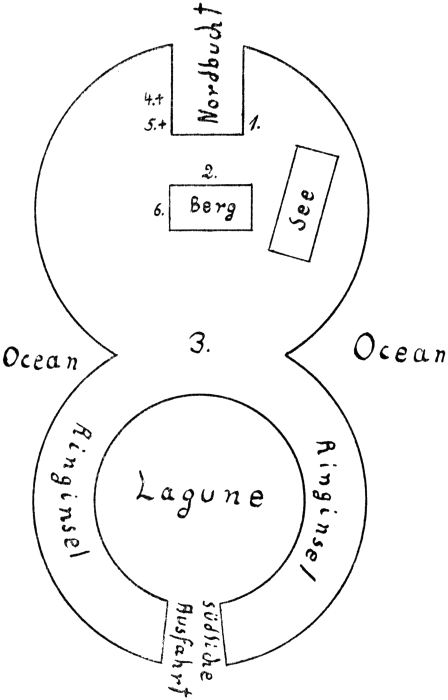

12\. Kapitel.
============
Zwei Gräber.
----------

Das rote Wrack lag in der Bucht nur zum Teil auf dem steinigen Strand. Wir
konnten es bequem in Augenschein nehmen, denn vom Bug hingen noch zwei
Ankerketten herab, und ich half Jane beim Emporklettern.

Mukki war empört, daß er am Strande bleiben mußte. Noch empörter war er über
die Krebse, die zuweilen mit ihren Scheren nach seinen Beinen schnappten und
sich unverschämt festklammerten …

Das Wasser aus dem Wrack war längst ausgeflossen … Einige Eisenplanken hatten
sich gelöst, – es gab unten am Rumpf genug Abflußlöcher.

Das schlüpfrige Deck stellte eine förmliche Muschelbank dar. Auch hier
Seepflanzen, schleimige Riesenquallen, einzelne Fische, – – armes Getier! Wenn
die Äquatorsonne erst niederbrennt, ist euch allen der Tod sicher. So viel wir
von ihnen wieder ins Wasser werfen können, werden wir retten, schon um den
Verwesungsgestank zu vermeiden, der uns den Aufenthalt auf Malmotta sehr
unangenehm machen könnte.

Jane will nicht mit hinein in die Kajüte … Sie fürchtet sich. Ihr gutes Herz
erbarmt sich lieber der Fische und Krebse und Muscheln, die sie am Heck so
bequem in das Wasser der Bucht schleudern kann.

Ich mühe mich mit der verquollenen Tür der Kajüte ab. Ich könnte ja durch das
eine zerbrochene Oberlichtfenster einsteigen, aber mir erscheint es doch nicht
ratsam. Der Stille Ozean birgt auch giftige Geschöpfe, große und kleine Fische
mit Stacheln, die böse Wunden hervorrufen, dazu giftige Seeschlangen,
Riesenwürmer von zwei Meter Länge mit Beißzangen und eine Art Aale, die
elektrisch geladen sind.

Ich nehme einen schmierigen, nassen Bootshaken und breche die Tür endlich auf.
Ein Schwall Wasser schießt mir entgegen, ich springe zurück, – in dem Wasser
tummelt sich wieder allerlei Ozeangetier, und … ein blanker Totenschädel rollt
mir vor die Füße, – ein scheußlicher Anblick, da in den Augenhöhlen und
zwischen den Kiefern krabbelnde Krebse sich eingenistet haben.

Dann trete ich ein … Was hier an Möbeln vorhanden gewesen, ist zum Teil
verfault, durcheinander geworfen, – hinter der Tür Skeletteile, ein sich
windender Riesenwurm, den ich rasch totschlage, – nur an der Wand erkenne ich
noch eine Uhr, das Barometer, Bilderrahmen …

Alles bedeckt mit kleinen Muscheln, Schleim und Schlick.

Bilderrahmen – ohne Bilder …

Nur einer scheint noch ein Bild zu enthalten, ist gefüllt, – vielleicht ein
Ölgemälde, das zwei Jahrzehnte der Fäulnis widerstand.

Ich reibe es mit einem Lappen behutsam ab, und ich erkenne das Brustbild eines
Seemannes mit Mütze und blauer Jacke … Die Farbe ist zum Teil abgeplatzt,
trotzdem sehe ich blondes Haar, große helle Augen …

Es kann Peter Bolk darstellen, als er noch jung war.

Hier ist im übrigen nichts festzustellen, und ich trete wieder auf das Deck
hinaus. Muscheln knirschen, – ich blinzele in das grelle Sonnenlicht …

„Hallo, – – Jane?!“

Keine Antwort … Nur die Brandung rauscht fernab an der Küste der
wiedergeborenen Insel, und am Buchtstrand läßt Mukki sehnsüchtig sein
eigentümliches Bellen vernehmen, das wie ein rasches Kack Kack Kack Kack
klingt.

„Hallo!!“

Ich lausche, blicke umher, und jäh packt mich die Angst … Ich laufe zum Heck, –
es ist mehr ein Gleiten auf den schlüpfrigen Deckplanken, – ich überblicke die
kaum dreißig Meter breite Bucht. Drüben gibt es nur einen schmalen
Strandstreifen, dann steigen die Felsen haushoch an, zum Teil nacktes Gestein,
zum Teil überkrustet von frischen Korallenbauten, zum Teil überwuchert von
Tiefseepflanzen.

Jetzt sehe ich meine Jane. Sie steht vor den Felsen, sie hat eine große
Muschelschale in der Hand und kratzt damit das Gestein sauber.

Rechts neben ihr sehe ich anderes: Ein Steinkreuz, freistehend, offenbar plump
behauen, – weiter rechts ein zweites … –

Janes Kleider triefen. Und waren doch längst trocken geworden in diesem heißen
Äquatorwind. Sie muß hinübergeschwommen sein, angelockt durch irgend etwas, das
in ihrer Erinnerung wieder wach geworden ist – wie das Bild des uralten
Holzwracks, das einem ruhenden Ungetüm gleicht.

„Hallo, Jane …!!“

Sie winkt nur, arbeitet weiter, und ich klettere an den Ketten herab, der
Fennek hüpft um mich herum, als hätte er mich ein ganzes Jahr nicht gesehen,
und wir traben um den äußersten Buchtwinkel herum und langen neben Frauchen an.

Frauchen ruft nur mit sonderbar schriller Stimme:

„Olaf, – hier – – eine eingemeißelte Inschrift …!!“

„Und was führte dich her, Jane?“

„Das Gefühl, daß hier meine Mutter begraben liegt …!“

Ich helfe ihr … Das Gestein gibt seine Kerben allmählich preis, wir entziffern
bereits einzelne lateinische Buchstaben … Kein Künstler war es, der hier dem
Felsen sein Leid um eine Tote eingrub. Die Buchstaben stehen schief, in
unregelmäßigen Abständen, dehnen sich nach rechts weit über das erste
Steinkreuz hinweg, gehören zu diesem Kreuz, das in einer Felsspalte festgekeilt
ist.

Buchstaben werden Worte, aus Worten klingt das Lied der Trauer …

Jane, Johanna, geborene Petersen, ist in die Knie gesunken. Sie weint, und ihr
Schluchzen erschüttert mich …

Der Ozean, der dieses Grab mitverschlang, hat es wieder dem Lichte
zurückgegeben und hat Licht gebracht in die Seele eines jungen Weibes, das
vielleicht den Vater bisher für einen Verworfenen hielt und das nun Klarheit
erhält über die große Liebe, die ihn mit dem braunen Mädchen einer Südseeinsel
verband.

> Hier ruht Giwana, vor Gott
mein Weib, Mutter
meines Kindes
Johanna.
Gest.  8. 3. 1905 auf
Malmotta.
Du warst die Liebe und die Treue.
John Petersen.

– Wie viele, viele Tage mochte wohl John Petersen an dieser Inschrift mit
unzulänglichen Werkzeugen gearbeitet haben!

Ganz tief waren die Buchstaben in das Gestein eingemeißelt, und gerade das
Kunstlose, Verzerrte dieser Buchstaben und Worte war so rührend in seiner
liebevollen Unbeholfenheit.

Jane erhob sich, ich half ihr, nahm sie in die Arme, und ihre Tränen, ihre
letzten Tränen weinte sie an meiner Brust.

„Ich bin …glücklich,“ sagte sie dann leise und machte sich aus meinen Armen
frei. „Verstehst du das, Olaf, daß ich jetzt glücklich sein darf? – Vater hat
sie geliebt, Vater muß ein guter Mensch gewesen sein … Wer weiß, ob nicht Peter
Bolk ihn irgendwie geschädigt hat … Denke an die Diamanten, Olaf … Diese Steine
können doch nur hier von Malmotta stammen … Und Vater und Bolk und Joicker und
Mortison waren Gefährten, lebten hier, liebten hier …“

Ihr Blick war nach innen gerichtet, – sie horchte vielleicht auf die ganz
zarten Stimmen, die aus ihrer Seele Tiefen erklangen als Erbteil ihrer Eltern …

„… Die Diamanten, Olaf, die mich reich gemacht haben, die haben hier wohl
Unheil gestiftet …“ fügte sie sinnend hinzu.

Ich wollte sie ablenken. Mich lockte auch das zweite Grab. Außerdem hatte ich
längst bemerkt, daß wir hier auf einer Steinplatte standen, unter der Giwanas
sterbliche Reste ruhten. Es war besser, daß Jane nicht etwa bat, ich solle
diese Platte lüften.

„Sehen wir, wer dort begraben liegt, Jane.“

Und wir kratzten auch dort das Gestein sauber, – wir fanden ebenfalls eine
Inschrift, und abermals ward so der bunte Gobelin, dem noch das Mittelstück
fehlte, weiter ergänzt.

> __Tubana,__
Tochter des Königs von Atauo,
Schwester Giwanas,
Mutter meines Sohnes
Peter Tuban Erich Bolk,
gest. 11. 9. 1904.
Mein Weib.
Du warst die Sonne von
Malmotta.
Peter Bolk.

Vielleicht kennzeichneten diese beiden Grabinschriften auch die beiden Männer,
von deren Hand sie herrührten, in treffendster Art. Aus John Petersens Nachruf
ließ sich unschwer auf einen etwas weichlichen Charakter schließen, auf eine
leicht zu beeinflussende Natur, auf einen Durchschnittsmenschen.

Anders Peter Bolk. In dieser Knappheit ohne viel Sentimentalität lag Kraft,
Zielbewußtsein, Stolz und eine gewisse Rücksichtslosigkeit.

Doch das alles hatte hier nichts zu bedeuten gegenüber der neuen Feststellung,
daß Aristide d’Oly Peter Bolks Sohn war. Ich entsann mich nur zu gut noch auf
die Fieberträume und Fieberschreie des kranken Aristide in der Kammer der
Astarte, – mir stand Bolk noch deutlich vor Augen, wie er mich damals aus der
Kammer hinausgeschickt hatte, nachdem Aristide das Wort Tubana überlaut
hervorgestoßen hatte. Erst in dem Augenblick war es wohl dem Käpten zur
Gewißheit geworden, daß Aristide sein Sohn sein müsse, – und gleich darauf
hatten sich die Meuterer an Bord geschlichen und Vater und Sohn mit sich
genommen.

Lebten sie noch?

Jane wußte nichts von ihnen, Jane hatte während ihrer Gefangenschaft auf dem
Star of London die beiden nie zu Gesicht bekommen.

Hierüber sprachen wir, als wir nun langsam zurückkehrten zu den Wrackteilen der
Astarte, die jetzt gerade dort auf dem Trockenen lagen, wo der felsige Nordteil
der Insel in den Lagunenteil überging.

Die Heckhälfte des Schoners lag ziemlich wagerecht zwischen bröckeligen
Korallensteinen. Es kostete nicht viel Mühe, gerade am Heck ein Zelt zu
errichten und den Laderaum unten in ein Schlafgemach zu verwandeln.

Jane und ich nahmen dann hier auf Malmotta unsere erste Mahlzeit ein – kalt,
Konserven, – denn wir waren beide bis zum äußersten erschöpft und bedurften des
Schlafes.

Jane zog sich nach unten zurück, ich streckte mich im Zelte aus und schlief
auch sofort ein. – Ich habe nie viel Schlaf gebraucht. Fünf Stunden genügten
mir auch nach diesen Strapazen und Aufregungen. Ich erwachte ganz von selbst,
erhob mich leise und wanderte erst einmal mit Fennek zum Berge, um nach der
Jacht Ausschau zu halten.

Dieser Spaziergang war eine Qual.

Eine unerträgliche Hitze brütete über der Insel, – Muscheln, Fische, Quallen
waren bereits halb verwest und verbreiteten unerträglichen Gestank. Am
schlimmsten war es am Fuße des Berges, wo die vielen Wassertümpel dem armen
Getier zunächst eine trügerische Zuflucht geboten hatten. Sie waren verdunstet,
sie waren zu Pestlöchern geworden. Ich war froh, als mich oben auf dem Berge
der Seewind umspielte. Ich setzte mich hinter einen Palmenstamm, nahm Fennek
auf den Schoß und überdachte unsere Lage. – Der Horizont war leer. Und doch
ahnte ich, daß die Jacht mit den Meuterern diesen Meeresteil niemals
unverrichteter Sache verlassen würde. Die Besatzung des Star of London wußte
nur zu gut, was ihnen im Falle der Aufdeckung ihrer Schandtaten drohte. Die
Engländer machen in solchen Fällen sehr kurzen Prozeß. Meuterei, Mordversuch, –
– der ganzen Bande war der Strang sicher. Fanden sie nun nicht die Insel und
nicht die erhofften Schätze, so waren sie, so lange sie auf der Jacht blieben,
beständig in Gefahr, von irgendeinem Kriegsschiff angehalten und … aufgeknüpft
zu werden. Gaben sie die Jacht preis und zerstreuten sie sich nach allen
Windrichtungen, so zogen sie als arme Teufel, ärmer als vorher, ins Ungewisse
hinein, – und die Gefahr einer Verhaftung blieb doch für jeden einzelnen in
demselben Grade bestehen. Sie würden also ohne Zweifel zunächst hier in dieser
einsamen Meeresgegend bleiben und … suchen, immer wieder suchen … Sie waren ja
hier mit am sichersten.

Jane und ich konnten also unmöglich in dem Wrack der Astarte bleiben. Wir wären
dort keine Minute nachts sicher gewesen. Wir konnten doch unmöglich abwechselnd
hier auf dem Berge wachen. – Es galt also einen Platz zu finden, der uns auch
im Falle eines Angriffs genügend schützte.

Ich stand wieder auf und überschaute nochmals unser Inselreich.

Hier ist es … Ich habe die Skizze ganz schlicht hingeworfen – mir zur
Erinnerung, Jane zur Erinnerung …

 
1\. ist das rote Wrack, 2\. das uralte Wrack, 3\. die Wrackteile der Astarte,
4\. das Grab Tubanas, 5\. das Grab Giwanas, der Mutter Janes, 6\. die von mir
an der Westseite des Berges entdeckte Höhle mit Terrasse und weit überhängendem
Felsdach.

Wenn ich soeben geschrieben habe „von mir entdeckte“, so stimmt das nicht ganz.
Der Ruhm gebührt eigentlich Mukki allein.

Ein Fennek ist ein sehr unruhiger Geist, und mein Fennek leistet auch hierin
Besonderes. Er ließ mich getrost über die Maßnahmen zu unserer Sicherheit
nachgrübeln, – er selbst ging auf Entdeckungsfahrten aus, er hatte so lange auf
einem engen Schiffe gelebt, daß er die acht Tage auf der grünen Insel nur als
ungenügende Zeit, sich Bewegung zu verschaffen, betrachtete. Leider gab es hier
keine Mäuse, die er jagen konnte, – die Krebse waren längst tot, und deshalb
kletterte er an den Steilwänden des Berges umher, kehrte zuweilen zu mir
zurück, verschwand aufs neue, – – bis mich plötzlich sein jämmerliches Heulen
und Kreischen aufschreckte und ich voller Augst ihn zu suchen begann. Nach
mühseligem Klettern gelangte ich an der Westseite des Berges (höher als vierzig
Meter ist er nicht) auf eine vorgebaute, steil abfallende und von einer
Felsnase überdachten Terrasse, deren Hintergrund sich als breite Grotte in den
Berg verlor.

Dorther erklang Mukkis Jammergeheul. Ich rannte blindlings in die Dunkelheit
hinein, ein böser Leichtsinn, denn ich erhielt einen Schlag gegen den
Oberschenkel, der mich sofort hintenüberwarf. Trotzdem hatte ich noch erkannt,
mit welcher Art Gegner ich es hier zu tun hatte …

Es war ein Haifisch, den die neue Schöpfungsgeschichte Malmottas ausgerechnet
in dieser Höhle aufs Trockene gesetzt hatte. Meine Augen gewöhnten sich schnell
an das Zwielicht, die Pistole hatte ich bei mir, und zwei Kugeln erledigten den
Hai sehr rasch, konnten jedoch dem armen Mukki den Rest seines linken Ohres
nicht wiedergeben, denn gerade dieses hatte die bereits recht schlappe
Meeresbestie zwischen den Zähnen, – immerhin, mein Fennek war noch glimpflich
weggekommen, – auch ich, denn ein Schlag eines Haifischschwanzes kann einem
sämtliche Knochen brechen.

Mukkis Ohr aus dem Maule des Hais freizumachen, war unmöglich. Ein rascher
Schnitt mit dem Messer, – der Fennek heulte, blutete, biß um sich, und ich
rannte und kletterte mit ihm schleunigst zum Strande hinab, um die Wunde
gründlich zu spülen und die bei jedem Haifischbiß so gefürchtete Eiterung zu
verhindern.

Nun, der Ohrstumpf eiterte nicht, Mukki hat nur noch ein Ohr, und Jane und ich
hausen jetzt seit gestern in der gründlich gesäuberten Höhle, in die wir alles
hineingeschleppt haben, was wir von der Astarte irgend brauchen konnten:
Bretter, Balken, Nägel, Eisenteile, Kochtöpfe, Konservenproviant – vieles
andere noch.

Und heute früh (es ist der dritte Tag auf Malmotta) habe ich auch Peter Bolks
Safe in dem hinteren Mast gründlich geleert, habe die Goldsäckchen anderswo
verstaut und … ganz unten einen kleinen flachen Zinkkasten gefunden, dessen
Schloß ich einfach aufsprengte. Er hat Gummileisten, der Kasten, und die
Papiere sind tadellos erhalten.

Jane und ich haben sie mittags gelesen …

Wir wissen nun *fast* alles von den Geheimnissen Malmottas …

Mit dem Lesen kamen wir, auf unserer Terrasse im Schatten liegend, freilich
nicht so recht vorwärts, denn Jane hält es für weit wichtiger, daß ich ihr jede
Minute irgendwie beweise, daß ich sie – und nur sie liebe … Fennek ist deshalb
auch hinten in der Höhle festgebunden worden.

Er stört, sagt Jane, – und sie hat recht.

