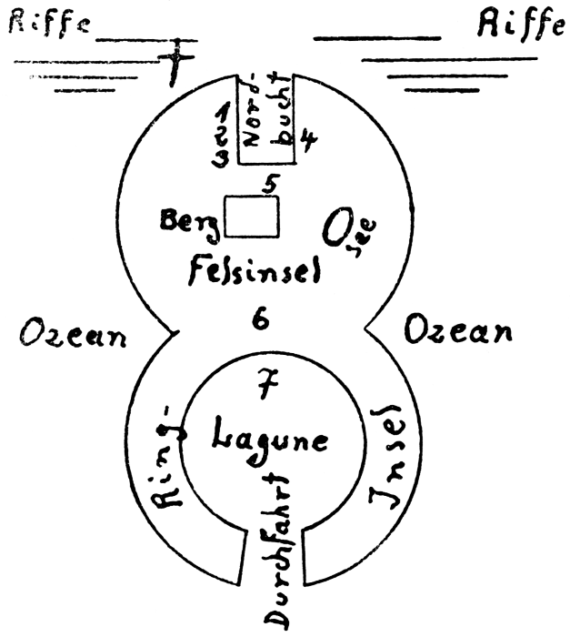

3\. Kapitel.
============
Der eiserne Walfisch.
----------

So ist die Zeichnung:

 

 

Malmotta besteht aus zwei Teilen, die ineinander übergehen. Die Südhälfte ist
eine richtige Laguneninsel, ein Atoll aus Korallen, mit Palmen und Büschen
bedeckt, die Lagune hat sehr verschiedene Tiefe, dort, wo (7) die Jacht ankert,
ist die Lagune zwanzig Meter tief, nach Osten zu wird sie immer flacher. – Die
Nordhälfte ist dunkles, verwittertes Gestein, nicht Korallen, – 1, 2, 3 sind
die drei Gräber, 2 das meiner Jane und meines Fennek, – 4 ist das verrostete
Wrack des Dampfers Malmotta, der Käpten Bolk gehörte, 5 das uralte Wrack aus
den Zeiten der spanischen Raubzüge in Südamerika, 6 die beiden Hälften des
Schoners „Astarte“, den Jane und ich auf Malmotta wiederfanden … – Das † in der
Reihe der mittleren Rifflinie ist der Platz, den ich in jener Nacht fand, ist –
– *der* Deckel. – –

Es sind über alledem wieder Tage dahingegangen, und wieder sitze ich in der
Grotte an der Westseite des Berges und schreibe … schreibe Erinnerungen …

Keine schönen …

Men Huleb hat es sich angewöhnt, links neben der Lampe, auch auf dem Tische, zu
schlafen, – er liegt da wie ein schlafendes Bübchen mit riesigem Pelzkragen,
den Kopf auf dem linken Oberarm, die Hinterbeine an den Leib gezogen, und wenn
ich einmal mit der Zigarre unvorsichtig umgehe, niest er laut und grunzt
ärgerlich und schläft weiter.

Es hat sich sehr vieles auf der Insel verändert.

Links liegt Men Huleb, rechts liegen zwei Pistolen, daneben lehnt die
Winchesterbüchse, und der Eingang zur Grotte ist verrammelt und draußen lauern
die Feinde.

Doch Feinde!

Auf meiner Insel – – Feinde, und ich ein Belagerter! Seit Tagen …

Sie lauern …

Sie schießen zuweilen. Ich auch. Nur mit dem Unterschied, daß ich treffe, und
daß dort draußen einige Hinkende lange an mich denken werden. Ich habe diesem
Menschenfresser Krikatawu nie recht getraut, und das Geschehene bestätigte
meine Vorahnung, daß der braune tätowierte Kerl ein Schuft sei.

Wie’s wohl Peter Larsen ergehen mag?! Wenn dieses schnapsbenebelte Pack ihm
auch nur ein Härchen gekrümmt hat, werde ich ein Meter höher zielen, und dann
wird es Kopflöcher geben.

Warten wir ab. In dieser Nacht, wo es draußen regnet und von Südwest stürmt,
will ich versuchen, ihn zu befreien, ihn und …

Aber eins nach dem andern.

Zunächst John Petersens „Deckel“.

… Damals ruderten wir, ich und Men Huleb, gemütlich aus der Lagune hinaus und
waren nach zwanzig Minuten bei den Außenriffen vor der Nordbucht.

Die Striche in Johns Skizze besagten, daß der „Deckel“ dreißig Meter nördlich
der Nordwestecke der Bucht und zwanzig Meter westlich der Mittellinie der
westlichen Riffe zu suchen sei. – Was die „neun Meter“ sollten, verstand ich
zunächst nicht.

Jedenfalls war das „Riff“ ein ungewöhnlich umfangreicher Korallenfelsen,
mindestens zehn Meter hoch bei Ebbe, doppelt so lang und breit, eine winzige
Insel fast, sogar mit ein paar Büschen und einem Palmenstumpf.

Ich befestigte das Boot an der Südseite, – die Brandung tobte vor mir an der
Außenreihe, – hier war stilles Wasser, und da ein Korallenriff unglaublich viel
Zacken besitzt, erklomm ich unschwer den Kalkfelsen. Men Huleb war längst oben.

Die Oberseite zeigte tiefe Spalten, nur nach Norden zu gab es eine flache,
wagerechte Fläche, und dort hatten sich die Büsche eingenistet.

Was sollten die „neun Meter“?! – Neun?! Ich besah mir das Riff genauer und
vergegenwärtigte mir die Striche …

Ich begriff!! – Neun Meter vom südlichsten Punkte, – ja, es stimmte schon, –
ich befühlte den Boden, … er … wackelte.

Das war … der Deckel, – ein genau eingepaßtes Stück Korallenkalk, eine Falltür,
die ich dann leicht emporhob.

Ich leuchtete in das Loch hinein …

Eine eiserne Leiter stand da in einem Schacht, der sich nach unten zu
verbreiterte.

Die Leiter hatte eine dicke Rostschicht, – kein Wunder, Malmotta hatte ja
zwanzig Jahre in den Tiefen des Ozeans geschlummert, bis ein Erdbeben sie
wieder emporsteigen ließ – kein Erdbeben, ein Seebeben, eine Veränderung der
Bodengestaltung des Ozeans – nichts Außergewöhnliches, wenn man davon absieht,
daß Malmotta zwanzig Jahre als Dornröschen unter dem Pazifik schlummert und
dann wieder emporsteigt, – um nach einigen Jahren abermals zu versinken.

Ich prüfte die Leiter … Sie hielt. Ich stieg hinab … Men Huleb grunzte warnend.

„Feigling!“

Er kam bedächtig hinterdrein, sehr bedächtig.

Als die Leiter zu Ende, stand ich auf einem Kalkboden, und vor mir liefen grob
ausgehauene Stufen in die Finsternis hinab.

Seltsam! – Eine Höhle?! Sie mußte doch voller Wasser sein!

Sie war trocken.

Vorsichtig stieg ich weiter abwärts. Ich traute dem Frieden nicht recht …
Malmotta und auch diese Riffe hatten zwei Jahrzehnte im Verborgenen
geschlummert. Die Wogen waren über die Stelle hingerollt, wo die Insel unter
der Meeresoberfläche ausruhte von ihrem kurzen Gastspiel an der Sonne. Alles
auf Malmotta hatte den Druck ungeheurer Wassermengen gespürt, – Palmen, Büsche,
Sträucher, Gräser wurden dort unten von Tiefseefischen angestaunt, – als Jane
und ich und Fennek die Insel emporsteigen sahen, als wir als erste wieder ihren
nassen Boden betraten, krabbelte das Getier der Tiefe verzweifelt über Steine
und Geröll … und starb im grellen Sonnenglanz des heißen Tages.

Alles war überflutet gewesen, also auch diese Höhle hier, in die von
Menschenhand die rohe Treppe eingemeißelt worden war – – wann, wann?!

Und wo waren die Wasser geblieben, die die Höhle bis an den Deckel gefüllt
haben mußten, der doch niemals wasserdicht schloß?!

Abgelaufen die Wasser?!

Wohin?! Wie?! – Zur Zeit der Flut ragte dieses Riff kaum vier Meter empor, und
die Eisenleiter allein war sechs Meter lang, – ich stand hier bereits unter der
Flutgrenze!!

Das war eine Frage, die mich, den früheren Ingenieur, besonders interessierte.

Verdunstet etwa?! Konnten derartige Wassermassen in kaum vier Wochen sich
vollkommen verflüchtigen?! – Es war eine rein physikalische Frage, und es mußte
eine Lösung dafür geben …!

Ich stieg Stufe um Stufe abwärts.

Die rauhen Kalkwände trocken – keine Spur von Wasser, – aber an den Wänden
überall die unverkennbaren Anzeichen einer jahrelangen Überschwemmung durch die
Salzwasser des Ozeans: Winzige Muscheln, Tiefseepflänzchen, getrockneter
Schlick, – auf den Stufen winzige verschrumpelte Fischlein …

Doch Wasser, – aber – – verschwunden! Wohin?!

Wasser fließt nicht ab aus einem Höhlenbehälter, der selbst im Wasser ruht!

– Ich schaltete diese bedeutsame Frage zunächst aus und wollte sehen, prüfen.

Men Huleb war zurückgeblieben … Ich wandte mich um, der Laternenschein traf
sein Hundsgesicht, – er grunzte entschieden mißbilligend. Man sollte sich auf
den Instinkt der Tiere verlassen. Hier war nicht alles so, wie es sein sollte.
Hier lauerte irgendeine Gefahr. Trotzdem mußte ich dieses seltsame Geheimnis,
das John Petersen niemandem anvertraut hatte, ergründen.

Ich fühlte eins: Je tiefer ich stieg, desto heißer schlug mir eine stickige
Luft entgegen, die ganz wenig nach Schwefel roch. Ich betastete die Wände: Sie
waren warm, wärmer als meine Hand.

Dreißig Stufen, – dann bog die Höhle nach links, nach Westen ab. Es war eine
natürliche Grotte, zweifellos, – die Korallentierchen hatten hier in ihrer
emsigen Arbeit aus unbekannten Gründen ein fast senkrechtes Loch von drei, vier
Meter Durchmesser frei gelassen.

Vierzig Stufen … Ich zählte. Das waren etwa achtzehn Meter unter dem tiefsten
Wasserstand bei Ebbe! Achtzehn Meter!!

Die Wände noch wärmer, fast heiß, und die Luft verdorben, gesättigt mit
warnenden Dünsten der unterirdischen nie erlöschenden ewigen Feuer.

Mir rann der Schweiß über den ganzen Leib, und ich schwitze so leicht nicht,
ich bin an die Äquatorsonne gewöhnt, und Malmotta liegt ganz nahe am Äquator,
nördlich der einsamen Baker-Insel, vielleicht auf dem vierten Grad nördlicher
Breite …

Ich zaudere.

Wenn ich hier ohnmächtig werde, wird niemand mich finden – – niemand!

Gedankenvoll beleuchte ich die Stufen, die finstere Tiefe, – es geht noch immer
weiter abwärts. – Umkehren?! Ich?! Hat denn das Leben noch Wert für mich?!

…. Ein flüchtiger Gedanke an Jane …

Und ein Lächeln verzerrt den Mund …

Weiter … weiter also!

Plötzlich stockt der erhobene Fuß … Ich bücke mich …

Meine Fingerspitzen sammeln braune Krümchen.

Tabak … Pfeifentabak, Grobschnitt.

Merkwürdig – – Tabak?! Hier?!

Ich führe die Krümchen an die Nase … Und ich rieche den Tabak, er ist frisch,
er hat nicht etwa das Versinken Malmottas vor zwanzig Jahren mitgemacht, er ist
frisch, ein Mensch hat ihn hier verloren, der vor kurzem hier seine Pfeife
stopfte.

Wer?!

Ist doch einer der Meuterer lebend entkommen und hat sich hier verborgen
gehalten?!

Ich bücke mich nochmals, um nach Fußspuren zu suchen. Gerade hier sind die
Stufen mit einer Schlickkruste bedeckt. Und daß ich mich bückte, rettete mir
das Leben …

Unter mir ein Schuß – noch einer – noch einer… Ich sehe das Aufblitzen des
Mündungsfeuers, ich werfe mich nieder, kauere mich hinter einen Vorsprung der
Wand …

Da fliegt von oben ein Schatten an mir vorüber, – wie ein kleiner Teufel saust
der kreischende Men Huleb auf den unsichtbaren Feind zu …

Noch ein Schuß …

Ein Schrei aus menschlicher Kehle, – – ein dumpfer Krach, … und ich stürme
hinab, finde Men Huleb halb besinnungslos auf dem hier flachen Boden mit
blutender Stirn … Meine Laterne zeigt mir drüben eine aufwärtsführende Treppe,
– doch ich halte mich hier nicht auf, ich nehme den Pavian in die Arme, eile
denselben Weg zurück, denn hier … ist die Hölle … Die Wände glühen fast, aus
Ritzen steigen feine Qualmfäden hoch.

Nur fort von hier in andere Luft! Nach oben – auf das Riff … Hier erstickt man
…

Die physikalische Frage ist jedenfalls gelöst, das Wasser *ist* verdunstet!!

So lange ich am Fuße der Leiter an …

Freund Huleb hat sich bereits wieder erholt, strampelt in meinem Arm, ich setze
ihn nieder, er klettert hurtig die Sprossen voran, grunzt wütend vor Schmerzen
…

Wir sind im Freien – oben auf dem Riff, atmen tief, japsen, und meine Augen
wandern dankbar zu den Sternen empor … wandern gen Norden, wo zwischen der
dreifachen Riffreihe die breite Öffnung den Wogen des Ozeans und einer starken
Strömung Zutritt gewährt.

Diese Augen weiten sich …

Ich erstarre vor Schreck – vor dem Unheimlichen, das da wie ein Riesenwal sich
näherschiebt, nähertaumelt, keine vier Meter entfernt ist.

Ein gekentertes Wrack … Der Bug über dem Wasser, das Heck ganz tief liegend …
Und der Bug schrammt schon über die Korallenklippe hin.

Ich reiße Men Huleb in den Schacht hinab – wir stehen auf der Leiter, – – wenn
wir nicht zerquetscht werden wollten, war dies die einzige Rettung.

Knisternd, krachend schiebt sich das Wrack über das Riff, – immer weiter, –
Stücke des Felsens brechen ab, – dann liegt das gekenterte Schiff festgekeilt
über mir, – und meine Laterne beleuchtet gerade eine offene Ladeluke …

Über den Lukenrand hinaus ragt ein Kopf mit zottigem Haar, ein braunes Gesicht
grinst mich an und verschwindet …

Ein zweites Gesicht erscheint, ein blasses Frauenantlitz …

„Wer sind Sie, mein Herr?“

„Ein … Robinson … Und Sie?“

„Helga Larsen, Frau des Kapitän Larsen, und …“

„Das Schiff?!“ schreie ich heiser.

„Ist der Dampfer Hardanger …“

– Ich schließe die Augen …

Ich fühle wieder einmal die Faust des Schicksals …: Das gekenterte Wrack hat
den Weg zurückgefunden zu seinem Herrn und Besitzer!

In solchen Momenten, wo man das unfaßbare, unbegreifliche Walten der Vorsehung
spürt, ist man vor sich selbst wie ein winziges, nichtiges Tröpflein des großen
Ozeans – ein Nichts!

„Ihr Mann lebt!“ rufe ich empor. „Er ist hier, auf Malmotta!“

Eine Hand erscheint, – eine braune Kralle, – die Faust eines Mannes fährt der
Frau ins Genick, zieht sie weg, und eine andere Hand hält ein dunkles Etwas …

Ein Blitz zuckt auf … Eine Kugel klatscht in das Korallengestein, und Men Huleb
und ich eilen die Leiter hinab, verfolgt von Schüssen … –

Von dem Augenblick an bin ich ein Belagerter.

Braune Teufel hausen auf Malmotta …

Aber ich will der Reihe nach das Weitere schildern.

