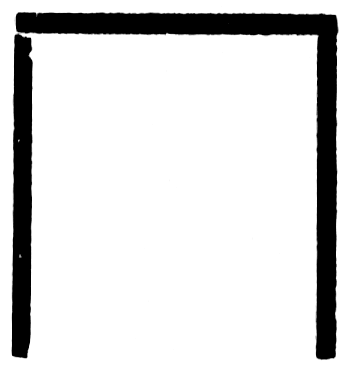

10\. Kapitel.
=============
Die Baumgrotte.
---------------

Die quadratische gemauerte Öffnung lag frei. Die Sonnenstrahlen fielen in den
Schacht und auf die schräge Rutschbahn, die nur an den Seiten Einkerbungen für
die Hände hatte.

Hondu schnüffelte …

Ich drängte ihn vorwärts … Er glitt ein Stück in die Tiefe, bremste kratzend
mit den Krallen und legte die Ohren nach hinten.

Steckten dort unten Leute im Gang, mußte er sie wittern.

Nichts an seinem Benehmen deutete auf Gefahr hin. Er schnüffelte, bog den Kopf
zurück und schaute mich an.

Zecke flüsterte: „Alles sicher, Mr. Abelsen … Ich kenne Pumas sehr gut …“

Ich drängte Hondu noch tiefer hinab. Die Leine, die ich ihm durch den Ring des
breiten Halsbandes geschlungen hatte, straffte sich.

Ich rutschte mit hinab.

„Zecke, schließe den Deckel!“, rief ich nach oben.

Die Schiffslaterne hatte ich mit einem Stück Leder umhüllt.

Wir, Hondu und ich, standen im Dunkeln.

Über uns fiel die Steinplatte zu, – und auch der letzte Rest Tageslicht
verschwand.

Ich kannte den Stollen nur etwa fünfzig Meter weit nach Norden.

Dort hatte Taskamore die Anakonda zerstückelt, von der man oft behauptet, sie
lebe im Wasser. Das trifft ebenso wenig zu, wie das alte Märchen, die
Ringelnatter, übrigens ein sehr harmloses und leicht zu zähmendes Geschöpf,
hause in Wassergrotten. Beide Schlangenarten sind vorzügliche Schwimmer, ihre
Wohnungen wählen sie am liebsten an trockenen Orten, in Steinen, Felsen,
Baumlöchern.

Der uralte Stollen hier war gut drei Meter breit und sehr sorgfältig
hergestellt. Eine dicke Schicht von bräunlichem Staub, der etwas feucht zu sein
schien, bedeckte den Boden. In dieser Staublage sah ich, als ich die
Lederblende etwas lüftete, zahlreiche Spuren von Menschen und Tieren. Sir
Reginald Sheridan, der nun tot sein sollte, hatte diesen Weg wahrscheinlich
häufig benutzt, ebenso seine Pumas.

Ich blendete die Laterne wieder ab, nachdem wir die eklen Kadaverreste der
Anakonda hinter uns hatten. Der Schwanzteil hatte sich noch immer lebhaft
bewegt, und Hondu war davor bis an die Wand zurückgewichen.

Ich blieb stehen und horchte.

Ein muffiger, dumpfer Geruch hing in der Luft: Nasse Erde!

Und hier und dort tropfte es auch klingend von der leicht gewölbten Decke.

Ich nahm Hondu beim Halsband. Die Staubschicht machte jeden Schritt unhörbar.
Hondu war mein bester Warner. Solange er ruhig blieb, hatte ich nichts zu
fürchten.

Er blieb ruhig.

Ich zählte die Schritte.

Dreihundert … Ich tastete mich immer an der linken Wand hin, den linken Arm
vorgestreckt. Meine Finger glitten über die sauber behauenen Felsblöcke und
ganz genau fühlte ich jede mit Mörtel ausgefüllte Rille zwischen den einzelnen
Quadern. Die alten Mayas mußten sehr tüchtige und fleißige Steinmetzen gewesen
sein. Freilich lehren uns Inschriften, daß hauptsächlich Sklaven all diese
Arbeiten verrichteten und nachher zum Lohn … geschlachtet wurden. Die
Maya-Priester hatten es also sehr leicht, ein Geheimnis sorgfältig zu hüten,
etwa eine Schatzkammer …

Trotz meiner keineswegs angenehmen Lage mußte ich lächeln: Schatzkammer …!! –
Cortez und Konsorten hatten hier in Mittelamerika und in dem Inka-Reiche
gründlich aufgeräumt. Ihre Methoden, Geständnisse zu erpressen, hatten sie von
Europa mitgebracht, wo die Inquisitionsrichter ungehemmt ihre grauenvolle
Phantasie hatten spielen lassen: Tortur, geschmolzenes Blei, kochendes Wasser
…, – besser, man dachte nicht daran! Und dieselben Herrschaften schickten dann
in die „friedlich“ eroberten Länder ihre Sendboten zum Preise des Christentums!
– Eine tolle Welt!!

Meine Finger fanden etwa beim vierhundertachtzigsten Schritt eine sehr breite
Mörtelstelle. Ich machte halt. Dieses Mörtelstück war lose, gab nach …

Ich horchte.

Hondu zeigte keinerlei warnendes Benehmen. Ich schob die Lederblende etwas
beiseite und musterte die Mauer.

Die Fugen zwischen fünf Steinen waren sehr breit, fast zehn Zentimeter, und
bildeten eine geschlossene Linie, so:

– eine Linie, die unten bis zum Boden reichte.

Der Mörtel fehlte stellenweise, ich sah, daß hier eine Spitzhacke gearbeitet
hatte, im Staube unten lagen Mörtelstücke und – – und wieder solch eine
Astgabel.

Seltsam … Ist es wirklich so, daß man im Dunkeln seine Gedanken besser zu
sammeln vermag und daß Sonnenlicht „zerstreuend“ wirkt?!

Als Taskamore mir die Astgabel gezeigt hatte, war es im hellen Sonnenglast
geschehen. Sie hatte keine einzige Zelle meines Gehirns irgendwie in jene
Schwingungen versetzt, die als „Reiz“ die Erinnerungen auslösen. Und
Erinnerungen sind Wissen, gesammelte Erfahrungen und Eindrücke verschiedener
Art.

Ich war geistig blind gewesen gegenüber jener ersten Gabel. Ich war geistig
blind geblieben auch dann, als Margot-Maya so rasch das Gespräch ablenkte und
bat, ich solle das „Ding“ ins Gestrüpp werfen.

„Das Ding“ war eine Astgabel für Rutengänger.

Nun wußte ich es.

Was ein Rutengänger ist, was sie leisten, daß hier keine Selbsttäuschung oder
kein Betrug vorliegt, wenn die Gabel in den Händen einer so hochsensiblen
Person über einer Wasserader oder einem Kohlenflöz oder Metallmassen
„ausschlägt“, war mir längst bekannt.

So wunderbar und fast übernatürlich die Fähigkeiten eines Rutengängers
erscheinen: Die exakte Wissenschaft hat sie anerkannt, unzählige Erfolge haben
selbst die ärgsten Zweifler zu Gläubigen gemacht, und ich persönlich war Zeuge
gewesen, wie eine Engländerin in den wasserlosen Landstrecken der Kalahari auf
Regierungskosten die Stellen fand, wo das Bohren nach Wasseradern Erfolg
versprach.

Kein Zweifel, daß auch Sir Reginald Sheridan mit zu den überempfindlichen,
feinnervigen Naturen gehörte, die die Wunderrute erfolgreich führen konnten,
nur daß er nach Edelmetall, nach dem Goldschatz geforscht hatte, und sicherlich
auch hier an dieser Stelle in dem uralten, feuchten, modrigen Gange.

So war denn der „Schatz“ aufs Neue in meine Gedankenreihe mit eingeschaltet
worden und ließ sich schwer daraus verdrängen.

Nach abermals hundert Schritt, die ich in beschleunigterem Tempo zurücklegte,
war es Hondu, der mich zu einem neuen Aufenthalt zwang.

Hondu blieb stehen und drängte hinüber zur rechten Wand. Das geschah so
plötzlich, daß ich zur Seite gerissen wurde. Im Dunkeln hörte ich, wie der Puma
die Luft leise pfeifend einsog und wieder ausstieß. Ich getraute mich nicht
recht, die Blende der Laterne wegzuziehen, da ich mit der Nähe der Gegner
rechnete. Aber als ich Hondus Kopf befühlte, stellte ich fest, daß er die Nase
dicht an die Mauer gedrückt hatte und daß gerade dort ein fingerlanges Stück
Mörtel fehlte.

Jetzt beleuchtete ich doch die Wand. Sie hatte nichts irgendwie Auffälliges, es
sei denn, daß einige der Steinquadern mir wie mit einem unmerklichen Fetthauch
überzogen erschienen. Das war aber auch alles, was mir ins Auge sprang. Der
Mörtel saß in den Rillen vollkommen fest, bis auf das fingerlange Loch. Dort
fehlte er. Als ich mit dem Messer in den Spalt fuhr, stieß ich wieder auf
Mörtel. Trotzdem schnupperte Hondu hartnäckig weiter, und eine gewisse Erregung
an ihm war unverkennbar.

Ethel Sheridans Geschick trat für Minuten zurück und mußte einer Neugier
weichen, die berechtigt war. Der Gedanke, daß der Stollen geheime Abzweigungen
besäße, war längst in mir aufgestiegen. Eine solche Abzweigung hätte mein
Vorhaben insofern erleichtert, als ich dadurch der Gefahr entging, mit den
„Heimatlosen“ zusammenzustoßen, die vielleicht bereits im Stollen behutsam und
lautlos wie ich vordrangen.

Notwendig hatte ich mich während meiner Studien auch mit uralten Bauten
erloschener Kulturvölker beschäftigt. Überall, sei es im alten Rom, in Athen,
in Memphis, Indien oder Mexiko waren die Priester größtenteils Betrüger
gewesen, die durch allerlei „Zauberei“ das Volk in Bann hielten, überall hatten
sie technische kleine Wunder nur zu diesem Zweck ersonnen. Die „Orakel“ jener
Zeit waren nichts als Ausnützung der Eigentümlichkeiten der Fortpflanzung des
Schalles gewesen. Tempelruinen in Mexiko enthielten in den Kellergeschossen
Geheimtüren von wunderbarster Art. Sollte hier nicht auch solch’ eine Geheimtür
zu finden sein?!

Ich leuchtete die Wand nochmals ab.

Zweifellos hatten die Steine hier einen ganz unmerklichen fettigen Glanz, als
ob nackte Leiber unendlich oft die Quadern gestreift hätten.

Gerade hier!

Und dieser Glanz zog sich bis zur gewölbten Decke hin. – Das war am
auffälligsten.

Ich überlegte.

Gab es hier eine Tür, so war sie oben in den Steinen der Decke, dicht an der
Wand.

Hiermit erhielt auch das fehlende Mörtelstück seine Bewertung. Bei genauestem
Hinsehen stellte ich fest, daß um dieses horizontale Loch herum die Steine noch
blanker waren. Das Mörtelloch genügte gerade, nackten Zehen Halt zu bieten.

Ich hielt die Laterne schräg und berechnete, daß ein gewandter Mann das Loch
mit hochgestrecktem Bein gerade noch erreichen konnte.

Aber oben am Gewölbe war nichts irgendwie auffällig. Vielleicht nur das eine,
daß der Mörtel zweier Steinplatten droben sehr dick aus den Steinen
hervorgequollen war und an zwei Stellen tropfenartige Wülste bildete.

Ich lächelte unwillkürlich …

Meine verehrten Mayabaukünstler, ihr seid ja gewiß sehr schlau vorgegangen,
aber hier steht nun nach rund siebenhundert Jahren ein moderner Techniker, der
sich kein X für ein U machen läßt!

Ich nahm Anlauf, meine Stiefelspitze fand in dem Mörtelloch Halt, ich packte
eine der Zacken, und – – mehr brauchte ich nicht zu tun, ich hatte die richtige
erwischt, über mir hoben sich vier der Quadern, die jedoch recht dünn waren,
und ohne jede Anstrengung schwebte ich aufwärts in einen anderen Stollen
hinein, der an dieser Stelle beträchtlich breit war. Daß Hondu bei dieser
Luftfahrt halb erwürgt wurde, hatte nichts zu bedeuten. Er erholte sich sehr
schnell, und als ich nun den Mechanismus dieser Tür ableuchtete, sah ich eine
fast primitive Hebelvorrichtung. Als Gegengewicht war ein auf einem Balken
befestigter Steinblock benutzt worden, die Tür ließ sich sehr leicht wieder
zudrücken, und der Steinzapfen, der den Auslöser spielte, war das Mörtelstück,
– – verblüffend genial, wenn auch primitiv!

Was hatte ich nun gewonnen?! Es ging doch um Ethels Befreiung, und falls dieser
obere Stollen nur ein Versteck, eine Sackgasse, darstellte, konnte ich eiligst
wieder hinabturnen.

Hondu hatte mir die Schwebefahrt etwas verübelt und saß mit bockbeiniger Miene
da und leckte sich die Oberlippe. Ein Puma hat keinen Schnurrbart wie andere
Katzenarten ihn besitzen, das Gesicht wirkt dadurch friedlicher, zur Zeit war
Hondu jedoch keineswegs in Stimmung, keuchte noch schwer und hatte weder für
die Balken des Mechanismus noch für sonst etwas Interesse. Ich verzichtete
darauf, ihn zu streicheln, – diesmal hätte er sicherlich zugeschnappt.

Auch hier auf dem Boden Fußspuren … Der Staub zeigte sie mir ganz deutlich. Es
waren die Stiefelabdrücke von vielleicht fünf Männern.

Diese Feststellung dämpfte meinen Eifer.

Nur eins wieder gab mir die Gewähr, daß diese Leute nicht zu den „Heimatlosen“
zählen könnten: Die Fährten entfernten sich den Gang hinab, ohne
zurückzukehren.

War Sir Reginald mit seinen Dienern hier gewesen?! Hatte er vor mir die Tür
entdeckt?!

Das ganze Abenteuer oder Teilabenteuer fiel so völlig aus dem Rahmen meiner
sonstigen Betätigung heraus, daß ich am liebsten schleunigst die Klapptür
wieder geöffnet hätte und hinabgesprungen wäre. In der freien Natur, in
pechfinsterer Gewitternacht in Urwald oder Steppe hätte ich nie, selbst unter
den bedrohlichsten Umständen, dieses scheußliche Gefühl der Beklemmung gehabt
wie hier. Es war eine lautlose Warnung, die das feste Gemäuer ausstrahlte.

Und die Reaktion kam sofort: Nun erst recht!! Nur nicht auf derartige Stimmen
hören, die da mißgünstig eine große Chance verderben wollen!

So dachte ich damals …

Mir selbst unverständlich, denn diesen „stillen Mahner“ in unserer Brust habe
ich nie mißachtet.

„Hondu – vorwärts …!!“

Freund Puma gehorchte … Der Stollen zog sich meiner Berechnung nach etwa in
östlicher Richtung weiter, während der untere Gang immer nördliche Richtung
eingehalten hatte.

Hondu wurde lebhafter, schon nach fünfzig Schritten drängte er sogar sehr
ungestüm vorwärts und schnüffelte und spielte dauernd mit den Ohren.

Hundert Schritt …

Jetzt spürte ich einen ganz bestimmten Geruch: Verwesung!

Also das war es! Das hatte Hondu bereits in dem unteren Stollen gewittert!

Ich machte mich auf allerhand Überraschungen gefaßt. Mit der entsicherten
Büchse im Arm, die Laterne vor der Brust, den Puma an der Leine mit der Linken
haltend, trabte ich lautlos dahin. Der grau-braune Staub wirbelte unter meinen
Füßen dicht empor, die Steinwände waren hier noch feuchter, die Wassertropfen
des Sickerwassers hatten sogar stellenweise trübe Pfützen erzeugt.

Plötzlich eine scharfe Biegung nach links, fast rechtwinklig. Der Gestank war
jetzt so aufdringlich, daß ich Lust hatte, mir erst einmal eine Zigarre
anzuzünden. Aber die Neugier duldete keinen Zeitverlust, erst recht nicht meine
ernste Aufgabe, die Ethel betraf.

Eine runde Halle tat sich vor mir auf. Schätzungsweise hatte ich bisher hier
vierhundert Meter im Eiltempo zurückgelegt.

Ich blieb stehen.

Was ich sah, war grauenvoll.

Noch grauenvoller, weil das grelle, kalte, weiße Licht der großen Karbidlaterne
so harte Schatten schuf.

Die Felsenhalle war eine natürliche Grotte … An der zackigen Decke gewahrte ich
schmale helle Streifen: Sonnenlicht, das von oben durch Löcher hineinfiel.
Mitten in dieser niederen Höhle war eine Vertiefung, in der welkes Laub, Äste,
Zweige, bleiches Moos, fahle Pflänzchen etwa eine verwahrloste Fontäne
darstellten. Der Wasserspeier des Fontänenbassins war ein ungeheurer Baum, ein
Pandanus, – besser, sein Wurzelstock. An dem grün-gelben Bast des knorrigen
Holzes rieselten dünne, plätschernde Rinnsale abwärts und verschwanden zwischen
dem Wurzelgewirr.

Ich erkannte, daß es sich um einen Pandanus handelte, der droben über der
Grottendecke im Sonnenschein sein buntes Blätterdach gen Himmel reckte, – eine
gewiß seltene Naturerscheinung, falls sie wirklich „natürlich“ war. Später sah
ich, daß die Grotte ursprünglich in der Mitte offen gewesen und daß die alten
Mayas Felsplatten benutzt hatten, um die Öffnung zu schließen. Der Baum mußte
zu jener Zeit sehr jung gewesen sein. Als er heranwuchs, schaffte er sich Luft
und drängte die Platten beiseite, dadurch waren die Luftlöcher entstanden.

Nicht der mindestens vier Meter dicke Waldriese mit seinem steinernen
„Blumentopf“ und den vielen Rinnsalen fesselte meinen Blick.

Neben dem Rande der Vertiefung lagen fünf verweste Tote …!

Es genügt: Verwest!

Viel war von ihnen nicht mehr übrig. –

Tote haben mich nie geschreckt …

Das Grauenvolle an diesen menschlichen Überresten war die Natternbrut, die da
vor dem Lichtschein aus hellen Rippen und halbleeren Bauchhöhlen eilends in das
Wurzeldickicht flüchtete, durchweg kleinere Giftschlangen …

Wovon sie sich nährten, sei nur angedeutet: Ganze Madenballen sah ich!!

Ich drehte mich rasch um, rieb das Feuerzeug an und tat drei lange Züge aus der
Zigarre. Ich hatte einen verdammt faden Geschmack im Munde!

Es kostete mich einige Überwindung, nochmals hinzuschauen. Und doch mußte ich
es. Daß die Toten dort Sir Reginalds Diener waren, erschien mir gewiß.

Wie waren sie hier umgekommen?

Von Giftschlangen gebissen?!

Dann hätten sie nicht alle fünf so dicht beieinander am Rande der Vertiefung
gelegen. Kein Schlangenbiß wirkt sofort. Außerdem wußte ich von Margot, daß ihr
Gatte und die Diener stets Gegengift bei sich getragen hatten. Am besten und
einfachsten ist da ein Schnitt durch die Bißstelle, aussaugen und Einstreuen
von ganz fein pulverisiertem übermangansaurem Kali, das bekanntlich, in Wasser
gelöst, violett färbt und auch zum Gurgeln benutzt wird.

Wie starben die fünf?

Ethel war vergessen …

*Das* Abenteuer hatte mich nun doch ganz in seinen Krallen!

Ich überlegte …

Erzählte man nicht von den Inka-Priestern, sie hätten ihre Schatzgewölbe durch
teuflische Einrichtungen geschützt, die jeden Uneingeweihten vernichteten?

Erzählte?! – Nein, es war so … es ist so … Forscher, die die alten,
überwucherten Inkastädte besuchten, verschwanden spurlos. Ich könnte hier Namen
anführen, – es genügt das eine: Die Gattin des amerikanischen Gelehrten
Professor Holdyn rüstete 1912 eine Expedition aus, die ihren Mann und seine
drei Begleiter suchen sollte. Von der Expedition kehrten nur Weiße zurück, und
beide … wahnsinnig. Was sie gesehen und erlebt, konnten sie nicht mehr
schildern. Aus ihren wirren Reden entnahm man, daß alle übrigen durch Gift
umgekommen seien. Wie, wo, – noch heute weiß es niemand. Die unendlichen
Urwälder im Norden Südamerikas hüten ihre Geheimnisse trotz Flugzeug, Auto und
tragbaren Sendern.

Ich ahnte, daß ich hier an einem Platz mich befände, der verborgene Gefahren
barg.

Unbekannte Gefahr, die irgendwie mit blitzartigem Tode lauert, kann auch die
besten Nerven rebellieren lassen.

Und – merkwürdig: Hondus feinerer Instinkt warnte auch ihn! Er hatte sich dicht
an mich gedrückt und stand regungslos.

Wo lauerte die Gefahr?

Umkehren?

Es wäre am klügsten, sagte ich mir.

Nochmals betrachtete ich die Leichenreste …

Neben ihnen lagen zwei Aluminiumbecher, der eine war platt zusammengedrückt.

Und die Schädel?

Das waren nicht Schädel, das waren nur zertrümmerte Knochen.

Ich schaute mir die Decke an, die Felsplatten. Da erkannte ich, daß sie wie
Schieferplatten übereinander angeordnet waren, ein sehr kunstvolles Dach, das
trotzdem den Eindruck einer natürlichen Höhlendecke machte. Nur am Stamm des
Pandanus hatten sich die Steinplatten gehoben und verschoben.

Sollte es hier eine Vorrichtung geben, die etwa eine der Platten herabschwingen
ließ, falls jemand eine bestimmte Stelle am Rande der Vertiefung betrat? –
Nein, – dazu hätte ein sehr komplizierter Mechanismus gehört, der außerdem
niemals die Jahrhunderte überdauert haben würde.

Ich nahm die Büchse, schob die Sicherung vor, ergriff sie am Lauf und betastete
jede Stelle des Bodens, bevor ich mich Schritt für Schritt weiterwagte.

Der Staub lag handhoch, und in dem Staub zogen sich überall Rinnen entlang –
wie willkürliche Muster. Es waren die Spuren des giftigen Ungeziefers, das dort
in dem Loche hauste.

Je näher ich den fünf eklen Leichenresten kam, desto vorsichtiger wurde ich.

Hondu zerrte rückwärts.

Auch das war ein schlechtes Zeichen.

Ich fühlte, daß mir der Schweiß ans allen Poren drang. Der Gestank war kaum zu
ertragen. Sekundenlang überwog das unerklärliche Furchtgefühl: „Kehre um!!“

Nein – gerade nicht!!

Wenn ich hinterher Taskamore erzählen würde, wie ich hier ängstlich vor dem
unbekannten Grauen zurückgewichen war, hätte er sicherlich jenes unnachahmliche
Gesicht aufgesetzt, das ich schon von Coy her nicht sehr schätzte …!

Ich tastete mich weiter vor.

Der Büchsenkolben schob die Staubschicht zusammen, und dann … sprang ich jäh
zurück, wollte die Büchse mitreißen …

Sie entfiel mir und … stand schräg wie angeschraubt.

Ich hatte nur ein schnappendes Geräusch gehört – so, als ob sich Klammern in
den Büchsenkolben einbohrten.

Vorsichtiger noch bückte ich mich …

Was ich da in einer der zahlreichen Mulden des Steinbodens gewahrte, wo die
Büchse wie angenagelt schräg emporstand, verblüffte mich.

Es war ein modernes, stark verrostetes Tellereisen für kleines Raubzeug, eine
Schlagfalle mit sehr starken Zinken. Die Feder mußte gut eingefettet gewesen
sein, sonst hätte sie niemals all die Jahre ihre Zugkraft bewahren können.

Und hier in dieser unheimlichen Höhle kam mir nun ein Gedanke, der unweigerlich
vieles erklärte. Ich besann mich auf Lord Edwards Krokodillederbuch. Von seinen
letzten Aufzeichnungen fehlten zwei Blätter, und dort, wo das Fehlende eine
Fortsetzung auf der nächsten Seite fand, hatte etwa gestanden:

> „wird keiner mehr hingelangen, dafür habe ich gesorgt. Laßt den Toten ihre
> Ruhe. Unser Geschlecht braucht Tote nicht zu bestehlen.“

… So etwa …

Ich hatte diesen Zeilen keine Bedeutung beigelegt. – Jetzt konnte ich mir den
Inhalt der fehlenden Blätter ergänzen. Nur Lord Edward konnte als uralter Mann
diese englischen Schlagfallen hier in die Bodenvertiefungen gelegt haben. Er
selbst mußte kurz vor seinem Ende die beiden Blätter vernichtet haben.
Weshalb?! War das Verhältnis zu seinem Sohne so schlecht gewesen?!

Das waren im Grunde nebensächliche Fragen.

Ich kniete nieder, – ich wußte, daß die Zinken der beiden Schlagbügel vergiftet
waren. Ein Blick zu den Toten hinüber zeigte mir, daß ihre Füße unter den
zerfaserten Lumpen noch in den Bügeln steckten. Die Schädelbrüche konnten nur
beim Sturz auf den Steinboden entstanden sein.

Eine Gefahr, die man kennt, ist keine Gefahr mehr. Man hat Mittel, ihr wirksam
zu begegnen.

Genug: Ich bahnte mir mit der Büchse, deren Kolben dabei übel zugerichtet
wurde, einen Weg durch diese Sperre. Acht Fallen schnappten noch zu, dann hatte
ich die Fortsetzung des Stollens vor mir.

Noch zweihundert Meter: Der Gang hörte auf, Steinquadern überall, fester Mörtel
überall, aber … gerade vor mir, an einem der untersten Steinblöcke, wieder zwei
Mörtelzacken.

Ich war gewarnt.

Ich sah hier im Staube eine einzelne Fußspur, die *nicht* zurückkehrte.

Mit dem Büchsenkolben stieß ich gegen die Zacken. Und das war mein Glück.

Zu meinen Füßen schwand der Boden, klappte mit dumpfem Krach herab, verblieb
eine Weile so, und dann schlug das Steinquadrat wieder zu.

Ich hatte hinabgeschaut in eine tiefe offene helle Grotte … Ich hatte das Meer
branden hören und hatte zwischen Felsstücken ein weißes Skelett gesehen, das
seltsamerweise aufrecht am Boden saß …

Genau so, wie Sir James mir seinen zufälligen Fund beschrieben hatte.

Es war das Skelett Lord Reginald Sheridans.

Margots Gatte war tot.

