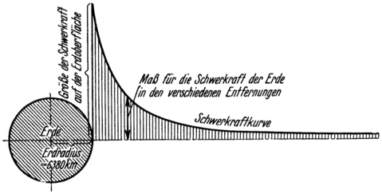
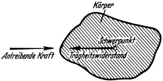
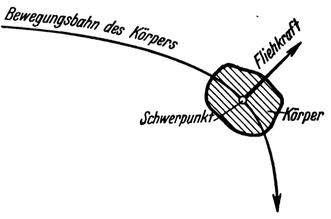

Die Macht der Schwere.
======================

Das ausschlaggebendste Hindernis, das der Weltraumbefahrung
im Wege steht, ist die Anziehungskraft der Erde, die wir
als Schwere jederzeit empfinden. Denn ein Fahrzeug, welches
den Weltraum befahren soll, muß nicht nur sich fortbewegen
können. Es muß vor allem und zuerst sich von der Erde entfernen,
d.h. es muß sich selbst und seine Nutzlast entgegen der
Schwerkraft.viele Tausende, ja Hunderttausende von Kilometern
hoch emporheben können!

Da die Schwerkraft eine Massenkraft ist, müssen wir uns vorerst
auch über die anderen in der Natur noch vorkommenden
Massenkräfte Klarheit verschaffen und uns ferner mit den Ursachen
dieser Kräfte, nämlich den beiden mechanischen Grundeigenschaften
der Masse kurz befassen; denn auf diesen Fragen
fußt das ganze Raumfahrtproblem.

Die eine dieser Eigenschaften besteht darin, daß alle Massen
sich gegenseitig anziehen (Gravitationsgesetz). Die Folge
dieser Erscheinung ist, daß jede Masse auf jede andere Masse eine
sogenannte „Massenanziehungskraft” ausübt. Die Anziehungskraft,
welche die Himmelskörper vermöge ihrer gesamten Masse auf
andere Massen ausüben, wird Schwerkraft genannt. Die von
der Erde ausgeübte „Erdschwerkraft” ist die Ursache, daß alle auf
der Erde befindlichen Körper eben „schwer” sind, also mehr oder
weniger „Gewicht” haben, je nach dem, ob sie selbst eine größere
oder kleinere Masse besitzen. Denn die Massenanziehungskraft
(Schwerkraft) ist umso bedeutender, je größer die Masse der Körper
ist, zwischen welchen sie Wirkt. Hingegen aber nimmt ihre
Stärke ab mit zunehmender Entfernung (und zwar mit dem Quadrate
der letzteren), doch ohne daß ihr Wirkungsbereich eine
ausgesprochene Grenze hätte (Abb. 1). Sie wird also theoretisch
erst in unendlicher Entfernung zu Null. Ebenso wie die Erde
übt natürlich auch die Sonne, der Mond und überhaupt jeder
Himmelskörper eine seiner Größe entsprechende Schwerkraft aus.

Abb. I. Der Verlauf der Massenanziehungskraft (Schwerkraft) der
Erde. Die mit zunehmender Entfernung quadratisch abnehmende Stärke der
Anziehung ist durch den Abstand der Schwerkraftkurve von der wagerechten
Achse dargestellt.

Die zweite grundlegende Eigenschaft der Masse besteht darin,
daß jede Masse stets bestrebt ist, in dem Bewegungszustand,
in welchem sie sich eben befindet, auch weiter
zu verharren (Trägheitsgesetz). Demzufolge wird jede Masse,

Abb. 2.

deren Bewegung man beschleunigen, verzögern oder der Richtung 
nach ändern will, diesem Bestreben Widerstand entgegensetzen,
indem sie durch Entwicklung entgegenwirkender, sogenannter 
„Massenträgheitskräfte” antwortet (Abb. 2).

Man bezeichnet dieselben im allgemeinen als Trägheitswiderstand,
oder in besonderem Falle auch als Fliehkraft. Letzteres
dann, wenn sie dadurch entstehen, daß eine Masse gezwungen wird,
sich in gekrümmter Bahn zu bewegen. Die Fliehkraft ist bekanntlich
stets von der Bewegungskurve senkrecht nach auswärts gerichtet
(Abb. 3). Alle diese Kräfte: die Schwerkraft, der Trägheitswiderstand
und die Fliehkraft sind Massenkräfte.

Wie früher erwähnt, erstreckt sich die Wirkung der Erdschwerkraft,
immer schwächer werdend, bis in unendliche Entfernung.
Wir können demnach den Anziehungsbereich

\3. Abb.

(das Schwerefeld) der Erde niemals völlig
verlassen, nie die wirkliche Schwere grenze der Erde erreichen.
Wohl aber läßt sich errechnen, welche Arbeitsleistung theoretisch
notwendig wäre, um das ganze Schwerefeld der Erde zu überwinden.
Es müßte hierzu eine Energie von nicht weniger als
6 380 Metertonnen für jedes Kilogramm der Last aufgewendet
werden. Weiterhin läßt sich ermitteln, mit welcher Geschwindigkeit
ein Körper von der Erde fortgeschleudert werden müßte, damit
er nicht mehr zu ihr zurückkehre. Sie beträgt 11 180 Meter je
Sekunde. Es ist dies dieselbe Geschwindigkeit, mit welcher ein
Körper auf der Oberfläche der Erde auftreffen würde, wenn er
aus unendlicher Entfernung frei auf sie zufiele. Um der Masse
eines Kilogrammes diese Geschwindigkeit zu erteilen, ist eben
dieselbe Arbeit von 6 380 Metertonnen erforderlich, die zur 
Überwindung des ganzen Erdschwerefeldes je Kilogramm der Last laut
Früherem aufgewendet werden müßte.

Doch wenn auch der Anziehungsbereich der Erde nie tatsächlich
verlassen werden könnte, so gäbe es trotzdem Möglichkeiten,
einen Körper der Schwerewirkung der Erde zu entziehen,
und zwar dadurch, daß man ihn auch der Einwirkung anderer
Massenkräfte unterwirft, welche der Erdschwerkraft entgegen-
wirken. Als solche kommen, gemäß unseren früheren Betrachtungen
über die Grundeigenschaften der Masse, nur in Frage: entweder
die Massenanziehungskräfte benachbarter Gestirne oder in dem
betreffenden Körper selbst erweckte Massenträgheitskräfte.

