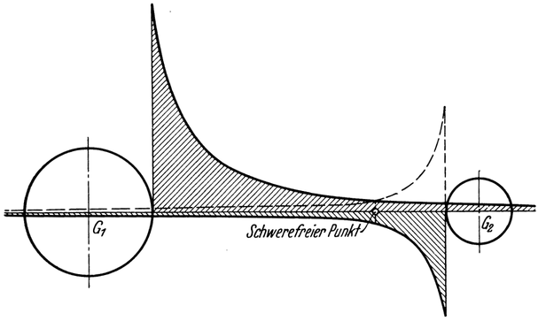

<#include "pagebreak.ftl">
\<@pagebreak 12/>
Die praktische Schweregrenze der Erde.
======================================

Wir wollen uns zuvor mit der erstgenannten Möglichkeit befassen.
Da ebenso wie die Erde auch jeder andere Himmelskörper
ein Schwerefeld besitzt, das sich, an Stärke immer mehr abnehmend,
bis in unendliche Entfernung erstreckt, so stehen wir —
wenigstens theoretisch — eigentlich stets unter der gleichzeitigen
Schwerewirkung aller Gestirne. Hiervon ist für uns jedoch nur
die Schwerewirkung der Erde und zum Teil auch die unseres Mondes
wahrnehmbar. Denn im Bereiche der Erdoberfläche, in dem
unser Leben sich abspielt, ist die Kraft der Erdanziehung. so überwiegend
groß, daß dagegen die Schwerewirkung, welche die anderen
Himmelskörper dortselbst ausüben, praktisch verschwindet.

Abb. 4. Der Verlauf der Schwerefelder der beiden benachbarten Gestirne G1 und
G2 ist wie in Abb. 1 dargestellt, nur daß die Schwerekurve des kleineren Himmelskörpers
G2 nach abwärts gezeichnet wurde, weil seine Anziehungskraft der des
größeren Gestirns G1 <em>entgegen</em> wirkt. Dort, wo die beiden Schwerefelder einander
entgegengesetzt gleich sind und sich daher in ihrer Wirkung aufheben, befindet
sich der <em>schwerefreie Punkt</em>.

Anders aber, sobald wir uns von der Erde entfernen. Deren
Anziehungskraft nimmt in ihrer Wirkung dann fortwährend ab,
\<@pagebreak /> die der benachbarten Gestirne hingegen beständig zu. Da letztere
der Erdschwerkraft entgegen wirkt, muß sich von der Erde aus
in jeder Richtung schließlich eine Stelle ergeben, an welcher sich
diese Anziehungskräfte der Stärke nach das Gleichgewicht halten.
Diesseits dieses Ortes beginnt dann die Schwerewirkung der Erde,
jenseits die eines Nachbargestirns zu überwiegen. Man kann dies
als *praktische Grenze des Schwerefeldes* der Erde bezeichnen,
ein Begriff, der allerdings nicht streng genommen werden darf,
mit Rücksicht auf die große Verschiedenheit und fortwährende Veränderung
der Lage der Nachbargestirne gegenüber der Erde.

In einzelnen Punkten der praktischen Schweregrenze (im allgemeinen
in jenen, welche auf der Verbindungsgeraden zwischen
der Erde und einem Nachbargestirne liegen), heben sich die Anziehungskräfte
auch der *Richtung* nach auf, so daß dort völlig
schwereloser Zustand herrscht. Eine solche Stelle des Weltraums
bezeichnet man als sogenannten „schwerefreien Punkt” (Abb. 4).

Allerdings befände man sich daselbst in einem nur unsicheren,
rein *labilen* Zustande der Schwerelosigkeit. Denn schon
bei geringstem Abweichen nach der einen oder der anderen
Seite, drohte der Absturz, entweder auf die Erde oder das Nachbargestirn.

