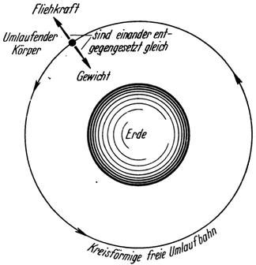
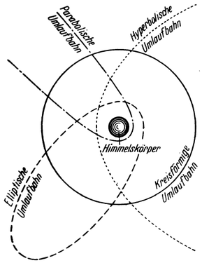
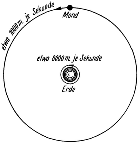

<#include "pagebreak.ftl">
Die freie Umlaufbahn.
=====================

Abb. 5. <em>Kreisförmiger freier Umlauf</em>
eines Körpers um die Erde. Das Gewicht desselben wird durch die dabei
erzeugte Fliehkraft <em>aufgehoben</em>. Er befindet sich daher gegenüber der
Erde in einem <em>stabilen Zustand freien Schwebens</em>.

Um einen sicheren, *stabilen* Zustand der Schwerelosigkeit zu erlangen, müßten wir
uns der Schwerkraftwirkung auf die zweite Art, nämlich durch Zuhilfenahme von
*Trägheitskräften* entziehen. \<@pagebreak 14/> Dies wird erreicht, wenn der anziehende Himmelskörper
also z. B. die Erde, mit entsprechender Geschwindigkeit in einer
*freien Umlaufbahn umfahren* wird (Gravitationsbewegung).
Die dabei entstehende, stets nach außen gerichtete Fliehkraft, hält
dann der Anziehungskraft das Gleichgewicht, und zwar nur sie
allein, wenn die Bewegung kreisförmig ist (Abb. 5), oder gleichzeitig
mit noch weiteren hierbei auftretenden Trägheitskräften, wenn
die Umlaufbahn eine andere Form besitzt (Ellipse, Hyperbel, Parabel,
Abb. 6).

Abb. 6. Verschiedene <em>freie 
Umlaufbahnen</em> um einen Himmelskörper. Nach den Gesetzen der Gravitationsbewegung 
muß stets ein Brennpunkt der Bahn (beim Kreis der Mittelpunkt)
mit dem Massenmittelpunkt (Schwerpunkt) des umlaufenen Himmelskörpers
zusammenfallen.

Auf ähnliche Weise erfolgen alle Mond- und Planetenbewegungen.
Da beispielsweise unser Mond die Erde mit einer mittleren Geschwindigkeit
von etwa 1000 Meter je Sekunde ständig umläuft, fällt er
nicht auf sie herunter, obwohl er sich in ihrem Anziehungsbereich
befindet, sondern schwebt frei über ihr. Und ebenso stürzt auch
die Erde nur deshalb nicht in das Glutmeer der Sonne ab, weil sie
dieselbe mit einer mittleren Geschwindigkeit von etwa 30 000 Meter
je Sekunde fortdauernd umfährt. Durch die dabei erzeugte
Fliehkraft wird die Schwerkraftwirkung der Sonne auf die Erde
aufgehoben und deshalb verspüren
wir auch nichts von ihrem Vorhandensein. Wir sind gegenüber
der Sonne „schwerelos“ in „stabilem Schwebezustand“, wir sind
praktisch genommen „ihrer Schwerkraftwirkung entzogen“.

In je geringerer Entfernung vom anziehenden Himmelskörper
dieser Umlauf erfolgt, desto stärker ist dortselbst auch die Wirkung
der Anziehungskraft. Desto größer muß daher auch die
\<@pagebreak /> entgegenwirkende Fliehkraft und demzufolge die Umlaufgeschwindigkeit
sein (denn die Fliehkraft nimmt zu mit dem Quadrate
der Umlaufgeschwindigkeit). Während

Abb. 7. Die Umlaufgeschwindigkeit
ist um so größer, je näher zum Anziehungszentrum die freie Umlaufbewegung erfolgt.

beispielsweise in der Entfernung des Mondes von der Erde eine Umlaufgeschwindigkeit
von nur etwa 1000 Meter je Sekunde genügt, müßte diese für
einen Körper, der die Erde nahe der Oberfläche schwebend umlaufen
soll, den Wert von etwa 8000 Meter je Sekunde erreichen.
(Abb. 7). Um einem Körper diese Geschwindigkeit zu erteilen,
ihn also auf solche Weise gegenüber der Erde in einen stabilen
Schwebezustand zu bringen und dadurch von der Erdschwere zu
befreien, ist ein Arbeitsaufwand von rund 3200 Metertonnen je
Kilogramm seines Gewichtes erforderlich.

