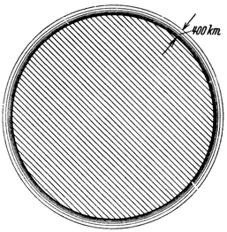

<@pagebreak 17/>

Der Panzer der Erdlufthülle.
============================

Außer der Schwerkraft spielt auch die *Lufthülle*, welche
manche Himmelskörper besitzen — ganz besonders aber natürlich
jene der Erde — für die Raumfahrt eine äußerst wichtige
Rolle. Während dieselbe für die Landung sehr wertvoll ist,
bildet sie hingegen für den Aufstieg ein recht bedeutendes
Hindernis.

Die Höhe der gesamten Erdlufthülle wird nach Beobachtungen
an Meteorfällen und Nordlichterscheinungen auf einige 100 (vielleicht
400) Kilometer geschätzt (Abb. 8). Doch nur in ihren tiefsten, einige
Kilometer hoch über der Erde lagernden Schichten, sozusagen nur am
„Grunde des Luftmeeres” ist auch jene *Luftdichte* vorhanden, die für
das Bestehen irdischen Lebens notwendig ist. Denn dieselbe vermindert
sich mit zunehmender Höhe sehr rasch und beträgt beispielsweise
in einer Höhe von 5 km bereits die Hälfte, von 15 km gar nur mehr
1/6 der Dichte über dem Meeresspiegel (Abb. 9).

Abb. 8. Das Bild zeigt die <em>Lufthülle</em>, unter der Voraussetzung,
daß sie etwa 400 km hoch ist, im richtigen Verhältnis zur Erdkugel.

Dieser Umstand ist für die Raumfahrtfrage von ausschlaggebender
Bedeutung und kommt ihr sehr zu statten. Denn bekanntlich
setzt die Luft jedem bewegten Körper einen Widerstand
entgegen. Letzterer steigt aber bei Vergrößerung der 
Bewegungsgeschwindigkeit sehr rasch und zwar in quadratischem Verhältnis.
Er erreicht bei den für die Raumfahrt in Betracht kommenden
außerordentlichen Geschwindigkeiten innerhalb der dichten erdnahen
Luftschichten bereits so hohe Werte, daß hierdurch die
Arbeit, welche beim Aufstieg zur Überwindung des Schwerefeldes
nach Früherem notwendig ist, noch um ein beträchtliches
vermehrt wird und auch beim Bau des Fahrzeuges in weitgehendem
<@pagebreak /> Maße darauf Rücksicht genommen werden muß. Da
jedoch zum Glück die Dichte der Luft mit zunehmender Höhe
rasch abnimmt, wird auch ihr Widerstand sehr bald kleiner und
kann dadurch in erträglichen Grenzen gehalten werden. Trotzdem
bedeutet die Lufthülle für die Raumfahrt beim *Aufstieg*
ein mächtiges Hindernis. Sie bildet gleichsam einen Panzer, der
die Erde allseits umgibt. Ihre Bedeutung für die *Rückkehr zur
Erde* werden wir später kennen lernen.

