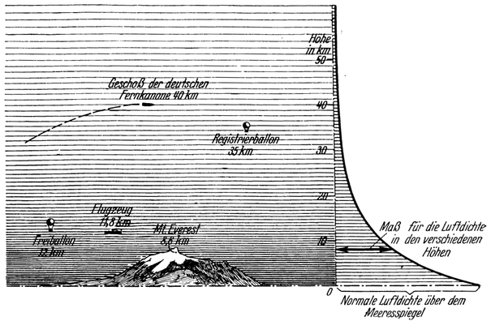

<#include "pagebreak.ftl">
Die bisher erreichten äußersten Höhen.
======================================

Es hat nicht an Versuchen gefehlt, in höchste Höhen vorzudringen.
Durch *Menschen* konnten bisher im Flugzeug 11800,
im Freiballon 12000, und alpinistiseh (am Mount Everest) 8600
Meter Höhe erreicht werden (Abb. 9). Noch weiter gelangten
sogenannte *Ballonsonden*. Es sind dies unbemannte Gummiballone,
die sehr leicht gebaute Meßgeräte möglichst hoch emportragen
\<@pagebreak 19/> sollen. Da sich mit zunehmender Höhe der Luftdruck
ständig verringert, dehnt sich der Ballon beim Aufstieg immer
mehr aus, bis er schließlich zerplatzt. Die Meßgeräte sinken dann
an einem Fallschirme langsam herunter, wobei sie selbsttätig
Druck, Temperatur und Feuchtigkeit der Luft aufnehmen. Solche
Ballonsonden konnten bis auf etwa 35 Kilometer Höhe emporgebracht
werden. Darüber hinaus, auf etwa 40 Kilometer Höhe,
gelangten die *Geschosse* der berühmten deutschen Fernkanone,
mit welcher Paris beschossen wurde. Doch was ist dies alles,
verglichen mit den ungeheuren Höhen, die wir erklimmen müßten,
um in den leeren Weltraum oder gar zu fremden Himmelskörpern
zu gelangen!

Abb. 9. Mit zunehmender Höhe vermindert sich die Luftdichte außerordentlich
rasch, wie aus der rechts gezeichneten Kurve und aus der Stärke der Schattierung
zu ersehen ist.

