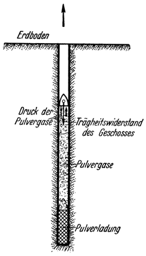

Der Kanonenschuß in den Weltraum.
=================================

Es schiene naheliegend, auf der Suche nach einem Mittel, um
den Fesseln der Erde zu entgehen, an den Schuß aus einer entsprechend
gewaltigen Riesenkanone zu denken. Bei diesem
Verfahren müßte dem Geschoß jene enorme Energie, die es zur
Überwindung der Schwere und für die Durchdringung der Lufthülle
benötigt, in der Gänze als lebendige Kraft, also in Form
von Geschwindigkeit, mitgegeben werden. Dies erfordert aber,
daß das Geschoß bereits beim Verlassen des Erdbodens eine Geschwindigkeit
von nicht weniger als rund 12000 Metern je Sekunde
erlangt haben muß, wenn nebst der Hebearbeit auch jene
zur Überwindung des Luftwiderstandes berücksichtigt wird.

Selbst wenn die heutigen Mittel der Technik es gestatten würden,
eine solche Riesenkanone zu schaffen und den Schuß in
den Weltraum zu wagen (in Wirklichkeit besitzen wir zurzeit
noch keinen Treibstoff, der für diesen Zweck genügend kräftig
wäre, wie Prof. H. Lorenz, Danzig nachgewiesen hat) — das
Ergebnis dieses Unternehmens würde die ungeheueren Geldmittel
nicht aufwiegen, die dazu notwendig wären. Bestenfalls könnte
solch ein „Ultra-Artillerist” sich rühmen, der Erste gewesen zu
sein, dem es gelungen ist, einen Gegenstand von der Erde fortgeschleudert
oder vielleicht auch den Mond beschossen zu haben.
Mehr ließe sich dabei kaum je gewinnen, weil alles, was man
diesem „Geschoßfahrzeug” auf die Reise mitgäbe, an Fracht,
Meßgeräten oder gar an Fahrgästen, sich schon in der ersten Sekunde
der Reise zu Brei verwandelt haben Würde; denn wohl

Abb. 10. Die Jules Vernesche Riesenkanone zur Beschießung des Mondes. Das Geschoß ist
hohl und zur Beförderung von Menschen bestimmt. Das Rohr
ist als Schacht in den Erdboden eingelassen.

nur massiver Stahl könnte dem ungeheueren Trägheitsdruck widerstehen,
der auf alle Teile des Geschosses während der Zeit des Abschusses einwirken
würde, während welcher es aus der Ruhelage auf die Geschwindigkeit
von 12000 Meter je Sekunde beschleunigt werden muß, in einem Zeitraum
von nur wenigen Sekunden (Abb. 10). Ganz abgesehen von der großen Hitze,
die durch die Reibung im Kanonenrohr und besonders in der zu durchdringenden
Luft entstünde.

