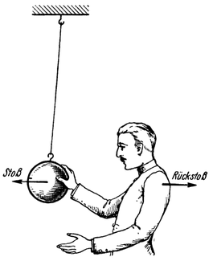

<#include "pagebreak.ftl">
Der Rückstoß.
=============

Dieses Verfahren ist also praktisch nicht brauchbar. Dem Raumfahrzeug
muß jene Energie, welche es zur Überwindung der Schwere und des Luftwiderstandes,
sowie zur Fortbewegung im leeren Weltraum benötigt, in anderer
Art zugeführt werden, also beispielsweise gebunden in
Betriebsstoffen, die man dem Fahrzeug auf
die Reise mitgibt. Es muß ferner ein Antriebsmotor vorhanden sein,
der gestattet, die Antriebskraft während der Fahrt zu ändern oder
auch stillzusetzen, die Fahrtrichtung zu wechseln und sich nur
*langsam*, ohne Gefährdung von Fahrgästen und Fracht auf jene
hohen, bereits kosmischen Geschwindigkeiten hinaufzuarbeiten, die
für die Raumfahrt nötig sind.

\<@pagebreak 21/> Aber wie dies alles? Wie soll die Fortbewegung denn *überhaupt*
ermöglicht werden, da im leeren Weltraum weder Luft
noch sonstige Körper zur Verfügung stehen, an welchen sich das
Fahrzeug fortarbeiten, gewissermaßen *abstoßen* könnte,
um seine Weiterbewegung nach einer der bisher gebräuchlichen
Methoden zu bewirken? (Fußbewegung bei Tier und Mensch, Flügelschlag
der Vögel, angetriebene Räder bei rollenden Kraftfahrzeugen,
Schiffsschraube, Luftschraube usw.).

Abb. 11. Der „Rückstoß” beim Abfeuern eines Gewehrs.

Das Mittel hierzu bietet eine allgemein bekannte physikalische
Erscheinung. Wer einmal einen scharfen Schuß abgab (und an solchen
dürfte es in der jetzt lebenden Generation kaum mangeln) hat hierbei
gewiß deutlich, nicht selten vielleicht sogar in recht unliebsamer Weise, den
sogenannten *„Rückstoß”* verspürt. Es ist dies ein mächtiger Stoß, den
das Gewehr dem Schützen beim Abfeuern entgegen der Abschußrichtung
versetzt. Er kommt dadurch zustande, daß die Pulvergase mit derselben
Kraft, mit welcher sie das Geschoß nach vorwärts treiben, *auch zurück
auf das Gewehr drücken* und es somit nach rückwärts zu bewegen
suchen (Abb. 11).

Abb. 12. Auch wenn man mit der Hand einen leichtbeweglichen, massigeren
Gegenstand (z. B. eine frei hängende Eisenkugel) rasch von sich
wegstößt, erhält man selbst dabei einen merklichen „Rückstoß”.

Aber auch im alltäglichen Leben
\<@pagebreak /> kann man den Rückstoßvorgang, wenn auch zumeist nicht in so
vollkommener Weise, immer wieder beobachten: so z. B. wenn
man einen beweglichen Gegenstand mit der Hand von sich wegstößt
(Abb. 12); denn genau denselben Stoß, welchen man dabei
dem Gegenstand erteilt, erhält man bekanntlich zugleich auch selbst
in entgegengesetzter Richtung, und zwar ist dieser *„Rückstoß”
desto stärker*, und man wird infolgedessen selbst auch umso
mehr zurückprallen, je kräftiger man gestoßen hat. *Umso größer*
ist dann aber auch die *„Abstoßungsgeschwindigkeit”*, welche
der betreffende fortgestoßene Körper hierbei erlangt. Anderseits
wird man mit ein und *derselben Kraft* dem fortgestoßenen
Gegenstand eine umso größere Geschwindigkeit
erteilen können, je geringeres Gewicht d. h. je
kleinere Masse er besitzt. Und ebenso wird man
auch selbst hierbei umso mehr zurückweichen je
leichter (und um so weniger je schwerer) man ist.

Abb. 13. Wird der „Rückstoß“ des Gewehres <em>nicht</em>
aufgefangen, dann bewegt sich das letztere (nach
dem Abschuß) nach rückwärts fort, und zwar so
daß der gemeinsame Schwerpunkt von Gewehr
und Geschoß <em>in Ruhe</em> verbleibt.

Das physikalische Gesetz, welches diese Erscheinung erfaßt,
heißt der „Satz von der Erhaltung des Schwerpunktes”.
Er besagt, daß der gemeinsame Schwerpunkt eines Systems
von Körpern stets in Ruhe bleibt, wenn dieselben nur durch
*innere*, d. h. nur zwischen diesen Körpern wirkende Kräfte, bewegt werden.

In unserem ersten Beispiel ist der Druck der Pulvergase die
innere Kraft, die zwischen den beiden Körpern: Geschoß und Gewehr
wirkt. Während unter ihrem Einfluß das nur sehr kleine
Geschoß eine Geschwindigkeit von etlichen hundert Metern je
Sekunde annimmt, ist dagegen die Geschwindigkeit, welche das
viel schwerere Gewehr in entgegengesetzter Richtung erlangt so
gering, daß der hierdurch verursachte Rückstoß vom Schützen mit
\<@pagebreak /> der Schulter aufgefangen werden kann. Würde man letzteres unterlassen
und dem Gewehr gestatten, sich ungehemmt nach rückwärts
zu bewegen (Abb. 13), dann bliebe der gemeinsame Schwerpunkt
von Geschoß und Gewehr tatsächlich in Ruhe (dort wo
er vor dem Abschuß war), und das Gewehr würde sich nun nach
rückwärts fortbewegen.

