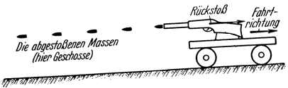

<#include "pagebreak.ftl">
Das Rückstoßfahrzeug.
=====================

Würde man nun das Gewehr auf einem leichten Wagen befestigen
(Abb. 14) und abfeuern, so würde sich derselbe durch
die Kraft des Rückstoßes in Bewegung setzen. Würde man so
in rascher Aufeinanderfolge fortgesetzt schießen, ähnlich etwa wie
mit einem Maschinengewehr, dann würde
der Wagen sich beschleunigen, könnte
auch Steigungen nehmen usw. Dies wäre
ein Fahrzeug mit Rückstoßantrieb,
nicht das vollkommenste allerdings. Die Fortbewegung eines solchen 
Fahrzeuges erfolgt also dadurch, daß es Teile seiner eigenen Masse (im früheren
Beispiel: die Geschosse) entgegengesetzt der Bewegungsrichtung
von sich fortschleudert und sich dabei an diesen fortgeschleuderten
Masseteilen abstößt.

Es ist darnach klar, daß diese Antriebsart auch dann brauchbar
sein wird, wenn das Fahrzeug sich im leeren Raum befindet,
in seiner Umgebung also weder Luft noch etwas anderes
vorhanden ist, an dem eine Abstoßung möglich wäre. Ja der
Antrieb wird sogar gerade dann erst seine größte Wirksamkeit
entfalten können, weil alle äußeren Widerstände entfallen.

Abb. 14. Ein primitives Fahrzeug mit Rückstoßantrieb: Der Wagen wird
durch andauerndes Abschießen eines Gewehres, vermöge des dabei erzeugten
„Rückstoßes“, fortbewegt.

Bei der technischen Ausgestaltung eines derartigen Fahrzeuges
wird man nun anstreben müssen, daß zur Erzeugung einer bestimmten
\<@pagebreak 24/> Antriebsleistung einerseits nur möglichst wenig Massen
abgestoßen werden müssen und anderseits, daß ihre Abstoßung
in tunlichst einfacher und betriebssicherer Weise vor sich
gehe. 

Zur Erfüllung der ersten Forderung ist vor allem notwendig,
daß die Abstoßungsgeschwindigkeit möglichst groß sei.
Dies ist nach dem bereits Gesagten auch ohne rechnerische Beweisführung,
allein durch Überlegung, leicht einzusehen: denn
mit je größerer Geschwindigkeit ich einen Körper von mir
fortstoßen will, mit desto größerer Kraft muß ich hierbei auf
ihn drücken; desto größer wird nach Früherem dann aber auch
die Gegenkraft sein, welche infolgedessen auf mich zurückwirkt,
das ist der Rückstoß, der durch die Abstoßung eben dieser
Masse erzeugt wurde.

Ferner ist erforderlich, daß nicht etwa größere Massenteile in
längeren Zeitabschnitten, sondern daß möglichst kleine Massen
in ununterbrochener Folge abgestoßen werden. Warum
dies ebenfalls zur Geringhaltung der abzustoßenden Masse beiträgt,
geht aus rechnerischen Untersuchungen hervor, die hier
jedoch nicht gebracht werden sollen. Wie aber ohne weiteres zu
verstehen ist, muß letzteres auch im Interesse der Betriebssicherheit
gefordert werden; denn der Vortrieb würde sonst ruckweise
erfolgen, was für das Fahrzeug und dessen Inhalt schädlich wäre.
Nur eine möglichst stetig wirkende Antriebskraft ist praktisch
brauchbar.

