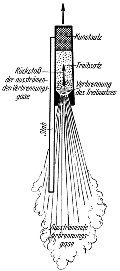

Die Rakete.
===========

Diesen Bedingungen kann am besten entsprochen werden, wenn
man die Abstoßung der Massen dadurch bewirkt, daß man geeignete,
im Fahrzeug mitgeführte Stoffe erst verbrennen und die
dadurch entstehenden Verbrennungsgase dann nach rückwärts ausströmen
— „auspuffen” — läßt. Die Massen gelangen so in
kleinsten Teilchen (Moleküle der Verbrennungsgase) zur Abstoßung
und die bei der Verbrennung freiwerdende und sich in Gasdruck
umsetzende Energie liefert die hierzu notwendige „innere Kraft”.

<@pagebreak 25/>

Abb. 15. <em>Feuerwerkrakete</em> im Längsschnitt. Der daran
befestigte Stab dient dazu, das Sichüberschlagen der Rakete zu
verhindern.

Ein Fahrzeug solcher Art in einfachster Ausführung stellt die bekannte
*Feuerwerkrakete* dar (Abb. 15). Ihr Zweck ist der, einen sogenannten
„Kunstsatz” emporzutragen: das sind allerlei Feuerwerkkörper, welche
nach erreichter Steighöhe dann zur Entzündung
gelangen, um entweder in prächtigem Feuerspiel das Auge zu erfreuen, oder
(wie beispielsweise in der Kriegführung) zu Leucht- und Signalgebungszwecken
zu dienen.

Die Fortbewegung (Emporhebung) einer solchen Feuerwerkrakete erfolgt
durch eine mitgeführte Pulverladung: „Treibsatz” genannt. Derselbe wird
beim Ablassen der Rakete entzündet und brennt dann während des Aufstieges
allmählich ab, wobei die entstehenden Verbrennungsgase nach rückwärts
(unten) ausströmen und dadurch — vermöge ihrer Rückstoßwirkung —
eine stetige nach vorn (oben) gerichtete Antriebskraft erzeugen, in gleicher Weise
wie dies schon früher besprochen wurde.

Nun, eine Rakete, die als Fahrzeug für den Weltraum dienen
soll, würde allerdings wesentlich anders aussehen müssen als eine
einfache Feuerwerkrakete.

