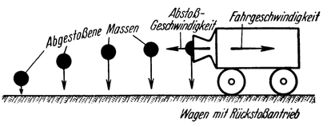
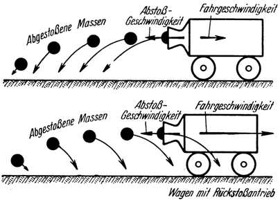
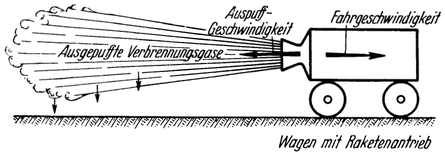

Die Fahrgeschwindigkeit und der Wirkungsgrad bei Raketen-Fahrzeugen.
====================================================================

Es ist sehr wichtig und für das Rückstoßfahrzeug eigentümlich,
daß bei diesem die Fahrgeschwindigkeit nicht willkürlich gewählt
werden darf, sondern durch die besondere Art seines Antriebes
im allgemeinen schon gegeben ist. Da nämlich die Fortbewegung
eines solchen Fahrzeuges dadurch erfolgt, daß es Teile
seiner eigenen Masse von sich abstößt, muß dieser Vorgang so
eingerichtet werden, daß alle Massen nach erfolgter Abstoßung
womöglich ihre gesamte Energie an das Fahrzeug ‘abgegeben haben;
denn was sie davon mit sich nehmen, ist unwiederbringlich verloren. 

Abb. 16. 
Die Fahrgeschwindigkeit ist gleich der
Abstoßungsgeschwindigkeit. Infolgedessen ist nach
der Abstoßung die Geschwindigkeit der abgestoßenen
Massen gleich Null, was man in der Abb. daraus
ersicht, daß sie lotrecht herunterfallen.

Eine derartige Energie bildet unter anderem die lebendige
Kraft, welche bekanntlich jedem Körper innewohnt, der sich
in Bewegung befindet. Soll nun davon in den
abgestoßenen Massen nichts mehr vorhanden sein, dann müssen sich
dieselben nach erfolgter Abstoßung gegenüber der Umgebung
(richtiger gesagt: bezüglich ihres Bewegungszustandes vor der Abfahrt)
in Ruhe befinden. Um dies aber zu erreichen, muß die
Fahrgeschwindigkeit von gleicher Größe wie die 
Abstoßungsgeschwindigkeit sein; denn dann wird die Geschwindigkeit,
welche die Massen vor ihrer Abstoßung (also noch als
Teile des Fahrzeuges) besessen haben, gerade aufgehoben durch
jene Geschwindigkeit, welche ihnen bei der Abstoßung in
entgegengesetzter Richtung erteilt wurde (Abb. 16). Sie gelangen
demnach durch die Abstoßung in relativen Ruhezustand und
sinken als frei fallende Körper lotrecht zu Boden.

Unter dieser Voraussetzung geht beim Rückstoßvorgang keine
Energie verloren, der Rückstoß selbst arbeitet dann mit einem
(mechanischen) Wirkungsgrad von 100 Prozent (Abb. 16).
Würde die Fahrgeschwindigkeit hingegen kleiner oder größer sein
als die Abstoßungsgeschwindigkeit, dann wäre auch dieser 
„Wirkungsgrad des Rückstoßes” entsprechend geringer (Abb. 17). Er
ist gänzlich Null, sobald das Fahrzeug bei arbeitendem Antrieb
stillsteht.

Abb. 17.
Die Fahrgeschwindigkeit ist kleiner (oberes
Bild) oder größer (unteres Bild) als die Abstoßungsgeschwindigkeit.
Die abgestoßenen Massen besitzen
daher nach erfolgter Abstoßung noch immer einen
Teil ihrer Abstoßungsgeschwindigkeit (oberes Bild)
oder ihrer Fahrgeschwindigkeit (unteres Bild), was
man in der Abbildung daraus erkennt, daß sie schief
zu Boden fallen.

Dies läßt sich in einfacher Weise rechnerisch verfolgen, was wir
hier auch tun wollen mit Rücksicht auf die entscheidende Bedeutung,
welche der Frage des Wirkungsgrades für das Raketen-Fahrzeug zukommt.
Wendet man nämlich den allgemeinen
Ausdruck für den Wirkungsgrad: „Verhältnis der gewonnenen zur
aufgewendeten Energie” auf den vorliegenden Fall an<a class="refnote" id="rn1" href="#fn1">1</a>, so gelangt
man zu der Formel

ηr = (2 - v / c) v / c

als Ausdruck für den Wirkungsgrad des Rückstoßes ηr
in Abhängigkeit von dem jeweiligen Verhältnis zwischen Fahrgeschwindigkeit
v und Abstoßungsgeschwindigkeit c.

<table>
	<caption>Tabelle I.</caption>
	<tr>
		<td>Verhältnis der Fahrgeschwindigkeit v zur
Abstoßungsgeschwindigkeit c</td>
		<td colspan="2">Wirkungsgrad des Rückstoßes ηr</td>
	</tr>
	<tr>
		<td>v/c</td>
		<td>ηr = (1 - v/c) v/c</td>
		<td>ηr in Prozenten gerundet</td>
	</tr>
	<tr><td>0	</td><td>0	</td><td>0</td></tr>
	<tr><td>0,01	</td><td>0,0199	</td><td>2</td></tr>
	<tr><td>0,05	</td><td>0,0975	</td><td>10</td></tr>
	<tr><td>0,1	</td><td>0,19	</td><td>19</td></tr>
	<tr><td>0,2	</td><td>0,36	</td><td>36</td></tr>
	<tr><td>0,5	</td><td>0,75	</td><td>75</td></tr>
	<tr><td>0,8	</td><td>0,96	</td><td>96</td></tr>
	<tr><td>1	</td><td>1	</td><td>100</td></tr>
	<tr><td>1,2	</td><td>0,96	</td><td>96</td></tr>
	<tr><td>1,5	</td><td>0,75	</td><td>75</td></tr>
	<tr><td>1,8	</td><td>0,36	</td><td>36</td></tr>
	<tr><td>2	</td><td>0	</td><td>0</td></tr>
	<tr><td>2,5	</td><td>-1,25	</td><td>-125</td></tr>
	<tr><td>3	</td><td>-3	</td><td>-300</td></tr>
	<tr><td>4	</td><td>-8	</td><td>-800</td></tr>
	<tr><td>5	</td><td>-15	</td><td>-1500</td></tr>
</table>

In der Tabelle 1 ist nun für verschiedene Größen dieses Verhältnisses
v/c der Wirkungsgrad des Rückstoßes ηr mit Hilfe obiger
Formel errechnet. Wäre also z. B. das Verhältnis v/c = 0,1 (d. h.
v = 0,1 c, somit die Fahrgeschwindigkeit nur 1/10 so groß wie die
Abstoßungsgeschwindigkeit), dann würde der Wirkungsgrad des
Rückstoßes nur 19 Prozent betragen; bei v/c = 0,5 (also wenn die
Fahrgeschwindigkeit 1/2 so groß wie die Abstoßgeschwindigkeit ist)
wäre derselben aber schon 75, und bei v/c = 1 (gleich große Fahr-
und Abstoßungsgeschwindigkeit) — in Übereinstimmung mit unserer
früheren Überlegung — sogar 100 Prozent. Wird das Verhältnis v/c
größer als 1 (übersteigt demnach die Fahrgeschwindigkeit
bereits die Abstoßungsgeschwindigkeit), dann verringert sich
der Wirkungsgrad des Rückstoßes wieder, geht schließlich bei v/c = 2
abermals durch Null und wird dann (also bei Fahrgeschwindigkeiten,
die mehr als doppelt so groß wie die Abstoßungsgeschwindigkeit
sind) sogar negativ.

Letzteres erscheint auf den ersten Blick paradox, da das Fahrzeug
durch die Abstoßung doch an Fahrgeschwindigkeit und damit scheinbar
auch an lebendiger Kraft gewinnt! Da aber der Energieabgang,
welcher sich durch die Abtrennung der infolge der großen 
Fahrgeschwindigkeit jetzt sehr stark mit lebendiger Kraft beladenen
Abstoßungsmasse ergibt, den durch die Abstoßung erzielten Energiegewinn
nunmehr überwiegt, resultiert aus dem ganzen Vorgang
für das Fahrzeug — trotz der dadurch hervorgerufenen 
Geschwindigkeitsvermehrung desselben — doch ein Energieverlust, was
eben in dem negativen Vorzeichen des Wirkungsgrades mathematisch
zum Ausdruck kommt. Immerhin aber haben diese für
große Werte des Verhältnisses v/c sich ergebenden Wirkungsgradzahlen
eigentlich nur einen mehr oder weniger theoretischen Wert.

Sehr klar und deutlich erkennt man jedoch aus der Tabelle,
wie sehr es von Vorteil und daher wichtig ist, daß die Größe der
Fahrgeschwindigkeit sich möglichst jener der Abstoßungsgeschwindigkeit
nähere, um einen guten Wirkungsgrad des Rückstoßes zu
erzielen, wobei jedoch gewisse Unterschiede (selbst bis zu v = o,5 c
bzw. v = 1,5 c) immerhin noch nicht so sehr ins Gewicht fallen,
weil die Schwankungen des Wirkungsgrades in der Nähe seines
Maximums ziemlich gering sind. Man kann demnach sagen, daß
die wirtschaftliche Fahrgeschwindigkeit eines Raketen—Fahrzeuges

Abb. 18. 
Bei einem Raketenfahrzeug muß die Fahrgeschwindigkeit
möglichst gleich der Auspuffgeschwindigkeit sein.

so ungefähr zwischen dem 1/2 und 1 1/2fachen Wert seiner
Abstoßungsgeschwindigkeit liegt.

Wenn nun wie hier das Rückstoßfahrzeug ein Raketen-Fahrzeug
ist, die Massenabstoßung demnach durch geeignetes Verbrennen—
und Auspuffenlassen von mitgeführten Betriebsstoffen erfolgt,
dann muß also im Sinne der soeben erkannten Forderung: die
Fahrgeschwindigkeit soweit als möglich von gleicher
Größe wie die Auspuffgeschwindigkeit sein (Abb. 18). Dies
bedingt aber wieder, daß sich die Fahrgeschwindigkeit gewissermaßen
nach der Art des jeweils verwendeten Betriebsstoffes richtet, da jedem
eine andere höchst erreichbare Auspuffgeschwindigkeit eigen ist.

Diese grundlegende Forderung der Raketenfahrtechnik ist nun
bestimmend für die Anwendungsmöglichkeit von Raketen-Fahrzeugen
überhaupt. Denn nach Früherem soll ja die Abstoßungsgeschwindigkeit
möglichst groß sein. Tatsächlich betragen auch
die in Frage kommenden Auspuffgeschwindigkeiten tausende
von Metern je Sekunde, und es muß daher die Fahrgeschwindigkeit
ebenfalls einen dementsprechend enormen, für alle bisher bekannten
Fahrzeuge unmöglich hohen Wert erreichen, wenn der
Wirkungsgrad eine für praktische Anwendung noch brauchbare
Höhe haben soll.

Deutlich ist dies aus der Tabelle 2 zu erkennen, in welcher zu
einzelnen wichtigen Fahrgeschwindigkeiten (angeführt in der Hauptkolonne
I) die denselben bei verschiedenen Abstoßungsgeschwindigkeiten
entsprechenden Wirkungsgrade ermittelt sind.

Schon aus der Hauptkolonne 2 der Tabelle, welche den
Wirkungsgrad des Rückstoßes allein darstellt, ersieht man,
wie gering die Wirtschaftlichkeit des Raketenantriebes bei den
von unseren bisherigen Fahrzeugen erreichbaren Geschwindigkeiten
(von höchstens einigen hundert Kilometern je Stunde)‚ ist.

Doch viel krasser noch tritt dies hervor, wenn man, wie es
die Hauptkolonne 3 zum Ausdruck bringt, den Gesamtwirkungsgrad
in Betracht zieht. Zu diesem gelangt man dadurch,
daß man noch die Verluste berücksichtigt, welche mit der Erzeugung
der Abstoßungsgeschwindigkeit (durch Verbrennen- und
Auspuffenlassen des Betriebsstoffes) an und für sich schon verbunden
sind und zur Folge haben, daß man praktisch stets nur
eine kleinere als jene Auspuffgeschindigkeit erzielen kann, welche
für den betreffenden Betriebsstoff theoretisch bestenfalls erreichbar
wäre. Die damit verbundene Auswertung desselben
dürfte, wie später noch des Näheren erläutert wird<a class="refnote" id="rn2" href="#fn2">2</a>, wahrscheinlich
bis auf etwa 60 Prozent zu bringen sein. Für Benzol beispielsweise
würde sich bei 62 Prozent Auswertung eine Auspuffgeschwindigkeit
von 3500 und bei 20 Prozent eine solche von
2000 Metern je Sekunde ergeben, für welche beiden Fälle die
Hauptkolonne 3 der Tabelle 2 den Gesamtwirkungsgrad zeigt (der im
Sinne des Gesagten nunmehr eben nur 62 bzw. 20 Prozent von
den entsprechenden Werten der Hauptkolonne 2 beträgt).

<table>
<caption>Tabelle 2</caption>
<tr>
  <td colspan="2">1</td>
  <td colspan="7">2</td>
  <td colspan="2">3</td>
</tr>
<tr>
  <td colspan="2" rowspan="2">Fahrgeschwindigkeit v in</td>
  <td colspan="7">Wirkungsgrad des Rückstoßes ηr = (1 - v/c) v/c</td>
  <td colspan="2">Gesamtwirkungsgrad des Fahrzeugantriebes η = ηr ηi</td>
</tr>
<tr>
  <td colspan="9">ausgedrückt in Prozenten, und zwar für folgende Abstoßungsgeschwindigkeiten c in m/sec:</td>
</tr>
<tr><td>km/st</td><td>m/sec</td><td>1000</td><td>2000</td><td>2500</td><td>3000</td><td>3500</td><td>4000</td><td>5000</td><td>2000</td><td>3500</td></tr>
<tr><td>40	</td><td>11	</td><td>2,2	</td><td>1,2	</td><td>0,9	</td><td>0,7	</td><td>0,6	</td><td>0,5	</td><td>0,4	</td><td>0,2	</td><td>0,4</td></tr>
<tr><td>100	</td><td>28	</td><td>4,6	</td><td>2,8	</td><td>22	</td><td>1,8	</td><td>1,6	</td><td>1,4	</td><td>1,2	</td><td>0,6	</td><td>1</td></tr>
<tr><td>200	</td><td>56	</td><td>11	</td><td>5,5	</td><td>4,5	</td><td>3,8	</td><td>3,2	</td><td>2,8	</td><td>2,2	</td><td>1,1	</td><td>2</td></tr>
<tr><td>300	</td><td>83	</td><td>16	</td><td>8	</td><td>6,5	</td><td>5,5	</td><td>4,7	</td><td>4	</td><td>3,4	</td><td>1,6	</td><td>3</td></tr>
<tr><td>500	</td><td>140	</td><td>26	</td><td>13	</td><td>11	</td><td>9	</td><td>8	</td><td>7	</td><td>5,5	</td><td>2,7	</td><td>5</td></tr>
<tr><td>700	</td><td>200	</td><td>36	</td><td>19	</td><td>15	</td><td>13	</td><td>11	</td><td>10	</td><td>8	</td><td>4	</td><td>7</td></tr>
<tr><td>1000	</td><td>300	</td><td>51	</td><td>28	</td><td>23	</td><td>19	</td><td>16	</td><td>14	</td><td>12	</td><td>6	</td><td>10</td></tr>
<tr><td>1800	</td><td>500	</td><td>75	</td><td>44	</td><td>36	</td><td>31	</td><td>27	</td><td>23	</td><td>19	</td><td>9	</td><td>17</td></tr>
<tr><td>3000	</td><td>1000	</td><td>100	</td><td>75	</td><td>64	</td><td>56	</td><td>50	</td><td>44	</td><td>36	</td><td>15	</td><td>31</td></tr>
<tr><td>5400	</td><td>1500	</td><td>75	</td><td>94	</td><td>84	</td><td>75	</td><td>67	</td><td>60	</td><td>51	</td><td>19	</td><td>42</td></tr>
<tr><td>7200	</td><td>2000	</td><td>0	</td><td>100	</td><td>96	</td><td>89	</td><td>81	</td><td>75	</td><td>64	</td><td>20	</td><td>50</td></tr>
<tr><td>9000	</td><td>2500	</td><td>-125	</td><td>94	</td><td>100	</td><td>97	</td><td>92	</td><td>86	</td><td>75	</td><td>19	</td><td>57</td></tr>
<tr><td>10800	</td><td>3000	</td><td>-300	</td><td>75	</td><td>96	</td><td>100	</td><td>98	</td><td>94	</td><td>84	</td><td>15	</td><td>61</td></tr>
<tr><td>12600	</td><td>3500	</td><td>-525	</td><td>44	</td><td>84	</td><td>97	</td><td>100	</td><td>99	</td><td>91	</td><td>9	</td><td>62</td></tr>
<tr><td>14400	</td><td>4000	</td><td>-800	</td><td>0	</td><td>64	</td><td>89	</td><td>98	</td><td>100	</td><td>96	</td><td>0	</td><td>61</td></tr>
<tr><td>1800	</td><td>5000	</td><td>-1500	</td><td>-125	</td><td>0	</td><td>56	</td><td>81	</td><td>94	</td><td>100	</td><td>-25	</td><td>50</td></tr>
<tr><td>21600	</td><td>6000	</td><td>	</td><td>-300	</td><td>-96	</td><td>0	</td><td>50	</td><td>75	</td><td>96	</td><td>-61	</td><td>31</td></tr>
<tr><td>25000	</td><td>7000	</td><td>	</td><td>-520	</td><td>-220	</td><td>-77	</td><td>0	</td><td>44	</td><td>70	</td><td>-111	</td><td>0</td></tr>
<tr><td>28800	</td><td>8000	</td><td>	</td><td>-800	</td><td>-380	</td><td>-175	</td><td>-64	</td><td>0	</td><td>64	</td><td>-160	</td><td>-40</td></tr>
<tr><td>36000	</td><td>10000	</td><td>	</td><td>-1500	</td><td>-800	</td><td>-440	</td><td>-250	</td><td>-125	</td><td>0	</td><td>-300	</td><td>-160</td></tr>
<tr><td>45000	</td><td>12500	</td><td>	</td><td>	</td><td>-1500	</td><td>-900	</td><td>-560	</td><td>-350	</td><td>-125	</td><td>	</td><td>-350</td></tr>
</table>

Wie man aus diesen Zahlen erkennt, ist der Gesamtwirkungsgrad 
— selbst für Fahrgeschwindigkeiten von etlichen hundert
Kilometern je Stunde — noch so gering, daß, abgesehen von gewissen
Sonderzwecken, bei welchen die Frage der Wirtschaftlichkeit
nicht ins Gewicht fällt, eine weitgehende praktische Anwendung
des Raketenantriebes für irgendeines unserer gebräuchlichen
Boden—Verkehrsmittel wohl kaum jemals in Frage kommen kann.

Doch ganz anders wird hingegen die Sache, wenn man sehr
hohe Fahrgeschwindigkeiten in Betracht zieht. Selbst schon bei
Überschallgeschwindigkeiten, die nicht allzu groß sind, ist der
Wirkungsgrad verhältnismäßig wesentlich besser und erreicht bei
noch höheren, bereits kosmischen Fahrgeschwindigkeiten, die
Tausende von Metern je Sekunde (also bis zu Zehntausende von
Kilometern je Stunde) betragen, sogar äußerst günstige Werte,
wie aus Tabelle 2 hervorgeht.

Es ist daher als ein besonders günstiges Zusammentreffen von
Umständen anzusehen, daß gerade für Weltraumfahrzeuge, für
welche ja der Rückstoß die einzig geeignete Antriebsart darstellt,
diese hohen Fahrgeschwindigkeiten nicht nur möglich sind (kein
Fahrwiderstand im leeren Weltraum!), sondern sogar eine unbedingte
Notwendigkeit darstellen. Denn wie könnten sonst
jene ungeheueren Entfernungen des Weltraums in menschenmöglichen
Reisezeiten zurückgelegt werden? Eine Gefahr aber, daß
allzuhohe Geschwindigkeiten vielleicht gesundheitsschädlich wirken
könnten, besteht nicht; denn eine Geschwindigkeit an sich wird
uns unmittelbar überhaupt nicht bewußt, mag sie auch noch so
gewaltig sein. Durcheilen wir doch als „Fahrgäste unserer Erde”
in unentwegtem Laufe um die Sonne den Weltraum ständig mit
einer Geschwindigkeit von 30000 Meter je Sekunde, ohne auch
nur im geringsten etwas davon zu fühlen. Anders verhält es
sich indessen mit den bei erzwungenen Geschwindigkeits-Änderungen
auftretenden „Beschleunigungen”, wie wir später sehen
werden.

<table>
<caption>Tabelle 3</caption>
<tr><td>Kilometer je Stunde km/st</td><td>Meter je Sekunde m/sec</td><td>Kilometer je Sekunde km/sec</td></tr>
<tr><td>5	</td><td>1,39	</td><td>0,00139</td></tr>
<tr><td>10	</td><td>2,78	</td><td>0,00278</td></tr>
<tr><td>30	</td><td>8,34	</td><td>0,00834</td></tr>
<tr><td>50	</td><td>13,9	</td><td>0,0139</td></tr>
<tr><td>70	</td><td>19,5	</td><td>0,0195</td></tr>
<tr><td>90	</td><td>25,0	</td><td>0,0250</td></tr>
<tr><td>100	</td><td>27,8	</td><td>0,0278</td></tr>
<tr><td>150	</td><td>41,7	</td><td>0,0417</td></tr>
<tr><td>200	</td><td>55,6	</td><td>0,0556</td></tr>
<tr><td>300	</td><td>83,4	</td><td>0,0834</td></tr>
<tr><td>360	</td><td>100	</td><td>0,1</td></tr>
<tr><td>500	</td><td>139	</td><td>0,139</td></tr>
<tr><td>700	</td><td>195	</td><td>0,195</td></tr>
<tr><td>720	</td><td>200	</td><td>0,2</td></tr>
<tr><td>1000	</td><td>278	</td><td>0,278</td></tr>
<tr><td>1080	</td><td>300	</td><td>0,3</td></tr>
<tr><td>1190	</td><td>330	</td><td>0,33</td></tr>
<tr><td>1800	</td><td>500	</td><td>0,5</td></tr>
<tr><td>2000	</td><td>556	</td><td>0,556</td></tr>
<tr><td>2520	</td><td>700	</td><td>0,7</td></tr>
<tr><td>3000	</td><td>834	</td><td>0,834</td></tr>
<tr><td>3600	</td><td>1000	</td><td>1</td></tr>
<tr><td>5400	</td><td>1500	</td><td>1,5</td></tr>
<tr><td>7200	</td><td>2000	</td><td>2</td></tr>
<tr><td>9000	</td><td>2500	</td><td>2,5</td></tr>
<tr><td>10800	</td><td>3000	</td><td>3</td></tr>
<tr><td>12600	</td><td>3500	</td><td>3,5</td></tr>
<tr><td>14400	</td><td>4000	</td><td>4</td></tr>
<tr><td>18000	</td><td>5000	</td><td>5</td></tr>
<tr><td>21600	</td><td>6000	</td><td>6</td></tr>
<tr><td>25200	</td><td>7000	</td><td>7</td></tr>
<tr><td>28800	</td><td>8000	</td><td>8</td></tr>
<tr><td>36000	</td><td>10000	</td><td>10</td></tr>
<tr><td>40300	</td><td>11180	</td><td>11,18</td></tr>
<tr><td>45000	</td><td>12500	</td><td>12,5</td></tr>
<tr><td>54000	</td><td>15000	</td><td>15</td></tr>
<tr><td>72000	</td><td>20000	</td><td>20</td></tr>
</table>

Um die verschiedenen hier betrachteten Fahrgeschwindigkeiten
leichter miteinander vergleichen zu können — was sonst durch
die Verschiedenheit der gebräuchlichen Bezeichnungsweisen (für die
bisher bekannten Fahrzeuge Kilometer je Stunde, bei der Raumfahrt
Meter oder Kilometer je Sekunde) einigermaßen erschwert
wird — ist vorstehend die Tabelle 3 gebracht.

<a href="#rn1">1</a>
 ηr = Gewonnene Energie / Aufgewendete Energie
 = (Aufgewendete Energie - Verlorene Energie) / Aufgewendete Energie
 Aufgewendete Energie = m c² / 2,
 Verlorene Energie = m (c - v)² / 2,

wobei m die betrachtete Abstoßungsmasse und (c— v) deren nach der Abstoßung
noch verbliebene Bewegungsgeschwindigkeit darstellt (diese bedeutet ja nach
Früherem für das Fahrzeug verlorene lebendige Kraft).

Daraus folgt
 ηr = ((m c² / 2) - (m (c - v)² / 2)) / (m c² / 2)
 = (2 - v / c) v / c

<a href="#rn2">2</a>
„Innerer Wirkungsgrad“ des Raketen-Motors, siehe Seite 55.

