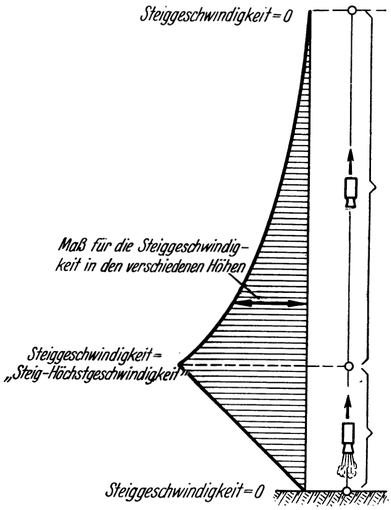
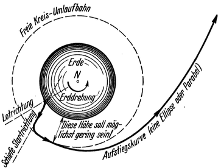
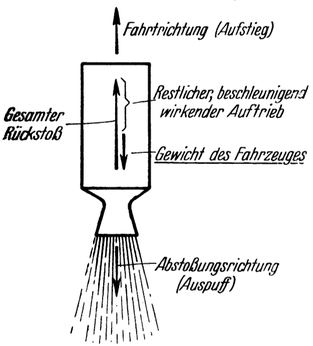
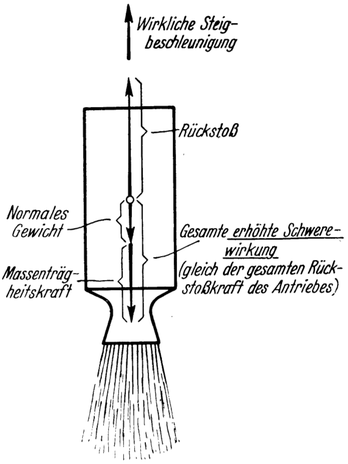
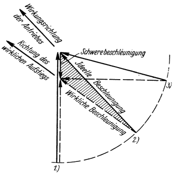

<#include "pagebreak.ftl">
Der Aufstieg.
=============

Von den wesentlichsten Teilen, aus welchen eine Raumfahrt
sich zusammensetzt: dem Aufstieg, der Fernfahrt durch den Weltraum
und der Rückkehr zur Erde (der Landung), wollen wir
hier nur den vorerst wichtigsten Teil: den *Aufstieg* behandeln,
denn dieser stellt an die Leistungsfähigkeit des Antriebes
weitaus die größten Anforderungen und ist deshalb auch für den
Aufbau des ganzen Fahrzeuges von entscheidender Bedeutung.

Abb. 19. Lotrechter Aufstieg — „<em>Steilaufstieg</em>” — einer Raumrakete.

\<@pagebreak 37/> Für die Durchführung desselben ergeben sich im Sinne des auch
schon zu Anfang über die Bewegungsweise in den Schwerefeldern
des Weltraums Angedeuteten<a class="refnote" id="rn1" href="#fn1">1</a>
2 grundsätzliche Möglichkeiten: der „Steilaufstieg” und der „Flachaufstieg”.

Beim *Steilaufstieg* erhebt sich das Fahrzeug in wenigstens
annähernd *lotrechter* Richtung. Dabei nimmt zunächst die Steiggeschwindigkeit
dank der vortreibenden Kraft des Rückstoßantriebes
von Null beginnend fortwährend zu (Abb. 19), und zwar
so lange bis eine derartig hohe Steiggeschwindigkeit erreicht ist —
wir wollen sie die „*Steig-Höchstgeschwindigkeit*” nennen —,
daß nun der Antrieb abgestellt und der weitere
Aufstieg bis zur gewünschten Höhe nur mehr unter
Wirkung der unterdessen im Fahrzeug aufgespeicherten
lebendigen Kraft als „Wurf nach aufwärts” vor sich gehen kann.

Abb. 20. „Flachaufstieg“ einer Raumrakete.
Der Energieaufwand für den Aufstieg ist hierbei am geringsten.

Beim *Flachaufstieg* hingegen erhebt sich das
Fahrzeug nicht lotrecht, sondern in *schiefer* (geneigter) Richtung, und es
handelt sich dabei weniger um die Erlangung von Höhe als vielmehr
besonders darum, *wagrechte* Geschwindigkeit zu gewinnen und
diese so lange zu steigern, bis die für die freie Umlaufbewegung
notwendige *Umlaufgeschwindigkeit* und damit der „stabile
Schwebezustand” erreicht ist (Abb. 5 und 20). Wir werden uns
mit dieser Aufstiegart später noch eingehender befassen.

Zunächst aber wollen wir noch einiges andere untersuchen,
darunter die Frage: wie es sich während des Aufstieges mit dem
*Wirkungsgrad* verhält; denn wie immer der Aufstieg erfolgen
mag, kann jedenfalls die erforderliche Endgeschwindigkeit nur
*nach und nach* erlangt werden, was zur Folge hat, daß die
\<@pagebreak /> Fahr-(Steig-)Geschwindigkeit der Raumrakete anfangs kleiner und
später (je nach der Höhe der Endgeschwindigkeit) größer als die
Abstoßungsgeschwindigkeit sein wird. Demgemäß muß aber auch
der Wirkungsgrad des Rückstoßes während des Aufstieges mit
Antrieb sich fortgesetzt ändern, da er ja gemäß unseren früheren
Feststellungen von dem jeweiligen gegenseitigen Größenverhältnis
der Fahr- und Abstoßungsgeschwindigkeit abhängt (siehe Tabelle I,
Seite 29). Er wird demnach anfangs nur klein sein, mit wachsender
Steiggeschwindigkeit allmählich zunehmen, schließlich (falls
die zu erreichende Endgeschwindigkeit entsprechend groß ist) sein
Maximum überschreiten und sodann wieder sinken.

Um sich unter diesen Umständen von der Größe des Wirkungsgrades
ein Bild machen zu können, muß man den während
der Dauer des Antriebes sich ergebenden „*mittleren* Wirkungsgrad
des Rückstoßes” ηrm in Betracht ziehen. 
Wie leicht einzusehen ist, wird dieser abhängen: einerseits von der 
Abstoßungsgeschwindigkeit c, die wir für die ganze Antriebsperiode als
*konstant* annehmen wollen, und andererseits von der am Ende
der Antriebsperiode schließlich erreichten Endgeschwindigkeit v'.

Aufschluß hierüber gibt die Formel<a class="refnote" id="rn2" href="#fn2">2</a>

ηrm = (v' / c)² / (ev'/c - 1)

\<@pagebreak />

<table id="tabelle4">
	<caption>Tabelle 4</caption>
	<tr align="center">
		<td rowspan="2" style="border-right: medium solid;">Verhältnis der Endgeschwindigkeit v' zur Abstoßungsgeschwindigkeit c:
		<strong>v'/c</strong></td>
		<td colspan="2">Mittlerer Wirkungsgrad des Rückstoßes ηrm
		während der Beschleunigungsperiode</td>
	</tr>
	<tr style="border-top: thin solid; border-bottom: medium double;">
		<td style="border-right: thin solid;">ηrm = (v' / c)² / (ev'/c - 1)</td>
		<td>ηrm in Prozenten</td>
	</tr>
	<tr><td>0	</td><td>0	</td><td>0 </td></tr>
	<tr><td>0,2	</td><td>0,18	</td><td>18</td></tr>
	<tr><td>0,6	</td><td>0,44	</td><td>44</td></tr>
	<tr><td>1	</td><td>0,58	</td><td>58</td></tr>
	<tr><td>1,2	</td><td>0,62	</td><td>62</td></tr>
	<tr><td>1,4	</td><td>0,64	</td><td>64</td></tr>
	<tr class="strong">
	    <td>1,59	</td><td>0,65	</td><td>65</td></tr>
	<tr><td>1,8	</td><td>0,64	</td><td>64</td></tr>
	<tr><td>2	</td><td>0,63	</td><td>63</td></tr>
	<tr><td>2,2	</td><td>0,61	</td><td>61</td></tr>
	<tr><td>2,6	</td><td>0,54	</td><td>54</td></tr>
	<tr><td>3	</td><td>0,47	</td><td>47</td></tr>
	<tr><td>4	</td><td>0,30	</td><td>30</td></tr>
	<tr><td>5	</td><td>0,17	</td><td>17</td></tr>
	<tr><td>6	</td><td>0,09	</td><td>9 </td></tr>
	<tr><td>7	</td><td>0,04	</td><td>4 </td></tr>
</table>

mit deren Hilfe die **Tabelle 4** ermittelt wurde. Dieselbe zeigt
den mittleren Wirkungsgrad des Rückstoßes in Abhängigkeit von
dem Verhältnis der am Ende der Antriebperiode erzielten 
Endgeschwindigkeit v' zu der während der Antriebsperiode herrschenden
Abstoßungsgeschwindigkeit c, also von v'/c. Darnach
ergäbe sich beispielsweise — bei einer Abstoßungsgeschwindigkeit
c = 3000 Meter je Sekunde — für eine Antriebsperiode, an deren
Ende die Endgeschwindigkeit v = 3000 Meter je Sekunde erlangt
wird (also für v'/c = 1), der mittlere Wirkungsgrad des Rückstoßes mit
\<@pagebreak /> 58 Prozent, für die Endgeschwindigkeit v = 12000 Meter je Sekunde
(also v'/c = 4) mit 30 Prozent usw. Er würde günstigenfalls, d. i.
für v'/c = 1,59, in unserem Beispiel also für eine Antriebsperiode
mit der Endgeschwindigkeit v' = 4770 Meter je Sekunde, sogar
65 Prozent erreichen.

Jedenfalls ersieht man, daß auch während des Aufstieges, trotz
der dabei auftretenden Schwankungen im Verhältnisse der Fahr-
und Abstoßungsgeschwindigkeit v/c der Wirkungsgrad noch immer
im allgemeinen nicht ungünstig ist.

Abb. 21. Solange das Fahrzeug während des Aufstieges durch den Antrieb <em>unterstützt</em>
(getragen) werden muß, <em>vermindert</em> sich die vortreibende Kraft desselben
um das Gewicht des Fahrzeuges.

Doch nebst dem in allen Fällen interessanten Problem des Wirkungsgrades
besteht speziell für den Aufstieg noch eine zweite Frage von hervorragender
Bedeutung. Sobald nämlich der Start stattgefunden und sich somit
das Fahrzeug von seiner Unterstützung (feste Unterlage oder
Aufhängung, Wasserspiegel, Startballon usw.) abgehoben hat,
wird es nur mehr durch den *Antrieb* getragen (Abb. 21), was aber — entsprechend der Natur
des Rückstoßes — mit fortgesetztem Arbeitsaufwand, also Betriebsstoffverbrauch,
verbunden ist. Dadurch wird jene Betriebsstoffmenge, welche für die Hebearbeit an und für sich schon
erforderlich ist, um einen weiteren, nicht unbedeutenden Betrag
vermehrt. Dieser Zustand dauert so lange an, bis — je nachdem
ob es sich um einen Steil- oder Flachaufstieg handelt — entweder
die notwendige Steig-Höchstgeschwindigkeit oder die erforderliche
\<@pagebreak /> wagrechte Umlaufgeschwindigkeit erreicht wird. Je früher dies
nun gelingt, desto kürzer ist auch die Zeitdauer, während welcher
das Fahrzeug durch den Antrieb unterstützt werden muß;
desto geringer wird dann aber auch der Betriebsstoffverbrauch
sein, der damit verbunden ist. Wir sehen also, daß man beim
Aufstieg trachten muß, möglichst *rasch* hohe Geschwindigkeit zu erlangen.

Abb. 22. Während der Dauer des Antriebes werden — infolge der dadurch hervorgerufenen
Beschleunigung (Geschwindigkeits-Zunahme) des Fahrzeuges — in demselben
<em>Trägheitskräfte</em> erweckt, die sich für das Fahrzeug wie eine Erhöhung der Schwere
äußern.

Allerdings ist bei Raumschiffen, welche für Menschenbeförderung geeignet sein sollen,
darin bald eine Grenze gesetzt. Denn bei einer (wie hier durch den Antrieb) *erzwungenen*,
also nicht durch das freie Spiel der Massenkräfte *allein* veranlaßten Geschwindigkeitszunahme,
hat die damit verbundene Beschleunigung stets das *Freiwerden* von Massenkräften
zur Folge. Diese äußern sich beim Aufstieg für das Fahrzeug wie eine Erhöhung der
Schwere (Abb. 22) und dürfen ein gewisses Maß nicht überschreiten, damit die 
mitfahrenden Menschen keine gesundheitlichen Schädigungen
erleiden. Durch Oberth sowie durch Hohmann angestellte vergleichende
Untersuchungen und auch die bisherigen Erfahrungen
des Flugwesens (z. B. bei Schraubenflügen) lassen vermuten, daß
bei *lotrechtem* Aufstieg eine *wirkliche Steigbeschleunigung*
bis zu 30 m/sec² noch zulässig sein mag. In diesem Falle stünde
das Fahrzeug und sein Inhalt während der Dauer des Antriebes,
\<@pagebreak /> wie unter der Einwirkung einer Schwerkraft von der vierfachen
Stärke der normalen Erdschwere. Man unterschätze nicht, was das
bedeutet! Denn dies heißt nicht weniger, als daß die Füße nahezu
das Vierfache des gewöhnlichen Körpergewichtes zu tragen hätten.
Deshalb kann diese Periode des Aufstieges, die jedoch nur einige
Minuten dauert, von den mitfahrenden Menschen nicht anders als in liegender
Stellung verbracht werden, wozu Oberth Hängematten vorsieht.

Mit Rücksicht auf diese Einschränkung in der Größe der Beschleunigung,
kann mit bemannten Raumschiffen bei *lotrechtem*
Aufstieg jene Steig—Höchstgeschwindigkeit, welche hierbei
zur gänzlichen Loslösung von der Erde erforderlich wäre, erst
in einer Höhe von etwa 1600 km erlangt werden. Sie beträgt
dann rund 10000 Meter je Sekunde und wird nach etwas mehr als
5 Minuten erreicht. Solange also muß der Antrieb wirken. Während
dieser Zeit ist nun laut Früherem das Fahrzeug durch den
Antrieb *unterstützt* (getragen), und muß außerdem noch der
*Widerstand der Erdlufthülle* überwunden werden. Beide
Umstände verursachen aber eine *Vermehrung* des Arbeitsverbrauches,
so daß der *gesamte* für den Aufstieg bis zur gänzlichen
Loslösung von der Erde notwendige Arbeitsaufwand
schließlich ebenso groß wird, als wenn dem Fahrzeug im ganzen
eine *ideelle Höchstgeschwindigkeit* von rund 13000 Meter
je Sekunde erteilt werden müßte. Diese nun (nicht die wirkliche
Steig-Höchstgeschwindigkeit von 10000 Meter je Sekunde) ist für
die Menge der erforderlichen Betriebsstoffe maßgebend.

Etwas günstiger ist es, wenn der Aufstieg nicht in der Lotrechten,
sondern in einer *schiefen* Kurve erfolgt; insbesondere
wenn dabei außerdem noch getrachtet wird, so nahe über der
Erdoberfläche, als dies mit Rücksicht auf den Luftwiderstand gerade
noch tunlich erscheint (vielleicht in etwa 60—100 km Seehöhe),
die *freie Umlaufbewegung* um die Erde zu erreichen,
und erst dann —— und zwar durch weitere Steigerung der Umlaufgeschwindigkeit
— auf die zur Erlangung der gewünschten
Höhe oder zur gänzlichen Loslösung von der Erde notwendige
Höchstgeschwindigkeit hingearbeitet wird („Flachaufstieg”, Abb. 20).

\<@pagebreak /> Die *schiefe Aufstiegrichtung* hat nämlich den Vorteil, daß
die Erdschwere dem Antrieb nicht in voller Stärke entgegenwirkt
(Abb. 23) und sich daher bei *gleicher ideeller* Beschleunigung
(gleichem Antrieb) — welche laut Früherem ja mit Rücksicht auf
gesundheitliche Zuträglichkeit begrenzt ist — eine *größere wirkliche*
Beschleunigung ergibt. Letzteres hat aber zur Folge, daß
die für den Aufstieg notwendige Höchstgeschwindigkeit früher erreicht wird.

Abb. 23. Beschleunigungspolygon für: 
1.) lotrechten‚ 2.) schiefen, 3.) wagerechten Aufstieg.

Man erkennt deutlich, daß trotz <em>gleichbleibender</em> ideeller Beschleunigung (Stärke
des Antriebes) die <em>wirkliche</em> Beschleunigung von 1.) nach 3.) immer größer wird. (Das
Beschleunigungspolygon für 2.) ist durch Schraffur hervorgehoben.)

Der möglichst baldige Übergang in die *freie Umlaufbewegung* aber verursacht,
daß das Fahrzeug an und für sich rascher als sonst (und zwar durch das
sich dabei ergebende frühzeitige Wirksamwerden der Fliehkraft) der Erdschwere
entzogen wird.

Beide Umstände nun wirken dahin, die Zeitdauer, während welcher das Fahrzeug
durch den Antrieb getragen werden muß, zu verkürzen und dadurch an Energieaufwand
zu sparen. Infolgedessen beträgt bei Anwendung dieses Aufstiegmanövers
die zwecks gänzlicher Loslösung von der Erde dem
Fahrzeug zu erteilende ideelle Höchstgeschwindigkeit nach Oberth
nur rund 12000 Meter je Sekunde. Bei Annahme einer *ideellen
Höchstgeschwindigkeit von etwa 12500 Meter je Sekunde*
dürfte man nach Meinung des Verfassers dem hierbei praktisch
wirklich Erreichbaren am nächsten kommen.

Doch wie immer der Aufstieg auch vor sich gehen mag, er
\<@pagebreak /> erfordert jedenfalls *sehr bedeutende Beschleunigungen*, so daß
das Fahrzeug schon in der Höhe von einigen Kilometern bereits
Geschoßgeschwindigkeit erlangen wird. Dieser Umstand hat aber —
bei der großen Dichte der tiefsten, erdnahen Luftschichten —
zur Folge, daß der Luftwiderstand im allerersten Teile des Aufstieges
recht ungünstig hohe Werte erreicht, was insbesondere für
*unbemannte* Raumraketen gilt; denn da für letztere gesundheitliche
Rücksichten nicht bestehen, können bei ihnen noch viel
größere Steigbeschleunigungen als bei bemannten Fahrzeugen angewendet werden.

Um diesem Nachteil zu begegnen, wird man daher den *Start von
einer möglichst hoch gelegenen Stelle der Erde aus* stattfinden
lassen, z. B. von einem Startballon oder sonstigem Luftfahrzeug
oder von einem entsprechend hohen Berg. Bei ganz
großen Raumschiffen könnte allerdings wegen ihres Gewichtes
nur letztere Möglichkeit in Frage kommen, wenn in diesem Falle
der Start nicht überhaupt lieber aus normaler Höhe vorgenommen wird.

<a href="#rn1">1</a>Siehe Seite 16.

<a href="#rn2">2</a>
Der mittlere Wirkungsgrad des Rückstoßes ηrm = Gewonnene Energie / Aufgewendete Energie
 = Lebendige Kraft der Endmasse M bei der Endgeschwindigkeit v' / Lebendige Kraft der Abstoßungsmasse (M0 - M) bei der Abstoßungsgeschwindigkeit c
 also: ηrm = (Mv'²/2) / ((M0 - M) c² / 2)

Daraus folgt mit M0 = Mev'/c (siehe folgende Seite 49):
 ηrm = (Mv'²) / (Mev'/c - M)c²
 = (v' / c)² / (ev'/c - 1)

