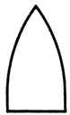
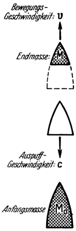

<#include "pagebreak.ftl">
Allgemeines über den Aufbau der Raumrakete.
===========================================

Entsprechend der Mannigfaltigkeit der Zwecke und Ziele, welche
für die Raumschiffahrt in Frage kommen, werden auch die an
das Fahrzeug gestellten Anforderungen in jedem Reisefalle verschiedenster
Art sein. Es wird sich daher bei Raumschiffen in
viel weitgehenderem Maße als bei den bisher bekannten Verkehrsmitteln
als notwendig erweisen, den Aufbau des Fahrzeuges der
Eigenart des jeweiligen Reisefalles anzupassen. Trotzdem werden
doch die wesentlichen Einrichtungen sowie auch die Gesichtspunkte,
die für den Aufbau bestimmend sind, allen Raumschiffen
gemeinsam sein.

Die äußere Form eines Raumfahrzeuges wird der eines Geschosses
ähnlich sein müssen. Denn bei den hohen Geschwindigkeiten,
welche es noch innerhalb der Erdlufthülle erreicht
(Geschoßgeschwindigkeit nach Früherem!), ist die Geschoßform zur
Überwindung des Luftwiderstandes am besten geeignet.

\<@pagebreak 45/> Grundlegend für den inneren Aufbau eines Raketenfahrzeuges
ist die Art des verwendeten Betriebsstoffes. Von diesem
ist zu fordern:

1. Daß sich mit ihm eine möglichst hohe Auspuffgeschwindigkeit
erzielen lasse, denn wir haben schon früher eine möglichst
hohe Abstoßungsgeschwindigkeit der fortgeschleuderten
Massen als notwendig erkannt.

2. Daß er möglichst große Dichte besitze (hohes spezifisches
Gewicht), damit zur Unterbringung der notwendigen Gewichtsmenge
ein tunlichst kleiner Behälter genüge. Denn dann vermindert
sich einerseits das Behältergewicht und werden anderseits
auch die Verluste infolge des Luftwiderstandes geringer.

3. Daß seine Verbrennung in ungefährlicher und für die Erzeugung
einer stetigen Vortriebskraft geeigneten Weise durchführbar sei.

4. Daß seine Handhabung möglichst geringe Schwierigkeiten
verursache.

Am naheliegendsten wäre es, ähnlich wie bei Feuerwerkraketen,
irgendeine Art von Schießpulver oder einen ähnlichen Körper,
also einen festen Betriebsstoff zu benützen. Der Aufbau des
Fahrzeuges könnte dann verhältnismäßig einfach, ähnlich jenem
der bekannten Feuerwerkrakete sein. Es wäre gewiß möglich,
auch auf diese Weise für verschiedene besondere Aufgaben dienliche,
hauptsächlich aber der Kriegstechnik neue Wege bahnende
Vorrichtungen zu schaffen, worauf wir im Nachfolgenden noch
zu sprechen kommen.

Für Zwecke der Weltraumbefahrung aber, namentlich wenn
hierbei auch die Beförderung von Menschen möglich gemacht
werden soll, dürfte jedoch die Anwendung flüssiger Betriebsstoffe
weit mehr Aussicht auf Entwicklungsmöglichkeiten
bieten, trotzdem damit erhebliche technische Schwierigkeiten verbunden
sind, wie später dargelegt wird.

Die wichtigsten Teile eines Raumschiffes für flüssigen
Betriebsstoff sind: Die Treibvorrichtung, die Behälter für die
Betriebsstoffe, der Fahrraum und die Landungsmittel.

\<@pagebreak /> Die Treibvorrichtung ist der Antriebsmotor des Raumschiffes.
In ihr soll der Rückstoß erzeugt und dadurch die mitgeführte,
in den Betriebsstoffen aufgespeicherte Energie in Vortriebsarbeit
umgewandelt werden. Hierzu aber ist vor allem
notwendig, den Betriebsstoff in einen geschlossenen Raum einzubringen,
um ihn dort verbrennen und sodann nach rückwärts
ausströmen (auspuffen) lassen zu können. Dafür bestehen nun
zwei grundsätzliche Möglichkeiten, und zwar:

1. Im Verbrennungsraum herrscht ständig die gleiche Druckspannung.
Man muß daher den Betriebsstoff, um ihn einzuführen,
in den Verbrennungsraum unter Überwindung dieses Druckes
einpressen. Wir wollen die so arbeitenden als 
„Gleichdruck-Raketen-Motore” bezeichnen.

2. Die Verbrennung geschieht so, daß der Verbrennungsraum
in rascher Aufeinanderfolge stets von neuem mit Betriebsstoff
geladen, letzterer sodann immer wieder‚zur Explosion (Verpuffung)
gebracht und jedesmal vollständig ausströmen gelassen
wird. In diesem Fall kann das Einbringen des Betriebsstoffes auch
ohne Überdruck erfolgen. Solche wollen wir „Verpuffungs-
(oder Explosions-)Raketen-Motore” nennen.

Die Hauptbestandteile des Gleichdruck—Raketen—Motors
sind: der Verbrennungsraum, auch „Ofen” genannt, und die
daran anschließende „Düse” (Abb. 24), welche Teile je nach Bedarf
in verschiedener Anzahl vorgesehen sein können.

Die Wirkungsweise ist folgende: Der Betriebsstoff (Brennstoff
und Sauerstoff) wird in geeignetem Zustande mittels entsprechenden
Überdruckes in den Ofen eingepreßt und dortselbst verbrannt.
Dabei verwandelt sich seine chemisch gebundene Energie
in Wärme und — gemäß der damit verbundenen Temperaturerhöhung —
auch in Druckspannung der so entstandenen, im
Ofen eingeschlossenen Verbrennungsgase. Unter der Wirkung
dieses Druckes strömen nun die Verbrennungsgase durch die Düse
aus und erlangen dadurch jene Geschwindigkeit, die wir schon
früher als „Auspuffgeschwindigkeit” bezeichnet haben. Die mit
dieser Geschwindigkeitserteilung verbundene Beschleunigung der
\<@pagebreak /> Gasmoleküle hat aber das Auftreten von Massenträgheits-Gegenkräften
zur Folge (Gegendruck, ähnlich wie beim Fortstoßen
eines Gegenstandes<a class="refnote" id="rn1" href="#fn1">1</a>!)‚ deren Summe nun jene Kraft des „Rückstoßes”
ergibt (Abb. 24), welche das Fahrzeug vortreiben soll,
in gleicher Weise, wie dies schon einleitend besprochen wurde<a class="refnote" id="rn2" href="#fn2">2</a>.
So wird aus der in den Betriebsstoffen chemisch gebundenen
Energie über Wärme, Druck, Beschleunigung und Rückstoß‚ die
Vortriebsarbeit gewonnen.

Damit dieser Vorgang stetig aufrechterhalten bleibt, muß dafür
gesorgt werden, daß fortgesetzt frischer Betriebsstoff in den Ofen
nachströmt. Hierzu ist aber, wie früher bereits erwähnt, notwendig,
daß die Betriebsstoffe gegen den Ofen einen gewissen
Überdruck aufweisen. Soll letzterer schon in den Behältern vorhanden

Abb. 24. Der Verbrennungsraum oder „Ofen“ und die „Düse“, die Hauptbestandteile
des Gleichdruck-Raketen-Motors.

sein, dann müßten dieselben auch dementsprechende Wandstärke
besitzen, was bei größeren Behältern jedoch Schwierigkeiten
bereiten dürfte. Andernfalls wieder müssen Pumpen mitgeführt
werden, um mittels dieser die Betriebsstoffe auf den notwendigen
Druck zu bringen.

Weiterhin sind entsprechende Vorrichtungen wie Zerstäuber,
Verdampfer u. dgl. erforderlich, damit die flüssig mitgeführten
Betriebsstoffe auch in den zur Verbrennung geeigneten Zustand
umgewandelt werden können. Endlich muß auch für hinreichende
Kühlung von Ofen und Düse, für Regulierung usw. vorgesorgt sein.

\<@pagebreak /> Die ganze Einrichtung hat manche Ähnlichkeit mit einer
Gleichdruck-Gasturbine. Und ebenso wie dort besteht auch hier die
nicht einfache Frage nach einem geeigneten, den hohen Temperaturen
standhaltenden Material und nach entsprechender Kühlungsmöglichkeit
für Verbrennungsraum und Düse. Hingegen
entfällt die dort so kritische Kompressorfrage.

<table>
<tr>
  <td>Nach geleistetem Antrieb: Die Rakete ist auf die gewünschte Bewegungsrichtung gebracht.</td>
  <td></td>
  <td>Verbliebene „Endmasse“ der Rakete.</td>
</tr>
<tr>
  <td>Während des Antriebes: Die Rakete wird beschleunigt.</td>
  <td></td>
  <td>Es wird forgesetzt Raktenmasse (nämlich Betriebsstoff) abgestoßen.</td>
</tr>
<tr>
  <td>Im startbereiten Zustand: Die Rakete befindet sich noch in Ruhe.</td>
  <td></td>
  <td>„Anfangsmasse“ der Rakete.</td>
</tr>
</table>
<bu>Abb. 25.</bu>

Desgleichen weist auch der Verpuffungs-Raketen—Motor
mit der ihm verwandten Turbinenart, der Verpuffungs-(Explosions-)Gasturbine,
viele Ähnlichkeiten auf. Wie bei dieser muß
auch hier der Vorteil leichterer Einbringungsmöglichkeit des Betriebsstoffes
durch schlechteren thermischen Wirkungsgrad und
komplizierteren Aufbau erkauft werden.

Welcher Konstruktionsart der Vorzug zu geben wäre, kann
erst die zukünftige Entwicklung des Raketen-Motors zeigen. Es
wird dies zum Teil vielleicht auch von dem jeweiligen besonderen
Verwendungszweck desselben abhängen.

\<@pagebreak /> Doch es würde nicht allein genügen, nur über einen auch im
völlig leeren Raum wirksamen Motor zu verfügen. Wir müssen
noch die Möglichkeit haben, die notwendigen Energiemengen in
Form von Betriebsstoffen in den Weltraum mitnehmen zu können
und damit stehen wir vor der entscheidend wichtigen Frage:
der Bauweise der Behälter für die Betriebsstoffe.

Abb. 26.

Wie groß ist nun eigentlich die Menge der mitzunehmenden
Betriebsstoffe? Wir wissen, daß der Antrieb des
Raketen—Fahrzeuges dadurch erfolgt, daß es fortgesetzt
Teile seiner eigenen Masse (in unserem
Falle eben die Betriebsstoffe in vergastem Zustande)
nach rückwärts abstößt. Es wird sich also
die Anfangsmasse des Fahrzeuges (d. i. dessen
gesamte Masse im startbereitem Zustand), nachdem
der Antrieb eine gewisse Zeit gearbeitet hat,
um die dabei verbrauchte (zur Abstoßung gelangte)
Betriebsstoffmenge bis auf eine bestimmte
Endmasse verkleinert haben (Abb. 25). Letztere
stellt mithin die gesamte Last dar, welche eben
mittels der verbrauchten Betriebsstoffmenge
befördert werden konnte und wird gebildet aus
der Nutzlast, dem Fahrzeug selbst und dem verbleibenden
Betriebsstoffrest.

Die Frage lautet nun (Abb. 26): Wie groß muß
die Anfangsmasse M0 sein, wenn bei gleichbleibender
Auspuffgeschwindigkeit c eine bestimmte

Endmasse M auf die Bewegungsgeschwindigkeit v gebracht werden
soll? Antwort darauf gibt die Raketengleichung:
M0 = 2,72v/cM

Danach berechnet sich die Anfangsmasse M0 einer Raumrakete,
welche befähigt sein soll, sich die zur Erreichung der gänzlichen
Loslösung von der Erde annähernd notwendige, schon früher
erwähnte<a class="refnote" id="rn3" href="#fn3">3</a> ideelle
Steig-Höchstgeschwindigkeit von 12500 Meter je
Sekunde zu erteilen, wie folgt:

\<@pagebreak /> 
	M0 = 520 M, für c = 2000 Meter je Sekunde,
	M0 =  64 M, für c = 3000 Meter je Sekunde,
	M0 =  23 M, für c = 4000 Meter je Sekunde,
	M0 =  12 M, für c = 5000 Meter je Sekunde.

Dies sagt also: Für den Fall, daß die Auspuffgeschwindigkeit c
beispielsweise 3000 Meter je Sekunde beträgt, muß das Fahrzeug zu
Beginn des Antriebes, also mit den für den Aufstieg notwendigen
Betriebsstoffen, 64 mal so schwer sein, als nach Verbrauch derselben.
Es müssen demnach die Behälter ein derartiges Fassungsvermögen
besitzen, daß sie eine Betriebsstoffmenge aufnehmen
können, welche 63 mal so viel wiegt, als die leere Raumrakete
samt der zu befördernden Last, oder anders ausgedrückt: eine
Betriebsstoffmenge, welche 98,5 Prozent vom Gesamtgewicht des
startbereiten Fahrzeuges ausmacht.

Doch würde auch schon eine Betriebsstoffmenge von 22-fachem
Gewicht genügen, wenn die Auspuffgeschwindigkeit 4000 Meter je
Sekunde beträgt und nur mehr von 11-fachem, wenn sich die
Auspuffgeschwindigkeit bis auf 5000 Meter je Sekunde steigern ließe.
Es entfielen dann auf den Betriebsstoffanteil: 96 bzw. 92 Prozent
vom Gesamtgewicht des startbereiten Fahrzeuges.

Man erkennt aus diesen Zahlen deutlich die schon so oft betonte,
außerordentliche Wichtigkeit möglichst hoher Abstoßungs—(Auspuff-)
Geschwindigkeit. (Dieselbe ist ja der Ausdruck des
praktischen Energiewertes des verwendeten Betriebsstoffes!)

Ein derartig großes wie das oben errechnete Betriebsstoff—Fassungsvermögen
müssen jedoch nur solche Raumraketen aufweisen,
welche befähigt sein sollen, sich die zur gänzlichen Loslösung
von der Erde erforderliche Steig—Höchstgeschwindigkeit zu erteilen.
Hingegen ergibt sich bei verschiedenen (später erläuterten) Anwendungsarten,
bei denen auch schon kleinere Höchstgeschwindigkeiten
genügen, das „Massenverhältnis” (Verhältnis der Anfangs- zur
Endmasse der Rakete: M0/M) wesentlich günstiger.

\<@pagebreak /> In letzteren Fällen würde es keine grundsätzlichen Schwierigkeiten
bereiten, den Anforderungen hinsichtlich des
Betriebsstoff-Fassungsvermögens des Fahrzeuges bzw. der Behälter
bautechnisch zu entsprechen. Beispielsweise müßte eine Raumrakete,
welche bei einer Auspuffgeschwindigkeit c = 3000 Meter je Sekunde
die Endgeschwindigkeit v = 4200 Meter je Sekunde erlangen
soll, ein Massenverhältnis M0/M = 4 aufweisen, wie sich aus
der Raketengleichung ergibt. D. h. sie müßte befähigt sein, eine
Betriebsstoffmenge Zu fassen, die 75 Prozent ihres gesamten Startgewichtes
ausmacht, was bautechnisch ohne Zweifel zu erreichen möglich ist.

Allerdings, solche Raumraketen, welche die zur gänzlichen Loslösung
von der Erde notwendigen Betriebsstoffmengen (die laut
Früherem bei einer Auspuffgeschwindigkeit c = 3000 Meter je Sekunde
98,5 Prozent des Startgewichtes betragen) mitführen können,
wären praktisch wohl nicht ohne weiteres ausführbar. Doch
es gibt zum Glück einen Kniff, der es ermöglicht, diese Bauschwierigkeit
in sehr einfacher Weise zu umgehen: das sogenannte
Stufenprinzip, welches sowohl Goddard wie Oberth unabhängig
voneinander als ein grundlegendes Prinzip der Raketentechnik erkannten.

Darnach verzichtet man überhaupt darauf, die gewünschte Endgeschwindigkeit
mit einer einzigen Raumrakete zu erreichen;
sondern man unterteilt vielmehr die letztere in mehrere Einheiten
(Stufen), von denen jede immer die Last der nächstgrößeren
Einheit bildet. Handelt es sich z. B. um eine dreistufige
Raumrakete, dann besteht dieselbe eben aus drei Teilraketen:
die Teilrakete 3 ist die kleinste und trägt die eigentliche
Nutzlast. Sie bildet (samt dieser) die Last der Teilrakete 2
und letztere wieder (samt der Teilrakete 3 und deren Nutzlast)
die Last der Teilrakete 1. Beim Aufstieg nun arbeitet zuerst die
Teilrakete 1. Sobald dieselbe aufgebraucht ist, wird ihr Leerkörper
abgekoppelt, und es beginnt die Teilrakete 2 zu wirken. Ist auch
diese verbraucht, bleibt auch sie zurück, und es arbeitet nun bis
\<@pagebreak /> zur Erreichung der gewünschten Endgeschwindigkeit die Teilrakete 3.
Nur letztere kommt mit der Nutzlast bis an das Ziel.

Da sich bei diesem Vorgang die Endgeschwindigkeiten der drei
Teilraketen addieren, muß jede einzelne derselben nur 1/3 der insgesamt
geforderten Endgeschwindigkeit hervorbringen können.

Bei einer 3stufigen Raumrakete also, welche die zur gänzlichen
Loslösung von der Erde notwendige Steig—Höchstgeschwindigkeit
von 12 500 Meter je Sekunde erlangen soll, würde demnach auf jede
Teilrakete nur eine zu erreichende Endgeschwindigkeit von rund
4200 Meter je Sekunde entfallen. Dafür genügt aber, wie wir schon
früher feststellten, z.B. bei einer Auspuffgeschwindigkeit c = 3000
Meter je Sekunde, das technisch zweifellos ausführbare Betriebsstoff-Fassungsvermögen
von 75 Prozent (Massenverhältnis M0/M = 4). Sind
aber die einzelnen Teilraketen herstellbar, dann kann auch über
die Erbauungsmöglichkeit der daraus zusammengesetzten Gesamtrakete
kein Zweifel bestehen.

Untersuchen wir vorsichtshalber noch die absoluten Größen
der sich bei obigem Beispiel ergebenden Raketen-Massen oder
-Gewichte. Angenommen es sei eine Nutzlast von 10 Tonnen von
der Erde loszulösen; die einzelnen Teilraketen mögen derart gebaut
sein, daß ihr Leergewicht ebenso groß ist wie die von ihnen
zu befördernde Last. Dann ergeben sich die Gewichte der Teilraketen
in Tonnen wie folgt:

<table>
<tr><td>Teilrakete</td><td>Last</td><td>Eigengewicht</td><td>Endgewicht M</td><td>Anfangsgewicht M0</td></tr>
<tr><td><b>3</b></td><td><b>10</b></td><td>10</td><td>10 + 10 = 20<a class="refnote" id="rn4" href="#fn4">4</a></td><td>4 x 20 = 80<a class="refnote" id="rn5" href="#fn5">5</a></td></tr>
<tr><td>2 + 3</td><td>8o</td><td>8o</td><td>80 + 80 = 160</td><td>4 x 160 = 640</td></tr>
<tr><td>1 + 2 + 3</td><td>640</td><td>640</td><td>640 + 640 = 1280</td><td>4 x 1280 = <b>5120</b></td></tr>
</table>

\<@pagebreak /> Das Anfangsgewicht der gesamten, aus 3 Stufen bestehenden
Raumrakete würde also 5120 Tonnen betragen, welche Zahl einer
Technik, die u. a. beispielsweise Ozeandampfer von 50000 Tonnen
zu schaffen imstande ist, wohl nicht sonderlich imponieren kann.

Auf diese Weise — mittels des Stufenprinzipes — wäre es,
wenigstens theoretisch, eigentlich möglich, jede beliebige Endgeschwindigkeit
zu erreichen. Praktisch werden sich darin, insbesondere
mit Rücksicht auf die absoluten Größen der Anfangsgewichte,
natürlich gewisse Grenzen ergeben. Trotzdem aber
liegt im Stufenprinzip ein unumstößlicher Beweis, daß es grundsätzlich
möglich wäre,_ Zur Lfoslösung vonder Erde geeignete
Raumraketen auIch schon mlit den heute zur Verfügung
stehenden Mitteln zu schaffen.

Damit soll jedoch nicht {gesagt sein, daß das Stufenprinzip in
der erläuterten Form bereits die ideale Lösung für die Konstruktion
der Raumrakete darstellt; denn es führt zu einer Vermehrung
der toten Last und damit des zur Beförderung notwendigen Betriebsstoffes.
Doch darauf kommt es jetzt nicht an. Vorerst handelt
es sich nur darum, zu zeigen, „daß es überhaupt möglich ist“.
Zweifellos aber wird jede Raumraketenbauart, wie immer sie auch
sein möge, sich den im Stufenprinzip zum Ausdruck kommenden
Grundsatz zu eigen machen müssen: während der Dauer des Antriebes —
zwecks Betriebsstoffersparnis — jeden Fahrzeugteil, der
überflüssig geworden ist, sofort loszukoppeln (abzuwerfen),
um nicht totes Gewicht nutzlos mitzuschleppen und gleichzeitig
mit dem übrigen noch weiterhin beschleunigen zu müssen; vorausgesetzt
natürlich, daß es sich um Raumraketen handelt, die
größere Endgeschwindigkeiten erreichen sollen.

Auch wollen wir uns nicht verhehlen, daß es gewiß noch einige
Schwierigkeiten bereiten wird, den — trotz des Stufenprinzipes —
noch immer recht bedeutenden Anforderungen an das Fassungsvermögen
der Betriebsstoffbehälter einer Raumrakete bautechnisch gerecht
zu werden. Es wird hierzu teilweise notwendig sein, vom
bisher Üblichen grundsätzlich abweichende Konstruktionsmethoden
anzuwenden; denn es müssen alle Teile des Fahrzeuges, insbesondere
\<@pagebreak /> die Behälter, so leicht als nur irgend möglich ausgeführt
werden. Trotzdem aber müssen letztere genügend Festigkeit und
Steifheit besitzen, um beim Aufstieg sowohl dem Massendruck als
auch dem Luftdruck widerstehen zu können, wobei man noch zu
berücksichtigen hat, daß bei den äußerst niederen Temperaturen,
welchen sie meist ausgesetzt sind, viele der üblichen Metalle bereits
spröde werden und daher an Festigkeit einbüßen.

Ferner muß in einem Raumschiff ein Fahrraum (Fahrzelle)
vorhanden sein zur Unterbringung des Führers, der Fahrgäste und
des zum Leben Notwendigen an Vorräten und sonstigem Zubehör,
sowie zur Aufnahme der Fracht, der wissenschaftlichen Beobachtungsgeräte
usw. Derselbe muß luftdicht abschließen und entsprechende
Vorkehrungen zur künstlichen Versorgung mit Atmungsluft und
zur Aufrechterhaltung erträglicher Temperatur aufweisen. In ihm
sind auch alle zur Steuerung des Fahrzeuges notwendigen Einrichtungen
untergebracht, wie Handgriffe zur Regelung der Treibvorrichtung,
Meßgeräte für Zeit, Beschleunigung, Geschwindigkeit,
Weg (Höhe) und zur Ortsbestimmung, Vorrichtungen zur Einhaltung
der gewünschten Fahrtrichtung u. dgl. Auch Raumanzüge
(siehe Folgendes)„Hängematten‚ usw. müssen vorhanden sein.

Schließlich gehören zur Ausrüstung eines Raumschiffes noch
die sehr wichtigen Hilfsmittel für die Landung, Wie Fallschirme,
Tragflächen u. a. m.

<a href="#rn1">1</a>Siehe Seite 21 und 22, Abb. 12.

<a href="#rn2">2</a>Siehe Seite 23.

<a href="#rn3">3</a>Siehe Seite 43.

<a href="#rn4">4</a>
Das Endgewicht M ist gleich dem Eigengewicht plus der Last, wenn die
Rakete — wie hier — bis zum gänzlichen Verbrauch ihres Betriebsstoffes arbeitet.

<a href="#rn5">5</a>
Das Anfangsgewicht M0 ist hier gleich dem 4fachen Endgewicht M, da
laut Früherem in unserem Beispiel jeder Teilrakete das Massen(Gewichts-)verhältnis
M0/M = 4 zukommt.

