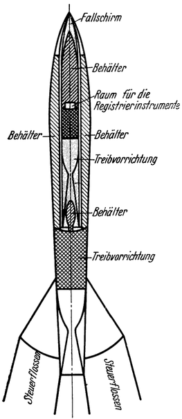
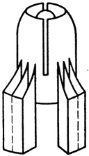
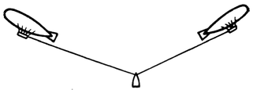
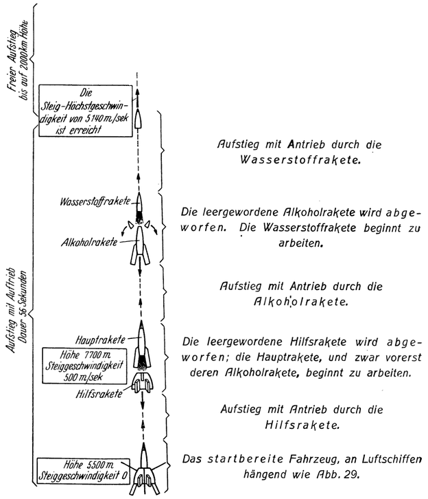
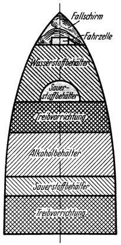
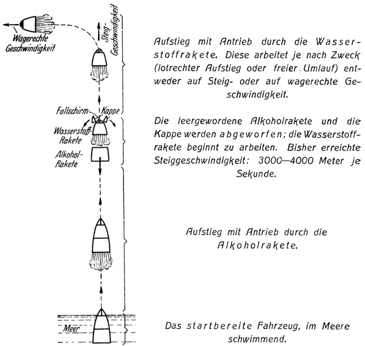
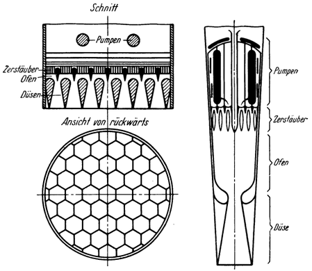
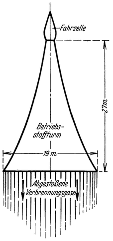

Die bisherigen Vorschläge.
==========================

Nun die verschiedenen bisher zur praktischen Lösung des
Raumfahrtproblems gemachten Vorschläge:

Prof. Goddard verwendet als Betriebsstoff seiner Raumraketen
rauchloses Pulver, also einen festen Körper. Er hat keinen
bestimmten Apparat beschrieben, sondern schlägt nur allgemein
vor, das Pulver in Patronen verpackt, nach Art eines Maschinengewehres,
automatisch in den Verbrennungsraum einzubringen.
Die ganze Rakete soll aus einzelnen Teilraketen zusammengesetzt
sein, welche während des Aufstieges nacheinander abgeworfen
werden, sobald sie verbraucht sind, bis auf jene in welcher sich
die Last befindet, und die allein an das Ziel gelangt. Er beabsichtigt
vorerst unbemannte Apparate auf einige 100 km Höhe
aufsteigen zu lassen. Später will er auch versuchen, eine unbemannte,
nur mit einigen Kilogramm Leuchtpulver ausgerüstete
Rakete bis zum Mond emporzuschicken. Beim Auftreffen dortselbst
soll der Leuchtsatz aufblitzen, was mit unseren Großfernrohren
wahrgenommen werden könnte und so das Gelingen des
Versuches anzeigen würde. Dem Vernehmen nach besteht für
die Goddardschen Apparate von seiten der amerikanischen Kriegsmarine
besonderes Interesse.

Sehr wertvoll sind die Ergebnisse der von Goddard angestellten
und bisher veröffentlichten praktischen Vorversuche,
für deren Durchführung ihm von der bekannten Smithsonian
Institution in Washington in großzügiger Weise die Mittel zur
Verfügung gestellt wurden: Er konnte bei entsprechender Formgebung
und Ausführung der Düsen mit gewissen Sorten von
rauchlosem Pulver Auspuffgeschwindigkeiten bis zu 2434 Meter je
Sekunde erreichen. Hierbei gelang es ihm, von der im Pulver
chemisch gebundenen Energie 64,5 Prozent auszuwerten, also in
lebendige Kraft der ausströmenden Verbrennungsgase umzusetzen.
Dieses Ergebnis stimmt nahezu überein mit den Erfahrungen der
Ballistik, nach welchen etwa 2/3 vom Energieinhalte des Pulvers
ausgenützt werden können, während der Rest auf die von den
Abgasen mitgeführte Wärme entfällt und dadurch verlorengeht.
Vielleicht wird sich bei weiterer technischer Vervollkommnung
der Wirkungsgrad von Ofen und Düse auch noch um Einiges
erhöhen, etwa bis nahe an 70 Prozent bringen lassen.

Somit dürfte, nach Berücksichtigung der noch hinzukommenden,
durch die verschiedenen Hilfsapparate (wie Pumpen u. dgl.)
sowie durch sonstige Umstände verursachten Verluste, für die
ganze Treibvorrichtung — also den Raketen—Motor — insgesamt
ein „innerer Wirkungsgrad” von etwa 60 Prozent zu
erwarten sein. Ein sehr günstiges Ergebnis, wenn man bedenkt, daß
der Wirkungsgrad selbst unserer besten bisher bekannten Wärmekraftmaschinen
kaum mehr als 38 Prozent beträgt.

Man möge aber den soeben betrachteten inneren Wirkungsgrad
wohl unterscheiden von jenem, mit welchem wir uns schon früher
befaßten: dem Wirkungsgrad des Rückstoßes<a class="refnote" id="rn1" href="#fn1">1</a>, den man zum
Unterschied auch als den „äußeren Wirkungsgrad“ des Raketen—Motors
bezeichnen könnte. Beide sind voneinander gänzlich unabhängig
und müssen zugleich berücksichtigt werden, um den
Gesamtwirkungsgrad des Fahrzeuges (der eben das Produkt
des inneren und des äußeren Wirkungsgrades ist) Zu erhalten. In
der Hauptkolonne 3 der Tabelle 2, Seite 33 sind als Beispiel die
Werte desselben für Benzol als Betriebsstoff schon angeführt worden.

Prof. Oberth schlägt im Gegensatze zu Goddard vor, flüssige
Betriebsstoffe zu verwenden, und zwar in erster Linie flüssigen
Wasserstoff und außerdem Alkohol, beide mit den zu ihrer
Verbrennung notwendigen Mengen flüssigen Sauerstoffes.

Das Gemisch Wasserstoff—Sauerstoff — Knallgas genannt
— besitzt nämlich unter allen bekannten Stoffen in Bezug auf
das Gewicht den höchsten Energieinhalt (3780 Kalorien je Kilogramm,
gegenüber ungefähr 1240 bei bestem rauchlosem Pulver).
Demgemäß ergibt es auch die weitaus höchste Auspuffgeschwindigkeit.
Oberth rechnet damit, etwa 3800—4200 Meter je Sekunde
erreichen zu können. Gelänge es, die im Knallgas chemisch gebundene
Energie bis zur theoretisch höchstmöglichen Grenze auszuwerten,
so würde sich dessen Auspuffgeschwindigkeit sogar auf
über 5000 Meter je Sekunde steigern lassen. Das hierbei entstehende
Verbrennungsgas ist Wasserdampf.

Leider steht dem Vorteile dieser bedeutenden Energiekapazität
und dadurch bedingten hohen Auspuffgeschwindigkeit, dank welcher
das Knallgas theoretisch als weitaus geeignetster Betriebsstoff
für Raumraketen erscheinen müßte, die Schwierigkeit, ihn
mitzuführen und praktisch anzuwenden, als großer Nachteil gegenüber;
denn die Unterbringung des Wasserstoffes wie auch des
Sauerstoffes ist in der Rakete aus räumlichen Gründen nur in
verflüssigtem Zustande möglich. Nun beträgt aber die Temperatur
des flüssigen Sauerstoffes -183° und die des flüssigen
Wasserstoffes gar nur -253° Celsius! Es ist klar, daß dieser
Umstand die Handhabung sehr komplizieren muß, abgesehen
von den ungewöhnlichen Anforderungen, welche hierdurch an
das Material der Behälter gestellt werden. Dazu kommt, daß
die mittlere Dichte (spezifisches Gewicht) des Knallgases auch in
verflüssigtem Zustand sehr gering ist, so daß zur Unterbringung
einer bestimmten Gewichtsmenge desselben verhältnismäßig große
Behälter notwendig sind.

Bei Alkohol, dem anderen von Oberth vorgeschlagenen Betriebsstoffe,
fallen diese nachteiligen Umstände zum Teile fort,
sind aber auch nicht ganz vermeidbar. Denn der zur Verbrennung
notwendige Sauerstoff muß auch in diesem Falle in flüssigem
Zustande mitgenommen werden. Die Auspuffgeschwindigkeit
beträgt bei Alkohol nach Oberth etwa 1530—1700 Meter
je Sekunde, ist also bedeutend geringer als bei Wasserstoff. Dafür
besitzt er aber größere Dichte.

Wegen dieser Eigenschaften benutzt Oberth Alkohol zusammen
mit flüssigem Sauerstoff als Betriebsstoff für den ersten
Teil des Aufstieges; denn während desselben muß der Widerstand
der dichten, erdnahen Luftschichten überwunden werden,
wozu Oberth eine große Querschnittsbelastung (d. i. der auf
1 qcm des Luftwiderstandsquerschnittes eines Geschosses entfallende
Teil der Gesamtmasse des letzteren) auch bei Raketen als
vorteilhaft ansieht und hierzu nebst anderem empfiehlt: „das
Massenverhältnis auf Kösten der Auspuffgeschwindigkeit zu
vergrößern<a class="refnote" id="rn2" href="#fn2">2</a>.
Dies wird aber erreicht, wenn man als Betriebsstoff
Alkohol und Sauerstoff verwendet.

Die Oberthsche Raumrakete hat im allgemeinen die äußere
Form eines deutschen S—Geschosses und ist aus einzelnen Teilraketen
zusammengesetzt, die also entweder mit Wasserstoff und
Sauerstoff (Wasserstoffrakete) oder mit
Alkohol und Sauerstoff (Alkoholrakete) betrieben werden.

Abb. 27. Längsschnitt durch die Hauptrakete des kleinen
Oberthschen Raketenmodells, schematisch dargestellt. Die 
Wasserstoffrakete (grau angelegt) steckt im
vorderen Teil der Alkoholrakete.

Zwei Ausführungsbeispiele seines Raumfahrzeuges hat Oberth auch näher
beschrieben. Davon ist das eine ein kleineres Modell, das unbemannt, aber
mit entsprechenden Registrierinstrumenten ausgerüstet, emporsteigen und
der Erforschung der höheren und höchsten Luftschichten dienen soll.
Das andere ist ein großes, für Menschenbeförderung bestimmtes Raumschiff.

Das kleinere Modell (Abb. 27) besteht aus einer Wasserstoffrakete, welche
in den vorderen Teil einer bedeutend größeren Alkoholrakete eingefügt
ist. Unter dem Behälter der Wasserstoffrakete befindet sich ein
eigener Raum zur Unterbringung der Registrierinstrumente. Am Ende der
Alkoholrakete sind verstellbare Flossen angeordnet, welche zur 
Stabilisierung und Steuerung des Fahrzeuges dienen sollen. Der ganze Apparat ist
5 Meter lang, mißt 56 cm im Durchmesser und wiegt im startbereiten Zustand 544 kg.

Außerdem ist noch eine sogenannte „Hilfsrakete” (Abb. 28)
vorgesehen, von 2 Meter Höhe, 1 Meter Durchmesser und einem Gewicht
von 220 kg im abfahrtbereiten Zustande.

Der Start erfolgt ab 5500 Meter Höhe, von Luftschiffen aus
(Abb. 29). Zuerst wird mittels der Hilfsrakete, die dann zurückbleibt,
die Hauptrakete bis auf eine Höhe von 7700 Meter gehoben
und dabei auf eine Anfangsgeschwindigkeit von 500 Meter
je Sekunde gebracht (Abb. 30). Nun tritt sie selbst
in Tätigkeit: erst die Alkoholrakete und, nach de-
ren Verbrauch und Abkopplung, dann die Wasser-
stoffrakete. 56 Sekunden nach dem Start ist bereits
eine Steig-Höchstgeschwindigkeit von 5140 Meter
je Sekunde erlangt, welche genügt, um die allein
verbliebene Wasserstoffrakete nun ohne Antrieb,
in freiem Aufstieg eine schließliche Höhe von etwa
2000 km erreichen zu lassen. Die Rückkehr zur
Erde erfolgt mittels eines sich selbsttätig entfalten-
den Fallschirmes, welcher in der Spitze der Wasser—
stoffrakete untergebracht ist.

Abb. 28. Die Hilfsrakete des kleinen Oberthschen Raketenmodells.

Beim zweiten Modell, dem für Menschenbeförderung bestimmten, großen Raketen—Raumschiff
(Abb. 31), besteht der ganze vordere Teil des Fahrzeuges aus
einer Wasserstoffrakete, welche auf eine rückwärts angeordnete
Alkoholrakete gestellt ist. Die Fahrzelle, für die mitreisenden
Menschen, die Fracht usw. bestimmt, mit allen Steuerungsbehelfen
ausgerüstet, befindet sich im vorderen Teil der Wasserstoffrakete.
Darüber ist der Fallschirm untergebracht. Nach vorn ist das Fahrzeug durch
eine metallene, der äußeren Geschoßform angepaßte Kappe

Abb. 29. Start der Rakete nach Oberth von Luftschiffen aus.

abgeschlossen, welche später, gleichzeitig mit der Alkoholrakete, als
überflüssiger Ballast abgeworfen wird (Abb. 32); denn zu diesem
Zeitpunkte ist die Erdlufthülle bereits verlassen, also kein Luftwiderstand
mehr zu überwinden. Die Stabilisierung und Steuerung
erfolgt hier nicht: mittels Flossen, sondern durch entsprechende
Drosselung der äußeren Düsen.

Bei diesem Modell wird der Start vom Meere aus vorgenommen.
Hierbei tritt wieder zuerst die Alkoholrakete in Wirksamkeit.

Abb. 30. Der Aufstieg des kleinen (unbemannten) Raketenmodells von Oberth.

Sie bringt das Fahrzeug bis auf eine Steiggeschwindigkeit
von 3000—4000 Meter je Sekunde, worauf sie abgekoppelt und
zurückgelassen wird (Abb. 32) und die Wasserstoffrakete zu arbeiten
beginnt, um dem Fahrzeug die notwendige Steig—Höchstgeschwindigkeit
oder, wenn erforderlich, auch noch eine wagrechte
Umlaufgeschwindigkeit zu erteilen. Ein solches Raumschiff,
geeignet zur Beförderung eines Beobachters, würde nach Oberths
Angaben im startbereiten Zustand 300 t wiegen.

Abb. 31. Längsschnitt einer großen Oberthschen Rakete für Menschenbeförderung, schematisch 
dargestellt. Die Wasserstoffrakete (grau angelegt) ist auf die Alkoholrakete
gestellt.

Bei beiden Modellen ist jede der Teilraketen für sich selbständig,
besitzt daher sowohl eigene Treibvorrichtung als auch eigene Behälter.
Letztere sind wegen Gewichtsersparnis sehr dünnwandig ausgeführt und erhalten die
notwendige Steifheit ähnlich wie nichtstarre Luftschiffe durch Prallfüllung, also durch
das Bestehen eines entsprechend großen inneren Überdruckes. Dieser wird bei
Inhaltsentnahme durch Nachverdampfen der zurückbleibenden Flüssigkeit aufrechterhalten.
Das Baumaterial der Sauerstoffbehälter ist Kupfer, jenes der Wasserstoffbehälter
Blei, also weiche Metalle, um der schon erwähnten durch die extrem niederen
Temperaturen bedingten Gefahr des Brüchigwerdens vorzubeugen.

Im rückwärtigen Teil jeder Rakete befindet sich die Treibvorrichtung (Abb. 33).
Dieselbe besteht im wesentlichen aus dem Ofen und einer oder mehreren daran
anschließenden aus dünnem Blech gebildeten Ausströmdüsen, sowie den verschiedenen,
dazu erforderlichen Hilfsmitteln: wie Zerstäuber u. dgl. Um die Betriebsstoffe
auf den für das Einführen in den Ofen notwendigen Überdruck
zu bringen, verwendet Oberth eigenartige, von ihm ersonnene
Pumpen. Kurz vor der Verbrennung wird dann der
Sauerstoff vergast, auf 7000 erhitzt und so in den Ofen eingeblasen,
während der Brennstoff selbst in fein verteiltem Zustand
in den heißen Sauerstoffstrom gespritzt wird. Für entsprechende
Kühlung des Ofens, der Düsen usw. sind Vorkehrungen getroffen.

Es muß auffallen, wie klein der für die Nutzlast bestimmte
Fahrraum im Vergleich zum gesamten Fahrzeug ist, das eigent—
lich der Hauptsache nach nur aus Behältern besteht. Dies wird

Abb. 32. Der Aufstieg des größeren (bemannten) Raketenmodells von Oberth.

jedoch verständlich, wenn man bedenkt, daß die früher mittels
der Raketengleichung errechneten<a class="refnote" id="rn3" href="#fn3">3</a>,
für den Aufstieg notwendigen Betriebsstoffmengen etwa das 20—8ofache der Gesamtlast
(Fahrzeugeigengewicht, Betriebsstoffrest und Nutzlast) ausmachen!
Die Ursache für diesen enormen Bedarf an Betriebsstoffen liegt
aber nicht etwa in zu ungenügender Ausnützung derselben, bedingt
vielleicht durch Unvollkommenheit des zum Antrieb verwendeten
Rückstoßprinzips, wie vielfach irrtümlich geglaubt
wird. Wohl geht beim Aufstieg, wie wir schon früher
feststellten<a class="refnote" id="rn4" href="#fn4">4</a>,
infolge des Umstandes daß die Fahrgeschwindigkeit während der
Dauer des Antriebes nur allmählich zunimmt und daher nicht

Abb. 33. Die Treibvorrichtung der Oberthschen Rakete:
rechts: des kleinen Modells. Der Ofen mündet in nur eine Düse.
links: des großen Modells. Ein gemeinsamer Ofen
mündet in viele, bienenwabenartig verteilte Düsen.

gleich groß (nämlich anfangs kleiner, später größer) wie die
Auspuff—(Abstoßungs-) Geschwindigkeit ist, Energie verloren (Abb. 17).
Trotzdem aber ergäbe sich, wenn z.B. das Fahrzeug auf die zur 
gänzlichen Loslösung von der Erde ideell notwendige Geschwindigkeit von
12 500 Meter je Sekunde beschleunigt werden soll,
der mittlere Wirkungsgrad des 
Rückstoßes<a class="refnote" id="rn5" href="#fn5">5</a> bei einer
gleichbleibenden Auspuffgeschwindigkeit von 3000 Meter je Sekunde mit 27 Prozent
und von 4000 Meter je Sekunde mit 45 Prozent. Ja, er würde
gemäß unseren früheren Betrachtungen im günstigsten Fall, d. i.
nämlich für eine Antriebsperiode, bei welcher die dem Fahrzeug
erteilte Endgeschwindigkeit das 1,59fache der Auspuffgeschwindigkeit
beträgt, sogar den Wert von 65 Prozent
erreichen<a class="refnote" id="rn6" href="#fn6">6</a>.

Da nun auf Grund der früher erwähnten Goddardschen Versuche
und der Erfahrungen der Ballistik der innere Wirkungsgrad der
Treibvorrichtung auf etwa 60 Prozent geschätzt werden
kann<a class="refnote" id="rn7" href="#fn7">7</a>,
so folgt, daß während des Aufstieges mit einem durchschnittlichen
Gesamtwirkungsgrad des Fahrzeuges von ungefähr
16 bis 27 (günstigstenfalls sogar bis 39) Prozent gerechnet werden
darf, was wohl jedenfalls nicht schlechter als bei unseren bisher
bekannten Kraftfahrzeugen ist! Nur die ungeheure, zur Überwindung
so enormer Höhen eben notwendige Arbeitsleistung
bedingt es, daß derartig gewaltige Betriebsstoffmengen erforderlich sind.

Würde also beispielsweise von der Erde in den Weltraum
hinauf bis an die praktische Schweregrenze eine Straße führen
und sollte ein Kraftwagen dieselbe erklimmen, dann müßte man
ihm einschließlich des zur Verbrennung notwendigen Sauerstoffes
einen ungefähr ebenso großen Betriebsstoffvorrat mitgeben, als
für ein Raumschiff bei derselben Last und Steighöhe an gleichwertigen
Betriebsstoffen notwendig wäre.

Es ist noch von Interesse zu erfahren, wie Oberth die Kostenfrage
beurteilt. Nach seinen Angaben würde sich das früher beschriebene
kleinere Modell einschließlich der Vorversuche auf
10—20000 Mark stellen. Die Baukosten eines Raumschiffes, geeignet
zur Beförderung von einem Beobachter, würden über
1 Million Mark betragen. Unter günstigen Bedingungen wäre
dasselbe befähigt, etwa 100 Fahrten auszuführen. Bei einem
größeren Raumschiff, das außer dem Führer samt Zubehör noch
2 t Fracht befördert, würde fein Aufstieg bis in den stabilen
Schwebezustand (Übergang in eine freie Umlaufbahn) etwa
50—60000 Mark erfordern.

Die Studie, welche von Dr.-Ing. Hohmann über das Raumfahrtproblem
veröffentlicht wurde, behandelt zwar die Konstruktion
der Raumrakete selbst nicht näher, befaßt sich aber dafür
eingehend mit allen grundsätzlichen Fragen der Raumfahrt und
bringt auch sehr wertvolle diesbezügliche Vorschläge. Sofern dieselben
sich auf den Landungsvorgang und auf die Fernfahrt durch
den Weltraum beziehen, werden sie später behandelt.

Abb. 34. Die Raumrakete nach Hohmann.

Was an dieser Stelle interessiert, ist die Berechnung eines Raumfahrzeuges
zur Beförderung von zwei Menschen einschließlich
allem an Zubehör und Vorräten dazu Notwendigen. Hohmann denkt sich
dasselbe in großen Zügen wie folgt aufgebaut: Das eigentliche Fahrzeug soll
nur aus der Fahrzelle bestehen. In dieser ist alles untergebracht —— außer
dem Betriebsstoff. Als solcher dient ein festes, sprengmittelartiges Material,
welches unterhalb der Fahrzelle in Form eines sich nach oben verjüngenden
Turmes derart anzuordnen wäre, daß die Fahrzelle dessen Spitze bildet (Abb. 34).
Durch allmähliches Abbrennen dieses Betriebsstoffturmes soll dann, ähnlich wie
bei einer Feuerwerkrakete, der Vortrieb erzeugt werden. Voraussetzung hierfür
ist, daß die Sprengmitteltechniker ein Material finden, welches einerseits
genügende Festigkeit aufweist, um sich von selbst in der gewünschten Form erhalten
zu können, und andererseits auch jene
Verbrennungsenergie besitzt, die für das Zustandekommen einer
entsprechend großen Abstoßungsgeschwindigkeit notwendig ist.

Unter der Annahme, daß letztere 2000 Meter je Sekunde betrage,
würde ein solches Raumfahrzeug nach Hohmann im startbereiten
Zustand insgesamt etwa 2800 t wiegen, wenn es zur Erreichung
einer Steighöhe von 800000 km (d. i. der doppelten
Mondentfernung) befähigt sein soll. Dies entspricht im Gewicht
ungefähr einem kleinen Ozeandampfer. Eine solche Reise würde
hin und zurück 30½ Tage dauern.

Sehr beachtenswert sind die neueren Veröffentlichungen, mit
welchen Dr. v. Hoefft in jüngster Zeit hervortrat.

Sein ursprünglicher Gedanke war, den Antrieb von Raumschiffen
mit Hilfe des Weltäthers zu bewirken. Zu diesem Zwecke soll
mittels elektrischer Beeinflussung ein einseitiger Ätherstrom durch
das Fahrzeug geleitet werden. Die nach Hoeffts Annahme dabei
auftretende Reaktionswirkung des Äthers würde dann die Vortriebskraft
des Fahrzeuges liefern, was allerdings voraussetzt, daß
der Äther auch Masse besitzt. Letzteres hält Hoefft jedoch für
gegeben, wenn die von Nernst und anderen Forschern vertretene
Ansicht, nach welcher dem Weltäther eine sehr bedeutende innere
Energie innewohnen soll (Nullpunktsenergie des Äthers), auch tatsächlich
zutrifft, und zwar mit der Begründung, daß nach dem
Einsteinschen Gesetz Energie auch Masse bedeute.

Jedoch mit Rücksicht auf die Unwahrscheinlichkeit, diesen Gedanken
in absehbarer Zeit verwirklichen zu können, hat v. Hoefft sich
nunmehr den Bestrebungen Oberths angeschlossen. Seine neuesten
diesbezüglichen Arbeiten haben ihn, seinen Mitteilungen nach, zu
baureifen Entwürfen gebracht, die nur der Finanzierung harren.

Er beabsichtigt, vorerst eine unbemannte Registrierrakete,
zwecks Erforschung der oberen Luftschichten, auf etwa 100 km
Höhe zu bringen. Dieselbe ist ungeteilt, durch Alkohol und flüssigen
Sauerstoff angetrieben und nach Art der Torpedos mittels
eines Kreisels gesteuert. Höhe der Rakete 1,2 Meter, Durchmesser
20 cm, Anfangs(Start-)gewicht 30 kg, Endgewicht 8 kg, von welchem
7 kg auf das Leergewicht und 1 kg auf die Nutzlast entfallen.
Letztere wird gebildet durch einen Meteorographen,
welcher in der Spitze der Rakete untergebracht ist und sich automatisch
aus dieser löst, sobald die Steighöhe erreicht ist, ähnlich
wie dies bei Registrierballons geschieht; er sinkt dann allein an
einem sich selbst entfaltenden Fallschirm langsam zur Erde, wobei
er Druck, Temperatur und Feuchtigkeit der Luft registriert. Der
Aufstieg soll aus 1 0000 Meter Höhe von einem unbemannten Gummiballon
(Pilotballon) aus erfolgen, um dadurch der Rakete das
Durchdringen der unteren dichten Luftschichten zu ersparen.

Als nächstes plant v. Hoefft die Ausführung einer größeren
Rakete mit einem Anfangsgewicht von 3000 kg und einem Endgewicht
von 450 kg, von welchem ungefähr 370 kg auf das Leergewicht
und 80 kg auf die Nutzlast entfallen. Sie soll, ähnlich
wie ein Geschoß angewendet, in freier Wurfbahn (Keplerschen
Ellipsen) weite Strecken der Erdoberfläche (etwa von 1500 km
aufwärts) in kürzester Zeit zurücklegen und hierbei entweder Post
u. dgl. befördern oder, mit einer selbsttätig arbeitenden Photoeinrichtung
ausgerüstet, die überflogenen (also z. B. noch unerforschte)
Gebiete aufnehmen. Die Landung ist so gedacht, daß
sich die Nutzlast, ähnlich wie bei der früher beschriebenen
Registrierrakete, vor dem Niedergehen automatisch aus der Spitze
löst und allein an einem Fallschirm niedersinkt.

Diese einteilige Rakete soll nebstdem aber auch zu einer zweiteiligen
ausgestaltet und dadurch für eine Anzielung des Mondes
geeignet gemacht werden, zu welchem Zweck sie an Stelle der
früheren Nutzlast von etwa 80 kg mit einer dieser gleichschweren
zweitem Rakete ausgerüstet wird, welche dann erst die wirkliche,
nunmehr allerdings viel kleinere Nutzlast Von ungefähr
5—10 kg trägt. Da sich bei einer solchen Doppelrakete nach
dem schon früher erläuterten Stufenprinzip<a class="refnote" id="rn8" href="#fn8">8</a>
während des Aufstieges mit Antrieb die Endgeschwindigkeiten beider
Teilraketen addieren, würde so eine Steig—Höchstgeschwindigkeit erreicht
werden, genügend groß, um die aus einer Blitzpulverladung
bestehende Nutzlast bis auf den Mond zu bringen. Beim Auftreffen
dortselbst soll dann diese Ladung sich entzünden und durch
ihr Aufleuchten das Gelingen des Versuches anzeigen, ähnlich wie
dies auch von Goddard beabsichtigt wird.

Sowohl diese als auch die vorgenannte Postrakete starten aus
einer Höhe von 6000 Meter von einem Pilotballon, einer Schubrakete
oder einem Bergesgipfel.

Im Gegensatze zu diesen bisher beschriebenen und unbemannten
Raketen sollen die für Menschenbeförderung bestimmten, großen
Raumfahrzeuge, welche Hoefft dann in weiterer Folge zu schaffen
gedenkt, grundsätzlich nur unmittelbar von einer geeigneten Wasserfläche
aus, und zwar nach Art eines Wasserflugzeuges, starten und
beim Niedergehen, ähnlich wie ein solches, wassern. Um sie hierfür
befähigt zu machen, sollen sie eine ganz besondere (etwa
drachenähnliche) äußere Form erhalten.

Das Zunächst in Aussicht genommene Modell eines derartigen
Raumfahrzeuges hätte ein Startgewicht von 30 t und ein Endgewicht
von 3 t. Sein Zweck ist der: einerseits ähnlich wie die
Postrakete angewendet, jedoch mit zu befördernden Personen
besetzt, in freier Wurfbahn (Keplerschen Ellipsen) große Strecken
der Erdoberfläche in kürzester Zeit zu überwinden; anderseits
hätte es aber später einmal auch als Spitzenstufe großer, mehrteiliger,
zur Erreichung fremder Himmelskörper bestimmter Raumschiffe
zu dienen. Deren Startgewichte wären dann schon recht
bedeutend, würden etliche 100 t, bei der größten Type sogar bis
Zu 12000 t betragen.

<a href="#rn1">1</a>Siehe Seite 28.

<a href="#rn2">2</a>
Diesem Vorschlage können wir uns jedoch nicht anschließen, wie in vorliegendem
Fall besonders hervorgehoben werden möge. Er dürfte auch kaum
haltbar sein, da er sich auf die Auffassung gründet, man könne den in der Ballistik
üblichen Begriff der „Querschnittsbelastung“ auch hier anwenden. Letzteres
ist nach unserer Meinung aber nicht ohne weiteres zulässig; denn die mit Antrieb
fortbewegte Rakete unterliegt wesentlich anderen mechanischen Bedingungen
als das sich im Schwung bewegende Geschoß.

<a href="#rn3">3</a>Siehe Seite 49, 50.

<a href="#rn4">4</a>Siehe Seite 37 bis 40.

<a href="#rn5">5</a>Mit Hilfe der Formel Seite 38.

<a href="#rn6">6</a>Siehe Tabelle 4, Seite 39.

<a href="#rn7">7</a>Siehe Seite 55.

<a href="#rn8">8</a>Siehe Seite 51 bis 53.

