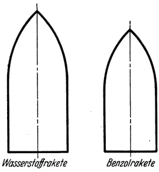

<#include "pagebreak.ftl">
Bemerkungen zu den bisherigen Konstruktionsvorschlägen.
=======================================================

Zu diesen verschiedenen Vorschlägen sei ergänzend noch hinzugefügt:
Wohl gehört, soweit es sich bis heute überblicken läßt,
die nähere Zukunft aller Wahrscheinlichkeit nach der Raumrakete
mit flüssigem Betriebsstoff. Zu endgültig baureifen Entwürfen
von solchen wird man jedoch erst dann kommen können,
wenn die hierfür notwendigen technischen Vorbedingungen geschaffen
sind, durch (im Versuchsverfahren gewonnene) praktische
Lösung der für ihre Konstruktion grundsätzlichen Fragen:
\1. der Mitführungsweise des Betriebsstoffes, 2. der Einbringungsart
desselben in den Ofen und 3. der Vorkehrungen gegen die
Zerstörung von Ofen und Düse durch die Verbrennungshitze.

Es wurde aus diesem Grund auch absichtlich vermieden, hier
selbst Konstruktionsvorschläge zu bringen. Wohl aber erachten
wir es zweifellos auch gegenwärtig schon als angezeigt und notwendig,
\<@pagebreak 69/> wenigstens soweit es mit den zur Zeit vorhandenen Erfahrungen
eben möglich ist, das "Grundsätzliche des Fahrzeugaufbaues
zu klären, und dazu gehört vor allem auch die Frage
des Antriebsstoffes. Als solcher wurde, laut Früherem, bisher
vorgeschlagen: einerseits Wasserstoff und Sauerstoff und andererseits
Alkohol und Sauerstoff.

Besser als diese beiden dürften sich nach Meinung des Verfassers
die reinen Kohlenwasserstoff-Verbindungen (zusammen
mit dem zur Verbrennung notwendigen Sauerstoff) als Betriebsstoffe
für Raumraketen eignen. Dies wird erkennbar, wenn
man den Energieinhalt statt auf das Gewicht auf das Volumen
bezogen ausdrückt, wie es Verfasser für am vorteilhaftesten hält,
um die Wertigkeit eines Raketenbetriebsstoffes in einfacher Weise
beurteilen zu können; denn es kommt nicht nur darauf an,
welche Gewichtsmenge Betriebsstoff für eine bestimmte Leistung
erforderlich ist; ebenso, ja für die Unterbringung desselben
und damit für die Konstruktion des Fahrzeuges noch wichtiger
ist es: welche Volumenmenge davon mitgeführt werden muß.
In letzterer Hinsicht gibt aber der auf das Volumen bezogene
Energiegehalt (Wärmeeinheiten je Liter) des Betriebsstoffes
am klarsten Aufschluß.

Derselbe ist umso bedeutender, je größer das spezifische Gewicht
sowie der untere Heizwert des betreffenden Brennstoffes
ist und je weniger Sauerstoff er zu seiner Verbrennung bedarf.
Im allgemeinen zeigen sich die kohlenstoffreichen Verbindungen
den wasserstoffreichen überlegen, obwohl der Heizwert je Kilogramm
der letzteren höher ist. Sehr geeignet erschienc danach
z. B. Benzol. Am günstigsten wäre reiner Kohlenstoff. Da
letzterer jedoch nicht flüssig vorkommt, sollte man versuchen,
ob nicht durch mechanische Mischung eines flüssigen Kohlenwasserstoffes
von möglichst hohem Energiegehalt je Liter (also vielleicht
Benzol, Heptan u. a.) mit feinverteiltem, möglichst reinen
Kohlenstoff (wie etwa Ruß, feinstes Kohlenmehl o. dgl.) der
Energiegehalt je Liter noch weiter gesteigert und dadurch ein
besonders hochwertiger, ja vielleicht der nach unserer heutigen
\<@pagebreak /> Kenntnis der Stoffe überhaupt bestmögliche Raketenbetriebsstoff
gewonnen werden könnte.

Selbstverständliche Bedingung für die Gültigkeit vorstehender
Betrachtungen ist natürlich, daß alle Betriebsstoffe mit dem gleichen
Wirkungsgrad ausgenützt werden.

Unter dieser Voraussetzung würde beispielsweise eine Raumrakete,
welche die Endgeschwindigkeit 4000 Meter je Sekunde erreichen
soll, dann wenn sie mit Benzol und flüssigem Sauerstoff

Abb. 35. Größenverhältnis zwischen einer Wasserstoffrakete und einer
Benzolrakete. von gleicher Leistungsfähigkeit, wenn jede imstande sein
soll, sich eine Geschwindigkeit von 4000 Metern je Sekunde erteilen
zu können.

betrieben wird, rund um die Hälfte kleiner ausfallen und eine um
1/3 geringere Behälteroberfläche aufweisen als bei Antrieb durch
flüssigen Wasser— und Sauerstoff (Abb. 35).

Es würde daher die Benzolrakete nicht nur eher technisch ausführbar
sein, sondern sich auch billiger stellen als die gleich leistungsfähige
Wasserstoffrakete; wenn auch das Gewicht der notwendigen
Betriebsstoffmenge in ersterem Falle etwas höher ist und daher eine größere
Antriebskraft und infolgedessen auch eine stärkere, also schwerere
Treibvorrichtung notwendig wäre. Dafür sind bei der Benzolrakete
eben die Betriebsstoffbehälter kleiner und können außerdem,
wenigstens soweit sie dem Benzol dienen, aus irgendeinem Leichtmetall
hergestellt werden, weil das Benzol normal flüssig ist,
während sie für verflüssigten Wasserstoff mit Rücksicht auf dessen
abnorm niedere Temperatur (—253° Celsius) nach Oberth, wie
schon erwähnt, aus Blei (!) bestehen müßten. Ganz abgesehen
von den vielen anderen durch diese niedere Temperatur des flüssigen
Wasserstoffes bedingten Schwierigkeiten in der Handhabung
und Anwendungsweise desselben, die alle beim Benzol fortfallen.

\<@pagebreak /> Allerdings tritt diese Überlegenheit der flüssigen Kohlenwasserstoffe
bei höheren Endgeschwindigkeiten gegenüber dem reinen

Abb. 36. Größenverhältnis zwischen einer Wasserstoffrakete und einer
Benzolrakete von gleicher Leistungsfähigkeit, wenn jede imstande sein
soll, sich eine Geschwindigkeit von 12 500 Metern je Sekunde (gänzliche
Loslösung von der Erde!) zu erteilen.

Wasserstoff immer mehr zurück. Trotzdem aber würde, selbst für
die Erreichung einer Geschwindigkeit von 12 500 Meter je Sekunde (wie
sie zur gänzlichen Loslösung von der Erde ideell notwendig ist), eine
Benzolrakete immer noch um 1/3 kleiner ausfallen als eine Wasserstoffrakete
(Abb. 36). Erst für die Endgeschwindigkeit von 22000 Meter
je Sekunde würden sich die Volumen der Betriebsstoffmengen bei der
Benzolrakete ebenso groß wie bei der Wasserstoffrakete ergeben.

Zu diesen energiewirtschaftlichen und sonstigen Vorteilen der
flüssigen Kohlenwasserstoffe kommt noch, daß sie an und für sich viel
billiger sind als flüssiger reiner Wasserstoff.

