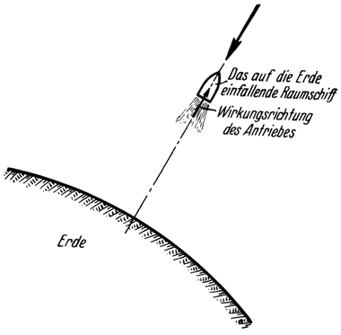

Die Rückkehr zur Erde.
======================

Aus den bisherigen Ausführungen geht also hervor, daß dem
*Aufstieg* in den Weltraum, wenn auch bedeutende, so doch
nicht unüberwindbare Hindernisse im Wege stehen. Bevor wir
uns aber mit weiteren Betrachtungen befassen, welche aus diesem
Ergebnis. nun gefolgert werden können, interessiert uns vor allem
die Frage: ob und wie es möglich wäre, nach gelungenem Aufstieg
wieder zur Erde rückkehren und daselbst landen zu können,
*ohne hierbei Schaden zu nehmen*. Denn es mag wohl auch
beim kühnsten Raumfahrer ein nicht gelindes Grausen erwecken,
wenn er, die Erde als ferne Kugel vor sich sehend, bedenkt, daß
er mit nicht weniger als etwa der zwölffachen Geschwindigkeit
eines Artilleriegeschosses auf ihr einlangt, sobald er, sich ihrer
<@pagebreak 72/> Schwerkraft frei überlassend, auf sie zufährt oder richtiger gesagt:
auf sie abstürzt.

Es muß also für rechtzeitige *Abbremsung* gesorgt werden.
Welch schwieriges Problem diese Forderung jedoch in sich schließt,
erkennt man, wenn man sich vergegenwärtigt, daß *jedem einzelnen*
Kilogramm des Raumschiffes bei seinem Eintreffen auf
der Erde eine lebendige Kraft innewohnt, welche beinahe jener
eines ganzen D-Zuges gleichkommt, der sich mit 70 km Stundengeschwindigkeit
in Fahrt befindet! Denn, wie schon anfangs erwähnt,
fällt ein Körper stets mit der Geschwindigkeit von etwa
11000 Meter je Sekunde auf die Erde ein, sobald er aus dem Weltraum
durch ihre Schwerkraft an sie herangezogen wird; er besitzt
hierbei also eine lebendige Kraft von rund 6000 Metertonnen
je Kilogramm seines Gewichtes. Diese ungeheure Energiemenge
muß nun dem Fahrzeug während der Abbremsung in der
Gänze entzogen werden.

Hierfür kommen lediglich zwei Möglichkeiten in Betracht: entweder
*Gegenarbeit mittels des Rückstoßantriebes* (ähnlich
wie beispielsweise die „Rückwärtsarbeit” der Maschine beim Stoppen
eines Schiffes) oder *Widerstandsbremsung* unter Ausnützung
der *Erdlufthülle*.

Bei Landung nach ersterer Art müßte man also den Antrieb
neuerlich und zwar diesmal *entgegen* der Fahrtrichtung wirken
lassen (Abb. 37). Hierbei würde dem Fahrzeug seine Einfallenergie
dadurch entzogen werden, daß man dieselbe durch Leistung
einer gleichgroßen, entgegengesetzten Arbeit *aufhebt*. Dies bedingt
aber, daß zur Bremsung dieselbe Energie und somit auch
die gleiche Betriebsstoffmenge aufgewendet werden müßte, welche
für den *Aufstieg* notwendig ist. Denn da die Anfangsgeschwindigkeit
für den Aufstieg (Steig-Höchstgeschwindigkeit) und
die Endgeschwindigkeit bei der Rückkehr (Einfallgeschwindigkeit)
von ähnlicher Größe sind, so unterscheiden sich auch die lebendigen
Kräfte, welche dem Fahrzeug in ersterem Falle *mitgeteilt*
und in letzterem *entzogen* werden müssen, nur wenig
von einander.

<@pagebreak /> Diese ganze, für die Bremsung notwendige Betriebsstoffmenge
muß aber vorerst noch — und das gibt den Ausschlag — auf
die *volle Steighöhe* mitgehoben werden, was eine ungeheure
Vermehrung der Steiglast bedeutet. Dadurch wird aber nun die
für den Aufstieg *insgesamt* erforderliche Betriebsstoffmenge dermaßen
groß, daß diese Bremsart jedenfalls äußerst unwirtschaftlich,
ja bei der Leistungsfähigkeit der bis heute zur Verfügung
stehenden Betriebsstoffe, sogar überhaupt undurchführbar erscheint. Aber
auch eine nur *teilweise* Heranziehung des Rückstoßes zur Bremsung muß
aus denselben Gründen wo nur möglich vermieden werden.

Abb. 37. <em>Landung mit Rückstoßbremsung</em>.
Das einfallende Fahrzeug soll durch den Antrieb
„aufgefangen“ werden, indem derselbe <em>entgegen</em>
der Fahrtrichtung, also ebenso wie beim
Aufstieg „von der Erde weg“ arbeitet.

Dazu kommt, daß die Rückstoßbremsung *im Bereiche der Lufthülle* —
wenigstens solange die Fahrgeschwindigkeit noch von kosmischer
Größe ist — vermutlich überhaupt kaum anwendbar sein dürfte.
Denn die Auspuffgase, welche das Fahrzeug dabei vor sich hertreibt, würden durch den
Luftwiderstand mehr verzögert werden als das schwerere Fahrzeug
selbst, und so müßte sich dieses in der Hitze der eigenen
Verbrennungsgase bewegen.

Die zweite Landungsart, jene mit Ausnützung des Luftwiderstandes,
wird dadurch bewerkstelligt, daß das Fahrzeug während
seines Weges durch die Erdlufthülle mittels Fallschirmen oder sonstigen
Vorrichtungen abgebremst wird (Abb. 38). Hierbei ist nun
ausschlaggebend, daß sich die lebendige Kraft, welche dem Fahrzeug
<@pagebreak /> während dieses Vorganges entzogen werden muß, nur zum Teil
in Luftbewegung (Wirbelung), zum anderen Teil aber in *Wärme*
umwandelt. Wenn nun der Bremsweg nicht genügend lang und
daher die Bremszeit zu kurz ist, dann kann während derselben
die entstehende Bremswärme nicht in genügendem Maße durch
Leitung und Strahlung an die Umgebung übergehen, und es muß
daher die Temperatur der Bremsmittel (Fallschirm usw.) fortgesetzt steigen.

Abb. 38. <em>Landung mit Luftwiderstandsbremsung</em> bei lotrechtem Einfall des Fahrzeuges.

Nun besitzt aber in unserem Falle das Fahrzeug bei seinem
Eintritt in die Lufthülle eine Geschwindigkeit von rund 11000 Meter
je Sekunde, während jener Teil der Lufthülle, welcher genügende
Dichte aufweist, um für Bremszwecke noch in Frage zu kommen,
kaum mehr als 100 km hoch sein dürfte. Nach dem vorhin
Gesagten ist ohne weiteres klar, daß ein Versuch, auf diesem für
so gewaltige Geschwindigkeiten relativ viel zu kurzem Wege eine
Abbremsung des Fahrzeuges durch den Luftwiderstand zu bewerkstelligen,
einfach zur *Verbrennung* führen müßte.

<@pagebreak /> So schiene es also, als ob das Problem der Raumfahrt, wenn
auch nicht an der Frage des *Aufstieges*, so doch an der Unmöglichkeit
einer wohlbehaltenen *Rückkehr* zur Erde scheitern sollte.

