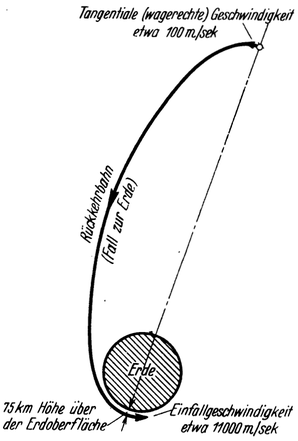
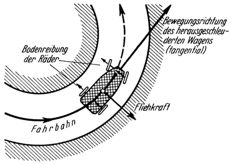
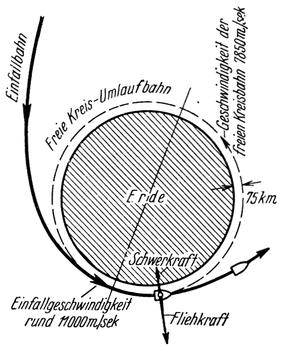

Das Hohmannsche Landungsmanöver.
================================

Es ist ein Verdienst des deutschen Ingenieurs Dr. Hohmann,
aus dieser Schwierigkeit einen Ausweg gezeigt zu haben. Nach
seinem Vorschlage wird *das Raumschiff für die Landung
mit Tragflächen ähnlich wie ein Flugzeug ausgerüstet*.
Weiterhin wird schon zu Beginn der Rückkehr dem Fahrzeug mittels
Rückstoßes eine solche *tangentiale (wagerechte) Geschwindigkeit erteilt*, daß es
bei seinem Fall zur Erde gar nicht auf ihrer Oberfläche auftrifft,
sondern die Erde in einer freien Umlaufbahn derart umfährt, daß
es sich ihrer Oberfläche im Scheitel der Bahn auf 75 km nähert
(Abb. 39).

Abb. 39. Beim <em>Hohmannschen Landungsvorgang</em>
wird die <em>Rückkehrbahn</em> derart künstlich beeinflußt,
daß das Raumschiff gar nicht auf die Erde auftrifft, sondern dieselbe in 75 km
Höhe umfährt.

Es sei versucht, diesen Vorgang in einfacher Weise vielleicht folgend
zu erläutern: Wenn man einen Stein wirft, statt ihn nur
fallen zu lassen, dann trifft er erst in einer gewissen *Entfernung*
auf den Boden, und zwar in umso weiterer, mit je größerer
Geschwindigkeit er fortgeschleudert wurde. Könnte man nun diese Wurfgeschwindigkeit beliebig
steigern, so daß der Stein nicht schon in einer Entfernung von
10 oder 100 Meter, ja auch noch nicht in einer solchen von 100
oder 1000 km niederfällt, sondern erst in einer Weite von
<@pagebreak /> 40000 km zu Boden gelangte, dann würde er in Wirklichkeit
überhaupt gar nicht mehr niederfallen, da ja der ganze Erdumfang nur 40000 km
mißt. Er würde dann die Erde wie ein winziger Mond in einer
freien Umlaufbahn umkreisen. Allerdings müßte man, um dies
von einem Standpunkte der Erdoberfläche aus zu erreichen, dem Steine die
gewaltige Geschwindigkeit von etwa 8000 Meter je Sekunde erteilen.

Abb. 40. Wenn die Fliehkraft infolge zu rascher Fahrt zu <em>groß</em> wird,
schleudert sie den Wagen aus der Bahn.

Letztere wird jedoch umso geringer, je weiter die Stelle von der
Erde entfernt liegt, von welcher aus der Körper zum Umlauf um dieselbe
veranlaßt werden soll. In einem Abstande von etlichen 100000 km beträgt
sie nur mehr rund 100 Meter je Sekunde (Abb. 39). Dies ist auch einzusehen,
wenn man bedenkt, daß das Fahrzeug ohnehin — allein schon
infolge seines *Falles zur Erde* — immer mehr an Geschwindigkeit gewinnt.
Erreicht doch die Einfallgeschwindigkeit laut Früherem schließlich
sogar den Wert von 11000 Meter je Sekunde, ist also bereits um mehr
als 3000 Meter je Sekunde *größer*, als jene Geschwindigkeit von genau
7850 Meter je Sekunde, die das Fahrzeug haben müßte, damit es die Erde
<@pagebreak /> (ähnlich wie früher der Stein) in freier Kreisbahn in einer Höhe
von 75 km umlaufe.

Abb. 41. Infolge der um rund 3000 m/sec zu großen Fahrgeschwindigkeit: (11000 Statt 7850 m/sec!)
ist die Fliehkraft größer als die Schwere, weshalb das Raumschiff
aus der freien Kreisbahn nach außen gedrängt wird.

Infolge dieses Überschusses an Geschwindigkeit wird nun das
Raumschiff durch die Fliehkraft stärker nach außen gedrängt, als
die Schwerkraft imstande ist, es nach innen zur Erde zu ziehen;
ein ähnlicher Vorgang wie etwa bei einem Kraftwagen, der eine
Kurve mit zu großer Geschwindigkeit (zu „scharf”) durchfährt
(Abb. 40). Ebenso wie dieser nach außen geschleudert wird, weil
die Fliehkraft, welche ihn aus der Bahn zu drängen sucht, größer
ist als die Bodenreibung der Räder, die ihn in derselben erhalten
sollte, so wird — in sinngemäßer Weise — auch unser Raumschiff
bestrebt sein, die freie Kreisbahn nach außen zu verlassen
und sich damit von der Erde wieder zu entfernen (Abb. 41).

