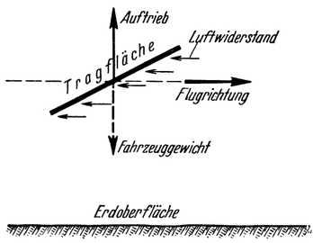
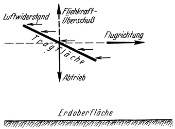
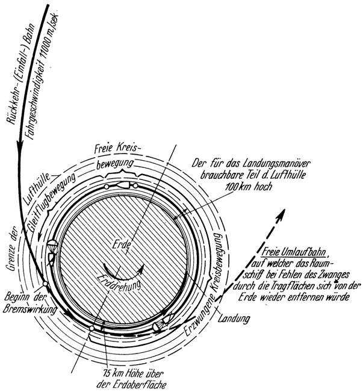

<#include "pagebreak.ftl">
Landung in erzwungener Kreisbewegung.
=====================================

Letzteres kann aber verhindert werden, und zwar durch entsprechende
Zuhilfenahme der Tragflächen. Bei einem normalen Flugzeuge sind dieselben
nach aufwärts geneigt, damit durch die Fahrbewegung jener Auftrieb entsteht,
der eben das Flugzeug tragen soll (Abb. 42). In unserem Falle werden nun die
Tragflächen entgegengesetzt, also nach abwärts geneigt, eingestellt (Abb. 43);
dadurch entsteht ein nach unten, gegen die Erde zu gerichteter Druck, der bei
richtiger Wahl des Anstellwinkels den Überschuß an Fliehkraft gerade aufhebt,
und auf diese Weise das Fahrzeug zwingt, in der Kreisbahn zu
Verbleiben (Abb. 44).

Abb. 42. Die grundsätzliche Wirkungsweise der Tragflächen beim normalen Drachenflug:
Der durch den Luftwiderstand bedingte „Auftrieb“ ist nach ob e n gerichtet und
trägt so das Flugzeug.

\<@pagebreak 78/> Für die Ausführung dieses Manövers wurde absichtlich die Höhe
von 75 km über der Erdoberfläche gewählt; denn dort ist die
Luftdichte bereits so gering, daß das Raumschiff trotz seiner
hohen Geschwindigkeit annähernd denselben Luftwiderstand erleidet,
wie ein normales Flugzeug in üblicher Höhenlage.

Im Verlaufe dieser „erzwungenen Kreisbewegung” wird
sich nun die Fahrgeschwindigkeit infolge des Luftwiderstandes andauernd
verringern und daher der Überschuß an Fliehkraft immer
mehr abnehmen. Demgemäß vermindert sich aber auch die Notwendigkeit einer
Mithilfe der Tragflächen, bis diese schließlich vollkommen überflüssig Wird, 
sobald die Fahrgeschwindigkeit auf 7850 Meter je Sekunde
gesunken ist und somit auch der Überschuß an Fliehkraft
aufgehört hat zu bestehen. Das Raumschiff kreist dann
in einer freien Umlaufbahn schwebend um die Erde
(„Freie Kreisbewegung”, Abb. 44).

Abb. 43. Wirkungsweise der Tragflächen Während der „erzwungenen Kreisbewegung“
eines landenden Raumschiffes. Hier erzeugt der Luftwiderstand einen zur
Erde (nach abwärts) gerichteten „Abtrieb“, der den Überschuß an Fliehkraft aufhebt.

Da sich aber infolge des Luftwiderstandes die Fahrgeschwindigkeit
andauernd weiter vermindert, nimmt auch die Fliehkraft
allmählich ab und läßt demgemäß die Schwere immer mehr zur
Geltung kommen. Daher müssen die Tragflächen bald wieder in
Wirksamkeit treten, und zwar jetzt ebenso wie ‚bei einem gewöhnlichen
Flugzeug (Abb. 42): der Schwere entgegenwirkend,
also tragend („Gleitflugbewegung”, Abb. 44).

Endlich wird mit weiterer Abnahme der Geschwindigkeit und
zunehmender Annäherung an die Erde die Fliehkraft praktisch
überhaupt zu Null: das Fahrzeug wird dann nur mehr von den
Tragflächen getragen, bis es schließlich im Gleitflug niedergeht.

\<@pagebreak /> Auf diese Weise wäre es möglich, den Weg durch die Lufthülle
dermaßen auszudehnen, daß dabei sogar die ganze Erde

Abb. 44. Landung in „erzwungener Kreisbewegung“. (Die Lufthülle
und die Landungsspirale ist in der Abbildung — der besseren Übersichtlichkeit
wegen — gegenüber der Erde höher, als es der Wirklichkeit entspricht, gezeichnet.
Würde maßstabrichtig den Verhältnissen der Abb. 8 gemäß aussehen müssen).

einige Male umfahren würde. Im Verlaufe dessen könnte aber
durch Anwendung von Fallschirmen, die hinterher nachgezogen
werden, zum Teil durch die Wirkung des eigenen Luftwiderstandes
des Fahrzeuges und seiner Tragflächen, die Geschwindigkeit
\<@pagebreak /> desselben sicherlich auch von 11000 Meter je Sekunde bis auf
Null abgebremst werden, ohne daß ein „Heißlaufen” zu befürchten
wäre. Die Dauer dieses Landungsmanövers Würde sich auf einige Stunden erstrecken.

