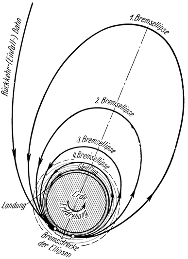

Landung in Bremsellipsen.
=========================

Bei dem soeben beschriebenen Verfahren wurde der Übergang aus
der Einfallbahn in die freie Kreisbahn und die hierzu erforderliche
Geschwindigkeitsverminderung von 11000 auf 7850 Meter je Sekunde im Verlaufe
der „erzwungenen Kreisbewegung” bewerkstelligt. Nach einem anderen Vorschlage Hohmanns
kann dies aber auch im Wege der Durchfahrung sogenannter „Bremsellipsen“
erreicht werden (Abb. 45). Bei diesem Landungsvorgang kommen die Tragflächen
anfangs nicht zur Verwendung, sondern es wird nur getrachtet,
sobald das Fahrzeug in genügend dichte Luftschichten eingetreten
ist, mittels eines nachgezogenen Fallschirmes
so kräftig zu bremsen, wie die schon erwähnte Gefahr zu starker
Erwärmung es noch gestattet.

Abb. 45. <em>Landung in „Bremsellipsen“</em>. (Die Lufthülle und die Landungsbahn sind hier, ebenso
wie in Abb. 44, höher als der Wirklichkeit entsprechend gezeichnet. Vergl. Abb. 8.)

<@pagebreak 81/> Allerdings kann dadurch die Fahrgeschwindigkeit noch nicht derart
vermindert werden, wie dies notwendig wäre, um damit das
Raumschiff in die freie Kreisbewegung überzuleiten. Es verbleibt
daher noch ein Überschuß an Geschwindigkeit und somit auch an
Fliehkraft, der das Fahrzeug nun nach außen abdrängt, so daß
es die Lufthülle wieder verlassen und sich in einer freien Umlaufbahn
von elliptischer Form (1. Bremsellipse) von der Erde entfernen
wird; jedoch nicht mehr bis auf jenen Abstand, von welchem
aus die Rückfahrt ursprünglich angetreten wurde, da sich
die lebendige Kraft bei der Bremsung ja bereits verringert hat
(Abb. 45). Infolge der Schwerewirkung wird das Fahrzeug nach
einiger Zeit dann wieder zur Erde zurückkehren, neuerlich die
Lufthülle durchfahren — wobei abermals ein Teil seiner Geschwindigkeit
durch Fallschirmbremsung vernichtet wird —, sich
nunmehr wieder, jetzt aber auf einer bereits kleineren elliptischen
Umlaufbahn (2. Bremsellipse), von der Erde entfernen, dann von
neuem zurückkehren usw.

Es werden somit, entsprechend der fortschreitenden Geschwindigkeitsabnahme,
nacheinander immer engere sogenannte „Bremsellipsen”
durchlaufen, bis schließlich die Geschwindigkeit auf
7850 Meter je Sekunde gesunken und damit die *freie Kreisbewegung*
eingetreten ist. Der weitere Verlauf der Landung erfolgt
dann unter Zuhilfenahme der Tragflächen im Gleitflug
ebenso wie bei dem früher geschilderten Vorgang. Die gesamte
Landungsdauer vom erstmaligen Eintritt in die Lufthülle bis zur
Ankunft auf der Erdoberfläche beträgt jetzt rund 23 Stunden, ist
also um ein Vielfaches länger als bei dem zuvor beschriebenen
Verfahren. Man wird daher die beim Hohmannschen Landungsmanöver
ohnehin vorgesehenen Tragflächen wohl auch schon
anfangs voll ausnützen und die Landung somit besser in erzwungener
Kreisbewegung vornehmen.

