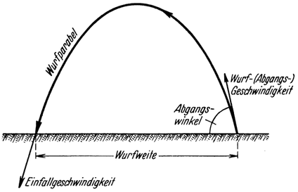
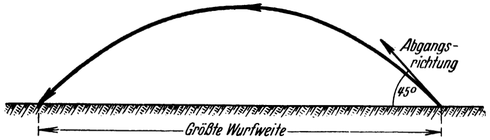
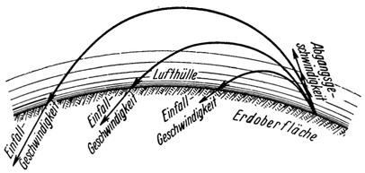

<#include "pagebreak.ftl">
Die Raumrakete im schiefen Wurf.
================================

Die einfachste Art einer praktischen Anwendung als Beförderungsmittel
ergibt sich für die Rakete, wenn man sie von der
Erde schief (statt lotrecht) aufsteigen läßt; denn sie beschreibt
dann eine Wurfparabel (Abb. 46). Bekanntlich ist hierbei die
Wurfweite am größten, wenn der Wurfwinkel (Abgangswinkel) —— in unserem
Fall also der Neigungswinkel der Aufstiegrichtung —— 45° beträgt (Abb. 47).
Bei dieser Verwendungsart kommt die Rakete ähnlich wie
ein Geschoß zur Wirksamkeit; jedoch mit den folgenden
Unterschieden: es ist kein Geschütz notwendig, um sie abgehen zu lassen; ihr
Gewicht kann um Vieles größer sein, als bei einem gewöhnlichen,
selbst noch so gewaltigen Geschoß; die Abgangsbeschleunigung
läßt sich beliebig klein wählen; trotzdem wären so hohe
Abgangsgeschwindigkeiten zu erreichen, daß es für die Wurf-(Schuß-)Weite
der Raumrakete theoretisch eigentlich überhaupt
keine irdische Grenze gäbe.

Abb. 46. Schiefer Wurf.

Man könnte demnach so in äußerst kurzer Zeit eine Last über
sehr große Distanzen fortbringen, weshalb mitunter die Meinung
vertreten wird, daß sich dieses Verfahren auch zur Beförderung
\<@pagebreak 85/> z. B. dringender Frachten etwa im Dienste der Post, des Fernmeldewesens
u. dgl. benützen ließe.

Letzteres wäre aber nur möglich, wenn es gelingt, die Einfallgeschwindigkeit
der ankommenden Rakete derart rechtzeitig abzubremsen,
daß ihr Auftreffen sachte erfolgt, weil sonst das
Fahrzeug bzw. seine Fracht dabei zugrunde ginge. Hierfür stehen
nach unseren früheren Betrachtungen<a class="refnote" id="rn1" href="#fn1">1</a> zwei
Bremsverfahren zur Verfügung, und zwar: entweder mittels Rückstoßes oder durch
den Luftwiderstand. Da ersteres wegen des enormen damit verbundenen
Betriebsstoffverbrauches, wo immer möglich, unbedingt
vermieden werden muß, kommt praktisch also nur die Anwendung des Luftwiderstandes in Frage.

Abb. 47. Mit einer gegebenen Abgangsgeschwindigkeit wird dann die größte
Wurfweite erzielt, wenn der Abgangswinkel 45° beträgt.

Nun würde aber mit einfacher Fallschirmlandung die Abbremsung
gewiß nicht zu erreichen sein; denn bei der Größe der
in Betracht kommenden Wurfweiten fällt die Rakete auf ihr Ziel
mit mehrfacher Geschoßgeschwindigkeit ein. Dafür wäre jedoch
die Bremsstrecke, welche sich hierbei in der Lufthülle bestenfalls
ergäbe, wegen der zu bedeutenden Steilheit des Einfalles viel zu
kurz, wozu noch der Nachteil kommt, daß dabei der Hauptanteil
der Einfallsgeschwindigkeit in den unteren, dichten Luftschichten
Zur Abbremsung gelangte.

Dies gilt gleichermaßen auch dann, wenn man es, wie von anderer
Seite vorgeschlagen, so einrichtet, daß sich vor dem Niedergehen
die Nutzlast aus der Rakete loslöst, um allein an
\<@pagebreak /> einem Fallschirm herabzusinken, während der Leerkörper der
Rakete preisgegeben wird; denn weder die Größe der Einfallgeschwindigkeit
noch die vor allem schädliche zu bedeutende
Steilheit des Einfalles wird durch diese Maßnahme irgendwie
günstig beeinflußt.

Um die Fracht unbeschädigt ans Ziel zu bringen, könnte die
Abbremsung, wenn sie durch den Luftwiderstand bewirkt werden
soll, nur während genügend lange dauernder, annähernd wagrechter
Fahrt in höheren, dünnen, entsprechend der Fahrtgeschwindigkeit
gewählten Luftschichten — also nach dem Hohmannschen
Landungsverfahren (Gleitfluglandung) — geschehen und würde sich
demgemäß auf Bremsstrecken ausdehnen, die nicht um vieles kürzer
als der ganze zurückzulegende Weg wären.

Daher käme — für den Fall daß vor dem Auftreffen abgebremst
werden soll — eine richtige Wurfbewegung überhaupt
gar nicht zustande, sondern es würde sich eine Bewegungsweise
ergeben, wie sie im nächsten Abschnitt: „Die Raumrakete als
Flugzeug” besprochen wird.

Im reinen schiefen Wurf könnte man die Rakete wohl nur
verwenden, wenn dabei „wohlbehaltene Landung” nicht erforderlich
ist, also z. B. als Geschoß für Kriegszwecke. In letzterem
Fall wären für ihren Antrieb ohne weiteres auch feste
Betriebsstoffe wie rauchloses Pulver u. dgl. im Sinne des Goddardschen
Vorschlages benutzbar, worauf früher bereits hingewiesen wurde<a class="refnote" id="rn2" href="#fn2">2</a>.

Solchen Raketengeschossen auch die notwendige Treffsicherheit
zu geben, ist jedenfalls nur eine Frage ihrer technischen
Vervollkommnung. Übrigens ließen die dafür hauptsächlich in
Betracht kommenden Großziele (wie feindliche Hauptstädte,
Industriegebiete usw.) ohnehin verhältnismäßig bedeutende Streuungen zu.

Bedenkt man nun, daß bei einer solchen Beschießung mit Raketen
selbst etliche Tonnen schwere Ladungen über die gewaltigsten
\<@pagebreak /> Entfernungen hinweg gefahrlos an Ziele gebracht werden
könnten, die sehr weit im feindlichen Hinterland liegen, ja
daß geradezu kein Teil desselben vor derartigen Angriffen sicher
wäre und es dagegen auch gar keine Abwehr gäbe, so ersieht
man, um was für ein furchtbares Kampfmittel es sich dabei handeln würde.

Immerhin aber dürfte dessen Wirkungsweite vermutlich doch
nicht ganz so unbegrenzt sein, wie dies mit Rücksicht auf die
Leistungsfähigkeit des Raketenantriebes eigentlich zu erwarten
wäre; denn mit Vergrößerung der Wurfweite steigt auch die
Geschwindigkeit, mit welcher der geworfene Körper, hier die

Rakete, auf das Ziel einfällt und dabei die dichtesten, erdnahen
Luftschichten durchdringenmuß (Abb. 48). Ist nun die Wurfweite
und damit auch die Einfallgeschwindigkeit zu groß, dann wird
sich die Rakete durch die Luftreibung derart erhitzen, daß sie

Abb. 48. Je größer die Wurfweite ist, desto größer
wird auch die Einfallgeschwindigkeit sein (entsprechend
der größeren hierzu notwendigen Abgangsgeschwindigkeit und Steighöhe).

vernichtet wird (zerschmilzt, krepiert), noch ehe sie überhaupt
ans Ziel gelangt; ähnlich so wie auf die Erde zufallende Meteore
auch nur selten den Erdboden erreichen, weil sie bereits vorher
in der Lufthülle verglühen, infolge ihrer wesentlich größeren
Einfallgeschwindigkeiten allerdings schon in viel bedeutenderen Höhenlagen.
Es würde uns also die Erdlufthülle so wie in etlicher anderer
Beziehung wahrscheinlich auch in dieser Hinsicht wenigstens
teilweisen Schutz gewähren.

Wohl mag die eben beschriebene einfachste Anwendungsweise
der Raumrakete manchem nicht gerade als Empfehlung für dieselbe
erscheinen! Doch es ist eben das Schicksal fast sämtlicher
großer Errungenschaften der Technik, daß sie auch für Zerstörungszwecke
\<@pagebreak /> benutzt werden können. Sollte man aber beispielsweise
die Chemie etwa als schädlich und ihre weitere Ausgestaltung
als nicht wünschenswert ansehen, weil sie die Waffen für
den heimtückischen Gaskrieg schafft? Und es würden die Ergebnisse,
die wir von einer erfolgreichen Entwicklung der Raumrakete
zu erwarten hätten, weit alles überragen, was uns die
Technik zu bieten bisher imstande war, wie wir im Folgenden
erkennen werden.

<a href="#rn1">1</a>Siehe Seite 72.

<a href="#rn2">2</a>Siehe Seite 45, 54.

