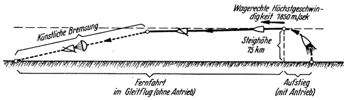
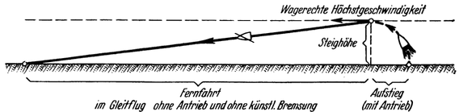
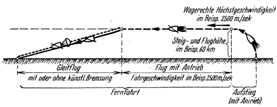
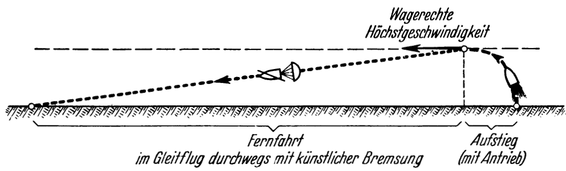
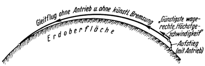

Die Raumrakete als Flugzeug.
============================

Wie schon erwähnt schlägt Hohmann vor, das Raumschiff für
die Landung mit Tragflächen auszurüsten. In einem gewissen
Stadium seines Landungsmanövers<a class="refnote" id="rn1" href="#fn1">1</a>
umläuft dasselbe die Erde in
einer kreisförmigen freien Umlaufbahn schwebend (nur von
der Fliehkraft „getragen”), in 75 km Höhe, mit einer dementsprechenden
Geschwindigkeit von 7850 Meter je Sekunde („Freie
Kreisbewegung”, Abb. 44). Weil aber im ferneren Verlaufe die
Fahrgeschwindigkeit und damit auch die Fliehkraft andauernd
abnimmt, bekommt das Fahrzeug immer mehr Gewicht, welches
nun von den Tragflächen aufgenommen werden muß, so daß
die freie Umlaufbewegung allmählich in einen Gleitflug übergeht.
Demgemäß müssen immer tiefer gelegene, dichtere Luftschichten
aufgesucht werden, so zwar: daß deren Widerstand bei
der verringerten Fahrgeschwindigkeit und der erhöhten Last zur
Erzielung des notwendigen Auftriebes gerade am besten entspricht
(„Gleitflugbewegung”, Abb. 44).

Da nun bei diesem Vorgange selbst die ganze Erde in nur
wenigen Stunden umfahren wird, liegt der Gedanke nahe, auf
ähnliche Weise auch einen irdischen Eilflugverkehr mit höchstmöglichen,
und zwar kosmischen Geschwindigkeiten zu schaffen:

Ließe man nämlich ein mit Tragflächen ausgerüstetes, entsprechend
gebautes Raumschiff nur bis auf eine Höhe von etwa 75 km
aufsteigen und sorgte gleichzeitig, daß es sich dabei auch eine
wagrechte Höchstgeschwindigkeit von 7850 Meter je Sekunde
in der Richtung auf ein irdisches Reiseziel erteilt (Abb. 49),
so könnte es den Weg bis dorthin ohne jeden weiteren Kraftaufwand
zurücklegen: anfangs in annähernd kreisförmiger freier Umlaufbahn,

Abb. 49. Schematische Darstellung eines „Eilfluges mit kosmischer Geschwindigkeit“
bei welchem die wagrechte Höchstgeschwindigkeit so groß ist (hier gleich der
Geschwindigkeit der freien Umlaufbewegung angenommen), daß die ganze Fernfahrt
im Gleitflug zurückgelegt werden kann und vor der Landung noch
künstlich gebremst werden muß.

später dann immer mehr und zum Schlusse gänzlich
im Gleitflug, nur mehr getragen vom Auftrieb der Luft. Rechtzeitig
vor der Landung müßte schließlich die Geschwindigkeit
durch künstliche Luftw'iderstandsbremsung z. B. mittels eines
nachgezogenen Fallschirmes entsprechend herabgemindert werden.

Abb. 50. Schematische Darstellung eines „Eilfluges mit kosmischer Geschwindigkeit“,
bei welchem die wagrechte Höchstgeschwindigkeit gerade noch ausreicht, die
ganze Fernfahrt im Gleitflug zurücklegen zu können, wenn dabei jede künstliche
Bremsung vermieden wird.

Mag letzteres bei derart hohen Geschwindigkeiten noch einige
Schwierigkeiten bieten, so würde es hingegen ohne weiteres gelingen,
wenn man die wagrechte Höchstgeschwindigkeit kleiner
Wählt, weil dann auch dementsprechend weniger künstliche Bremsung
notwendig wäre. Bei einer bestimmten wagrechten Höchstgeschwindigkeit
würde sogar schon die natürliche Bremsung
durch den unvermeidlichen Fahrwiderstand der Luft hierfür
allein genügen (Abb. 50).

In allen diesen Fällen benötigt das Fahrzeug während der
Fernfahrt keinerlei Antrieb. Würde man es demnach während
des Aufstieges, also bis zur Erreichung der erforderlichen Flughöhe
bzw. der wagrechten Höchstgeschwindigkeit, nur durch
eine Schubrakete antreiben lassen — es also mittels derselben
gleichsam „abschießen” — dann könnte es den weiteren Weg
bis an das Ziel allein vermöge seines „Schwunges” (der erhaltenen
lebendigen Kraft) zurücklegen und brauchte daher selbst
überhaupt mit keiner Treibvorrichtung versehen zu sein, außer
höchstens mit einem kleinen Reserveantrieb zur Ausgleichung
eventueller Schätzungsfehler beim Landen. Natürlich könnte
während des Aufstieges bis zur Erreichung der wagrechten
Höchstgeschwindigkeit der Antrieb, statt durch eine Schubrakete,
auch vom Fahrzeug zum Teil oder in der Gänze selbst geleistet
werden. In ersterem Falle dürfte es vorteilhaft sein, die Schub-
rakete hauptsächlich auf Steiggeschwindigkeit, das Fahrzeug dagegen
auf wagrechte Geschwindigkeit hinarbeiten zu lassen.

Bei noch “kleinerer wagrechter Höchstgeschwindigkeit müßte
auch ein gewisser Teil der Fernfahrt mit Antrieb zurückgelegt
werden (Abb. 51). Dann aber wäre es, ungeachtet dessen wie
der Aufstieg erfolgen mag, jedenfalls notwendig, daß das Fahrzeug
auch selbst mit einer Treibvorrichtung ausgerüstet ist und
soviel Betriebsstoff mitführt, als für die Dauer der Fahrt mit
Antrieb erforderlich ist.

Angenommen, daß als Betriebsstoff Benzol und flüssiger Sauerstoff
verwendet und damit eine Auspuffgeschwindigkeit von
2500 Meter je Sekunde erreicht wird: dann müßte nach den früher
erläuterten Grundgesetzen der Raketenfahrtechnik<a class="refnote" id="rn2" href="#fn2">2</a>,
zwecks Erreichung günstigsten Wirkungsgrades, auch die Fahrgeschwindigkeit
während der Dauer des Antriebes (und demgemäß auch
die wagrechte Höchstgeschwindigkeit) ebenso groß sein, also
zgoo Meter je Sekunde betragen. Die hierfür voraussichtlich am
besten entsprechende Flughöhe würde sich im Sinne der Überlegungen
des Hohmannschen Landungsvorganges mit rund 60 km
ergeben. Bei dieser Geschwindigkeit, besonders wenn die Fahrt
auch noch entgegen der Erddrehung also in der Richtung von
Ost nach West erfolgt, wäre die Fliehkraftwirkung bereits so
gering, daß die Tragflächen schon nahezu mit dem vollen Fahrzeuggewicht
belastet wären, es sich hierbei also fast nur mehr
um reine Drachenflug- statt um Himmelskörperbewegung handeln würde.

Abb. 51. Schematische Darstellung eines „Eilfluges mit kosmischer Geschwindigkeit“,
bei welchem die wagrechte Höchstgeschwindigkeit zur Zurücklegung der ganzen
Fernfahrt im Gleitflug nicht ausreicht, so daß ein Teil derselben mit Antrieb
zurückgelegt werden muß.

Über die konstruktive Ausführung eines solchen durch
Rückstoß (Raketenwirkung) angetriebenen Eilflugzeuges nähere
Angaben zu machen, wollen wir mit Rücksicht auf den Mangel
genügender technischer Unterlagen vorläufig lieber noch unterlassen.
Es wird dies — wie auch schon früher<a class="refnote" id="rn3" href="#fn3">3</a>
hinsichtlich der Raumrakete im allgemeinen angedeutet wurde — erst dann
wirklich möglich sein, wenn einmal die grundlegende Frage des
Raketen-Motors in befriedigender Weise praktisch gelöst ist.

Hingegen ist die Fahrweise, welche hierbei zur Anwendung
kommen müßte, der Hauptsache nach bereits heute zu erkennen.
Zu dem, was darüber ohnehin schon erwähnt wurde, sei noch gesagt:

Da beim Aufstieg die Emporhebung des Fahrzeuges auf so
beträchtliche Flughöhen (35-75 km) nicht unbedeutenden
Betriebsstoffaufwand erfordern würde, erscheint es angezeigt,
Zwischenlandungen jedenfalls zu vermeiden. Dafür spricht
außerdem der Umstand, daß die Unterteilung des gesamten Reiseweges
wegen der dadurch bedingten Verkürzung jener Luftstrecken,
welche in einem Zuge zurückzulegen sind, die Anwendung
künstlicher Bremsung in vermehrtem Maße notwendig
machen würde, was aber Vergeudung wertvoller Energie bedeutet;
ganz abgesehen von den mit Zwischenlandungen stets
verbundenen Zeitverlusten, Unbequemlichkeiten und Gefahrvermehrungen.
Es liegt eben geradezu im Wesen dieses Eilflugverkehrs,
daß er sich um so vorteilhafter erweisen muß, je größer
(natürlich in irdischen Grenzen) die auf einmal zurückzulegenden
Entfernungen sind, so daß man dieselben nicht noch absichtlich
durch Zwischenlandungen verkürzen wird.

Es wäre demnach z. B. die Einschaltung von Tankzwischenstationen,
wie dies in Anlehnung an manche Projekte des Transozeanflugverkehrs
für das Raketenflugzeug u. a. schon vorgeschlagen wurde,
der Eigenart desselben durchaus entgegen. Aber
auch sonst ist es gewiß ein falscher Weg, um über dessen Bewegungsweise
Klarheit zu gewinnen, sich einfach nur die Fahrtechnik
unserer bisherigen Flugzeuge zum Vorbild zu nehmen;
denn dafür sind Raketen— und Propellerfahrzeuge zu sehr im
Wesen verschieden.

Andererseits aber halten wir es ebenso für unrichtig, daß die
Fahrt des Raketenflugzeuges überhaupt nicht als eigentlicher „Flug“,
sondern vielmehr hauptsächlich als Wurf (also ähnlich wie im
früheren Abschnitt besprochen) vor sich gehen soll, was viele
Autoren befürworten. Denn in diesem Fall ist beim Niedergehen
des Fahrzeuges nebst der wagrechten auch eine lotrechte
Fahrgeschwindigkeits-Komponente abzubremsen, die jedoch, wegen zu
geringer Länge eines in der Erdlufthülle bestenfalls möglichen lotrechten
Bremsweges, nicht mittels Luftwiderstandes sondern nur
durch Rückstoßbremsung vernichtet werden kann. Letztere
ist aber mit Rücksicht auf den damit verbundenen großen
Betriebsstoffverbrauch, wo immer möglich, zu vermeiden.

Man muß deshalb das Auftreten einer wesentlicheren lotrechten
Fahrgeschwindigkeits -Komponente überhaupt verhindern,
und das wird eben erreicht, wenn die Fahrt, wie vom Verfasser
vorgeschlagen, durchweg als Drachenflug in annähernd wagrechter
Bahn — womöglich größtenteils im Gleitflug (ohne Antrieb) —
zurückgelegt wird, also ähnlich wie die letzte Phase einer Hohmannschen
Gleitfluglandung, die jedoch in unserem Fall, und
zwar mit der wagrechten Höchstgeschwindigkeit, erst neu begonnen wird,
vor sich geht<a class="refnote" id="rn4" href="#fn4">4</a>.

Abb. 52. Die größte mittlere Reisegeschwindigkeit wird dann erreicht,
wenn man die wagrechte Höchstgeschwindigkeit so groß wählt, daß sie gerade
noch abgebremst werden kann, wenn gleich nach ihrer Erlangung mit der künstlichen
Bremsung begonnen wird. (In den schematischen Abb. 49 bis 52 würde bei
naturgetreuer Darstellung die Erdoberfläche ebenso wie in Abb. 53 gekrümmt
erscheinen.)

Die größte mittlere Reisegeschwindigkeit, mit welcher
bei einem solchen Eilflug eine bestimmte Reisestrecke überhaupt
zurückgelegt werden könnte, hängt ab von der Länge der letzteren;
denn die Fahrgeschwindigkeit ist begrenzt durch die Forderung,
daß die Abbremsung des Fahrzeuges zwecks Landung
noch gelingen muß, wenn damit sobald als möglich, d. h. also
gleich nach Erlangung der wagrechten Höchstgeschwindigkeit,
begonnen wird (Abb. 52).

Die „günstigste wagrechte Höchstgeschwindigkeit”
für eine bestimmte Reisestrecke dürfte jene sein, welche für die
Zurücklegung der ganzen Fahrt bis an das Ziel im Gleitflug,
ohne wesentliche künstliche Bremsung gerade ausreicht
(Abb. 50 und 53). Nach Meinung des Verfassers stellt dies zweifellos
die vorteilhafteste Fahrweise für ein Raketenflugzeug dar. Sie
ist: zudem für alle, selbst für die weitesten irdischen Entfernungen
anwendbar, wenn nur die wagrechte Höchstgeschwindigkeit entsprechend
gewählt wird, und zwar deshalb, weil man nämlich mit
Vergrößerung der letzteren zugleich auch eine Verminderung des
Fahrwiderstandes erreicht; denn je größer die wagrechte Geschwindigkeit wird,
desto mehr nähert sich der Flug einer freien Umlaufbewegung um die Erde
und verliert demnach das Fahrzeug infolge stärkerem Hervortretens der Fliehkraft
an Gewicht; desto weniger Auftrieb durch die Luft ist dann aber nötig, so daß die
Fahrbahn nun in dementsprechend höhere, dünnere Luftschichten
mit kleinerem Widerstand — also auch geringerer natürlicher
Bremswirkung — verlegt werden kann.

Abb. 53. Vorteilhafteste Art der Ausführung
eines „Eilfluges mit kosmischer Geschwindigkeit“:
Die wagrechte Höchstgeschwindigkeit wird —
entsprechend der Entfernung — so groß gewählt
(„günstigste wagrechte Höchstgesehwindigkeit“),
daß die ganze Fernfahrt im Gleitflug ohne
Antrieb und ohne künstliche Bremsung zurückgelegt
werden kann (Schema siehe Abb. 50).

Die Größe der günstigsten wagrechten Höchstgeschwindigkeit
hängt allein nur von der Länge des zurückzulegenden Weges ab,
wird sich genau aber erst dann angeben lassen, wenn einmal die
Widerstandsverhältnisse in den höheren Luftschichten bei Überschall-
und kosmischen Geschwindigkeiten erforscht sind.

Aber auch kleinere wagrechte Höchstgeschwindigkeiten, bei
denen ein Teil der Fahrt mit Antrieb zurückgelegt werden
müßte (früher für Benzolantrieb untersucht), könnten mitunter
in Betracht kommen. Wesentlich größere hingegen kaum; denn
dieselben würden den Betrieb sehr unwirtschaftlich gestalten,
wegen der Notwendigkeit, einen bedeutenden Teil der aufgewendeten
Energie durch Fallschirmbremsung künstlich vernichten zu
müssen.

Doch sie wären wohl auch gar nicht notwendig! Denn schon
bei Anwendung der „günstigsten”, ja auch bei kleineren wagrechten
Höchstgeschwindigkeiten, könnte jede auf der Erde überhaupt
mögliche Entfernung, selbst jene bis zu den Antipoden,
in nur wenigen Stunden zurückgelegt werden.

Zu dem Vorteil einer derartigen auch für unsere heutigen, verwöhnten
Begriffe noch geradezu ungeheuerlich erscheinenden
Reisegeschwindigkeit, kommt aber noch jener der geringen Gefährlichkeit
eines solchen Eilfluges hinzu; denn während der
Fernfahrt selbst können unvorhergesehene „äußere Gefahren”
sich überhaupt nicht ergeben: Daß Bahnhindernisse auftauchen,
ist hierbei ja, wie auch bei jedem anderen sich in entsprechend
großer Höhe bewegenden Luftfahrzeug, praktisch nicht möglich.
Aber auch Wettergefahren, die für ein solches insbesondere
bei sehr weiten Fernfahrten (z. B. Ozeanüberquerungen) mitunter
verhängnisvoll werden können, sind für das Eilflugzeug während
der ganzen Fernfahrt vollkommen ausgeschaltet; denn die Wetterbildung
ist nur auf den unteren, bis etwa auf 10 km Höhe reichenden
Teil der Atmosphäre — die sogenannte „Troposphäre”
— beschränkt. Der darüber lagernde Teil der Lufthülle — die
„Stratosphäre” — woselbst eben der Eilflugverkehr sich abwickeln
würde, ist gänzlich frei davon. Dort gibt es, abgesehen von
stets gleichbleibenden Luftströmungen, keinerlei atmosphärische
Veränderungen mehr.

Wenn man außerdem noch die „günstigste wagrechte Höchstgeschwindigkeit”
anwendet, so daß während der Fernfahrt weder
Antrieb noch künstliche Bremsung notwendig ist, sind auch die
„inneren”, d.h. in der Funktion des Fahrzeuges selbst gelegenen
Gefahren auf ein Minimum reduziert. Solche können sich dann,
ebenso wie äußere Gefahren, überhaupt nur während des Aufstieg-
und des Landungsvorganges ergeben. Sobald man die
letzteren einmal wenigstens mit jener Sicherheit beherrscht, welche
bei den anderen Verkehrsmittel üblich ist, dann werden durch
Rückstoß angetriebene Eilflugzeuge nicht nur die für unsere Erde
schnellstmöglichen sondern auch die sichersten Fahrzeuge
darstellen.

Die Erreichung eines derartigen verkehrstechnischen Erfolges
wäre etwas so Großartiges, daß dies allein schon alle Opfer
rechtfertigen würde, welche die Verwirklichung der Raumfahrt
noch erfordern mag. Unsere Begriffe über irdische Entfernungen
aber müßten sich von Grund aus wandeln, wenn wir einmal
z. B. von Berlin nach Tokio oder auch rund um die ganze Erde
in einem knappen Vormittage reisen könnten! Dann erst würden
wir uns als Beherrscher unserer Erde fühlen dürfen, aber
auch zugleich so recht zu der Erkenntnis kommen, wie klein in
Wirklichkeit unser Heimatplanet ist und die Sehnsucht würde
steigen nach jenen fernen Welten, die wir bis heute nur als Sterne
kennen.

<a href="#rn1">1</a>Siehe Seite 78.

<a href="#rn2">2</a>Siehe Seite 31.

<a href="#rn3">3</a>Siehe Seite 68.

<a href="#rn4">4</a>Vgl. hierzu das auf Seite 85, 86 Gesagte.

