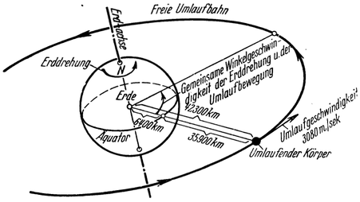
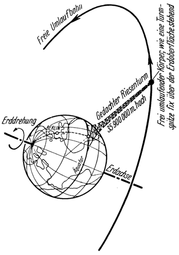

Eine Warte im leeren Weltraum.
==============================

Doch bisher sind wir ja dem eigentlichen Zweck der Raumschiffahrt
noch überhaupt gar nicht gefolgt. Das in diesem Sinn
zunächst liegende Ziel wäre nun: so hoch emporzusteigen, daß
man entsprechend weit über die Erdlufthülle bis in den völlig
leeren Raum gelangte, ohne aber sich vorerst von der Erde auch
gänzlich loszulösen. Nur allein dadurch würden sich schon gewaltige,
ganz neuartige Möglichkeiten eröffnen.

Allerdings genügte es hierzu nicht, lediglich aufsteigen und
wieder landen zu können. Wohl dürfte es möglich sein, im Verlaufe
einer Fahrt, bei der die Steighöhe so groß gewählt wird,
daß die Reise Tage oder Wochen dauert, mancherlei wissenschaftliche
Beobachtungen vorzunehmen; aber eine großzügige Ausnützung
der Raumfahrt ließe sich auf diese Weise doch nicht erzielen.
Schon aus dem Grunde nicht, weil die hierzu nötigen
Einrichtungen wegen ihres Umfanges nicht auf einmal in die Höhe
mitgenommen, sondern nur nacheinander, bestandteilweise hinaufgebracht
und erst oben zusammengesetzt werden könnten.

Letzteres setzt aber die Fähigkeit voraus, in der erreichten
Höhe auch beliebig lang verweilen zu können; ähnlich etwa
wie ein Fesselballon, der sich dort ohne jeden Energieaufwand,
nur durch den Auftrieb der Luft getragen, lange Zeit schwebend
erhält. Wie wäre dies in unserem Falle aber möglich, in Höhen,
die bis in den leeren Weltraum ragen, wo nichts besteht, ja
selbst die Luft zur Unterstützung fehlt? Und doch! Wenn auch
nichts Materielles vorhanden ist, so stünde dennoch etwas, und
zwar noch viel Verläßlicheres zur Verfügung, uns dort oben zu
erhalten. Eine ganz einfache Naturerscheinung ist es: die bereits
so oft erwähnte Fliehkraft.

Schon einleitend wurde darauf hingewiesen<a class="refnote" id="rn1" href="#fn1">1</a>,
daß man sich der Schwerewirkung eines Gestirns, außer durch Erreichung der
praktischen Schweregrenze, auch durch den Übergang in eine freie
Umlaufbahn entziehen könnte; denn in letzterem Falle wird
die Wirkung der Schwerkraft durch die erweckten Trägheitskräfte
(bei kreisförmigem Umlauf nur durch die Fliehkraft allein, Abb. 5)
aufgehoben, so daß ein stabiler Schwebezustand entsteht, der
es gestatten würde, beliebig lange über dem betreffenden Gestirn
zu verharren. Von dieser Möglichkeit müßte nun auch in vorliegendem
Falle Gebrauch gemacht werden.

Es handelt sich demnach also darum, beim Aufstieg nicht nur
die gewünschte Höhe zu erreichen, sondern auch eine bestimmte,
der betreffenden Höhenlage (bzw. der Entfernung vom Erdmittelpunkt)
gerade entsprechende Umlaufgeschwindigkeit zu erlangen,
deren Größe aus den Gesetzen der Gravitationsbewegung genau
errechnet werden kann. Die Erteilung dieser Umlaufgeschwindigkeit,
welche für die Erde in keinem Falle mehr als rund 8000 Meter
je Sekunde betragen müßte, würde keine Schwierigkeiten bereiten,
sobald wir in der Vollendung des Raumfahrzeuges einmal soweit
sind, auch derart hoch aufsteigen zu können.

Unter den unzählig vielen, überhaupt möglichen freien Umlaufbahnen
um die Erde haben für unseren vorliegenden Zweck
nur die wenigstens annähernd kreisförmig verlaufenden Bedeutung
und hiervon wieder sind jene besonders interessant,
deren Halbmesser (Abstand vom Erdmittelpunkt) 42 300 km beträgt
(Abb. 54); denn diesem entspricht, bei einer zugeordneten
Umlaufgeschwindigkeit von 3080 Meter je Sekunde, eine Umlauf—
Winkelgeschwindigkeit, welche ebenso groß ist, wie jene der
Erdrotation. D. h. aber nichts anderes, als daß ein Körper in einer
dieser freien Umlaufbahnen die Erde ebenso schnell
umkreist, als sie sich selber dreht: nämlich einmal in
einem Tage („Stationärer Umlauf“)

Abb. 54. Jeder Körper, der die Erde in der Ebene des
Äquators, 42 300 km entfernt vom Erdmittelpunkte, in
kreisförmiger Bahn umläuft, verharrt freischwebend beständig
über demselben Punkte der Erdoberfläche.

Richten wir es nun außerdem noch so ein, daß die
Umlaufbahn genau in der Äquatorebene liegt,
dann würde der Körper dauernd über ein und demselben
Äquatorpunkte stehen, und zwar in 35900 km Höhe über
der Erdoberfläche, wie sich nach Berücksichtigung des Erdhalbmessers
von rund 6400 km ergibt (Abb. 54). Er würde dann
gleichsam die Spitze eines ungeheuer hohen Turmes bilden, welcher
selbst jedoch gar nicht vorhanden, dessen Tragkraft aber
ersetzt wäre durch die Wirkung der Fliehkraft (Abb. 55).

Diese schwebende „Turmspitze” könnte nun bis zu jeder Größe
ausgebaut und zweckentsprechend eingerichtet werden. Es entstünde
so ein Bauwerk, das fest zur Erde gehört, ja sogar
dauernd in unveränderlicher Stellung zu ihr verharrt und sich
doch weit über der Lufthülle bereits im leeren Weltraum befindet:
eine Warte mit der „Seehöhe 35900000 Meter über
dem Meeresspiegel”. Würde man diese „Weltraumwarte” z.B.
im Meridian von Berlin errichtet haben, dann wäre sie von dort
ständig an jener Himmelsstelle zu erblicken, an welcher sich die
Sonne in der Zeit um Mitte Oktober zur Mittagsstunde befindet.

Abb. 55. Ein Körper, der die Erde wie in Abb. 54 umläuft, verhält sich so, als ob er
die Spitze eines riesigen (natürlich nur gedachten), 35900000 Meter hohen
Turmes bilden würde.

Wollte man die Warte jedoch statt über einem Punkte des Äquators über einer
anderen Stelle der Erde haben, dann müßte man allerdings darauf verzichten, sie in
Bezug auf die Erdoberfläche in unveränderter Lage erhalten zu können; denn es wäre
hierzu erforderlich, der Ebene ihrer Umlaufbahn gegenüber der Äquatorebene einen
entsprechenden Neigungswinkel zu erteilen, was aber zur Folge hätte, daß sie im Verlaufe des
Tages vom Zenite gegen den Horizont je nach der Größe dieses Neigungswinkels mehr
oder weniger tief schwanken würde. Diesen Nachteil könnte man jedoch zum Teil
ausgleichen, wenn man für einen bestimmten Ort nicht nur eine sondern mehrere
Raumwarten errichtet; bei entsprechender Wahl der Bahnneigung wäre
es dann möglich zu erreichen, daß stets eine der Raumwarten
sich nahe dem Zenite des betreffenden Ortes befindet.
Schließlich käme auch der besondere Fall in Frage, die Umlaufbahn
so einzustellen, daß ihre Ebene entweder zur Ebene der Erdbahn,
wie Oberth es vorschlägt, oder zu jener des Äquators senkrecht steht.

Desgleichen könnte natürlich auch die Größe (der Durchmesser)
der Umlaufbahn anders gewählt werden, als dies in vorliegendem
Fall zwecks Erreichung des stationären Umlaufes geschehen ist;
so z. B., wenn der Umlauf aus energiewirtschaftlichen
Gründen in größerer Entfernung von der Erde (Verkehrsstützpunkt,
siehe Nachfolgendes) oder näher zu ihr stattfinden soll,
bzw. ein ständiger Wechsel des Standpunktes der Raumwarte
gegenüber der Erdoberfläche besonders erwünscht wäre
(unter Umständen eventuell für Raumspiegel, Kartographie usw.,
siehe Nachfolgendes).

Wie nun würde sich in einer Raumwarte das Leben abspielen,
welchen Zwecken könnte dieselbe dienen und wie müßte sie demgemäß
ausgestaltet und eingerichtet werden? Entscheidend für
diese Fragen sind die besonderen, dort herrschenden physikalischen
Voraussetzungen: schwerelos und luftleer.

<a href="#rn1">1</a>Siehe Seite 13 bis 16.

