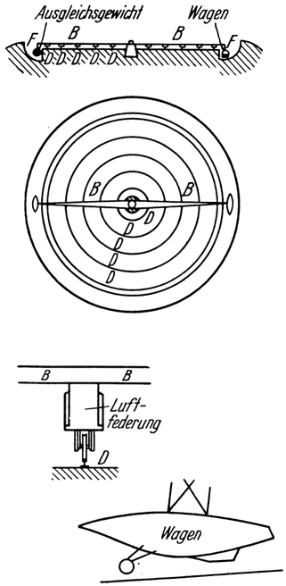
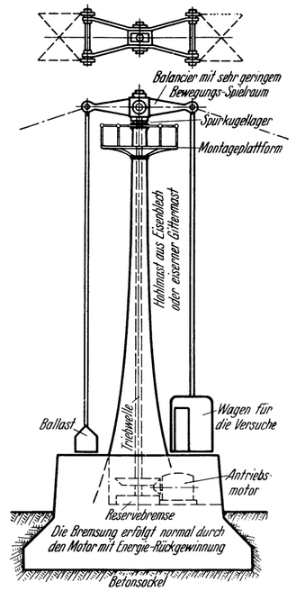
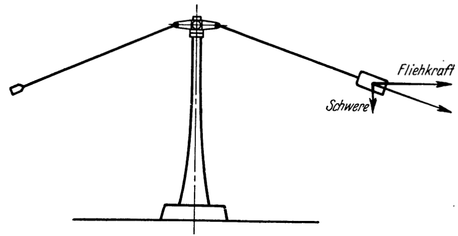
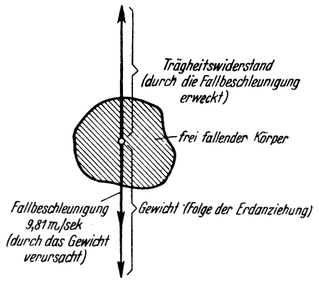

Das Wesen der Schwere und ihre Beeinflußbarkeit.
===============================================

Schon eingangs wurde über die sogenannten Massenkräfte gesprochen<a class="refnote" id="rn1" href="#fn1">1</a>
und dargetan, daß wir verschiedene Arten derselben
unterscheiden nämlich: die Schwerkraft, den Trägheitswiderstand
und, als besonderen Fall des letzteren, die Fliehkraft.
Nun müssen wir uns etwas näher auch mit ihrem Wesen befassen.

Dasselbe besteht nämlich darin, daß diese Kräfte nicht wie die
anderen mechanischen Kräfte nur an einzelnen Stellen der Oberfläche
eines Körpers, sondern daß sie an allen, auch an den in
seinem Inneren gelegenen Punkten gleichzeitig angreifen. Da diese
Besonderheit allen Massenkräften gemeinsam zukommt, ist es somit
für die praktische Wirkung ganz gleichgültig, von welcher
Art eine Massenkraft ist. Stets wird sie sich auf einen Körper
in gleicher Weise äußern wie die Schwerkraft, und wir werden
sie auch in jedem Falle ebenso empfinden, wie das uns wohlbekannte
„Schweregefühl“, einerlei ob es sich hierbei um Schwerkraft,
Trägheitswiderstand, Fliehkraft oder auch um die Resultierende
mehrerer dieser Kräfte handelt. Durch diese vollkommene
Gleichartigkeit der Wirkung ist es möglich, daß die verschiedenen
Arten von Massenkräften sich gegenseitig sowohl verstärken als
schwächen oder auch sich gänzlich aufheben können.

<table>
<tr>
  <td align="center"></td>
  <td align="center"></td></tr>
<tr>
  <td>B. Querarm. D. Fahrschienen. Abb. 56. Karussell nach Oberth,</td>
  <td>Abb. 57. Riesenzentrifuge nach Vorschlag des Verfassers,</td></tr>
<tr><td colspan="2">beide dazu bestimmt, den Zustand erhöhter Schwere
künstlich zu erzeugen, zwecks Vornahme von physiologischen Versuchen.</td></tr>
</table>

Ein Beispiel für das Zustandekommen gegenseitiger Verstärkung
von Massenkräften lernten wir schon bei der Untersuchung
des Aufstieges von Raumraketen kennen<a class="refnote" id="rn2" href="#fn2">2</a>.
In diesem Falle wird die Schwerkraft, solange der Antrieb wirkt, durch den dabei
erweckten Trägheitswiderstand vermehrt, was sich praktisch wie
eine vorübergehende Erhöhung der Schwere geltend macht (Abb. 22).

Aber auch unter normalen irdischen Verhältnissen kann der Zustand
erhöhter Schwere — und sogar auf beliebig lange Dauer erzeugt
werden: nämlich wenn hierzu die Fliehkraft herangezogen
wird. Letzteres findet, technisch angewendet, z. B. in den
verschiedenartigen Zentrifugen statt und würde sich mit Hilfe von
eigens dafür gebauten Karussellen (Abb. 56) oder besser noch
mittels besonders konstruierter Riesenzentrifugen (Abb. 57 und 58)
auch in größtem Maßstabe bewerkstelligen lassen. Bei entsprechend
hoher Drehzahl wäre auf diese Weise
eine auch sehr bedeutende Vervielfachung der Schwerewirkung
erzielbar.

Abb. 58. Die Riesenzentrifuge in Betrieb.

Hingegen ist eine länger andauernde Verminderung oder
Aufhebung der Schwere, also die Erzeugung eines dauernden
schwerelosen Zustandes unter irdischen Verhältnissen nicht möglich;
denn — es sei nochmals betont — die Schwerkraft läßt sich
auf keinerlei andere Weise unwirksam machen, als nur durch das
Entgegensetzen einer gleichgroßen anderen Massenkraft. So kann
man einen Körper durch Unterstützen wohl daran hindern, daß
er fällt (also der Schwerkraft folgt), aber sein Gewicht aufheben
kann man dadurch nicht, was ja das Fortbestehen seines
Druckes auf die Unterlage beweist. Auch der Versuch, einen Körper
etwa durch irgendeine Veränderung seines materiellen Aufbaues
dem Einfluß der Schwerkraft zu entziehen, dürfte wohl für
alle Zeiten zum Mißlingen verurteilt sein.

Nun steht auf der Erdoberfläche aber weder eine entsprechend
starke fremde Schwerkraft zur Verfügung, noch können daselbst
Fliehkräfte in einem Körper auf solche Art erweckt werden,
daß er durch deren Wirkung in einen beobachtbaren schwerelosen
Zustand versetzt wird.

Abb. 59. Kräftespiel an einem frei fallenden Körper.

Wohl aber ist es auch auf der Erde — allerdings nur für kurze
Dauer — möglich, die Schwerkraft durch die dritte Massenkraft
nämlich mittels des Trägheitswiderstandes aufzuheben.
Alltäglich können wir diese Art des Zustandekommens der
Schwerelosigkeit an uns selbst erleben oder auch an anderen
Körpern beobachten, und zwar im Zustande des freien Fallens.
Daß ein Körper fällt, bedeutet ja nichts anderes, als
daß er durch sein Gewicht gegen den Erdmittelpunkt bewegt
wird, und zwar mit einer Be
schleunigung (von bei uns bekanntlich 9,81 m/sec²)‚ die genau
so groß ist, daß der dadurch im Körper erweckte Trägheitswiderstand
das Körpergewicht gerade aufhebt (Abb. 59); denn würde
davon ein Rest noch übrigbleiben, so hätte dies eben eine dementsprechende
Vergrößerung der Beschleunigung und damit des (hier
der Schwere entgegenwirkenden) Trägheitswiderstandes zur Folge.

Im freien Fallen, auch während eines Sprunges, sind wir demnach
gewichtslos. Jenes Gefühl, das wir dabei empfinden, ist also das der
Schwerelosigkeit; jenes Verhalten, das wir an einem Körper während
des freien Fallens beobachten, würde er auch in einem auf andere
Weise erzeugten gewichtslosen Zustande zeigen. Da aber das Fallen
nur Augenblicke andauern kann, wenn es nicht zur Vernichtung
führen soll (am längsten noch bei Fallschirmabsprüngen, Skisprüngen
usw.), so ist eben das Zustandekommen des schwerelosen Zustandes
auf der Erde nur für ganz kurze Zeit möglich.
Trotzdem gelang es Oberth auf diese Weise sehr interessante Versuche
anzustellen, aus denen auf das Verhalten der verschiedenen
Körper und den Ablauf von Naturerscheinungen im schwerefreien
Zustand geschlossen werden kann.

Ganz anders liegen jedoch die Verhältnisse bei der Raumfahrt.
Nicht nur daß bei dieser der freie Fall Tage und Wochen andauern
kann. Es wäre hierbei auch möglich, einen Körper bleibend
der Schwerewirkung zu entziehen, und zwar wie eingangs<a class="refnote" id="rn3" href="#fn3">3</a>
schon gesagt: mit Hilfe der Gegenwirkung von durch freie Umlaufbewegung
erzeugten Trägheitskräften, insbesondere der Fliehkraft.
Hiervon ist ja laut Früherem auch bei der Raumwarte
Gebrauch gemacht. Demnach befindet sich diese im Zustande
unbegrenzt andauernder, vollkommener Schwerefreiheit
(„stabiler Schwebezustand“).

<a href="#rn1">1</a>Siehe Seite 9 bis 11.

<a href="#rn2">2</a>Siehe Seite 41, 42.

<a href="#rn3">3</a>Siehe Seite 13, 14.

