Das physikalische Verhalten der Körper bei Fehlen der Schwere.
==============================================================

Um sich nun auch von den allgemeinen physikalischen Verhältnissen,
die im schwerelosen Zustand herrschen, eine Vorstellung bilden
zu können, muß man festhalten: Die alle Massen auf den Boden
niederziehende und so nach bestimmter Gesetzmäßigkeit ordnende
Kraft der Erdschwere ist nicht mehr wirksam. Demnach
bewegen sich die Körper, nahezu nur dem Trägheitsgesetze
(Beharrungsvermögen) folgend, solange in ihrer zufälligen
Bewegungsrichtung geradlinig fort, als kein Widerstand sie hemmt, und sie
ordnen sich allein nach den zwischen und in ihnen wirkenden,
den Körpern selbst zukommenden (molekularen, elektrischen,
magnetischen, Massenanziehungs- und sonstigen) Kräften.

Diese außergewöhnlichen Voraussetzungen müssen aber zur
Folge haben, daß sämtliche Körper ein gänzlich verändertes Verhalten
zeigen und daß sich demgemäß auch unser eigenes Tun
und Lassen in einer vom Bisherigen völlig verschiedenen Art abwickeln wird.

So kann die menschliche Fortbewegung nun nicht mehr durch
„gehen” erfolgen. Die Füße haben ihren gewohnten Zweck
verloren. Mangels eines Gewichtsdruckes fehlt die Reibung unter
den Sohlen; diese bleiben daher am Boden noch viel weniger
haften, als selbst auf dem glattesten Eisspiegel. Um sich fortzubewegen,
muß man sich entweder entlang einer Fläche mit den
Händen fortziehen (Abb. 60, z), zu welchem Zweck die Wände
der Raumwarte womöglich durchweg mit entsprechenden Griffen
(etwa Schlingen ähnlich jenen der Straßenbahnwagen) ausgestattet
sein müßten (Abb. 60 und 61), oder aber man stößt
sich in der Richtung auf ein Ziel ab und schwebt demselben zu
(Abb. 60, a).

Es mag dabei dem Neuling schwerfallen, mit seinen Kräften
entsprechend Maß zu halten. Dies aber ist notwendig; denn da
man ja mit der vollen Kraft der Abstoßung auch auf der gegenüberliegenden
Wand des Zimmers auftrifft, kann allzu großer
Eifer in diesem Fall sehr leicht zu schmerzlichen Beulen führen.
Deshalb müßten in allen von Menschen benutzten Räumen die
Wände und insbesondere sämtliche Ecken und Kanten sehr gut
gepolstert sein (Abb. 60).

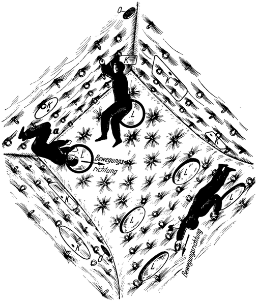
Abb. 60. Ein Zimmer der Raumwarte, in welchem gewichtsloser Zustand
herrscht und das demgemäß ausgestattet ist: Die Wände sind durchweg gepolstert
und mit Greifschlingen versehen. Kein loser Gegenstand ist vorhanden.
<dl>
<dt>K</dt><dd>Verschließbare Kästen zum Aufbewahren von Gebrauchsgegenständen u. dgl.</dd>
<dt>L</dt><dd>Luken für den Lichteinlaß (siehe folgende Seite 129).</dd>
<dt>O</dt><dd>Öffnungen der Belüftungsleitmg (siehe folgende Seite 130).</dd>
<dt>z</dt><dd>Fortbewegung des Menschen durch Fortziehen.</dd>
<dt>a</dt><dd>Fortbewegung des Menschen durch Abstoßen.</dd>
</dl>

Die Abstoßung kann aber auch lebensgefährlich werden, und
zwar wenn sie nicht in einem geschlossenen Raum sondern im
Freien erfolgt, also z.B. bei Aufenthalt (im Raumanzug, siehe
Folgendes) außerhalb der Raumwarte; denn hat man es versäumt,
hierbei entsprechende Vorsichtsmaßregeln zu treffen und
beim Abstoßen sein Ziel verfehlt, dann schwebt man fortgesetzt
weiter: ohne Ende indie totbringende Leere des Weltenraums.
So droht nun, als Gegenstück zur irdischen Gefahr des „Stürzens
in die Tiefe”, die nicht minder erschreckende Möglichkeit
des „Entschwebens in den Raum”. Der Ruf: „Mann über
Bord” gilt also auch bei Fehlen der Schwere, allerdings in anderem Sinn.

Da die Körper nun nicht mehr durch ihr Gewicht auf ihre
Unterstützung gedrückt werden, hat es natürlich keinen Zweck,
daß man einen Gegenstand irgendwo „aufhängt” oder „hinlegt”,
es wäre denn, man würde ihn auf seiner Unterlage ankleben
oder etwa durch magnetische oder andere Kräfte niederhalten.
Einen Körper aufbewahren kann man also nur mehr dadurch,
daß man ihn irgendwo befestigt oder besser noch einschließt.
Daher müßten die Räume der Warte mit gut verschließbaren,
an den Wänden entsprechend angebrachten Kästen ausgestattet
sein (Abb. 60 und 61, K).

Kleiderrechen, Stellagen u. dgl., ebenso Tische, soweit sie zum
Ablegen von Gegenständen dienen sollen, sind also unbrauchbare
Möbelstücke geworden. Aber auch Sessel, Bänke und Betten
können ihren Zweck nicht mehr erfüllen; man müßte sich an
ihnen festbinden, um nicht schon bei der kleinsten Bewegung
von ihnen fort in irgendeine Zimmerecke zu entschweben. Ohne
Schwere gibt es eben weder ein „Stehen” noch ein „Sitzen” oder
„Liegen”. Um eine Arbeit zu verrichten, ist es somit nötig,
sich an der Stelle seiner Tätigkeit ebenfalls festzumachen: also
z. B. an der Tischplatte, wenn man schreiben oder zeichnen
wollte (Abb. 61). Um zu schlafen, muß man jedoch nicht
erst sich niederlegen: in jeder Körperlage, an jeder Stelle des
Raumes kann man der Ruhe pflegen.

Aber trotz dieser durch das Fehlen der Schwere bedingten
Regellosigkeit im physikalischen Verhalten der frei beweglichen
Körper, ist die Art, wie dieselben nunmehr zur Ruhe kommen,
doch nicht vollkommen willkürlich; denn das allgemeine Gesetz
der Massenanziehung gilt ja auch für die Raumwarte
selbst und bewirkt, daß alle Massen gegen den gemeinsamen Schwerpunkt
hingezogenwerden. Allerdings — infolge der verhältnismäßigen
Kleinheit der Gesamtmasse — mit so äußerst geringer Beschleunigung, daß
die Zurücklegung von nur einem Meter Weges Stunden dauert. Aber
schließlich werden die nicht festgehaltenen Körper, entweder infolge dieser
oder ihrer sonstigen

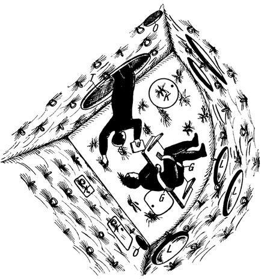
Abb. 61. Verrichtung von Schreibarbeiten im
schwerelosen Zustand: Man muß sich hierzu an der Tischplatte
z.B. mittels Ledergurten (G) festmachen, um
(ohne sich anzuhalten) an derselben überhaupt verbleiben
zu können. — Durch die (hier runde) Türöffnung
(T) schwebt eben ein Mann aus dem Nebenraum
herein, einen Gegenstand bringend.

zufälligen Bewegung, doch auf eine der Zimmerwände treffen und
entweder gleich an derselben angelegt bleiben oder, wenn ihre Geschwindigkeit
genügend groß war, je nach dem Grade der Elastizität
immer wieder zurückgestoßen zwischen den Wänden des Raumes
solange hin und her schweben, bis ihre Bewegungsenergie sich allmählich
verbraucht hat und sie an einer der Wände ebenfalls zur
Ruhe kommen. Es werden sich somit sämtliche im Bereiche

der Raumwarte freischwebenden Körper im Laufe der
Zeit an die Wandungen anlegen, und zwar vornehmlich so,
daß sie dem gemeinsamen Gebäudeschwerpunkt dabei möglichst
nahekommen.

Da sich dieser Vorgang jedoch über Stunden, ja auch viele
Tage ausdehnen kann und sogar schon ein schwacher Luftzug
genügen würde, ihn zu stören, bzw. die bereits zur Ruhe gekommenen,
aber nur äußerst schwach haftenden Körper von den
Wänden loszureißen und wieder durcheinanderzubringen, so wird
dadurch praktisch genommen doch keine Gesetzmäßigkeit in die
Bewegungsweise der gewichtslosen Massen gebracht.

Letzteres macht sich besondersgunange'nehm bemerkbar, wenn
es sich um Körper handelt, die in bedeutender Zahl in einen
Raum gelangten. Sind dieselben staubförmig, so können sie noch
in verhältnismäßig einfacher Weise, und zwar durch Filtrieren der
Luft mittels Staubsaugapparaten oder ähnlichen Vorrichtungen gesammelt
und entfernt werden. Sind sie aber etwas größer, würde
man z.B. so unvorsichtig' sein, einen Sack Äpfel in einem Zimmer
auszuleeren, dann bliebe nichts anderes übrig, als dieselben mittels
Netzen einzufangen. Es müssen eben alle_Körper sehr gut verwahrt
werden; denn die ordnende Macht der Schwere hat aufgehört
zu herrschen: die Materie ist „entfesselt”.

Auch die Bekleidungsstoffe streiken nun; denn sie „fallen” nicht
mehr, auch wenn sie aus noch so schwerem Gewebe bestünden.
Daher sind Mäntel, Frauenröcke, Schürzen und dgl. unbenützbare
Kleidungsstücke. Sie würden sich bei Körperbewegungen ganz
regellos nach allen möglichen Richtungen legen.

Besonders eigenartig ist im gewichtslosen Zustand das Verhalten
der Flüssigkeiten. Diese sind unter normalen Verhältnissen
bekanntlich bestrebt, der Schwere folgend, nach möglichst tief
gelegenen Stellen zu gelangen und schmiegen sich demnach stets
vollkommen der jeweiligen Unterlage (dem Gefäße, dem Erdboden
usw.) an. Fehlt jedoch die Schwere, dann können die ein-
zelnen Massenteilchen ungehindert ihren Molekularkräften
folgen und sich nach deren Wirkungsweise ordnen.

Flüssigkeiten nehmen daher im gewichtslosen Zustand eine
selbständige, und zwar die einfachste geometrische Körperform,
nämlich Kugelgestalt an. Voraussetzung hierfür ist allerdings,
daß sie nur ihren Kohäsionskräften unterliegen, also mit keinem
Körper in Berührung sind, den sie „benetzen” können.

Es wird nun auch verständlich, warum sich das Wasser im
Fallen gerade zu Tropfen formt: denn in diesem Zustande ist es
laut Früherem ja gewichtslos, nimmt daher also Kugelgestalt an,
die durch den Luftwiderstand aber zur Tropfenform verzerrt wird.

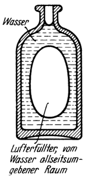
Abb. 62. Verteilung des Wassers in einer nur teilweise gefüllten Flasche bei
Fehlen der Schwere.

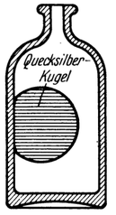
Abb. 63. Verhalten des Quecksilbers in einer Flasche bei
Fehlen der Schwere.

Befindet sich die Flüssigkeit jedoch mit einem Körper in
Berührung, dem gegenüber sie benetzend Wirkt, dann kommen
zu den Kohäsions— noch Adhäsionskräfte von überwiegender
Stärke hinzu. Die Flüssigkeit wird dann bestrebt sein, letzteren zu
folgen, und sich über die Oberfläche des Körpers möglichst
auszubreiten: ihn also mit einer mehr oder weniger dicken
Flüssigkeitsschicht zu überziehen.

Demgemäß wird z. B. das Wasser einer nur zum Teil gefüllten
Flasche nicht etwa den Boden derselben einnehmen, sondern,
die Mitte leer lassend, sich über sämtliche Gefäßwände auszubreiten
suchen (Abb. 62). Hingegen wird Quecksilber, das eine
nicht benetzende Flüssigkeit ist, zu einer Kugel zusammengeballt
und an eine Gefäßwand angelegt, in der Flasche schwebend verharren (Abb. 63).

In beiden Fällen ist es gänzlich gleichgültig, in welcher Lage
man dabei die Flasche hält. Daher kann dieselbe auch nicht,
wie sonst, durch einfaches Neigen entleert werden. Man muß
sie zu diesem Zwecke nun:

entweder rasch zurückziehen (also nach rückwärts beschleunigen, Abb. 64)
oder in der Richtung der Ausflußöffnung verstoßen und daraufhin
bzw. in schon bestehender Vorwärtsbewegung plötzlich
anhalten (also in einer Vorbewegung verzögern, auch wie Abb. 64),
oder endlich man muß sie im Kreise schwingen (Abb. 65).

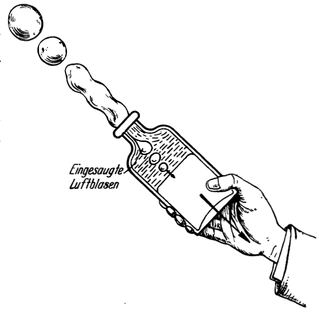
Abb. 64. Entleeren einer Flasche in gewichtslosem Zustand durch Zurückziehen derselben.

Die Flüssigkeit wird dann infolge ihres Beharrungsvermögens
(das sich in letzterem Falle als Fliehkraft äußert) aus der Flasche
austreten, unter gleichzeitigem Einsaugen von Luft (wie das Glucksen beim normalen Ausgießen
einer Flasche). Voraussetzung hierfür ist allerdings, daß der Flaschenhals
ausreichend weit ist, bzw. die Bewegung mit genügender Kraft
ausgeführt wird, damit dieser Lufteinlauf entgegen dem gleichzeitig
ausströmenden Wasser auch tatsächlich stattfinden kann.

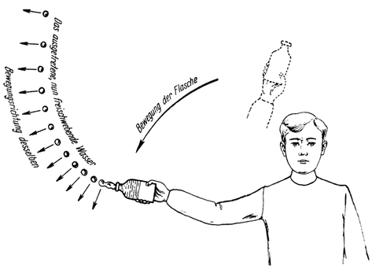
Abb. 65. Im Kreise Schwingen einer Wasserflasche zwecks Entleerung derselben
bei Fehlen der Schwere. (In Wirklichkeit wird sich die ausgetretene Flüssigkeit
auf der angedeuteten Ausflußkurve wahrscheinlich nicht so regelmäßig verteilen.)

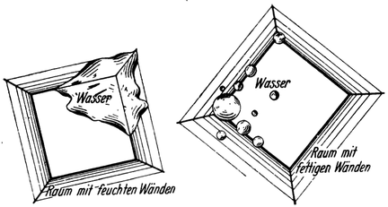
Abb. 66. Bei Fehlen der Schwere würde sich
ausgeflossenes Wasser in einem Raum mit gut benetzbaren
(also z. B. etwas feuchten) Wänden über dieselben ausbreiten
(linkes Bild), in einem Raum mit nicht benetzbaren
(z. B. fettigen) Wänden in Kugeln zusammengeballt an die Wände legen (rechtes Bild).

[Es ist interessant zu beachten, daß die beschriebene Art der
Entleerung einer Flasche durch Zurückziehen oder Anhalten derselben
bei fehlender Schwere im Grunde genommen eigentlich
auch nicht anders vor sich geht, als wenn sie bei normalem
Schwerezustand durch verkehrtes Halten ausgegossen wird.
Ja, daß diese Vorgänge physikalisch sogar vollkommen geichartig
sind, wenn man die Bewegung des Zurückziehens bzw. Anhaltens
genau mit der Beschleunigung der Schwere (bei uns
9,81 m/sec2) ausführt; denn nach der allgemeinen Relativitätstheorie ist
bekanntlich ein in beschleunigter oder verzögerter Bewegung begriffenes
System einem Schwerefeld von derselben Beschleunigung
vollkommen gleichwertig. Man kann also sagen, daß bei
dem geschilderten Entleerungsverfahren an die Stelle der fehlenden
Schwere gleichsam ersetzend jene Massenträgheitskräfte treten,
welche in dem System: Flasche samt Inhalt durch das Zurückziehen
bzw. Anhalten desselben wachgerufen werden.]

Nach dem Austreten aus der Flasche wird die Flüssigkeit zu
einer oder mehreren Kugeln geballt im Raume weiterschweben,
was vielleicht ähnlich wie durch die Luft sich bewegende Seifenblasen
aussehen mag. Schließlich muß dann jede solche schwebende
Flüssigkeitskugel auf eine der Zimmerwände stoßen.

Kann sie dieselbe benetzen, dann wird sie sich darüber auszubreiten
suchen (Abb. 66 links).

Andernfalls aber wird sie durch den Stoß, ähnlich etwa wie
ein auffallender Quecksilbertropfen, in zahlreiche kleinere Kügelchen
zerbröseln, die längs der Wände oder mitunter vielleicht
auch frei durch den Raum entschweben, wobei sie sich zum Teil
wieder vereinigen und abermals zerstieben werden, bis ihre lebendige
Kraft sich endlich verbraucht hat und die ganze Flüssigkeitsmenge
dann zu einer oder mehreren an die Wände angelegten
Kugeln vereinigt (Abb. 66 rechts) zur Ruhe kommt. (Man vergleiche
hierzu das früher über die Vorgänge in einer Flasche Gesagte, Abb. 62 und 63.)

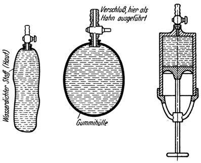
Abb. 67. Bei Fehlen der Schwere müßten die sonst
üblichen Flüssigkeitsgefäße durch verschließbar ausgeführte
Schläuche (links), Gummiballons (Mitte)
oder handspritzenartige Gefäße (rechts) ersetzt werden.

Mit Rücksicht auf dieses ungewöhnliche Verhalten der Flüssigkeiten würde keines
der üblichen Gefäße wie Flaschen, Trinkgläser, Kochtöpfe, Krüge, Waschbecken usw.
noch zu verwenden sein. Es wäre kaum möglich, sie zu füllen.
Aber selbst wenn es gelänge, beispielsweise ein Bad bereitzustellen
— wir könnten es nicht benützen; denn in kürzester Zeit würde
sich das Wasser der Wanne zu unserer Enttäuschung über die
Zimmerwände ausgebreitet oder als Kugeln an diese gelegt haben.

Zur Unterbringung von Flüssigkeiten wären nur mehr verschließbare
Schläuche, Gummiballons oder Gefäße mit kolbenartig
verschiebbaren Böden, ähnlich Handspritzen, geeignet
(Abb. 67); denn nur solche ließen sich in einfacher Weise füllen
(Abb. 68) sowie bequem entleeren. Letzteres, indem man durch
Zusammendrücken derselben bzw. durch Vorschieben des Kolbens
den Inhalt aus ihnen herauspreßt (Abb. 69). Bei elastischen
Gummiballons, die unter Dehnung der Hülle gefüllt werden,
genügte auch schon die Spannung der letzteren allein, um die
Flüssigkeit bei Öffnen des Hahnes zum Ausfließen zu bringen
(Abb. 70).

Derartige zusammendrückbare Gefäße müßten (mit einem entsprechenden
Mundstück ausgestattet) nun auch zum Trinken
benützt werden, an Stelle der jetzt unbrauchbar gewordenen
sonst üblichen Trinkgefäße.

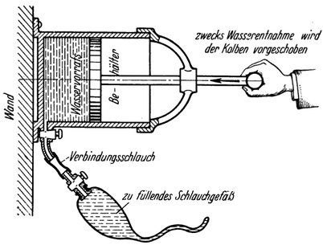
Abb. 68. Füllen eines Wassergefäßes im schwerelosen Zustand.

Aber auch die verschiedenen Eßgeräte wie Teller, Schüsseln,
Löffel usw. ließen sich nicht mehr verwenden. Eine unvorsichtige
Bewegung: und wir müßten ihrem vielleicht köstlichen Inhalt
durch das Zimmer schwebend nachjagen. Das Zusichnehrnen der
Speisen wäre daher überhaupt nur auf zwei Arten möglich:
entweder indem man sie in fester Form wie ein Brot ißt oder in
flüssigem oder breiigem Zustand mit Hilfe der erwähnten
zusammendrückbaren Gefäße trinkt. Dementsprechend zubereitet
würde sie der Koch auch liefern müssen.

Letzterer hätte bei seiner wichtigen Tätigkeit allerdings mit
besonders großen Schwierigkeiten zu kämpfen. Immerhin ließen
sich aber auch diese überwinden. So könnte man z. B. verschließbare,
elektrische Kochgeräte gebrauchen, die während der Benützung
in ständiger Rotation erhalten werden, so daß (an Stelle
der nun fehlenden Schwere) die dabei erzeugte Fliehkraft den Inhalt
an die Gefäßwände andrückt und ähnliches mehr. Jedenfalls
aber wäre das Kochen recht unbequem, trotzdem jedoch ebenso
wie das Essen und Trinken in irgendeiner Weise möglich.

Gänzlich verzichten müßte man aber darauf, sich in gewohnter
Weise zu waschen oder zu baden! Reinigungen könnten jetzt
nur mehr durch Abreiben mittels feuchter, nach Bedarf auch
eingeseifter Tücher, Schwämme oder dgl. bewerkstelligt werden,
so gut oder schlecht es auf diese Art eben ginge.

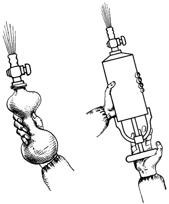
Abb. 69. Das Entleeren eines Flüssigkeitsgefäßes kann bei Fehlen der Schwere in
zweckdienlicher Weise nur durch Herausschieben (-pressen) des Inhaltes
bewerkstelligt werden.

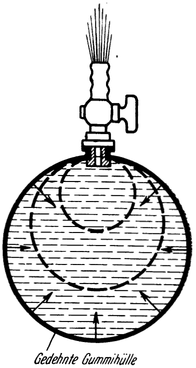
Abb. 70. Bei elastischen, unter Drück gefüllten Gummiballonen fließt der
Inhalt bei Öffnen des Hahnes von selbst aus.

Je näher wir also die Sache betrachten, desto mehr müssen wir
erkennen, daß es in Wirklichkeit keineswegs ein ganz ungetrübtes
Vergnügen sein dürfte, von allem lästigen Gewicht befreit, engelsgleich
schweben zu können; ja sogar auch dann nicht, wenn wir
selbst diesen Zustand angenehm empfinden würden. Denn die
Schwere hält nicht nur uns in ihrem Bann: auch alle anderen
Körper zwingt sie zu Boden und hindert sie so, ganz ohne Gesetzmäßigkeit,
dem Zufall frei überlassen, sich wirr durcheinander
zu bewegen. Sie ist vielleicht die wichtigste ordnunggebietende
Macht unseres Daseins. Wo sie fehlt, ist alles im wahrsten Sinne
„auf den Kopf gestellt”, es hat seinen Halt verloren.

