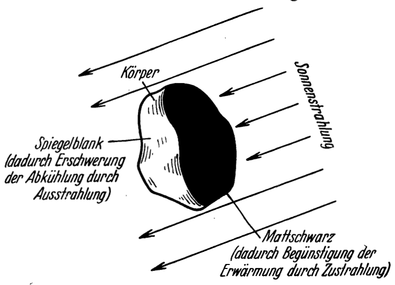
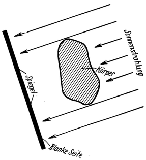
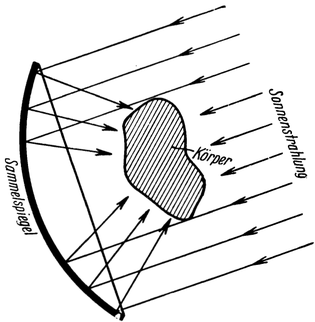
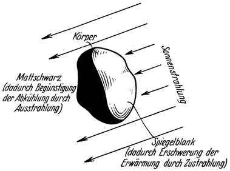
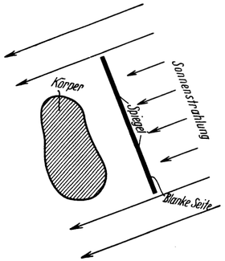

<#include "pagebreak.ftl">
Wärmelos.
=========

Besonders bedeutungsvoll ist der Einfluß, den das Fehlen der
Luft auf die *Wärmeverhältnisse* des Weltraums ausübt. Da
die Wärme, wie man heute weiß, nichts anderes ist als ein bestimmter
*Bewegungszustand* der kleinsten materiellen Teilchen, aus
denen sich die Körperstoffe aufbauen, ist ihr Auftreten stets an
die Voraussetzung geknüpft, daß überhaupt Stoffe vorhanden sind.
Wo letztere fehlen, kann es somit keine Wärme geben: der leere
Weltraum ist also praktisch „*wärmelos*”. Ob dies auch theoretisch
\<@pagebreak 122/> vollkommen richtig ist, hängt davon ab, inwieweit die mancherseits
vertretene Ansicht, daß der Weltraum doch mit einem
wenn auch außerordentlich fein verteilten wirklichen Stoff erfüllt
sei, tatsächlich zutrifft. Herrscht *völlige* materielle Leere, dann
verliert damit der Begriff der Temperatur überhaupt seinen Sinn.

Diese Auffassung steht nicht im Widerspruch mit der Tatsache,
daß der Weltraum von den Wärmestrahlen der Sonne und
jenen der anderen Fixsterne in reichlichstem Maße durchsetzt wird;
denn die Wärmestrahlen *selbst* sind noch keine Wärme! Sie sind
nichts als elektromagnetische Ätherwellen von gleicher Art wie
beispielsweise die Licht- oder die Funkwellen; jedoch mit der besonderen
Eigenschaft, daß sie eben jene molekulare Bewegung,
die wir Wärme nennen, *erzeugen* können, sobald sie auf etwas
Stoffliches treffen. Dies aber auch nur dann, wenn sie dabei von
dem betreffenden Stoffe *aufgenommen* (vernichtet) werden, denn
nur in diesem Falle geht ihre Energie auf den Körper über und
setzt sich dabei in Wärme desselben um.

So wird sich die Temperatur eines *durchsichtigen* oder
eines *spiegelglatt* polierten Körpers auch bei starker Wärmebestrahlung
nur wenig erhöhen, er wird sich gegen Wärmestrahlen
als nahezu *unempfindlich* erweisen; denn in ersterem
Falle werden die Strahlen vom Körper größtenteils durchgelassen
in letzterem zurückgeworfen, ohne aber geschwächt oder vernichtet
worden zu sein, also ohne hierbei von ihrer Energie
etwas abgegeben zu haben. Ist hingegen die Oberfläche des
Körpers *dunkel* und *rauh*, dann kann er die auftreffenden
Strahlen weder durchlassen noch zurückwerfen: sie müssen in
diesem Falle aufgenommen werden und führen dadurch zur *Erwärmung* des Körpers.

Diese Erscheinung gilt jedoch nicht nur für die *Aufnahme*
sondern ebenso auch für die Abgabe von Wärme durch Strahlung:
Je heller und glatter die Oberfläche eines Körpers ist, desto
geringer ist auch sein Ausstrahlungsvermögen, desto länger *behält*
er demgemäß seine Wärme, während er sich hingegen bei
dunkler, rauher Oberfläche sehr rasch durch Ausstrahlung *abkühlen* kann.

\<@pagebreak /> Den Wärmestrahlungsvorgängen der verschiedenen Art unterliegen
also am meisten *mattschwarze* und am wenigsten *hellspiegelnde* Flächen.
Dieser Umstand würde es ermöglichen, die Temperatur von Körpern im
leeren Weltraum auf einfache Weise und in weitgehendem Maße
willkürlich zu beeinflussen.

Abb. 71. <em>Erwärmung</em> eines Körpers im leeren
Weltraum mittels Sonnenstrahlung, durch entsprechende
Wahl seiner Oberflächenbeschaffenheit.

Soll sich ein Gegenstand im Weltraum *erwärmen*, so wird man
demnach seine der Sonne zugekehrte Seite mattschwarz und die
Schattenseite hellspiegelnd machen (Abb. 71); oder man schirmt die
Schattenseite mittels eines Spiegels gegen den Weltraum ab (Abb. 72).

Abb. 72. <em>Erwärmung</em> eines Körpers durch Abschirmung seiner Schattenseite
gegen den leeren Weltraum mittels eines Spiegels.

Abb. 73. <em>Starke Erhitzung</em> eines Körpers durch Konzentration von
Sonnenstrahlen auf denselben mittels eines Hohlspiegels.

Benutzt man hierzu einen Sammelspiegel, der außerdem noch
\<@pagebreak /> Sonnenstrahlen in entsprechender Stärke auf den Körper hinlenkt,
dann könnte dessen Temperatur auch sehr hoch gebracht werden
(Abb. 73).

Abb. 74. <em>Abkühlung</em> eines Körpers im leeren
Weltraum durch entsprechende Wahl seiner Oberflächenbeschaffenheit.

Soll sich hingegen ein Körper im Weltraum *abkühlen*, dann muß seine
Sonnenseite spiegelnd gemacht und seine Schattenseite mattschwarz
gelassen werden (Abb. 74); oder man schirmt ihn mittels eines
Spiegels gegen die Sonne ab (Abb. 75). Er wird dann durch Ausstrahlung
in den Weltraum immer mehr von seiner Wärme verlieren;
denn diese könnte sich nun nicht mehr durch Leitung aus der
Umgebung beständig ersetzen, wie dies auf der Erde infolge
Berührung mit der umgebenden Luft geschieht, während die Ergänzung
seiner Wärme durch *Zustrahlung* eben durch die erwähnte
Abblendung auf ein Mindestmaß herabgesetzt wäre. Auf diese Weise
müßte sich ein Körper bis nahe an den absoluten Nullpunkt
(-273° Celsius) abkühlen lassen. Ganz erreichen könnte man
denselben dabei allerdings auch nicht, weil auf der Schattenseite dem
Körper durch die Fixsterne doch ein gewisses Maß von Wärme zugestrahlt wird, und auch die
Spiegel nie vollkommen gegen die Sonne abschirmen könnten.

Abb. 75. <em>Abkühlung</em> eines Körpers durch Abschirmung desselben gegen die
Sonnenstrahlung mittels eines Spiegels.

\<@pagebreak /> Es wäre somit in der Raumwarte möglich, durch die geschilderte
Ausnützung der Strahlungserscheinungen nicht nur die normale,
zum Leben notwendige Wärme andauernd zu halten, sondern
auch äußerst hohe und niedere Temperaturen und demnach
auch sehr gewaltige Wärmegefälle zu erzeugen.

