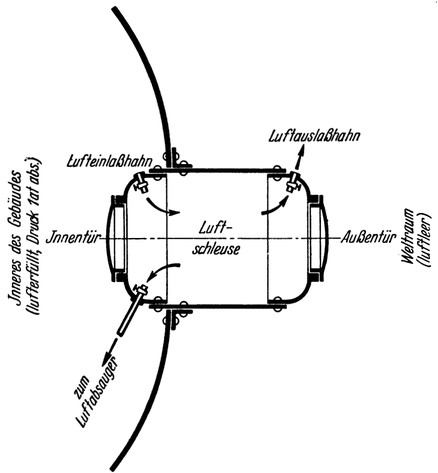

<#include "pagebreak.ftl">
Die Ausgestaltung der Raumwarte.
================================

Die physikalischen Voraussetzungen und Möglichkeiten des
leeren Weltraums sind uns somit bekannt. Nun auch ein Bild,
wie unsere Raumwarte demgemäß ausgestaltet sein müßte:

Um bei ihrer Herstellung die im Weltraum auszuführenden
Arbeiten tunlichst zu vereinfachen (diese sind ja nur im *Raumanzug*
möglich), müßte das ganze Bauwerk samt Einrichtung zuerst
auf der Erde gänzlich fertiggestellt und auf Zuverlässigkeit
geprüft werden; ferner müßte es so konstruiert sein, daß es
sich leicht in seine Bestandteile, womöglich in einzelne, vollständig
eingerichtete „*Zellen*” zerlegen ließe, die dann mittels Raumschiffen
in den Weltraum befördert und dort ohne viel Umstände
wieder zusammengefügt werden könnten. Als Material
wären soweit als möglich nur *leichte* Metalle zu verwenden,
um die Kosten der Emporhebung in den Weltraum zu verringern.

Das zur Benutzung fertige Bauwerk würde im allgemeinen
nun folgend aussehen: Vor allem muß es nach außen, gegen den
leeren Weltraum, vollkommen *luftdicht abschließend* sein,
damit in seinem Innern normale Luftverhältnisse auf künstlichem
Wege aufrechterhalten werden können. Um die Gefahr des *Entweichens
der Luft*, welche bei Entstehung eines Lecks (z. B.
durch Meteoreinschlag) eintreten würde, lokalisieren zu können,
ist von der aus dem Schiffbau bekannten *Unterteilung* in
„*Schotten*” in zweckentsprechender Weise Gebrauch gemacht.

Da alle Räume untereinander in Verbindung stehen und lufterfüllt
sind, ist der Verkehr im Innern überallhin ohne weiteres
möglich. Nach außen, in den leeren Weltraum, kann man
jedoch nur mittels sogenannter *Luftschleusen* gelangen. Diese
\<@pagebreak 126/> aus dem Unterwasserbau bekannte (bei den Caissons, den Taucherglocken
usw. angewendete) Vorrichtung, besteht im wesentlichen
aus einer kleinen Kammer, die zwei luftdicht abschließende
Türen besitzt, von denen die eine in das Innere des Gebäudes
und die andere nach außen führt (Abb. 76).

Abb. 76. Grundsätzliche Anordnung einer <em>Luftschleuse</em>,
für den Verkehr zwischen einem lufterfüllten Raum (z.B.
das Innere der Raumwarte) und dem leeren Weltraum<a class="refnote" id="rn1" href="#fn1">1</a>

Will man beispielsweise die Warte *verlassen* („Ausschleusen”),
dann begibt man sich im Raumanzug durch die Innentür in die Schleuse,
deren Außentür hierbei verschlossen sein muß. Nun wird die
Innentür zugemacht und die in der Schleuse vorhandene Luft abgesaugt
bzw. ausgelassen, worauf man die Außentür öffnen und ins Freie hinausschweben kann.
Um in das Innere der Warte zu gelangen („Einschleusen”), müßte der
umgekehrte Vorgang eingehalten werden.

Für den *Betrieb* und die demgemäße *Einrichtung* der
Raumwarte maßgebend ist der Umstand, daß an Ort und Stelle
*garnichts* zur Verfügung steht als nur die Strahlen der Gestirne,
\<@pagebreak /> vor allem jene der Sonne — diese allerdings fast zu jeder
Zeit und auch in unbeschränkter Menge. Sämtliche, insbesondere
auch die zum Leben notwendigen Stoffe, wie beispielsweise Luft
und Wasser, müssen also von der Erde ständig zugeführt werden.
Daraus ergibt sich für die Wirtschaft in der Raumwarte
von selbst der Grundsatz: mit allen *Verbrauchsstoffen
äußerste Sparsamkeit* zu üben, dafür aber die in den Sonnenstrahlen
an Ort und Stelle reichlich verfügbare *Energie in
weitgehendstem Maße* zum Betrieb von technischen Anlagen
aller Art *heranzuziehen*, insbesondere auch von solchen, welche
es ermöglichen, die abfallenden Verbrauchsstoffe neuerdings verwendbar zu machen.

Dies kann nun geschehen: entweder *unmittelbar* durch Ausnutzung
der *Licht-* und *Wärmewirkung* der Sonne, oder aber
*mittelbar* im Wege der Umwandlung ihrer Strahlenwärme in
*elektrische Energie*.

<a href="#rn1">1</a>Das Luftleermachen der Schleuse beim
„Ausschleusen“ geschieht aus Sparsamkeitsgründen größtenteils durch <em>Absaugen</em> der
Luft in das Innere des Gebäudes; nur der letzte Rest des Luftinhaltes der Schleuse
wird durch Ausströmen in den Weltraum abgelassen.

