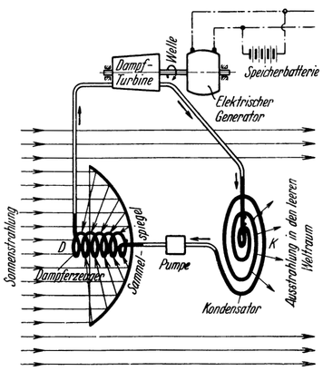

Das Sonnenkraftwerk.
====================

Das für letzteren Zweck dienende *Sonnenkraftwerk* (Abb. 77)
bildet somit eine der allerwichtigsten Einrichtungen der Raumwarte.
Es liefert Gleichstrom, ist mit einer Speicher-Akkumulatorenbatterie
ausgerüstet und ähnelt im Prinzip einer normalen
Dampfturbinenanlage gleicher Art; jedoch mit dem Unterschiede,
daß nun der Dampferzeuger mit *Sonnenstrahlen beheizt*
wird, welche hierbei zur Erzielung genügend hoher Temperaturen
durch Sammelspiegel konzentriert werden (Abb. 77, D),
und daß die Kühlung des Kondensators nur durch *Ausstrahlung
in den leeren Weltraum erfolgt*, weshalb er gegen denselben
offen und gegen die Sonne abgeschirmt untergebracht sein
muß (Abb. 77, K).

Dies bedingt, gemäß unseren früheren Ausführungen, daß sowohl
der Dampferzeuger wie auch der Kondensator außen
*mattschwarz gefärbt* ist. Beide bestehen der Hauptsache
nach eigentlich nur aus entsprechend langen Metallrohren, welche
<@pagebreak 128/> stetig gekrümmt sind, damit die inneren Rohrwände auch in gewichtslosem
Zustande von der durchströmenden *Treibflüssigkeit*
genügend stark und andauernd berührt werden (Siehe Abb. 77).

Abb. 77. Schema des <em>Sonnenkraftwerkes</em> der Raumwarte.

Letztere befindet sich in ständigem, verlustlosem Kreislauf.
Abweichend vom Gebräuchlichen, ist hier als Treibflüssigkeit
nicht Wasser (Wasserdampf) sondern ein leichtflüchtigeres Medium,
und zwar *Stickstoff* verwendet. Dieser gestattet nämlich,
die Kondensatortemperatur so tief zu halten, daß die außerordentliche
Abkühlungsmöglichkeit des leeren Weltraums dadurch auch wirklich
ausgenützt werden kann; außerdem bildet ein zufälliger Austritt desselben
in die Räume der Warte keine Verunreinigung der dort so wertvollen Luft.

Da es nur von der Größe der verwendeten Sammelspiegel abhängt,
wieviel Energie man der Sonnenstrahlung hierbei entnimmt, kann durch
entsprechend leistungsfähigen Ausbau des Kraftwerkes ohne weiteres
erreicht werden, daß in der Raumwarte *elektrische* und damit
zugleich *mechanische* Energie stets reichlich zur Verfügung
steht. Da außerdem *Wärme*, auch in großen Mengen, aus
der Sonnenstrahlung unmittelbar gewonnen und *Kälte*, selbst
bis zu den niedersten Temperaturen, durch Ausstrahlung in den
Weltraum auf einfachste Weise erzeugt werden kann, sind somit
die Voraussetzungen gegeben, um technische Anlagen aller Art
betreiben zu können.

