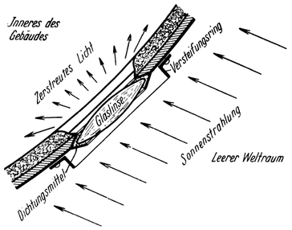
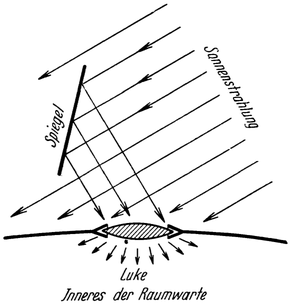

<@pagebreak 129/>

Die Lichtversorgung.
====================

Am einfachsten zu bewerkstelligen ist die Beleuchtung der
Raumwarte; denn diese erfordert nahezu keinerlei maschinelle Einrichtungen,
sondern kann größtenteils *unmittelbar* durch die *Sonne* erfolgen‚
welche dort ja unentwegt scheint — abgesehen von eventuellen,
jedenfalls aber nur kurzen Durchgängen der Raumwarte durch den Erdschatten.

Abb. 78. Beleuchtungsluke.

Zu diesem Zwecke weisen die Wände runde, den Luken eines Schiffes
ähnliche Öffnungen auf, welche mit starken, linsenartig geformten
Fenstern (Abb. 78) luftdicht verglast sind (Abb. 60 und 61, L).
Durch milchweise Färbung bzw. Mattierung derselben und entsprechende
Wahl der Sorte des Glases, ist dafür gesorgt, daß das Sonnenlicht von allen schädlichen
Strahlenbeimengungen befreit, in gleicher Weise wie durch die Lufthülle
gefiltert und ferner in zerstreutem Zustand in die Warte einfällt,
deren Inneres somit von *normalem Tageslicht* erhellt wird.

Abb. 79. Der Spiegel lenkt eigens Sonnenstrahlen auf die Luke hin.

Manche der Luken sind mit besonderen Spiegeln ausgestattet, durch welche Sonnenstrahlen nach
Bedarf auch eigens auf die betreffenden Luken hingelenkt werden
können (Abb. 79).

<@pagebreak /> Außerdem ist noch für künstliche, nämlich *elektrische Beleuchtung*
gesorgt, wozu der Strom dem Sonnenkraftwerk entnommen wird.

