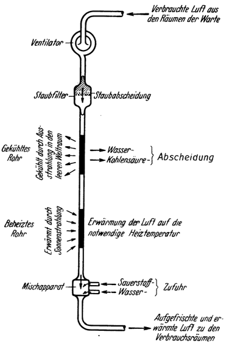

<#include "pagebreak.ftl">
Die Luft- und Wärmeversorgung.
==============================

Auch die Beheizung der Raumwarte erfolgt durch unmittelbare
Ausnutzung der Sonnenstrahlung, und zwar nach dem Prinzip der Luftheizung
gleichzeitig mit der Belüftung.

Abb. 80. Schematische Darstellung der Belüftungsanlage. Das gekühlte und das beheizte
Rohr könnte z. B. ähnlich wie in Abb. 77‚ D bzw. K ausgeführt sein.

Zu diesem Zwecke befindet sich die ganze Luft der Raumwarte in ständigem
Kreislauf: zwischen den Räumen, in denen sie benötigt wird, und einer
Belüftungsanlage, in welcher ihre Reinigung; Auffrischung und Erwärmung
erfolgt. Ein großer, elektrisch angetriebener Ventilator sorgt
für die Aufrechterhaltung dieser Bewegung. Hierfür notwendige Rohrleitungen
sind auch vorhanden. Sie münden durch kleine vergitterte Öffnungen (Abb. 60 und
61, O) in die einzelnen Verbrauchsräume.

Die Belüftungsanlage (Abb. 80) ist ähnlich dem
von Oberth angedeuteten Lufterneuerungsapparat eingerichtet. Erst
durchströmt die Luft einen Staubfilter. Sodann gelangt sie in
\<@pagebreak 131/> ein durch Ausstrahlung in den Weltraum gekühltes Rohr, in
welchem ihre Temperatur allmählich bis unter —78° Celsius erniedrigt
wird, wodurch sich die gasförmigen Beimengungen, und
zwar zuerst der Wasserdunst und später die Kohlensäure abscheiden.
Dann strömt die Luft durch ein Heizrohr, das mittels
konzentrierter Sonnenstrahlen erhitzt wird, um nun auf die
zur Warmhaltung der Räume notwendige Temperatur gebracht
zu werden. Endlich wird auch noch ihr Sauerstoff- und
Feuchtigkeitsgehalt auf das richtige Maß ergänzt, worauf sie
schließlich wieder zurück in die Räume der Warte fließt.

Durch dieses Verfahren wird erreicht, daß nur der durch die
Atmung verbrauchte Sauerstoff ersetzt und daher von der
Erde nachgeschafft werden muß; die unverbrauchten Bestandteile
der Luft (insbesondere ihr ganzer Stickstoffanteil) bleiben dauernd
in Verwendung. Da an der Beheizung, welche gleichzeitig
damit erfolgt, die Außenwände der Raumwarte keinen Anteil
haben, muß nur soweit als möglich verhindert werden, daß dieselben
durch Ausstrahlung in den Weltraum Wärme abgeben,
weshalb das ganze Bauwerk außen vollkommen spiegelblank
gemacht ist.

