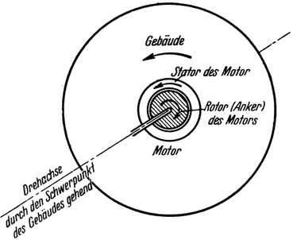
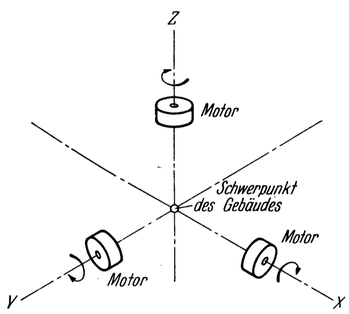

<#include "pagebreak.ftl">
Mittel zur Einstellung der Raumwarte.
=====================================

Schließlich sind noch besondere Schwenkmotoren und Rückstoßantriebe
vorgesehen, die dazu dienen, die Warte sowohl
in beliebiger Richtung wenden als auch ihren Bewegungszustand
nach Bedarf beeinflussen zu können.

Diese Möglichkeit muß bestehen, und zwar einerseits um die
Raumwarte in dem beabsichtigten Verhältnis zur Erde, bzw. in
der erforderlichen Stellung zur Richtung der Sonnenstrahlen, überhaupt
erhalten zu können; denn zu diesem Zwecke sind nicht
nur alle jene (von außerhalb des Systems herrührenden!) Bewegungsimpulse,
welche ihr im Verkehr mit den Raumschiffen unvermeidlicherweise
immer wieder erteilt werden, fortwährend
auszugleichen, sondern es muß auch dem Einfluß der Erdbewegung
um die Sonne andauernd Rechnung getragen werden.

Abb. 81. Wirkungsweise eines Schwenkmotors
(siehe Buchtext Seite 133 unten).

\<@pagebreak 133/> Andererseits aber ist dies auch aus dem Grunde notwendig,
um die Warte zur Erfüllung ihrer besonderen, später noch zu
besprechenden Aufgaben zu befähigen, da für manche derselben
beliebige Änderungen ihrer Lage im Raume möglich sein müssen, und
endlich Weil sich gelegentlich auch die Notwendigkeit
zur Durchführung von Ortsverschiebungen gegenüber der Erdoberfläche ergeben kann.
Die Schwenkmotoren sind normale Gleichstrom-Elektromotoren,
aber mit möglichst hoher maximaler Drehzahl
und relativ großer Rotormasse. Besondere Bremsen ermöglichen
es, ihren Lauf beliebig rasch zu vermindern oder stillzusetzen.
Sie sind so eingebaut, daß ihre verlängerte theoretische Drehachse durch
den Schwerpunkt des Gebäudes geht.

Abb. 82. Anordnung der Schwenkmotoren. Die 3 Achsen stehen aufeinander senkrecht und
gehen durch den Schwerpunkt des Gebäudes.

Wird nun ein solcher Schwenkmotor angelassen (Abb. 81), dann dreht sich
gleichzeitig mit seinem Rotor (Anker) auch sein Stator (der sonst feststehende Teil
eines Elektromotors) und sonach auch das ganze, mit
letzterem fest verbundene Gebäude um die Motorachse — jedoch
in entgegengesetzter Richtung und, entsprechend der größeren
\<@pagebreak /> Masse, viel langsamer als der Rotor — und zwar solange, bis der
Motor wieder stillgesetzt wird und verschieden rasch je nach der
ihm erteilten Drehzahl. (Denn es handelt sich in vorliegendem
Fall um ein „freies System”, in welchem nur innere Kräfte wirken.)
Da nun diese Motoren so angeordnet sind, daß ihre
Achsen wie die eines rechtwinkligen räumlichen Koordinatensystems
aufeinander senkrecht stehen (Abb. 82), kann durch ihr
geeignetes Zusammenwirken das Gebäude in jeder beliebigen
Weise verschwenkt werden.

Die Rückstoßantriebe gleichen sowohl im Bau als in der
Wirkungsweise den schon früher beschriebenen Treibvorrichtungen
der Raumschiffe<a class="refnote" id="rn1" href="#fn1">1</a>.
Sie sind jedoch entsprechend den geringeren
an sie gestellten Anforderungen (die durch sie hervorgerufenen
Beschleunigungen brauchen nicht groß zu sein) viel schwächer als
diese ausgeführt. Ihre Verteilung ist so getroffen, daß man mit
ihrer Hilfe dem Gebäude in jeder beliebigen Richtung eine Beschleunigung
erteilen kann.

<a href="#rn1">1</a>Siehe Seite 46, 47.

