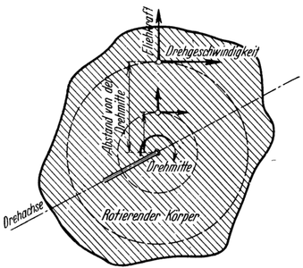
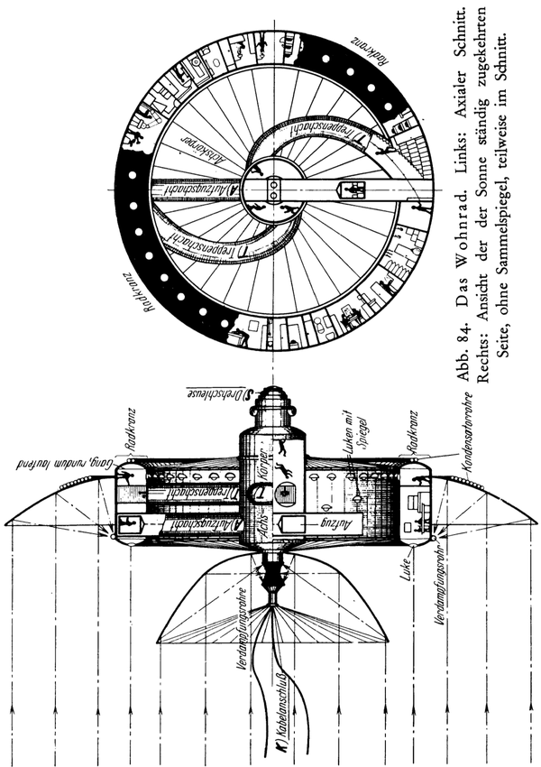
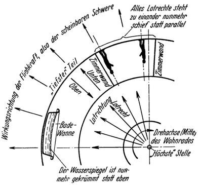
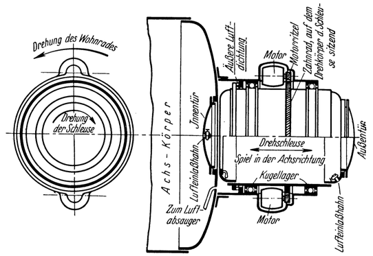
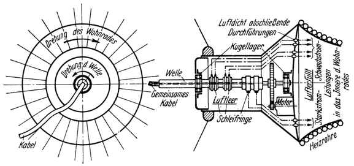
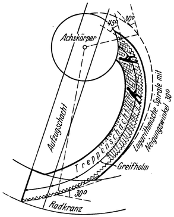
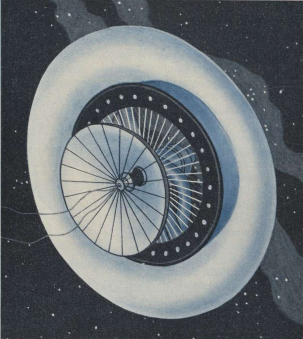
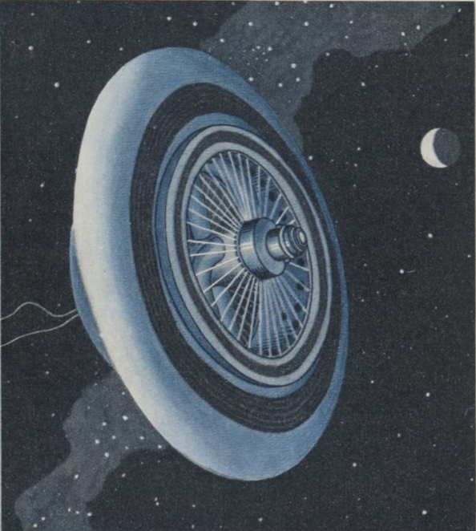

<#include "pagebreak.ftl">
Das Wohnrad.
============

Bekanntlich ist sowohl die *Drehgeschwindigkeit* als auch
die *Fliehkraft* in den verschiedenen Punkten eines rotierenden
Körpers verhältnisgleich dem Abstande von seiner Drehmitte, der Achse (Abb. 83);
d. h. sie ist umso größer, je weiter der betreffende Punkt
von der Achse entfernt liegt und umso kleiner, je näher
er sich zu ihr befindet; in der theoretischen Drehachse selbst
ist sie gleich Null.

Abb. 83. Drehgeschwindigkeit und Fliehkraft an einem rotierenden Körper.

Demgemäß muß der rotierende Teil der Raumwarte so gestaltet sein, daß dessen
Luftschleuse und die Kabelanschlüsse in der Mitte des Ganzen: in der Drehachse liegen,
weil dort am wenigsten Bewegung herrscht, und jene Teile, in
denen man durch Fliehkraft Schwerewirkung erzeugen will, sich
von der Achse entfernt: am Umfang befinden, weil dort die
Fliehkraft am stärksten ist.

\<@pagebreak 137/>

Abb. 84. Das <em>Wohnrad</em>. Links: Axialer Schnitt.
Rechts: Ansicht der der Sonne ständig zugekehrten
Seite, ohne Sammelspiegel, teilweise im Schnitt.

\<@pagebreak />

Abb. 85. Richtungsverhältnisse im Wohnrad.

Diesen Bedingungen wird aber am besten entsprochen, wenn
man das Bauwerk in der schon angedeuteten Form eines *großen
Rades* anordnet (Abb. 84, 89 und 90): Der Radkranz desselben
ist aus Zellen zusammengefügt und hat die Form eines
durch Drahtspeichen gegen die Achse verspannten Ringes. Sein
Inneres wird durch Zwischenwände in einzelne Räume unterteilt,
die alle von einem breiten Gang aus zugänglich sind, der rundum
führt und in sich geschlossen ist. Es gibt da: Einzelzimmer, größere
Schlafräume, Arbeits- und Studierzimmer, Speisesaal, Laboratorium,
Werkstatt, Dunkelkammer usw., sowie die üblichen Nebenräume
wie Küche, Badezimmer, Waschküche und dgl. Alles ist mit modernem
Komfort ausgestattet; auch Kalt- und Warmwasserleitung fehlen
nicht. Im allgemeinen gleichen die Räume jenen eines modernen Seeschiffes. Sie können
ja ohne weiteres ebenso wie auf der Erde eingerichtet werden, da
in ihnen nahezu *normaler, irdischer Schwerezustand* herrscht.

Damit dieser aber zustande kommt, muß das ganze Gebäude für
den Fall eines *Durchmessers von* z. B. 30 Meter derart rotieren,
daß es *eine volle Umdrehung in rund 8 Sekunden* vollführt;
denn dann ergibt sich im Radkranz eine Fliehkraft, welche
ebenso groß ist, wie die Schwerkraft auf der Erdoberfläche.

Während letztere aber *zur* Mitte hinwirkt, ist dagegen die
Fliehkraft *von* der Mitte weg gerichtet. Daher bedeutet beim
\<@pagebreak /> Wohnrad „lotrecht” (umgekehrt wie bei der Erde): die radiale
Richtung von der Mitte (also der Drehachse) *nach auswärts*
(Abb. 85); Demgemäß weist „unten” nun gegen den *Umfang*
und zugleich „tiefsten” Teil und „oben” gegen die Achse und
zugleich „höchste” Stelle dieses künstlichen Weltkörpers. Mit
Rücksicht auf die Kleinheit desselben tritt aber bei ihm nun auch
der *radiale* Verlauf der Lotrichtung, der bei der Erde infolge
ihrer Größe meist nicht zur Geltung kommt, schon deutlich hervor.
Die Folge davon ist, daß alles „Lotrechte” (wie aufrechtstehende
Menschen, die Scheidewände der Zimmer usw.) nun
*schief* statt parallel zueinander steht und alles „Wagerechte” (also
z. B. die Wasserfläche der Badewanne) *gekrümmt* statt eben
erscheint (Siehe Abb. 85).

<table>
<tr><td colspan="2">Abb. 86.</td></tr>
<tr><td>Draufsicht auf die Außentür der</td><td>Axialer Schnitt durch die</td></tr>
<tr><td colspan="2"><em>Dreh-Luftschleuse des Wohnrades</em>. 
(Siehe Abb. 84 und Buchtext Seite 141 oben.) 
Die Kugellager sind so ausgeführt, daß sie in der Achsrichtung Spiel erlauben,
wodurch das Schließen bzw. Lösen der <em>äußeren Luftdichtung</em>, welche die
Schleuse bei offener Innentür mit dem Innern des Wohnrades luftdicht verbindet,
möglich ist.</td></tr>
</table>

Eine weitere Eigentümlichkeit besteht darin, daß sowohl die
\<@pagebreak /> Umfangsgeschwindigkeit als auch die Fliehkraft, infolge ihrer Abnahme
gegen die Drehmitte zu (Abb. 83), für den Kopf eines
im Wohnrad stehenden Menschen etwas kleiner als für seine
Füße ist (bei einem Raddurchmesser von 30 Meter etwa um 1/9).
Hiervon dürfte der Unterschied der Fliehkräfte zwar kaum, jener
der Umfangsgeschwindigkeiten aber doch schon einigermaßen bemerkbar
sein, und zwar bei Ausführung auf- und abwärtsgehender
(d. h. radial verlaufender) Bewegungen wie: Erheben einer
Hand, Niedersetzen usw.

Alle diese Erscheinungen machen sich indessen um so weniger
geltend, je größer der Raddurchmesser ist. Bei dem vorhin gewählten
Fall (Durchmesser 30 Meter) wäre hiervon nur mehr Geringes fühlbar.

<table>
<tr><td colspan="2">Abb. 87.</td></tr>
<tr><td>Draufsicht auf den</td><td>Axialer Schnitt durch den</td></tr>
<tr><td colspan="2"><em>Kabelanschluß des Wohnrades</em>. 
(Siehe Abb. 84, K und Buchtext Seite 141 unten.)</td></tr>
</table>

Da in der Gegend der Achse (weil dort die geringste Bewegung
herrscht!) die Vorrichtungen zur Verbindung mit der Außenwelt
angebracht sind, bildet der *Achskörper* gewissermaßen die
„Vorhalle” des ganzen Gebäudes. Er besitzt zylindrische Form.
An seinen beiden Enden (um jene Stellen, wo er von der theoretischen
Drehachse durchsetzt wird) ist auf der einen Seite die
Luftschleuse und auf der anderen der Kabelanschluß angeordnet
(Abb. 84,S und K).

Die *Luftschleuse* ist hier *drehbar* gemacht, um den Übergang
\<@pagebreak /> zwischen der Rotationsbewegung des Wohnrades und dem
Ruhezustande des Weltraums zu erleichtern (Abb. 86). Beim
„Ausschleusen” steht sie gegenüber dem Wohnrad still (dreht sich
also gegenüber dem Weltraum). Man kann sich somit aus dem
Wohnrad ohne weiteres in die Schleuse begeben. Nun wird dieselbe
durch elektrischen Antrieb langsam angedreht — und zwar
entgegen der Rotationsrichtung des Wohnrades — bis sie mit
diesem auf gleiche Tourenzahl kommt. Sie gelangt dadurch
gegenüber dem Weltraum in Ruhezustand und kann nun ebenso verlassen
werden, als wenn das Wohnrad sich gar nicht drehen würde.
Für das „Einschleusen” ist der Vorgang umgekehrt.

Abb. 88. Treppenschacht des Wohnrades.

Bei einiger Übung kann auf das Andrehen der Schleuse aber auch
verzichtet werden, da das Wohnrad ohnehin nur verhältnismäßig langsam
rotiert (eine volle Umdrehung in etwa 8 Sekunden, bei dem
früher angenommenen Fall eines Raddurchmessers von 30 Meter).

Auch der *Kabelanschluß* auf der anderen Seite des Achskörpers
ist in grundsätzlich ähnlicher Weise ausgeführt, um damit
zu verhindern, daß durch die Rotation des Wohnrades das
Kabel verdreht wird. Letzteres geht deshalb *vom Ende einer
Welle aus* (Abb. 87), welche in der theoretischen Drehachse des
Wohnrades angeordnet ist und mittels eines Elektromotors fortgesetzt
so angetrieben wird, daß sie sich mit genau derselben
Tourenzahl wie das Wohnrad — aber *verkehrt* wie dieses — dreht.
Infolgedessen befindet sich die Welle gegenüber dem Weltraum
andauernd in Ruhe. Das von ihr austretende Kabel kann also
durch die Rotation des Wohnrades tatsächlich nicht in Mitleidenschaft
gezogen werden.

\<@pagebreak />

Abb. 89. Gesamtansicht der <em>Sonnenseite des Wohnrades</em>. Der mittlere
Sammelspiegel könnte auch weggelassen und durch entsprechende Vergrößerung
des äußeren Spiegels ersetzt werden.

Zur Verbindung zwischen Achskörper und Radkranz dienen
*Treppen* und elektrische Aufzüge, welche in eigenen Röhrenschächten
untergebracht sind. Letztere verlaufen für die Aufzüge
„lotrecht”, also *radial* (Abb. 84, A). Bei den Treppen hingegen,
die ja geneigt sein müssen, sind sie — mit Rücksicht auf das
Divergieren der Lotrichtung — nach *logarithmischen Spiralen*
\<@pagebreak /> gekrümmt, die aber nach „oben“ (der Mitte) zu allmählich steiler
werden (Abb. 88 und 84, T), gemäß der nach dort mehr
und mehr abnehmenden Schwerewirkung (Fliehkraft). Durch entsprechend
*langsames* Benützen der Treppen bzw. der Aufzüge
kann der Übergang zwischen dem im Radkranz herrschenden
Zustand der Schwere und der Schwerefreiheit des Weltraums
beliebig allmählich vollzogen werden.

Abb. 90. Gesamtansicht der <em>Schattenseite des Wohnrades</em>.

\<@pagebreak /> Die Versorgung des Wohnrades mit Licht, Wärme, Luft und
Wasser erfolgt in der schon früher für die Raumwarte allgemein
angegebenen Weise, unter Verwendung der dort beschriebenen
technischen Einrichtungen. Nur mit dem Unterschiede, daß an
der Beheizung des Wohnrades auch die der Sonne ständig zugekehrte
*Wand des Radkranzes* mitwirkt<a class="refnote" id="rn1" href="#fn1">1</a>, welche deshalb
mattschwarz gefärbt ist (Abb. 89 und 84), im Gegensatz zur
vollkommenen Spiegelblankheit der sonstigen Außenflächen des
Gebäudes. Auch ein kleines, für den Notbedarf des Wohnrades
genügendes Sonnenkraftwerk ist vorhanden.

Alle *Magazine* und *Tankräume* für die stets reichlichen
Luft-, Wasser-, Nahrungsmittel- und sonstigen Vorräte befinden
sich im Radkranz, desgleichen auch sämtliche *maschinellen Einrichtungen*.
Die zu letzteren gehörenden Sammelspiegel und
mattschwarz gefärbten Dampferzeuger- und Kondensatorrohre
sind am Wohnrad außen in zweckentsprechender Weise angebracht
und rotieren mit (Abb. 84, 89 und 90).

Schließlich sind noch *Schwenkmotoren* und *Rückstoßantriebe*
vorgesehen, welche außer zu den schon früher angegebenen
Zwecken hier auch noch dazu dienen, die Drehbewegung
des Wohnrades erzeugen und wieder stillsetzen zu können,
bzw. regelnd darauf einzuwirken.

<a href="#rn1">1</a>
Natürlich könnte darauf auch verzichtet und die Wärmeversorgung des
Wohnrades ebenfalls allein nur mittels Luftheizung bewirkt werden. Der Radkranz
müßte dann durchaus spiegelblank sein.

