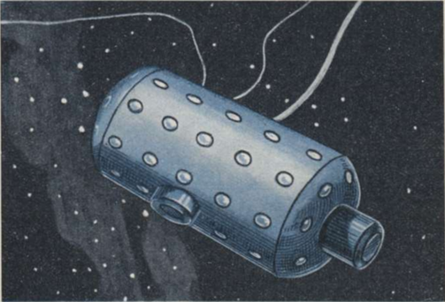
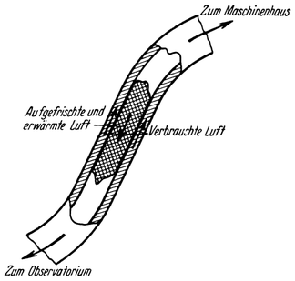
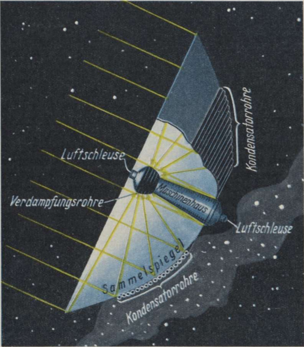

Das Observatorium und das Maschinenhaus.
========================================

Der für das Wohnrad leitend gewesene Gedanke: möglichst
günstige Lebensbedingungen zu schaffen, muß beim Observatorium
und Maschinenhaus zurücktreten gegenüber der Forderung, diese
Objekte vor allem zur Erfüllung ihrer besonderen Aufgaben geeignet
zu machen, weshalb bei denselben, wie schon erwähnt, auf
die Beseitigung des schwerelosen Zustandes verzichtet wird.

Für das *Observatorium* (Abb. 91) ist vor allem Wichtig,
daß man ihm jede beliebige, durch die vorzunehmenden Beobachtungen
<@pagebreak 145/> bedingte Lage im Raume ohne weiteres erteilen kann.
Es muß daher von der Stellung der Sonne vollkommen unabhängig
sein, darf also keine der früher beschriebenen, durch
Sonnenstrahlen betriebenen Einrichtungen aufweisen. Aus diesem
Grund erfolgt die Belüftung und damit gleichzeitig auch die Beheizung
des Observatoriums ebenso wie seine Elektrizitätsversorgung
vom Maschinenhause aus, zu welchem Zweck beide Objekte
außer mittels eines Kabels noch durch eine biegsame Rohrleitung
verbunden sind (Abb. 91 und 92). Doch ist Vorsorge getroffen,
daß die Belüftung des Gebäudes im Notfalle auch selbständig,
unter Zuhilfenahme von Reinigungspatronen in ähnlicher
Weise vorgenommen werden kann, wie dies bei den modernen
Taucheranzügen üblich ist.

Abb. 91. Beispiel für die Ausführung des <em>Observatoriums</em>.
Es hat annähernd die Form eines Kessels mit Rücksicht auf den
darin herrschenden Überdruck von 1 Atm. Die Luftschleuse, zwei
elektrische Kabel (links). das biegsame Luftrohr (rechts) und die
Beleuchtungsluken sind erkennbar.

Im Observatorium sind vorhanden: vor allem, seiner Bestimmung
gemäß, die *Fernbeobachtungs-Einrichtungen* und
ferner sämtliche, in Abhängigkeit von der Fernbeobachtung zu
<@pagebreak /> betätigenden *Steuerungen*, wie z. B. jene der Raumspiegel
(siehe Folgendes). Endlich befindet sich dortselbst auch noch ein
*Laboratorium* für Untersuchungen im schwerelosen Zustand.

Das Maschinenhaus ist dazu bestimmt, die wichtigeren, für
die ganze Raumwarte gemeinsamen maschinellen Anlagen aufzunehmen,
insbesondere jene, welche zur großzügigen Auswertung
der Sonnenstrahlen dienen. Es enthält daher vor allem das
*Haupt-Sonnen-Kraftwerk* samt *Speicherbatterie*. Ferner
ist darin die ganze Apparatur der *Großfunkstation* untergebracht
und schließlich noch eine *Belüftungsanlage* vorhanden, die gleichzeitig auch für
das Observatorium arbeitet.

Abb. 92. Die <em>biegsame Rohrleitung</em> zur Verbindung des Observatoriums mit
der Belüftungsanlage des Maschinenhauses.

Die Zufuhr der Sonnenenergie erfolgt durch einen mächtigen,
mit dem Gebäude fest verbundenen Sammelspiegel (Abb. 93), in dessen Brennpunktgebiet
sich die Verdampfungs- und Heizrohre befinden, während
auf seiner Rückseite die Kondensator- und Kühlrohre angebracht sind.

Die Lage des Maschinenhauses ist daher im vorhinein festgelegt:
sie muß stets so erhalten werden, daß der Sammelspiegel
mit seiner Vorderseite die Sonnenstrahlen voll aufnimmt.

Die *Beleuchtung* sowohl des Observatoriums als auch des Maschinenhauses
erfolgt in der für die Raumwarte bereits allgemein
beschriebenen Weise. Die Außenflächen der Gebäude sind zwecks
Verringerung der Abkühlung vollkommen *spiegelblank* gehalten.
Schließlich sind beide Objekte auch mit *Schwenkmotoren*
und <em>Rückstoßantrieben</em> ausgerüstet.

Küchen, Wasserreinigungsanlagen, Waschgelegenheiten u. dgl.
fehlen jedoch, mit Rücksicht auf das sehr unbequeme Verhalten
<@pagebreak /> der Flüssigkeiten im schwerelosen Zustand. Für die Nahrungsaufnahme
und Körperpflege ist eben das Wohnrad vorhanden.
Was im Observatorium und Maschinenhaus an Speise und Trank
benötigt wird, muß jeder Mann selbst, bereits in der für den
gewichtslosen Zustand geeigneten Art zubereitet, aus dem Wohnrad dorthin mitnehmen.

Abb. 93. Beispiel für die Anordnung des <em>Maschinenhauses</em>, im Achsschnitt
andeutungsweise dargestellt.

