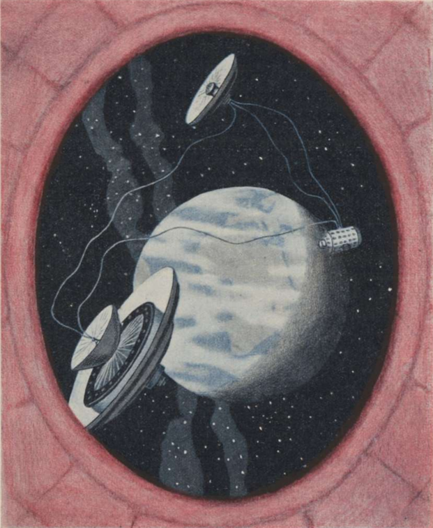

<#include "pagebreak.ftl">
Die Reise zur Raumwarte.
========================

Der Verkehr zwischen der Erde und der Raumwarte erfolgt
durch Raketen-Raumschiffe, wie solche schon im ersten Teil dieser
Ausführungen annähernd beschrieben wurden. Es mag das
Bild vervollständigen, eine solche Reise in großen Umrissen einmal
mitzuerleben:

Das Raumschiff ist auf der Erde bereitgestellt. Wir betreten
die *Fahrzelle*, eine kleine im Innern seines Rumpfes untergebrachte
Kammer, die zur Aufnahme des Führers und der Fahrgäste
dient. Die Tür wird von innen luftdicht verschlossen.
Wir müssen uns in Hängematten legen.

Einige Steuergriffe des Führers, ein leises Erbeben des Fahrzeuges
und schon im nächsten Augenblick fühlen wir uns schwer
wie Blei, fast schmerzhaft pressen sich die Schnüre der Hängematte
in den Körper, das Atmen wird zur Anstrengung, das
Erheben eines Armes zur Kraftprobe: Der Aufstieg hat begonnen.
Der Antrieb arbeitet und hebt uns mit einer Beschleunigung von
30 m/sec² empor, was wir wie eine Erhöhung unseres Gewichtes
auf den vierfachen Wert des Normalen empfinden. Unter dieser
Last sich aufrecht zu erhalten, wäre unmöglich gewesen.

Es dauert nicht lange — da hört für einen Augenblick das
vermehrte Schweregefühl auf, um gleich wieder von Neuem einzusetzen.
Der Führer erklärt, daß er soeben die erste Teilrakete,
die nun verbraucht ist, abgekoppelt und die zweite angelassen hat.

Doch bald erfolgen neue Steuergriffe: Wir haben, wie uns der
Führer verrät, die notwendige Steig-Höchstgeschwindigkeit bereits
erlangt; deshalb wurde das Fahrzeug um 90° gewendet, so daß
der Antrieb jetzt in *wagerechter* Richtung arbeitet, um uns
noch auf die notwendige Umlaufgeschwindigkeit zu bringen.

Schon haben wir auch diese erreicht. Erst einige Minuten sind
\<@pagebreak 153/> seit dem Start verflossen, aber endlos deucht uns, daß wir den
anstrengenden Zustand erhöhter Schwere bereits ertragen müssen.
Allmählich verringert sich nun der auf uns lastende Druck. Erst
fühlen wir wohltuende Erleichterung, dann aber — beklemmende
Angst: wir glauben! zu fallen, haltlos in die Tiefe zu stürzen.
Der wackere Führer bemüht sich uns zu beruhigen: er hat den
Antrieb langsam abgestellt; unsere Bewegung erfolgt jetzt nur
mehr vermöge unserer eigenen lebendigen Kraft; was wir als
Fall empfinden, ist nichts als das Gefühl der Schwerelosigkeit,
an das wir uns nun wohl oder übel gewöhnen müssen. Leichter
gesagt, als getan; doch da keine andere Möglichkeit besteht,
gelingt schließlich auch dieses.

Indessen hat der Führer mit seinen Instrumenten scharf beobachtet,
seine Tabellen und Fahrkurven zu Rate gezogen; einige
Male wurde auf kurze Zeit der Antrieb wieder angelassen: es
mußten kleine Bahnfehler korrigiert werden.

Nun aber ist das Ziel erreicht. Wir haben die Raumanzüge
angelegt, die Luft wird aus der Fahrzelle abgelassen, die Tür
geöffnet und vor uns, in einiger Entfernung erblicken wir etwas
gar Seltsames, das sich vom tiefschwarzen, sternübersäten Himmel
abhebt, metallen glitzernd in hellstem Sonnenschein: die
Weltraumwarte (Abb. 94).

Doch man läßt uns wenig Zeit zu staunen. Schon stößt unser
Führer sich ab und schwebt der Warte zu. Wir folgen ihm,
aber nicht mit sehr behaglichen Gefühlen: gähnt doch zur Erde
ein Abgrund von beinahe 36000 km!

Für die *Rückreise* finden wir unser Fahrzeug mit Tragflächen
ausgerüstet. Diese sind während des Aufstieges in zerlegtem Zustande
mitgeführt und nun aufmontiert worden, was infolge der
herrschenden Gewichtslosigkeit keine Schwierigkeiten verursachte.

Wieder begeben wir uns in die Fahrzelle des Raumschiffes;
die Tür wird geschlossen, Luft eingelassen. Vorerst ganz schwach
beginnt der Antrieb zu arbeiten: ein leichtes Schweregefühl stellt
sich ein. Abermals müssen wir uns in die Hängematten legen.
Dann, nach und nach, schaltet der Führer weitere Düsen ein, so
\<@pagebreak /> daß sich das Schweregefühl zu immer größerer Stärke vermehrt.
Noch viel drückender als früher empfinden wir es diesmal, nachdem
wir nun durch längere Zeit der Schwere entwöhnt waren.
Mit voller Kraft arbeitet jetzt der Antrieb, und zwar in wagrechter
Richtung, aber entgegengesetzt wie früher; denn es gilt,
unsere Umlaufgeschwindigkeit und damit die Fliehkraft, die uns
während des Aufenthaltes bei der Raumwarte getragen hatte, so
stark zu *vermindern*, daß wir in einer elliptischen Bahn der
Erde *frei zufallen*. Im Verlaufe dieses Teils der Rückfahrt
herrscht dann wieder schwereloser Zustand.

Indessen sind wir der Erde bereits erheblich näher gekommen.
Allmählich treten wir nun auch in ihre Lufthülle ein; schon macht
sich der Luftwiderstand bemerkbar, und es beginnt nun der
schwierigste Teil der Reise: die *Landung*. Denn jetzt heißt es,
unsere Fahrgeschwindigkeit, die sich während unseres Falles zur
Erde bis auf den rund 12fachen Wert der Geschwindigkeit eines
Geschosses gesteigert hat, mittels des Luftwiderstandes so langsam
abzubremsen, daß dabei kein *Heißlaufen* durch die Luftreibung
eintritt.

Vorsichtshalber haben wir uns alle angegurtet. Der Führer
ist vollauf beschäftigt, die Tragflächen und Fallschirme zu steuern,
die jeweilige Lage des Fahrzeuges zu bestimmen, Luftdruck
und Außentemperatur zu messen u. a. m. Stundenlang umfahren
wir so in rasender Eile unseren Planeten: anfangs ist es ein Kopfflug
in einer Höhe von etwa 75 km; später dann, mit fortschreitender
Abnahme der Geschwindigkeit, *nähern* wir uns in einer
langen Spirale immer mehr der Erde und gelangen dadurch in
tiefere, dichtere Luftschichten; allmählich stellt sich wieder das
irdische Schweregefühl ein, und unsere Fahrt geht in einen normalen
Gleitflug über. Wie in rasendem Lauf eilt hierbei unter
uns die Erdoberfläche hinweg: in halben Stunden nur werden
ganze Ozeane überflogen, Kontinente überquert.

Doch immer langsamer wird die Fahrt und näher kommen
wir dem Erdboden, bis wir schließlich in der Nähe eines Hafens
auf dem Meere niedergehen.

\<@pagebreak />

Abb. 94. Die <em>gesamte Raumwarte</em> mit ihren 3 Objekten, gesehen durch die
Türöffnung eines Raumschiffes. Im Hintergrunde — 35900 km entfernt — die
Erde. Der Mittelpunkt ihres Umfangskreises ist jene auf dem Äquator gelegene
Stelle der Erdoberfläche, über welcher die Raumwarte ständig schwebend verharrt
(Siehe Seite 98, 99). Dieselbe liegt, so wie die Annahme hier getroffen
wurde, im Meridian von Berlin, und zwar etwa in der Südspitze von Kamerun.

