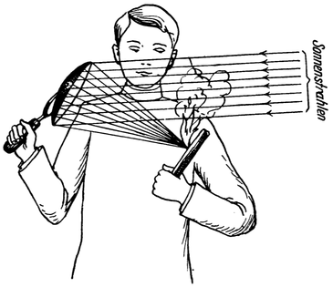

<#include "pagebreak.ftl">
Das furchtbarste Kampfmittel.
=============================

Aber wie jede technische Errungenschaft so würde auch diese
für kriegerische Zwecke verwendet werden können und noch
dazu — sie gäbe ein Kampfmittel ab, das alles bisher Dagewesene
an Furchtbarkeit weit überträfe.

Es ist bekannt, daß durch die Konzentration von Sonnenstrahlen
mittels eines *Sammelspiegels* (in ähnlicher Weise wie
mit Hilfe eines sogenannten „Brennglases”) recht bedeutende Temperaturen
erzeugt werden können. Auch wenn derselbe nur die
Größe einer Hand besitzt, ist es möglich, in seinen Brennpunkt
\<@pagebreak 162/> gehaltene Papierstücke ja auch Holzspäne u. dgl. ohne weiteres
zu entzünden (Abb. 95).

Stelle man sich nun vor, daß der Durchmesser eines solchen
Spiegels nicht nur 10 cm, sondern einige 100 oder gar 1000 Meter
beträgt, wie dies bei einem Raumspiegel der Fall wäre: Auch
Stahl müßte schmelzen und selbst feuerfestere Stoffe würden auf
die Dauer kaum standhalten können, wenn ein so ungeheuer konzentriertes
Sonnenlicht sie träfe.

Und vergegenwärtigt man sich nun auch noch, daß der Beobachter
der Raumwarte mit Hilfe seines mächtigen Teleskopes
das ganze Kampfgebiet, mit der Etappe und dem Hinterland des Feindes, mit
allen seinen Land- und Seezufahrtwegen usw. vor sich ausgebreitet sähe, wie
einen riesigen, auch die kleinsten Einzelheiten zeigenden Plan, dann kann
man sich davon ein Bild machen, was solch ein Raumspiegel, von seiner
Hand geleitet, als Kampfmittel bedeuten würde!

Abb. 95. Entzünden eines Holzspanes mittels eines Sammelspiegels.

Ein leichtes wäre es: damit die Munitionslager des Feindes in
die Luft zu sprengen, die Stapelplätze seines Kriegsgerätes zu entzünden,
Kanonen, Panzerkuppeln, eiserne Brücken, die Schienenstränge
wichtiger Bahnhöfe u. dgl. in Glutflüssigkeit zu verwandeln.
Fahrende Eisenbahnzüge, kriegswichtige Fabriken, ja ganze
Industriebezirke und große Städte könnte man in Flammen aufgehen
lassen. Marschierende oder lagernde Truppen würden einfach
verkohlen, wenn man das Strahlenbündel dieses konzentrierten
Sonnenlichtes über sie hinweggleiten ließe. Und die Schiffe
des Feindes, mögen sie auch noch so gewaltig sein und in den
stärksten Seefestungen Zuflucht suchen, nichts würde sie davor
\<@pagebreak /> bewahren können: vernichtet, ebenso ausgebrannt zu werden,
wie man mit einer Stichflamme das Ungeziefer in seinen Schlupfwinkeln vertilgt.

Es wären wirkliche Todesstrahlen! Und doch keine anderen
als jene lebenspendenden, die wir alltäglich von der Sonne uns
erwünschen; nur eben ein wenig „zuviel des Guten”.

Doch zu allen diesen Greueln würde es wohl gar nicht kommen;
denn kaum dürfte eine Macht es jemals wagen, mit einem Volke
Krieg zu beginnen, das über derartig furchtbare Waffen verfügt.

