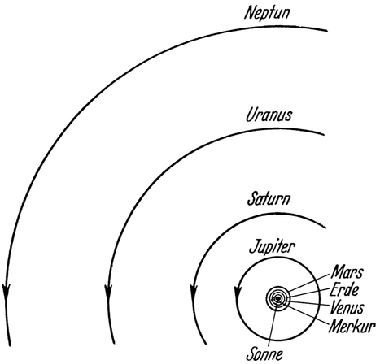
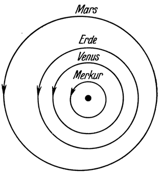

Zu fremden Himmelskörpern.
==========================

Bei den bisherigen Betrachtungen haben wir den Bereich der
überwiegenden Anziehungskraft der Erde — gleichsam ihr „Hoheitsgebiet
im Weltraum” — noch nicht verlassen. Wie verhält
es sich nun aber mit dem eigentlichen Zweck der Raumfahrt:
sich von der Erde gänzlich loszulösen und fremde Himmelskörper
zu erreichen?

Zuvor noch kurz ein Bild der Sternenwelt, wenn sie vom Standpunkte
der Raumschiffahrt, also als zukünftiges Bereisungsgebiet
angesehen wird. Vor allem heißt es da: den Rahmen der gewohnten
Vorstellung erweitern; denn wollen wir als unsere Welt
das ganze All betrachten, dann wird, was uns bisher als Welt
erschien, die Erde, nur mehr — zu unserer „*engeren Heimat*”.
Nicht sie allein! Auch alles, was sie durch ihre Schwerkraft an
sich gefesselt hält, wie die zukünftige Weltraumwarte, ja selbst
der Mond muß noch zu unserer engeren Heimat im Weltenall:
zum „*Reich der Erde*" gerechnet werden; denn wie gering ist
der rund 380000 km messende Abstand des Mondes von der Erde,
im Vergleiche zu den anderen Weltraumweiten! Beträgt er doch
nur Tausendstel von der Entfernung der uns nach ihm zunächst
befindlichen Gestirne Venus und Mars, und leicht könnte selbst
die Erde samt der ganzen Mondbahn innerhalb der Sonnenkugel
Platz finden.

Die für uns nächstgrößere Einheit im Weltall ist das System
der Sonne, mit allen seinen verschiedenartigen, dazu gehörenden
<@pagebreak 164/> Gestirnen. Es sind dies die 8 großen *Planeten* oder *Wandelsterne*,
von denen einer eben unsere Erde ist (Abb. 96 und 97),
und zahlreiche andere Himmelskörper von meist viel kleinerer
Masse: die Planetoiden, periodischen Kometen, Meteorschwärme
usw. Von den Planeten steht der Sonne am nächsten der Merkur,
dann folgt die Venus, die Erde, der Mars, der Jupiter, der
Saturn, der Uranus und am entferntesten der Neptun. Es sind
also *Venus* und *Mars* nebst *dem Mond die der Erde unmittelbar
benachbarten Gestirne*.

Abb. 96. Skizze der Bahnen der 8 Planeten unseres Sonnensystems in ihrem
gegenseitigen Größenverhältnis.

Alle diese Himmelskörper sind durch die Wirkung der
Massenanziehung dauernd an die Sonne gefesselt, gezwungen, sie
— als den Zentralkörper — ständig in elliptischen Bahnen zu
umlaufen. Sie bilden mit ihr zusammen gleichsam das „*Reich
des Fixsternes Sonne*”: durch deren Strahlenpracht beleuchtet
und erwärmt und zugleich beherrscht durch die unerschütterliche
Macht ihrer Schwerkraft, so zu ewiger Gemeinsamkeit verbunden,
<@pagebreak /> eine Insel in der Leere und Finsternis des unendlichen
Raums; das ist unsere „*weitere Heimat*” im Weltenall. Ein
Reich, fürwahr, von ungeheurer Größe: benötigt ja sogar das
Licht mehr als 8 Stunden, um es quer zu durchmessen, und es
durcheilt den Raum mit: der Geschwindigkeit von 300000 km
je Sekunde!

Abb. 97. Vergrößerte Darstellung der Bahnen der Planeten Mars, Erde, Venus
und Merkur aus Abb. 96.

Und doch, wie winzig klein ist diese Welt verglichen mit den
unfaßbaren Weiten des Alls, aus welchen jene vielen glutflüssigen
Himmelskörper, die uns als *Fixsterne* bekannt sind, ihre leuchtenden
Strahlengrüße herübersenden. Selbst der von ihnen uns am nächsten befindliche, der
Fixstern Alpha-Centauri, steht 4,3 Lichtjahre von uns ab, d. i.
rund 4500 mal so weit als der Durchmesser des ganzen Sonnenreichs beträgt! Alle andern sind
aber noch viel mehr, die meisten hunderte und tausende von Lichtjahren
von uns entfernt. Und sollte es bereits erloschene Fixsterne
geben, die näher zu uns stehen — in der ewigen Finsternis
des leeren Weltraums könnten wir sie nicht gewahren.

Daraus läßt sich schon jetzt ersehen, daß für die Fahrt zu fremden
Himmelskörpern nach *heutigem* Ermessen wohl nur jene Gestirne
überhaupt in Frage kommen können, die zum Sonnenreich gehören.

