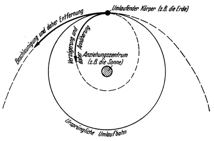
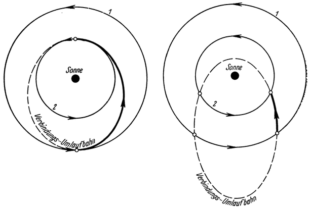

Die Fahrtechnik.
================

In welcher Weise die Fernfahrt durch den Weltraum zu er—
folgen hätte, wurde schon am Beginn angedeutet<a class="refnote" id="rn1" href="#fn1">1</a>
im allgemeinen in freien Umlaufbahnen um jene Himmelskörper, in deren
überwiegendem Anziehungsfeld die Reise gerade vor sich geht.

Innerhalb des Reichs der Sonne also muß letztere demnach stets in
irgendeiner freien Umlaufbahn umfahren werden, will man verhindern,
ihrer Schwerkraft zu verfallen und in ihr Glutmeer abzustürzen.

Allerdings brauchen wir hierauf nicht erst besonders Rücksicht zu
nehmen, solange wir im engeren Bereich der Erde oder eines
andern Weltkörpers des Sonnensystems verweilen. Denn jeder
solche umläuft die Sonne ja ohnehin schon in einer eigenen
freien Umlaufbahn und mit ihm zugleich und von selbst auch
alle Körper, die zu ihm gehören. Mit der Geschwindigkeit der
Erde, also mit 30000 Meter je Sekunde, umkreist z. B. auch der
Mond und umliefe ebenso auch unsere zukünftige Raumwarte
(beide als Trabanten der Erde) die Sonne, deren Anziehungskraft
für sie dadurch ihre unmittelbare Wirksamkeit verliert („stabiler
Schwebezustand” gegenüber der Sonne).

Erst wenn sich das Raumschiff aus dem engeren Anziehungsbereich
eines die Sonne umkreisenden Himmelskörpers weiter
entfernt, müßte die Sonne dann in einer selbständigen freien
Umlaufbahn umfahren werden. Handelt es sich hierbei z. B. um
die Reise von der Erde zu einem fremden Planeten, dann muß,
auf Grund vorhergegangener Berechnung, sowohl der Verlauf
dieser selbständigen Bahn als auch der Zeitpunkt der Abreise von
der Erde so gewählt werden, daß das Raumschiff in der Umlaufbahn
des zu besuchenden Planeten annähernd zu jenem Zeitpunkt
anlangt, in welchem die Eintreffstelle auch von dem Planeten
selbst durchlaufen wird.

Ist auf diese Weise das Fahrzeug in den praktischen Wirkungsbereich
der Anziehung des zu besuchenden Himmelskörpers gebracht,
dann steht die Möglichkeit offen, denselben entweder in einer
freien Umlaufbahn als Trabant beliebig oft zu umfahren oder
auf ihn niederzugehen. Letzteres kann, im Falle er eine der irdischen
ähnliche Lufthülle besitzt, in gleicher Weise geschehen,
wie früher schon für die Erde besprochen<a class="refnote" id="rn2" href="#fn2">2</a>
(Hohmannsches Landungsmanöver, Abb.44 und 45). Fehlt jedoch eine entsprechende
Lufthülle, dann ist die Landung nur durch Rückstoßbremsung
möglich, indem man während des Niedergehens den Antrieb entgegengesetzt
der Fallrichtung wirken läßt<a class="refnote" id="rn3" href="#fn3">3</a> (Abb. 37).

Abb. 98. Wird die Bewegung eines frei umlaufenden
Körpers beschleunigt, dann vergrößert er seine ursprüngliche
Umlaufbahn und entfernt sich damit
vom Anziehungszentrum; wird sie verzögert, dann
nähert er sich demselben, indem er seine Umlaufbahn verengt.

Man müßte also, um innerhalb des Sonnensystems zu einem
andern Himmelskörper zu reisen, nach erfolgter Loslösung von
dem ursprünglichen, die Umlaufbewegung, welche man mit
diesem bisher gleichzeitig um die Sonne ausführte, unter Zuhilfenahme
des Antriebes derartig ändern, daß man dadurch in eine
selbständige Umlaufbahn um die Sonne gelangte, welche die Umlaufbahn
des eigenen mit jener des anderen Gestirnes verbindet. Gemäß den Gesetzen
der Himmelsmechanik wäre zu diesem Zweck die ursprüngliche
Umlaufbewegung zu beschleunigen, wenn sich
das Fahrzeug (entsprechend der Lage des Reisezieles) hierbei von
der Sonne entfernen soll (Abb. 98) und zu verzögern, wenn
es sich ihr zu‘nähern hätte. Schließlich muß, sobald der zu besuchende
Weltkörper erreicht ist, dann die selbständige, in der
„Verbindungs-Umlaufbahn” eingehaltene Bewegung in jene übergeleitet
werden, die das Fahrzeug in bezug auf den neuen
Himmelskörper zwecks Ausführung des Umfahrungs- oder des
Landungsmanövers einhalten muß. In gleicher Weise hätte auch
die Rückreise Zu erfolgen.

Man sieht also, daß im Verlaufe einer solchen Fernfahrt durch
den Planetenraum wiederholte Änderungen des Bewegungszustandes
notwendig sind, die jedesmal durch Antrieb mit künstlicher
Kraft bewirkt werden müßten und daher Betriebsstoffaufwand
erforderten, worauf ja auch schon einleitend<a class="refnote" id="rn4" href="#fn4">4</a>
hingewiesen wurde. Letzterer wird, wie Hohmann rechnerisch festgestellt hat,
dann am geringsten, wenn die Umlaufbahn des ursprünglichen
und jene des zu besuchenden Gestirns durch die Verbindungs—Umlaufbahn
des Fahrzeuges nicht geschnitten sondern tangiert (berührt)
wird (Abb. 99). Immerhin sind auch dann die erforderlichen
Betriebsstoffmengen nicht unbeträchlich.

Abb. 99. Tangierende / Schneidende Verbindungs-Umlaufbahn, in welcher sich das
Raumfahrzeug selbständig bewegen muß, um innerhalb des Sonnensystems zu einem
fremden Himmelskörper zu gelangen.
Es bedeutet im Bilde: 1 die Umlaufbahn des ursprünglichen, 2 die des zu be-
suchenden Himmelskörpers. Die stark ausgezogene Strecke &rarr; der
Verbindungs—Umlaufbahn ist jener Teil derselben, den das Raumfahrzeug tatsächlich
durchläuft.

Zu diesen kommen aber noch weitere hinzu, wenn der zu besuchende
Weltkörper nicht zu umfahren wäre, sondern auf
ihn niedergegangen werden soll, und zwar umsomehr, je größer
seine Masse und damit auch seine Anziehungskraft ist; denn
der Wiederaufstieg von demselben bei Antritt der Rückreise
erfordert ja, wie uns schon von der Erde her bekannt ist<a class="refnote" id="rn5" href="#fn5">5</a>,
einen sehr bedeutenden Energieaufwand. Ist dazu außerdem noch
die Abbremsung bei der Landung, mangels einer entsprechenden
Lufthülle, durch Arbeit des Antriebes zu leisten (Rückstoßbremsung),
dann ergibt sich daraus noch eine weitere, gewaltige Vervielfachung
der notwendigen Betriebsstoffe.

Letztere müssen aber alle schon bei der Hinreise von der
Erde aus mitgenommen werden, wenigstens bei erstmaligem Besuch
eines fremden Gestirns; denn man könnte in diesem Fall
nicht von vornherein damit rechnen, die für die Rückreise erforderlichen
Betriebsstoffe dortselbst gewinnen zu können.

<a href="#rn1">1</a>Siehe Seite 15, 16.

<a href="#rn2">2</a>Siehe Seite 75 bis 81.

<a href="#rn3">3</a>Siehe Seite 72, 73.

<a href="#rn4">4</a>Siehe Seite 16.

<a href="#rn5">5</a>Siehe Seite 49, 50.

