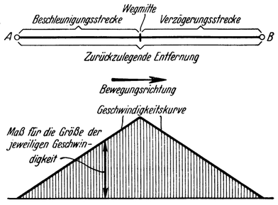

Könnten Fixsterne jemals erreicht werden?
=========================================

Viel günstiger wäre es in dieser Hinsicht jedoch, wenn auch
die außerhalb unseres Sonnensystems liegende Sternenwelt hierfür
in Betracht gezogen werden könnte; denn ungeheuer ist die
Zahl nur jener Himmelskörper, welche, weil sie sich in glühendem
Zustande befinden, uns sichtbar und daher als Fixsterne
bekannt sind. Viele von diesen sind unserer Sonne ähnlich
und, als gewaltige Massenanziehungszentren, vermutlich ebenso
wie diese von einer Menge kleiner und großer Weltkörper
verschiedenster Art umlaufen.

Sollten sich darunter nicht auch solche vorfinden, die unseren
Planeten gleichen? Wohl wäre es viel zu weit bis hin, um sie
auch wahrzunehmen; aber die Wahrscheinlichkeit spricht sehr
für ihr Vorhandensein: Hat doch die neuere Wissenschaft — als
eines ihrer wunderbarsten Ergebnisse — zeigen können, daß das
ganze Universum, selbst in seinen fernsten Teilen, sowohl von
denselben Naturgesetzen beherrscht, als auch aus den gleichen
Stoffen aufgebaut ist wie die Erde und unser Sonnensystem!
Müßte unter diesen Umständen (also aus der gleichen Materie
und unter dem Einfluß derselben Gesetze) denn nicht auch noch
an anderen Stellen des Alls Ähnliches, ja vielfach nahezu Gleiches,
hervorgegangen sein wie bei uns?

Es ist also gewiß nicht unberechtigt zu vermuten, daß es im
Weltall auch noch andere dem unseren mehr oder weniger ähnliche
Sonnensysteme gäbe, und unter deren zahlreichen Planeten
sich wohl auch solche vorfinden dürften, die der Erde in ihren
physikalischen wie sonstigen Bedingungen nahezu gleichen und
daher durch Erdenmenschen bewohnt, besiedelt werden könnten,
ja voraussichtlich von irgendwelchen, vielleicht sogar von
intelligenten Lebewesen überhaupt schon bevölkert sein mögen.
Mindestens ist die Wahrscheinlichkeit, daß dies so sei, in vorliegendem
Fall bedeutend größer, als wenn wir nur die verhältnismäßig
wenigen Gestirne unseres Sonnenreiches hierfür in Betracht ziehen.

Doch Wäre es denn überhaupt denkbar, daß jene unermeßlichen
Entfernungen, die uns selbst von den nächsten dieser
Fixsterne noch trennen, von Menschen je zurückgelegt werden
könnten, allein nur mit Rücksicht auf die Grenze, welche der
zeitlichen Ausdehnung einer Reise durch die mittlere Lebensdauer
des Menschen gesetzt ist, ganz abgesehen von der dazu
notwendigen technischen Leistungsfähigkeit des Fahrzeuges.

Nehmen wir' zuvor erst an, es sei das für unsere heutigen
Begriffe allerdings noch ungeheuerlich Erscheinende bereits gelungen:
den Rückstoßantrieb so zu vervollkommnen, daß man
dem Raumschiff während sehr langer Zeit, selbst Jahre
hindurch, ständig eine Beschleunigung von etwa 15m/sec² erteilen
könne, welche der Mensch bei allmählicher Gewöhnung wahrscheinlich
auch auf die Dauer vertragen würde. Es wäre dann
möglich, um eine bestimmte Weltraumstrecke zurückzulegen, das
Fahrzeug auf der ganzen ersten Hälfte seines Weges fortgesetzt
gleichförmig zu beschleunigen, also immer mehr in Fahrt zu
bringen, und es auf der zweiten Hälfte ebenso zu verzögern
und dadurch wieder allmählich abzubremsen (Abb. 100), nach
welchem Verfahren eine bestimmte Entfernung, bei vorgegebener,
höchstzulässiger Beschleunigung bzw. Verzögerung, in der kürzesten
überhaupt erreichbaren Zeit durcheilt wird.

Abb. 100. Zurücklegung einer Entfernung, wenn auf
der ganzen ersten Hälfte des Weges gleichförmig
beschleunigt und auf der zweiten ebenso verzögert
wird. Die höchste Bewegungsgeschwindigkeit ergibt sich dabei in der Wegmitte.

Erfolgte nun die Fahrt zu den benachbarten Fixsternen auf
diese Weise, dann würden sich für die gesamte Reise hin und.
zurück (wie sie bei erstmaligem Besuch in Einem ausgeführt werden
müßte) rechnungsmäßig folgende Zeiten ergeben: 7 Jahre zum
Alpha-Centauri, dem nächsten uns bekannten Fixstern; 10 Jahre
zu den vier in der Entfernung dann folgenden Fixsternen; mit
12jähriger Gesamtreisezeit Wären schon
zahlreiche Fixsterne erreichbar.

Hierbei wurde allerdings stillschweigend vorausgesetzt, daß im
leeren Ätherraum die Entfaltung jeder auch noch so großen Geschwindigkeit
möglich sei. Nach der Relativitätstheorie kann
aber eine höhere Geschwindigkeit als die des Lichtes von 300000 km
je Sekunde in der Natur überhaupt niemals zustande kommen.

Wird dem nun Rechnung getragen und gleichzeitig auch angenommen,
daß sich sonst kein (uns heute noch nicht erkennbares,
vielleicht in der Natur des Weltäthers gelegenes) Hindernis
ergeben würde, um Fahrgeschwindigkeiten zu erreichen, die sich
der Größenordnung der Lichtgeschwindigkeit nähern: dann könnte
man immerhin noch mit einer Gesamtreisezeit, einschließlich Hin—
und Rückfahrt, von rund 10 Jahren den Fixstern Alpha-Centauri,
von 20 Jahren die vier weiteren‚und von 30 Jahren
bereits eine beträchtliche Zahl der uns bisher bekannten, benachbarten
Fixsterne erreichen.

Für die einfache Fahrt, wie sie bei einem ständigen Verkehr
in Frage käme, würden die halben Zeiten genügen.

Wohl lägen Reisen von solcher Dauer schon ziemlich hart an
der Grenze des Menschenmöglichen; als gänzlich unausführbar
kann man sie jedoch noch nicht bezeichnen, so daß in dieser
Hinsicht eigentlich noch kein grundsätzliches Hindernis für die
Erreichbarkeit der nächsten Fixsterne zu ersehen ist.

Indes bleibt immer noch die Frage offen, ob Fahrzeuge von der
für solche Leistungen notwendigen technischen Vollendung jemals
geschaffen werden könnten? Aber auch darauf kann nicht mit
einem unbedingten Nein geantwortet werden; denn naturgesetzliche
Möglichkeiten sind dafür vorhanden, worauf schon früher
hingewiesen wurde<a class="refnote" id="rn1" href="#fn1">1</a>:
beispielsweise etwa die durch Atomzertrümmerung
bewirkte Nutzbarmachung der in der Materie gebundenen
Energie, oder die Auswertung des Radiumzerfalles,
der Kathodenstrahlung usw.
Allerdings, wie weit sind wir bis heute noch davon entfernt,
solche Naturvorgänge derartig-vollkommen zu beherrschen, daß
man dieselben für vorliegende Raumfahrtzwecke technisch nutzen
könnte! Und ob dies überhaupt gelingen wird?

Den Söhnen unseres Zeitalters nach menschlichem Ermessen
kaum. Ihnen wird daher die Fixsternwelt wohl unerreichbar
bleiben, sie, welche die ganz großen Geheimnisse des Alls in
ihrer Unermeßlichkeit verbirgt. Was ferne Zeiten aber an
wissenschaftlichen Triumphen und technischen Möglichkeiten noch
bringen werden — wer kann es sagen! Welch großartigen Fortschritt
bedeuten heute, da die Menschheit mit dem naturwissenschaftlichen
Denken nun einmal vertraut geworden ist, nur einige
Jahrzehnte; und was sind 100, ja selbst 1000 Jahre in der nach
allem noch vor uns liegenden Zeitspanne menschlicher Entwicklung.

Die Besiegung des Raums! Es wäre die grandioseste aller nur
erträumbaren Leistungen, Erfüllung höchsten Zwecks: der Menschheit
geistige Errungenschaften vor ihrem endlichen Untergang in
die Ewigkeit zu retten; denn erst wenn es gelänge, unsere Kultur
auf fremde Himmelskörper zu verpflanzen und so über das
All zu verbreiten, erst wenn die ganze Menschheit mit ihrem
Tun und Hoffen und dem, was sie in vieltausendjährigem Streben
errang, wenn alles das nicht mehr nur eine Laune kosmischen
Geschehens sein wird, ein Zufallsergebnis im Spiel der
ewigen Natur, welches mit dem nur für uns so großen und in
der Allwelt doch nur winzig kleinen Kügelchen Erde entsteht
und vergeht: dann wird unser ganzes Dasein erst wirklich Sinn
erhalten; dann wird die Menschheit erst berechtigt sein, sich
gottgesandt zu fühlen, als Werkzeug höheren — und doch nur
aus ihr selbst hervorgebrachten Wirkens.

<a href="#rn1">1</a>Siehe Seite 174, 175.

