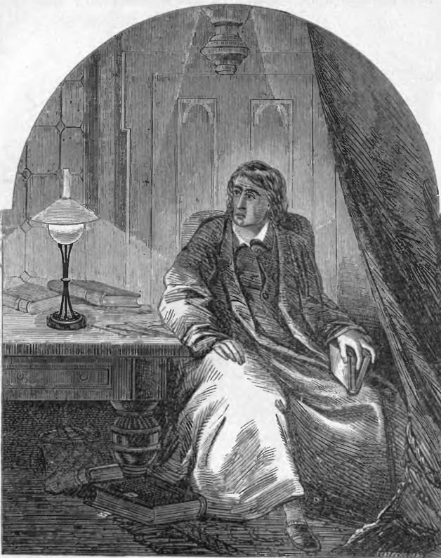
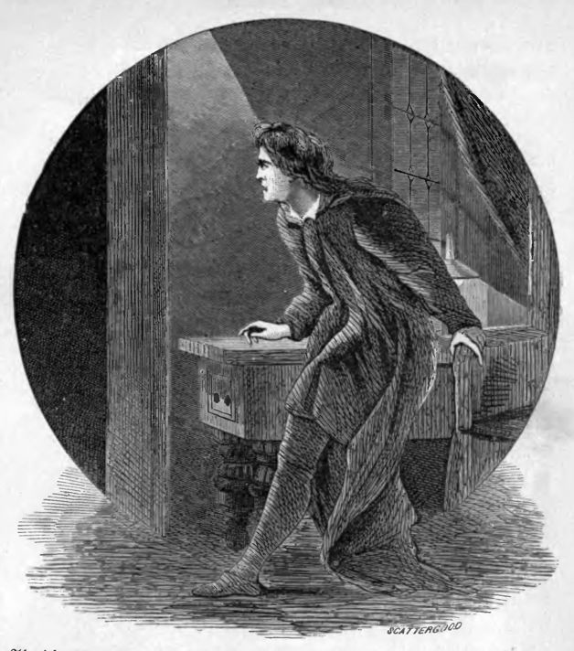
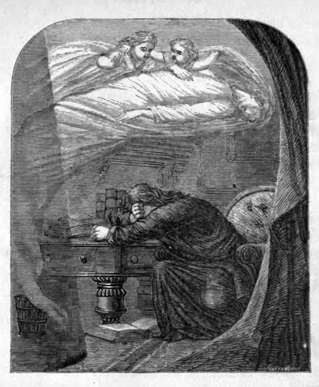
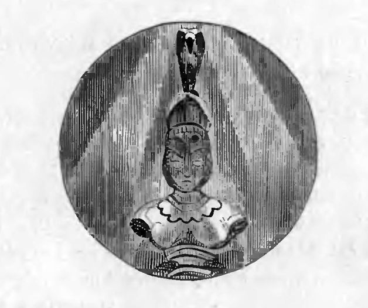

Der Rabe
========

Mitternacht umgab mich schaurig, 
als ich einsam, trüb und traurig,
Sinnend saß und las von mancher 
längstverklung’nen Mähr’ und Lehr’–
Als ich schon mit matten Blicken 
im Begriff, in Schlaf zu nicken,
Hörte plötzlich ich ein Ticken 
an die Zimmertüre her;
„Ein Besuch wohl noch,“ so dacht’ ich, 
„den der Zufall führet her –
Ein Besuch und sonst Nichts mehr.“

Wohl hab’ ich’s im Sinn behalten, 
im Dezember war’s, im kalten,
Und gespenstige Gestalten 
warf des Feuers Schein umher.
Sehnlich wünscht’ ich mir den Morgen, 
keine Lind’rung war zu borgen
Aus den Büchern für die Sorgen – 
für die Sorgen tief und schwer
Um die Sel’ge, die Lenoren 
nennt der Engel heilig Heer –
Hier, ach, nennt sie Niemand mehr!

Jedes Rauschen der Gardinen, 
die mir wie Gespenster schienen,
Füllte nun mein Herz mit Schrecken – 
Schrecken nie gefühlt vorher;
Wie es bebte, wie es zagte, 
bis ich endlich wieder sagte:
„Ein Besuch wohl, der es wagte, 
in der Nacht zu kommen her –
Ein Besuch, der spät es wagte, 
in der Nacht zu kommen her;
Dies allein und sonst Nichts mehr.“

Und ermannt nach diesen Worten 
öffnete ich stracks die Pforten:
„Dame oder Herr,“ so sprach ich, 
„bitte um Verzeihung sehr!
Doch ich war mit matten Blicken 
im Begriff, in Schlaf zu nicken,
Und so leis scholl Euer Ticken 
an die Zimmertüre her,
Dass ich kaum es recht vernommen; 
doch nun seid willkommen sehr!“ –
Dunkel da und sonst Nichts mehr.

Düster in das Dunkel schauend 
stand ich lange starr und grauend,
Träume träumend, die hienieden 
nie ein Mensch geträumt vorher;
Zweifel schwarz den Sinn betörte, 
Nichts die Stille draußen störte,
Nur das eine Wort man hörte, 
nur „Lenore?“ klang es her;
Selber haucht’ ich’s, und „Lenore!“ 
trug das Echo trauernd her –
Einzig dies und sonst Nichts mehr.

Als ich nun mit tiefem Bangen 
wieder in’s Gemach gegangen,
Hört’ ich bald ein neues Pochen, 
etwas lauter als vorher.
„Sicher,“ sprach ich da mit Beben, 
„an das Fenster pocht’ es eben,
Nun wohlan, so lass mich streben, 
dass ich mir das Ding erklär’ –
Still, mein Herz, dass ich mit Ruhe 
dies Geheimnis mir erklär’
Wohl der Wind und sonst Nichts mehr.“

Riss das Fenster auf jetzunder, 
und herein stolziert’ – o Wunder!
Ein gewalt’ger, hochbejahrter Rabe 
schwirrend zu mir her;
Flog mit mächt’gen Flügelstreichen, 
ohne Gruß und Dankeszeichen,
Stolz und stattlich sonder Gleichen, 
nach der Türe hoch und hehr –
Flog nach einer Pallasbüste 
ob der Türe hoch und hehr –
Setzte sich und sonst Nichts mehr.

Und trotz meiner Trauer brachte 
er dahin mich, dass ich lachte,
So gesetzt und gravitätisch 
herrscht’ auf meiner Büste er.
„Ob auch alt und nah dem Grabe,“ 
sprach ich, „bist kein feiger Knabe,
Grimmer, glattgeschor’ner Rabe, 
der Du kamst vom Schattenheer –
Sprich, welch’ stolzen Namen 
führst Du in der Nacht pluton’schem Heer?“
Sprach der Rabe: „Nimmermehr.“

Ganz erstaunt war ich, zu hören 
dies Geschöpf mich so belehren,
Schien auch wenig Sinn zu liegen 
in dem Wort bedeutungsleer;
Denn wohl Keiner könnte sagen, 
dass ihm je in seinen Tagen
Sonder Zier und sonder Zügen 
so ein Tier erschienen wär’,
Das auf seiner Marmorbüste 
ob der Tür gesessen wär’
Mit dem Namen „Nimmermehr.“

Dieses Wort nur sprach der Rabe 
dumpf und hohl, wie aus dem Grabe,
Als ob seine ganze Seele 
in dem einen Worte wär’.
Weiter Nichts ward dann gesprochen, 
nur mein Herz noch hört’ ich pochen,
Bis das Schweigen ich gebrochen: 
„Andre Freunde floh’n seither –
Morgen wird auch er mich fliehen, 
wie die Hoffnung floh seither.“
Sprach der Rabe: „Nimmermehr!“

Immer höher stieg mein Staunen 
bei des Raben dunklem Raunen,
Doch ich dachte: „Ohne Zweifel 
weiß er dies und sonst Nichts mehr;
Hat’s von seinem armen Meister, 
dem des Unglücks finstre Geister
Drohten dreist und drohten dreister, 
bis er trüb und trauerschwer –
Bis ihm schwand der Hoffnung Schimmer, 
und er fortan seufzte schwer:
‚O nimmer – nimmermehr!‘“

Trotz der Trauer wieder brachte 
er dahin mich, dass ich lachte;
Einen Armstuhl endlich rollte 
ich zu Tür und Vogel her.
In den sammt’nen Kissen liegend, 
in die Hand die Wange schmiegend,
Sann ich, hin und her mich wiegend, 
was des Wortes Deutung wär’ –
Was der grimme, finst’re Vogel 
aus dem nächt’gen Schattenheer
Wollt’ mit seinem „Nimmermehr.“

Dieses saß ich still ermessend, 
doch des Vogels nicht vergessend,
Dessen Feueraugen jetzo mir 
das Herz beklemmten sehr;
Und mit schmerzlichen Gefühlen 
ließ mein Haupt ich lange wühlen
In den veilchenfarb’nen Pfühlen, 
überstrahlt vom Lichte hehr –
Ach, in diesen sammtnen Pfühlen, 
überstrahlt vom Lichte hehr –
Ruhet sie jetzt nimmermehr!

Und ich wähnte, durch die Lüfte 
wallten süße Weihrauchdüfte,
Ausgestreut durch unsichtbare 
Seraphshände um mich her.
„Lethe,“ rief ich, „süße Spende 
schickt Dir Gott durch Engelshände,
Dass sich von Lenoren wende 
Deine Trauer tief und schwer!
Nimm, o nimm die süße Spende 
und vergiss der Trauer schwer!“
Sprach der Rabe: „Nimmermehr!“

„Gramprophet!“ rief ich voll Zweifel, 
„ob Du Vogel oder Teufel!
Ob die Hölle Dich mir sandte, 
ob der Sturm Dich wehte her!
Du, der von des Orkus Strande – 
Du, der von dem Schreckenlande
Sich zu mir, dem Trüben, wandte – 
künde mir mein heiß Begehr:
Find’ ich Balsam noch in Gilead! 
ist noch Trost im Gnadenmeer?“
Sprach der Rabe: „Nimmermehr!“

„Gramprophet!“ rief ich voll Zweifel, 
„ob Du Vogel oder Teufel!
Bei dem ew’gen Himmel droben, 
bei dem Gott, den ich verehr’ –
Künde mir, ob ich Lenoren, 
die hienieden ich verloren,
Wieder find’ an Edens Toren – 
sie, die thront im Engelsheer –
Jene Sel’ge, die Lenoren nennt 
der Engel heilig Heer!“
Sprach der Rabe: „Nimmermehr!“

„Sei dies Wort das Trennungszeichen! 
Vogel, Dämon, Du musst weichen!
Fleuch zurück zum Sturmesgrauen, 
oder zum pluton’schen Heer!
Keine Feder lass zurücke mir 
als Zeichen Deiner Tücke;
Lass allein mich dem Geschicke – 
wage nie Dich wieder her!
Fort und lass mein Herz in Frieden, 
das gepeinigt Du so sehr!“
Sprach der Rabe: „Nimmermehr!“

Und der Rabe weichet nimmer – 
sitzt noch immer, sitzt noch immer
Auf der blassen Pallasbüste 
ob der Türe hoch und hehr;
Sitzt mit geisterhaftem Munkeln, 
seine Feueraugen funkeln
Gar dämonisch aus dem dunkeln, 
düstern Schatten um ihn her;
Und mein Geist wird aus dem Schatten, 
den er breitet um mich her,
Sich erheben – nimmermehr!

