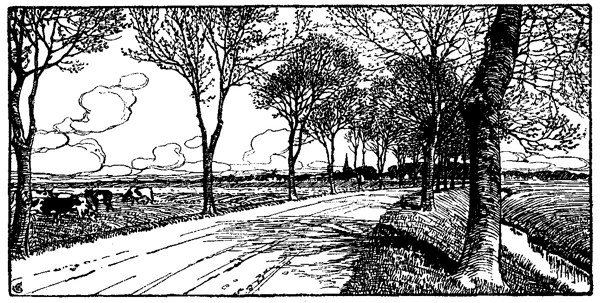

<#include "pagebreak.ftl">
\<@pagebreak 1/>

<h1>I. Blick in das Land.</h1>

<h2>Anblick des Landes.<a class="refnote" id="rn1" href="#fn1">*)</a></h2>

<h3>Von Dr. Ludwig Meyn.</h3>

»Sollte man es denken, daß diese Seen, diese
herrlichen Buchen, diese Hügel und Büsche Schweizer
Täler zurückrufen!«                  Leop. v. Bach.

Für Fremde und Einheimische hat ein Blick über die Naturbeschaffenheit
und namentlich über die Naturschönheiten und Eigentümlichkeiten
eines Landes hohe Bedeutung. Der Heimische fühlt
sich wohler in dem Lande, dessen Vorzüge ihm unverborgen sind;
der Fremde orientiert sich, trägt das Gesamtbild des Landes seiner
äußern Erscheinung nach mit heim, und bewahrt für das, was seiner
Liebe würdig war, diese um so inniger, je eindringender die Tätigkeit
war, mit der eine solche Anschauung erworben wurde.

Nördlich von der Elbe hat eine andere Sitte Geltung gewonnen
als südlich von ihr, eine andere Stellung der verschiedenen Stände
zu Kunst, Wissenschaft, Erwerbsverkehr und Politik, eine andere Seite
des deutschen Geistes ist hier wesentlich entwickelt; auch die Natur
ist eine andere geworden, dem Forscher und Künstler gegenüber,
mehr aber noch für den Freund der nährenden Mutter Natur.

Zwar nicht die schroffen Gegensätze zeigt unser Land, die das
Gebirgsland bezeichnen; nicht sind die Klimate eines halben Erdballes
\<@pagebreak/>
übereinander geschichtet, einfach wie der Charakter des Bewohners
ist die klimatische Natur; aber die Größe der Gletscher
brauchen wir nicht anzustaunen, wenn die halbe Ostsee mit Eis bedeckt
ist, oder wenn der Elbstrom die ungeheuren Schollen rauschend
aneinander reibt, die das Pfahlwerk in Hamburgs Hafen zerknicken;
auch das Tosen der Wasserfälle ist verschwindend vor der Wut der
Wellen, wenn eine Sturmflut in der Westsee entsteht.

Hier ist das Meer finster, grau und undurchsichtig; zweimal
täglich weicht es zurück und breitet die unendliche Fläche seines geheimnisvollen
Grundes aus; immer aber kehrt es wieder und wirft,
wenn Stürme es peitschen, seinen ganzen Wogenschwall gegen menschliche
Befestigungen eines oft schon eroberten Landes. Wenige Stunden
Entfernung und man erreicht ein anderes Meer, die Ostsee, dunkelblau,
durchsichtig bis auf den Grund, ohne die ewig gleichmäßige
Bewegung, immer ruhig, wenn nicht Stürme sie aufregen. Auf
der einen Seite die breite Strommündung, die mit Ebbe und Flut
Schiffe aller Nationen durchziehen; auf der andern tief in das Land
eindringende Meeresbuchten, Föhrden genannt, die nordischen Fjorde
wiederholend, aber mit dem milderen Reiz des Südens verschönt,
zugänglich den größten Schiffen, oft gesucht von russischen Fahrzeugen,
deren Mannschaft asiatische Züge trägt.

Hier an der Westseite siehst du ja das Land des Außendeichs,
eine unübersehbare Ebene, ohne Wald, ja ohne Baum, ohne
Busch, ohne Berg und Tal und ohne Hügel, ohne See und ohne
Bach und weder Haus noch Hütte, aber umschwärmt von einer
Schar kreischender Seevögel, und durchschweift von Herden Rindviehs
-- man glaubt, in den Savannen und Pampas von Amerika
Büffelherden wiederzusehen.

Aber man übersteige den Deich; die menschenleere Öde ist in
ein Eden der schönsten Kultur verwandelt, das weite Land von
schnurgeraden Gräben durchschnitten, wie ein Garten in Beete geteilt,
eingefaßt von Wasser und Schilf, und auf den Beeten der
dichte, gleichährige Weizen neben den hohen Bohnen, die, ein eigentümliches
Erzeugnis der Marsch, mit dem würzreichsten Dufte die
ganze Gegend erfüllen; Hafer, Sommer- und Wintergerste, alle so
geschlossen, daß kaum ein Sonnenstrahl bis auf den Boden dringen
mag, und dazwischen die Stoppel der letzten Rapsaat und die frisch
gewendete Scholle für die nächste, oder zu andern Zeiten unter dem
Grün der Felder das prangende Gelb der Rapsaatblüte, auf den 
\<@pagebreak/>
Weiden das größeste und fetteste Vieh. Durch dies Land rollt man
bei gutem Sommerwetter im Zickzack auf Wegen dahin, so hart und
glatt wie eine Dreschdiele, zwischen schnurgeraden Kanälen von der
Breite eines Flüßchens. Hinter ihnen stehen die blinkenden Häuser
einzeln oder zu Dörfern gesammelt oder eins an das andere gereiht,
die ganzen langen Wege durch das ganze weite Land, das
nächste immer noch einladender als das letzte; auf den Dächern aber
Haus bei Haus der große, menschenfreundliche Vogel, der Storch,
und wo die Häuser stattlicher sich drängen, die stattlichen Kirchen.
Hier wird der Fruchtwachs unterbrochen von Gärten und Alleen,
dort sieht man ein halbes Hundert Windmühlen ihre Flügel
schwenken, ein Bild voll der fröhlichsten Beweglichkeit.

In dieses Meer von Fruchtbarkeit ragen, zum Teil mit Moorgehängen
an ihrem seitlichen Fuß, weitläufige Vorgebirge hohen
Landes hinaus, auf deren Vorsprüngen freundliche Örter mit roten
Ziegeldächern stehen. Man ersteigt das Plateau und ist wieder in
eine neue Welt versetzt: ein Eichenwald und bald darauf eine unabsehbare 
Heide, nur in weiter Ferne ein einsames Hüttchen, mit
Heide gedeckt, einige wenige scheue Schafe mit zerrissenem Vließe,
ein paar einzeln stehende Halme in der Nähe der traurigen Wohnung,
auf der nächsten Erhebung des Bodens ein kuppelförmiges Hünengrab, 
in der nächsten Senkung zwergartiger Eichenkratt und krüppelhaft 
gewachsene Büsche; oder weiterhin die rotbraune, halbentblößte, 
bald stäubige, bald sumpfige Gegend eines blasenförmig aufgequollenen 
Hochmoors mit windzerzausten Schuppen oder hoch aufgemauerten 
Torfhaufen, die sich kuppelförmig wölben wie die düstersten Grabmale 
von schwarzem Stein, die eine traurige Phantasie ersinnen 
könnte, -- man glaubt in die Moore des bremischen Landes, in die 
ungeheuren Einöden an der Ems versetzt zu sein. Daneben sieht 
man eine weiße oder rostfarbene, pflanzenleere Sandwüste, in welcher 
der Wind mit dem Boden spielt, heute hier, morgen dort einen 
langen Hügel aufschüttend, wenn nicht die harten Halme des Sandhafers 
ihn binden oder das duftende Nadelholz, das wie zerrissen 
dasteht. Aber in diese dreierlei Einöden der Mitte des Landes, 
die miteinander abwechseln, bringt doch ein Bach, der aus schöneren 
Gegenden kommt, ein freundlicheres Leben. Große Erlenbrüche und 
sumpfiges Bultenland bezeichnen die Niederung, Wiesen begleiten 
den Lauf, und beackerte Felder sind im Gefolge der Wiesen und irgendein
stattliches Gehöfte. Wo aber mehrere Bäche zusammentreffend 
\<@pagebreak/>
ein größeres Land bezwungen haben, da steht ein geschlossenes Dorf
von strengem Charakter, dicht geschart um die Kirche, oder in der
vorhin nicht sichtbaren Tiefe des Bachrandes vielleicht gar ein freundlicher
Flecken, wo rauschende Mühlräder sich drehen.

Woher kam dieser Bach? Dort ist das Paradies von Holstein,
sein kleines, gesegnetes Bergland, dem in seinen freundlichen Formen
selbst der größeste Gebirgskenner, der da lebt und je gelebt hat,
Leopold von Bach, alpinische Reize zuschreibt. Schroff in den See
abstürzende Felswände fehlen, aber natürlicher Wellengang des
Hügels und die ihm folgende Linie der Krone eines Waldes, der
in runden Wölbungen mit seinem schönsten Laube sich bis in das
Wasser senkt, umschließt die unbewegliche Flut ebenso geheimnisvoll
als der Fels. Über den niedrigen Bäumen des Waldes erheben
sich in hohen Säulenhallen die Buchen, deren Stämme senkrecht,
glatt, astlos emporsteigen und erst im Gipfel die gemeinsame
Krone wölben, »ein Wald über dem Walde« so gut wie Amerikas
Palmen.

Neben den Wäldern ist das bunteste Land Hügel an Hügel gereiht,
einzeln halbkugelförmig herauftauchend oder in lange Rücken
gezogen, die sich wunderbar verschlingen, in jedem geschlossenen Tal
ein stiller See, in jedem offenen ein rieselnder Bach, hie und da die
Hügel durchbrechend mit tiefen Schluchten, über deren Enge sich die
Bäume zusammenbeugen. An den Bächen klappern die Mühlen,
auf den Höhen liegen stattliche Dörfer, an dem Rande der Seen
prächtige Schlösser und freundliche Höfe mit gewaltigen Vorratshäusern,
und in der Nähe werden die Hunderte von Kühen, die zum
Hofe gehören. Von lebendigen Hecken ist dieses Hügelland durchzogen;
wie ein natürliches Netz überspannen sie die Bodenfläche,
tauchen hinab und erheben sich mit ihr, beschatten den Weg, verbergen
und öffnen immer neu die Aussicht und bringen bei jeglicher
Fernsicht zugleich mit dem Gemälde der Landschaft deren ganze
plastische Bildung durch unmittelbare Anschauung zum Bewußtsein,
als ob ein längst vorbereitetes Auge in die Gegend schaue.
Ranken und Blumen durchflechten diese dichten Hecken; Insekten und
Vögel führen darin ein üppiges Leben; Summen und Brummen,
Gesang und Geschrei ohne Ende erfüllt sie zur Sommerzeit. All
dieser Schmuck aber tritt bis an den Spiegel der Ostsee; dort kommt
hinzu die unendliche Fläche des Meeres, dort die leuchtenden Segel
der Schiffe, dort die von Masten umgebenen blühenden Handelsstädte. 

<a href="#rn1">*)</a>Geschrieben vor 50 Jahren.

